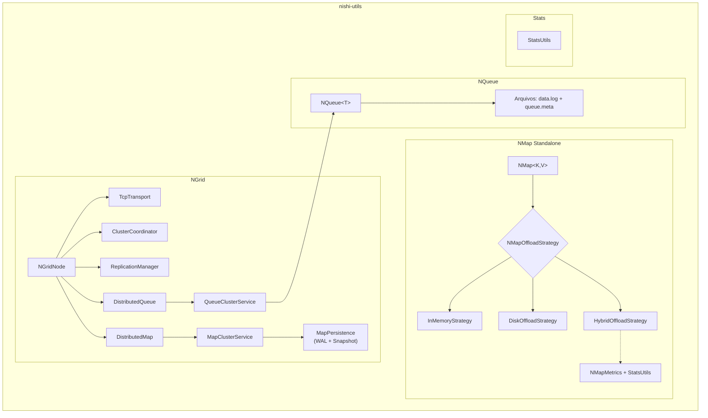

# nishi-utils

Coleção de utilitários em Java, com foco em:

- **NMap**: mapa **persistente** standalone (WAL + snapshot), com **offloading plugável** (in-memory, disco, híbrido com LRU).
- **NQueue**: fila **persistente** (FIFO) baseada em arquivos, segura para múltiplas threads.
- **NGrid**: infraestrutura **distribuída** via TCP com **fila** e **mapa** (replicação por líder + quorum).
- **Stats**: utilitários para **métricas/estatísticas** simples (contadores, médias, valores, memória).

### NMap (mapa persistente standalone)

- **Persistência WAL + snapshot** com recuperação robusta a falhas
- **Offloading plugável** via `NMapOffloadStrategy`:
  - `InMemoryStrategy` (default): `ConcurrentHashMap`, zero mudança para quem já usa
  - `DiskOffloadStrategy`: todas as entries em disco, índice leve em memória
  - `HybridOffloadStrategy`: cache in-memory limitado com spillover automático para disco
- **Políticas de evicção**: `LRU` (Least Recently Used) e `SIZE_THRESHOLD` (por volume)
- **Warm-up automático**: entries frias são promovidas ao `get()`
- **Observabilidade**: integração com `StatsUtils` (hit/miss, evictions, latência de disco)
- **Thread-safe**: todas as operações são concorrentes

### NQueue (fila persistente)

- **Persistência em disco** (reconstrução do estado após restart)
- **Concorrência** (múltiplos produtores/consumidores)
- Operações: `offer`, `poll`, `peek`
- **Compactação** automática/parametrizável do arquivo de dados

### NGrid (fila/mapa distribuídos)

- Cluster via **TCP** com descoberta de peers e heartbeats
- **Configuração via YAML**: suporte a variáveis de ambiente (`${VAR}`) para fácil deployment em containers.
- **Múltiplas Filas (2.1.0+)**: filas distribuídas independentes com API type-safe
- **Sequenciamento por tópico** (por fila/mapa), evitando bloqueios lógicos em multi-queue
- **Roteamento por nome da fila** (comandos `queue.offer:{queue}` etc.) e init eager no líder
- **Roteamento Inteligente (Sticky Proxy)** com otimização por RTT para alcançar nós inacessíveis diretamente
- **Eleição determinística de líder** (por ID) e reeleição opcional guiada por taxa de escrita
- **Replicação com quorum** configurável (modos: disponibilidade ou consistência estrita)
- API cliente transparente: qualquer nó pode encaminhar a operação ao líder
- **Log Distribuído & Streaming**: retenção por tempo + consumo persistente por NodeId (offset)
- **Consistência de leitura** para mapas: forte, eventual ou limitada por lag
- **Sincronização de estado (catch-up)** por snapshot em chunks para mapas **e filas**
- **Reenvio de sequência** quando gaps são detectados (com fallback para snapshot)
- **Persistência opcional de mapa** com WAL + snapshot (recuperação robusta em crash/rotação)
- Estruturas:
  - `DistributedQueue`: `offer`, `poll`, `peek`
  - `DistributedMap`: `put`, `get`, `remove`

## Requisitos

- Java **21**
- Maven

## Instalação (Maven)

Versão do artefato no projeto: **1.0.14** (`pom.xml`).

```xml
<dependency>
  <groupId>dev.nishisan</groupId>
  <artifactId>nishi-utils</artifactId>
  <version>3.0.3</version>
</dependency>
```

## Uso: NQueue

### Exemplo básico

```java
import dev.nishisan.utils.queue.NQueue;

import java.nio.file.Path;
import java.util.Optional;

public class Example {
  public static void main(String[] args) throws Exception {
    Path baseDir = Path.of("/tmp/queues");

    try (NQueue<String> queue = NQueue.open(baseDir, "minha-fila")) {
      queue.offer("primeira");
      queue.offer("segunda");

      Optional<String> next = queue.peek();
      System.out.println("peek=" + next.orElse("<vazio>"));

      Optional<String> msg = queue.poll();
      System.out.println("poll=" + msg.orElse("<vazio>"));
    }
  }
}
```

### Configurações avançadas

```java
import dev.nishisan.utils.queue.NQueue;

import java.nio.file.Path;
import java.time.Duration;

public class ExampleOptions {
  public static void main(String[] args) throws Exception {
    Path baseDir = Path.of("/tmp/queues");

    NQueue.Options options = NQueue.Options.defaults()
        .withFsync(false)
        .withCompactionWasteThreshold(0.30)
        .withCompactionInterval(Duration.ofMinutes(10))
        .withCompactionBufferSize(256 * 1024);

    try (NQueue<String> queue = NQueue.open(baseDir, "minha-fila", options)) {
      queue.offer("hello");
    }
  }
}
```

### Exemplo produtor/consumidor (threads)

Veja também: `src/main/java/dev/nishisan/utils/queue/NQueueExample.java`.

```java
import dev.nishisan.utils.queue.NQueue;

import java.nio.file.Path;
import java.util.concurrent.ExecutorService;
import java.util.concurrent.Executors;
import java.util.concurrent.TimeUnit;

public class ProducerConsumer {
  public static void main(String[] args) throws Exception {
    Path baseDir = Path.of("/tmp");
    try (NQueue<String> queue = NQueue.open(baseDir, "demo")) {
      ExecutorService ex = Executors.newFixedThreadPool(2);

      ex.submit(() -> {
        try {
          for (int i = 0; i < 1000; i++) {
            queue.offer("message-" + i);
          }
        } catch (Exception ignored) {
        }
      });

      ex.submit(() -> {
        try {
          // espera itens aparecerem
          Thread.sleep(200);
          while (!queue.isEmpty()) {
            queue.poll();
          }
        } catch (Exception ignored) {
        }
      });

      ex.shutdown();
      ex.awaitTermination(30, TimeUnit.SECONDS);
    }
  }
}
```

## Uso: NMap

### Básico (persistência WAL + snapshot)

```java
import dev.nishisan.utils.map.NMap;

import java.nio.file.Path;

public class NMapExample {
  public static void main(String[] args) throws Exception {
    Path baseDir = Path.of("/tmp/maps");

    try (NMap<String, String> map = NMap.open(baseDir, "usuarios")) {
      map.put("u1", "Alice");
      map.put("u2", "Bob");

      System.out.println("u1=" + map.get("u1").orElse("<vazio>"));
      System.out.println("size=" + map.size());
    }
    // Reabrindo: dados são reconstruídos do WAL/snapshot
    try (NMap<String, String> map = NMap.open(baseDir, "usuarios")) {
      System.out.println("u2=" + map.get("u2").orElse("<vazio>")); // Bob
    }
  }
}
```

### In-memory (sem persistência)

```java
import dev.nishisan.utils.map.NMap;
import dev.nishisan.utils.map.NMapConfig;
import dev.nishisan.utils.map.NMapPersistenceMode;

try (NMap<String, String> map = NMap.open(
        Path.of("/tmp"), "cache", NMapConfig.inMemory())) {
  map.put("key", "value");
}
```

### Offloading: Disco completo

```java
import dev.nishisan.utils.map.DiskOffloadStrategy;

NMapConfig cfg = NMapConfig.builder()
    .mode(NMapPersistenceMode.DISABLED)
    .offloadStrategyFactory(DiskOffloadStrategy::new)
    .build();

try (NMap<String, String> map = NMap.open(Path.of("/data"), "big-map", cfg)) {
  // Todas as entries vão direto para disco
  for (int i = 0; i < 1_000_000; i++) {
    map.put("k" + i, "v" + i);
  }
}
```

### Offloading: Híbrido com LRU

Mantém as N entries mais acessadas em memória e faz spillover das demais
para disco automaticamente. Warm-up transparente no `get()`.

```java
import dev.nishisan.utils.map.EvictionPolicy;
import dev.nishisan.utils.map.HybridOffloadStrategy;

NMapConfig cfg = NMapConfig.builder()
    .mode(NMapPersistenceMode.DISABLED)
    .offloadStrategyFactory((baseDir, name) ->
        HybridOffloadStrategy.<String, String>builder(baseDir, name)
            .evictionPolicy(EvictionPolicy.LRU)       // ou SIZE_THRESHOLD
            .maxInMemoryEntries(10_000)
            .build())
    .build();

try (NMap<String, String> map = NMap.open(Path.of("/data"), "sessions", cfg)) {
  map.put("session-1", "alice");
  map.get("session-1"); // hot: leitura do cache
}
```

### Observabilidade com StatsUtils

O `HybridOffloadStrategy` emite métricas via `StatsUtils` quando configurado:

```java
import dev.nishisan.utils.stats.StatsUtils;
import dev.nishisan.utils.map.NMapMetrics;

StatsUtils stats = new StatsUtils();

NMapConfig cfg = NMapConfig.builder()
    .mode(NMapPersistenceMode.DISABLED)
    .offloadStrategyFactory((baseDir, name) ->
        HybridOffloadStrategy.<String, String>builder(baseDir, name)
            .evictionPolicy(EvictionPolicy.LRU)
            .maxInMemoryEntries(10_000)
            .stats(stats)       // ← ativa métricas
            .build())
    .build();

// Métricas disponíveis:
// stats.getCounterValue(NMapMetrics.CACHE_HIT)     → taxa de cache hit
// stats.getCounterValue(NMapMetrics.EVICTION)       → entries movidas para disco
// stats.getCounterValue(NMapMetrics.WARM_UP)        → entries promovidas para memória
// stats.getAverage(NMapMetrics.DISK_READ_LATENCY)   → latência média de leitura (ms)
```

| Métrica | Tipo | Descrição |
|---------|------|-----------|
| `NMAP.GET_HIT` | Counter | Cada `get()` |
| `NMAP.CACHE_HIT` | Counter | Entry encontrada em memória |
| `NMAP.CACHE_MISS` | Counter | Entry não encontrada em memória |
| `NMAP.EVICTION` | Counter | Entry movida para disco |
| `NMAP.WARM_UP` | Counter | Entry promovida de disco para memória |
| `NMAP.HOT_SIZE` | Gauge | Entries em memória |
| `NMAP.COLD_SIZE` | Gauge | Entries em disco |
| `NMAP.DISK_READ_LATENCY` | Average | Latência de leitura (ms) |
| `NMAP.DISK_WRITE_LATENCY` | Average | Latência de escrita (ms) |

## Uso: NGrid

### Criando um cluster (exemplo em um único processo)

O exemplo abaixo segue a mesma ideia do teste de integração:
`src/test/java/dev/nishisan/utils/ngrid/NGridIntegrationTest.java`.

```java
import dev.nishisan.utils.ngrid.common.NodeId;
import dev.nishisan.utils.ngrid.common.NodeInfo;
import dev.nishisan.utils.ngrid.structures.DistributedMap;
import dev.nishisan.utils.ngrid.structures.DistributedQueue;
import dev.nishisan.utils.ngrid.structures.NGridConfig;
import dev.nishisan.utils.ngrid.structures.NGridNode;
import dev.nishisan.utils.ngrid.structures.QueueConfig;

import java.nio.file.Files;
import java.nio.file.Path;
import java.util.Optional;

public class NGridClusterExample {
  public static void main(String[] args) throws Exception {
    NodeInfo n1 = new NodeInfo(NodeId.of("node-1"), "127.0.0.1", 9001);
    NodeInfo n2 = new NodeInfo(NodeId.of("node-2"), "127.0.0.1", 9002);
    NodeInfo n3 = new NodeInfo(NodeId.of("node-3"), "127.0.0.1", 9003);

    Path base = Files.createTempDirectory("ngrid-demo");
    Path d1 = Files.createDirectories(base.resolve("node1"));
    Path d2 = Files.createDirectories(base.resolve("node2"));
    Path d3 = Files.createDirectories(base.resolve("node3"));
    QueueConfig queueConfig = QueueConfig.builder("queue").build();

    try (NGridNode node1 = new NGridNode(NGridConfig.builder(n1)
        .addPeer(n2).addPeer(n3)
        .dataDirectory(d1).addQueue(queueConfig)
        .replicationQuorum(2)
        .build());
         NGridNode node2 = new NGridNode(NGridConfig.builder(n2)
             .addPeer(n1).addPeer(n3)
             .dataDirectory(d2).addQueue(queueConfig)
             .replicationQuorum(2)
             .build());
         NGridNode node3 = new NGridNode(NGridConfig.builder(n3)
             .addPeer(n1).addPeer(n2)
             .dataDirectory(d3).addQueue(queueConfig)
             .replicationQuorum(2)
             .build())) {

      node1.start();
      node2.start();
      node3.start();

      DistributedQueue<String> queue = node1.queue(String.class);
      queue.offer("job-1");
      Optional<String> job = queue.poll();
      System.out.println("job=" + job.orElse("<vazio>"));

      DistributedMap<String, String> map = node2.map(String.class, String.class);
      map.put("k1", "v1");
      System.out.println("get(k1)=" + map.get("k1").orElse("<vazio>"));

      // Múltiplos mapas (nomeados) no mesmo cluster:
      DistributedMap<String, String> users = node1.getMap("users", String.class, String.class);
      DistributedMap<String, String> sessions = node3.getMap("sessions", String.class, String.class);
      users.put("u1", "alice");
      sessions.put("s1", "token-123");
    }
  }
}
```

### Múltiplas Filas (Novo em 2.1.0)

A partir da versão 2.1.0, você pode configurar múltiplas filas independentes no mesmo cluster:

#### Configuração via YAML

```yaml
node:
  id: worker-1
  host: 127.0.0.1
  port: 7001
  dirs:
    base: /var/ngrid/data

cluster:
  name: my-cluster
  replication:
    factor: 2
    strict: false
  seeds:
    - 127.0.0.1:7001

# Múltiplas filas
queues:
  - name: orders
    retention:
      policy: TIME_BASED
      duration: 24h
  
  - name: events
    retention:
      policy: TIME_BASED
      duration: 1h
  
  - name: logs
    retention:
      policy: TIME_BASED
      duration: 7d
```

#### API Type-Safe

```java
import dev.nishisan.utils.ngrid.structures.TypedQueue;

// Definir tipos de fila (recomendado usar constantes)
public final class AppQueues {
    public static final TypedQueue<Order> ORDERS = 
        TypedQueue.of("orders", Order.class);
    
    public static final TypedQueue<Event> EVENTS = 
        TypedQueue.of("events", Event.class);
}

// Usar com type-safety
NGridNode node = new NGridNode(Path.of("config.yaml"));
node.start();

DistributedQueue<Order> orders = node.getQueue(AppQueues.ORDERS);
DistributedQueue<Event> events = node.getQueue(AppQueues.EVENTS);

orders.offer(new Order("order-123", 99.99));
events.offer(new Event("user.login", System.currentTimeMillis()));

Optional<Order> order = orders.poll();
Optional<Event> event = events.poll();
```

Para mais detalhes, consulte a [documentação completa de configuração YAML](doc/ngrid/ngrid_yaml_config_guide.md).

### Observações/limitações atuais

- Operações são **roteadas ao líder** para consistência.
- O mapa é mantido em memória (e replicado); persistência em disco é **durabilidade**, não expansão de capacidade.
- O `replicationQuorum` define quantos nós (incluindo o líder) precisam confirmar para a operação ser considerada commitada.
- **Catch-up de filas e mapas** usa snapshot em chunks quando há atraso relevante.
- Offsets de consumo em modo `TIME_BASED` são persistidos por `NodeId`; se o retention expirar, o consumidor pode ser avançado para o item mais antigo disponível.
- `queueDirectory` (legado) mantém semântica destrutiva; no NGrid moderno o padrão é `TIME_BASED`.

## Arquitetura (resumo)

- **Transporte/Cluster**: TCP, troca de mensagens, descoberta de peers
- **Coordenação**: membros, heartbeats e eleição de líder
- **Replicação**: operação com ID, replicação e ACK até atingir quorum
- **Estruturas**: `DistributedQueue` e `DistributedMap`



Para detalhes (docs em pt-BR):

- `doc/ngrid/arquitetura.md`
- `doc/ngrid/guia-utilizacao.md`
- `doc/ngrid/map-design.md`
- `doc/ngrid/nqueue-integration.md`
- `doc/ngrid/playbook-resiliencia.md`
- `doc/nqueue-readme.md`

## Stats (métricas)

O pacote `dev.nishisan.utils.stats` inclui a classe `StatsUtils`, que mantém:

- contadores de hits (`notifyHitCounter`)
- médias com janela fixa (`notifyAverageCounter`)
- valores atuais (`notifyCurrentValue`)
- cálculo periódico de memória/counters (thread daemon interna)

Veja: `src/main/java/dev/nishisan/utils/stats/StatsUtils.java`.

## Rodando testes

```bash
mvn test
```

### Testes de NMap (Standalone + Offloading)

```bash
mvn test -Dtest=NMapTest,NMapRecoveryTest,NMapOffloadTest,HybridOffloadStrategyTest
```

### Testes de Durabilidade (NGrid)

Para validar a durabilidade de offsets e mensagens após crash abrupto:

```bash
mvn test -Dtest=NGridDurabilityTest
```

Estes testes usam `docker kill` (SIGKILL) para simular falhas reais.
Veja: `doc/ngrid/testcontainers-tests.md`

## Licença

Este projeto é distribuído sob **GNU GPL v3** (ou posterior). Veja os cabeçalhos dos arquivos-fonte para detalhes.
