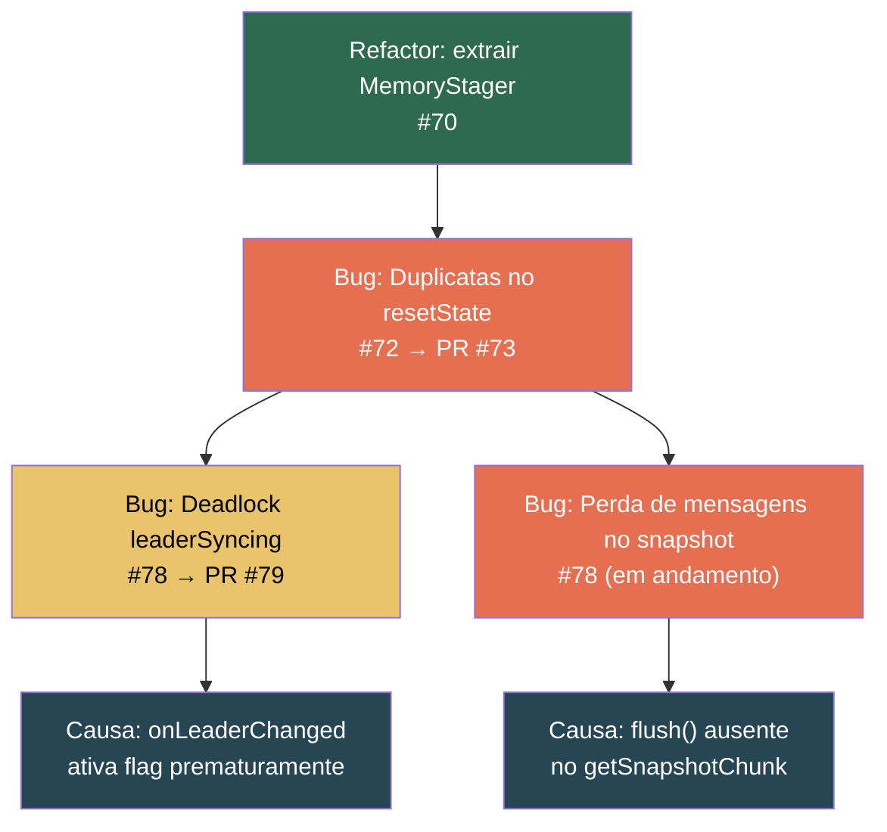

# Diário de Bordo — nishi-utils (NGrid / NQueue)

> Registro cronológico das alterações, decisões técnicas e lições aprendidas durante o ciclo de estabilização do NGrid (fev–mar/2026).

---

## 2026-06-08 — 🟢 4.7.0 — Feat: retenção do binlog do líder estilo MySQL (rotação por tamanho + nº de arquivos)

Evolui a persistência do op-log do líder (o "binlog" do `RELAY_STREAM`, `ResendLog`) para reter um
número configurável de arquivos por **tamanho** ou **contagem de ops**, equiparando ao
relay/binlog do MySQL. O dono pode agora expressar **"10 arquivos de 10GB"** ou **"10 arquivos de
10M ops cada"**.

**Contexto:** o `ResendLog` já era segmentado (`seg-NNNNNNNNNN.dat`) e rotacionava por **ops**
(`resendLogSegmentMaxEntries`) e **idade** (`resendLogSegmentMaxAge`), retendo por **contagem total**
(`resendLogMaxEntries`) e **tempo** (`replicationLogRetentionTime`). Faltavam os dois eixos com que o
operador raciocina no MySQL: rotação por **bytes do arquivo** (`max_binlog_size`) e retenção por
**número de arquivos/índices** (`mysql-bin.NNNNNN`).

**Mudanças:**
- **Rotação por tamanho** (`resendLogSegmentMaxBytes`, o `max_binlog_size`): o segmento ativo rola no
  primeiro limite atingido entre ops, idade e bytes; um registro nunca é partido.
- **Retenção por nº de segmentos** (`resendLogMaxSegments`): mantém no máximo N arquivos de binlog; o
  segmento ativo nunca é dropado, então o líder sempre tem janela para servir o stream.
- **Exposição** no `ReplicationConfig`/`NGridConfig.Builder` e no YAML (`cluster.replication.*`), com
  **guardrails de PRODUCTION** (piso de 1MB/segmento e ≥2 segmentos retidos quando opt-in).
- **Observabilidade:** `ResendLog.totalBytes()/segmentCount()` e `ResendLogStore.diskBytes()/segmentCount()`.
- **Relay do follower:** expõe o TTL `expireAfterWrite` que o `NQueue` já suportava como knob
  `relayExpireAfterWrite` (o relay-log expiry do MySQL) — teto duro opt-in, default desligado.

Knobs `0`/`ZERO` por default (desabilitados) → comportamento atual preservado; o backstop de contagem
(`resendLogMaxEntries = 10M`) continua limitando o disco out-of-box.

**Testes:** `ResendLogTest` (rotação por bytes, retenção por nº de segmentos, `totalBytes`/
`segmentCount`), `ReplicationConfigTest`/`NGridConfigOpLogKnobTest` (defaults, propagação, rejeição de
negativos), `NGridConfigValidationTest` (guardrails de PRODUCTION), `NGridConfigLoaderTest`
(round-trip YAML), `RelayStoreTest` (TTL descarta entrada não-aplicada; default preserva).

---

## 2026-06-08 — 🟢 4.5.2 — Feat: compressão LZ4 transparente na camada de transporte (#133)

Adiciona **compressão LZ4** transparente ao transporte TCP do cluster (PR **#133**), reduzindo os
bytes trafegados na replicação — em especial `SYNC_RESPONSE` (snapshots multi-MB, byte-sliced) e
`REPLICATION_REQUEST`. O `ReplicationManager` não foi tocado: a compressão é totalmente transparente,
feita na camada de codec/transporte.

**Contexto:** nenhuma camada do caminho de replicação comprimia nada; a serialização é JSON via
Jackson, que ainda emite os `byte[]` dos payloads como Base64 (~+33%). O ganho é direto sobre esse
volume inflado.

**Como funciona:**
- Novo marker de frame **`0x10`** no `CompositeMessageCodec` (LZ4 *block* + header
  `[marker][originalLength]`, pois o block não guarda o tamanho descomprimido). `unwrap` valida o
  tamanho contra um teto (256 MiB) antes de alocar.
- **Threshold + ganho real:** só comprime JSON `>= minSize` (default **512B**) e apenas se o frame
  comprimido ficar menor; caso contrário envia `0x00`+JSON. HEARTBEAT/PING seguem binários.
- **Compatível com rolling upgrade:** capacidade negociada no handshake
  (`HandshakePayload.supportsCompression`). Nó antigo (campo ausente → `false`) **nunca** recebe frame
  comprimido; o `decode` sempre sabe descomprimir. O próprio handshake nunca vai comprimido.
- **Per-connection:** cada `Connection` tem seu `CompositeMessageCodec`; a compressão de saída só liga
  após o peer confirmar suporte (`compressionEnabled && peerSupportsCompression`).
- **Configurável (default ligada):** `TcpTransportConfig`/`NGridConfig`
  (`compressionEnabled`/`compressionMinSize`) e seção YAML `cluster.transport.compression`
  (`enabled`/`minSize`). Dependência nova: `org.lz4:lz4-java`.

**Testes:** `Lz4FrameCompressorTest`, `CompositeMessageCodecTest` (round-trip comprimido, threshold,
incompressível, interop legado `0x00`/`0x7B`, HEARTBEAT binário), `HandshakePayloadTest` (campo
ausente → `false`), `TransportCompressionConfigTest`, mapeamento YAML em `NGridConfigLoaderTest` e
`TransportCompressionClusterTest` (cluster real de 2 nós: cold-join via snapshot comprimido +
replicação ao vivo comprimida). Suíte do core verde (420 testes) com compressão ligada por default.

---

## 2026-06-07 — 🟢 4.5.1 — Fix: sync proativo do cold-join contra líder quiescente (montagem manual)

Corrige o **#131** (follow-up do #129 3a): em montagem **manual** do `ReplicationManager` (sem
`NGridNodeBuilder`, como no `tevent-cardinal`), um follower **novo** contra um líder **quiescente**
não fazia o sync proativo do cold-join — ficava em estado vazio indefinidamente. O caminho reativo
(líder produzindo) sempre funcionou; só o proativo/sem-tráfego falhava.

**Causa raiz:** `checkProactiveJoinSync` desistia quando `getTrackedLeaderHighWatermark() <= 0`. Esse
watermark vem do heartbeat do líder, cujo valor é produzido pelo `leaderHighWatermarkSupplier` do
coordinator — **fiado apenas pelo `NGridNode`** (default `-1`). Na montagem manual o supplier ficava no
default, o líder emitia heartbeat com watermark `-1` e o proativo do follower era barrado para sempre.
(A hipótese de epoch da issue é falso positivo: o fencing compara contra `trackedLeaderEpoch`, que
começa em 0, não contra o `leaderEpoch` local da auto-eleição transitória.)

**Correção:**
- **`ReplicationManager.start()` passa a fiar o supplier do watermark** (`isLeader ? getGlobalSequence()
  : getLastAppliedSequence()`), tornando-o correto em **qualquer** montagem (manual ou facade). A
  fiação externa duplicada no `NGridNode` foi removida (fonte única).
- **O cold-join proativo não depende mais de watermark > 0**: só pula quando o watermark é **conhecido
  (>0) e já alcançado**; watermark desconhecido (`<=0`) vira "sincroniza por segurança" (pior caso:
  snapshot vazio, 1x por termo).

**Testes:** `ProactiveColdJoinWatermarkTest` (2, montagem manual — cobre o gap do #129 que usava o
facade): heartbeat do líder carrega o watermark real após `start()`, e o follower cold dispara o sync
proativo mesmo com watermark desconhecido (verificado que falha sem o fix). Suíte do core verde.

---

## 2026-06-07 — 🟢 4.5.0 — Convergência do bootstrap sob carga (op-log em disco, apply em lote, sync no join) + broadcast inter-nós

Fecha três falhas interligadas observadas na validação do `tevent-cardinal` (TEMS) em HA de 2 nós com
o `ReplicationManager` em **RELAY_LOG** (#124), sob carga real de produção (pré-prod 218/219), e
adiciona uma primitiva de coordenação leve entre nós. Detalhes e diagramas em
[`doc/ngrid/oplog-ha-hardening.md`](ngrid/oplog-ha-hardening.md) (seções 10–12) e
[`doc/ngrid/broadcast-messaging.md`](ngrid/broadcast-messaging.md).

**#127 — op-log de resend do líder em disco (híbrido).** O op-log de resend vivia em heap
(`NavigableMap`), então sob alta produção o teto por **contagem** vencia a janela **temporal** e o gap
de bootstrap era evictado → "missing sequences → snapshot fallback" em loop (relay do follower
crescendo sem limite, 18 GB observados). Novo **`ResendLog`**: store próprio, segmentado, indexado por
sequência (busca binária ordenada por inserção, tolerante a commits fora de ordem), com
**auto-compactação por descarte de segmento** governada por tempo. O op-log passa a ser **híbrido**:
cache quente em heap (recente) + `ResendLog` em disco (janela temporal profunda, off-heap). Opt-in via
**`persistentResendLog`** (default `false`); janela por `replicationLogRetentionTime`.

**#128 — throughput de apply em lote + métricas de relay.** O drain do relay era 1-a-1
(`peek→apply→poll`); o apply do follower não acompanhava a produção sob burst. Agora **apply em lote**
(`readRange(n)` + um único commit de frontier por lote), mantendo consumidor single-thread e ordem
estrita (`effectively-once` preservado). Knob **`relayApplyBatchSize`** (default 256). Métricas
públicas de lag: **`getRelaySize(topic)`**, **`getRelayHeadAgeMillis(topic)`**, **`getRelaySizes()`**.

**#129 — sync proativo no join + leader-pause-on-join + sem caught-up transitório.** Em RELAY_LOG o
follower só sincronizava reativamente, então um follower **novo** contra um líder **quiescente** nunca
convergia. Agora: **(3a)** sync proativo no cold-join (lê o watermark do líder via heartbeat e puxa um
snapshot, sem depender de tráfego); **(3b)** **leader-pause-on-join** opt-in (`leaderPauseOnJoin`) —
o líder pausa a produção enquanto um follower atrasado entra, até ele alcançar / desconectar / estourar
`joinQuiesceMaxDuration` (espelho do drain-gate de failover, novo canal `FOLLOWER_PROGRESS`);
**(3c)** um nó que se auto-elege sozinho no boot (pair mode) não libera o gate por relay vazio dentro da
`joinPeerDiscoveryWindow`, evitando marcar estado vazio como sincronizado.

**Broadcast inter-nós.** Nova API **`broadcastMessage(String)`** + listener
**`onMsgBroadcasted(NodeId produtor, String msg)`** (em `ReplicationManager` e `NGridNode`), sobre o
`transport.broadcast` existente (novo `MessageType.USER_BROADCAST`). **Best-effort** (não-ordenado,
não-durável) e **com loopback** (o produtor também recebe a própria mensagem). Para coordenação leve;
para entrega garantida/ordenada, usar fila replicada.

**Novas chaves de config (`ReplicationConfig`/`NGridNodeBuilder`):** `persistentResendLog`,
`resendLogSegmentMaxEntries`, `resendLogSegmentMaxAge`, `resendLogMaxEntries`, `resendLogReadBatchMax`,
`relayApplyBatchSize`, `leaderPauseOnJoin`, `joinQuiesceMaxDuration`, `followerProgressInterval`,
`joinPeerDiscoveryWindow`, `joinSyncLagThreshold`. Defaults preservam o comportamento 4.4.0.

**Testes:** `ResendLogTest` (9), `PersistentResendLogRegressionTest` (2, regressão da espiral),
`RelayLogReplicationTest` (+2: métricas de backlog e cold-join contra líder quiescente),
`LeaderPauseOnJoinTest` (1, gate), `BroadcastMessagingTest` (2). Suíte do core verde.

---

## 2026-06-07 — 🟢 4.4.0 — Relay-log no follower (elimina a espiral de morte)

Implementa o **modelo relay-log** no follower do `ReplicationManager` (#124), sobre as fundações da
4.3.0 (#122/#123). Substitui o buffer em memória por um **relay-log persistente em disco** que
desacopla recepção de aplicação, eliminando a espiral de morte (reset + full-snapshot crescente +
starvation do líder) sob volume real (~2.8k ops/s). **Opt-in e aditivo**: default `INLINE` preserva o
comportamento 4.3.0. Detalhes e diagramas em
[`doc/ngrid/oplog-ha-hardening.md`](ngrid/oplog-ha-hardening.md) (seção *Relay-log no follower*).

**Novidades:**
- **`FollowerIngestMode { INLINE, RELAY_LOG }`** — knob do follower (default `INLINE`). No modo
  `RELAY_LOG`, cada `REPLICATION_REQUEST` é persistido num relay-log NQueue por tópico (ACK na recepção
  durável) e aplicado por um consumer próprio: `peek → fencing(epoch,seq) → apply → poll`. Exposto em
  `ReplicationConfig.Builder`, `NGridConfig.Builder`, facade `NGridNodeBuilder` e YAML
  (`cluster.replication.followerIngestMode`).
- **`RelayDurability { OS_MANAGED, GROUP_COMMIT, ALWAYS }`** — durabilidade configurável do tail do
  relay, análoga ao `sync_relay_log` do MySQL (trade-off taxa × janela de perda; o tail perdido é
  re-buscado pelo resend do líder). Default `OS_MANAGED`. Novo `NQueue.sync()` para o group commit.
- **Extensão NQueue** — `Options.withRetentionClampToConsumer(boolean)`: a retenção `TIME_BASED` nunca
  descarta registros **não-aplicados** (só recupera o prefixo consumido); e fix do `recordCount`
  defasado após compaction `TIME_BASED`.
- **Snapshot bootstrap-only** — no modo relay, lag **não** dispara snapshot (o relay absorve);
  snapshot fica só para o irrecuperável (restart sujo, gap evictado, head > retenção). Com
  `replicationLogRetentionTime=0` (default), o relay **acumula indefinidamente** os não-aplicados e
  aplica depois (lag ≠ perda — comportamento tipo relay log do MySQL sem purge).
- **Failover drain-gate** — generaliza o gate de leader-sync de "snapshot instalado" para "relay
  drenado": o nó promovido segura escrita (`LeaderSyncingException`) até drenar o relay; release por
  relay vazio, **sem depender de peer**.
- **Crash-safety do cursor** — clean-shutdown marker distingue parada limpa (resume) de crash
  (bootstrap), evitando duplicação do `OFFER` não-idempotente.
- Métricas `getSyncRequestCount()` e `getInlineSequenceBufferSize()` (observabilidade do regime relay).

**Aceite:** carga sustentada de 10k ops com lag muito além dos limiares → converge com **0**
snapshot/sync, sem reset (espiral eliminada). Failover 3-nós sem divergência. Suíte de resiliência
completa verde; INLINE inalterado.

---

## 2026-06-07 — 🟢 4.3.0 — Retenção temporal do op-log e gate de leader-sync

Fecha duas lacunas do HA active/standby (op-log) levantadas pelo `tevent-cardinal` (issues #122 e
#123). Detalhes e diagramas em [`doc/ngrid/oplog-ha-hardening.md`](ngrid/oplog-ha-hardening.md)
(seções 7 e 8).

**Novidades:**
- **`replicationLogRetentionTime(Duration)`** (#122) — retenção **temporal** do resend log do op-log,
  complementar ao teto de contagem (`replicationLogRetention`): *o que evictar primeiro vence*
  (contagem = memória; tempo = janela de backlog). Eviction oportunística no commit + agendada para
  tópicos ociosos. Default `Duration.ZERO` (desabilitado). Exposto em `ReplicationConfig.Builder` e na
  facade `NGridConfig.Builder`. Métricas `getReplicationLogTimeEvictedCount()` /
  `getReplicationLogSize(topic)`. Sequência fora da janela → `missingSequences` → snapshot fallback
  (caminho existente, sem divergência silenciosa).
- **Gate de escrita durante leader-sync** (#123) — `replicate()` agora rejeita escritas com
  **`LeaderSyncingException`** (subtipo de `IllegalStateException`) enquanto `isLeaderSyncing()` for
  `true`, fechando a janela de divergência para queue **e** map. Além disso, `attemptLeaderSync`
  **limpa** `leaderSyncing` quando não há `syncSource` alcançável (nó sozinho / cluster novo), em vez
  de travar o consumidor — elimina a necessidade do *grace* do lado do cardinal.

**Testes:** `ReplicationLogTimeRetentionTest` (4) e `LeaderSyncGateTest` (2). Testes de failover que
escreviam durante a janela de sync foram alinhados à convenção `!isLeaderSyncing()`.

---

## 2026-06-06 — 🟢 4.1.3 — Endurecimento do op-log de HA sob volume real

Convergência e estabilidade do HA active/standby (op-log) sob a volumetria real do Kafka
(~milhares de ops/s). Diagnóstico por logs + thread dumps de pré-prod; validado E2E. Detalhes e
diagramas em [`doc/ngrid/oplog-ha-hardening.md`](ngrid/oplog-ha-hardening.md).

**Correções:**
- **`leaderLocalApply`** — quando um engine externo é a fonte da verdade, o líder pula o apply-local
  redundante e commita+indexa de forma síncrona ao atingir o quórum, mantendo o índice de resend no
  frontier (elimina o falso-"missing" que causava snapshot infinito).
- **Snapshot multi-chunk byte-sliced** (`onSnapshotInstalled`) — contorna o limite de frame de 64 MB.
- **Resiliência do `sequenceBufferLock`** — `tryLock(timeout)` (lock órfão degrada para recuperação,
  não freeze), `catch(Throwable)` nas tasks, cap do buffer (remove o gatilho de OOM) e persistência
  da sequência coalescida/off-lock.
- **Operações O(log n) sob o lock** — removidos o scan de duplicata O(n) e o `removeIf` O(n²) que
  monopolizavam o lock e travavam a convergência.
- **skip-and-drain** — gap evictado é pulado e a cauda drenada em massa (quebra head-of-line),
  trocando consistência forte por liveness (LWW eventual; métrica `getEvictedSkipCount()`).
- **Pair mode** (`ClusterCoordinatorConfig.withPairMode`) — cluster de 2 nós: o sobrevivente assume
  ao perder o peer (bypassa a maioria dinâmica); split-brain reconciliado pelo maior NodeId.

**Testes:** `PairModeFailoverTest` (RED→GREEN). Suíte completa verde (329).

---

## 2026-06-04 — 🟢 `DistributedMap implements java.util.Map<K,V>` (#106) + baseline JDK 21 (#107)

**Alterações:**
- **#106 — `DistributedMap<K,V>` agora implementa `java.util.Map<K,V>`** (drop-in de
  `ConcurrentHashMap`, sem refatorar o código consumidor — inclusive regras Groovy).
  - `get`/`put`/`remove` passam a retornar `V` (contrato `Map`); variantes `getOptional`/
    `putOptional`/`removeOptional` preservam o retorno `Optional<V>` (e o overload com
    `Consistency`).
  - Novos: `values()`, `entrySet()` (snapshots imutáveis locais, imunes a
    `ConcurrentModificationException`), `containsValue()` e `clear()` **replicado**.
  - `replaceAll` sobrescrito para emitir `put` **replicado** (o default da interface
    mutaria apenas o snapshot descartável de `entrySet()`).
  - `equals`/`hashCode` mantidos por **identidade** (`Object`), intencionalmente — o
    `DistributedMap` é registrado como `TransportListener` num `CopyOnWriteArraySet` (dedup
    por `equals`); igualdade por conteúdo faria mapas distintos colidirem e dropar o registro
    do listener. Mesma escolha de implementações como o Hazelcast `IMap`.
  - Novo opcode **`CLEAR`** (`NMapOperationType`, adicionado ao final do enum para preservar a
    compatibilidade de ordinais do WAL): esvazia a réplica mantendo a engine de persistência
    viva (reutilizável), distinto do `DESTROY` que apaga os arquivos. Propagado via
    `MapClusterService.clearReplicated()` e registrado no WAL como marcador sem chave/valor.
  - `DistributedOffsetStore` migrado para `getOptional`.
  - `DistributedMapApiTest` cobre o contrato `Map` ponta a ponta (RF1–RF12, incl. clear
    replicado + reuso, iteração sob escrita concorrente e uso como `java.util.Map`).
- **#110 — Ponto de extensão do `ObjectMapper` no `MapReplicationCodec`**: `registerModule`,
  `addMixIn` e `registerCustomizer` (estáticos, escopo global ao codec) permitem registrar
  Jackson `Module`s/Mixins que **compõem** com o default typing, aplicados simetricamente em
  serialização e desserialização. Sem customização, comportamento idêntico (backward-compat).
  Caso de uso: mixin `@JsonIdentityInfo` para quebrar ciclos `impacts`/`impactedBy` do
  `EventDto` (dedup por id) **sem anotar o POJO global**.
- **#107 — Baseline JDK 21** para a linha 4.x: `maven.compiler.release=21` (declarado o
  `maven-compiler-plugin` 3.13.0, pois o default 3.1 não suporta a property `release`),
  `Dockerfile` e workflows do GitHub Actions em JDK 21. Nenhuma API exclusiva de JDK > 21 é
  usada (virtual threads são GA desde 21). Suíte verde sob JVM 21 (293 unitários + 31 do
  profile resilience).

**Status:** ✅ Commitado

---

## 2026-03-28 — 🟢 NMap: `lastMutationTimestamp` persistido + Consumer Lógico

**Commits:** `84722d7`, `b97e214`, `e831d31`

**Alterações:**
- `NMap.lastMutationTimestamp()` agora persiste o timestamp da última mutação em `meta.json` e restaura no `open()`
- Documentação ADR: semântica V1 do NQUEUE e NMAP canonizada (`adr-nqueue-nmap-v1.md`)
- Matriz de gap: `nqueue-nmap-gap-matrix.md` com status de cada capacidade
- Consumer lógico: `DistributedQueue.openConsumer(groupId, consumerId)` com `QueueConsumerCursor` e `DistributedQueueConsumer`
  - Cursor independente do `NodeId` físico
  - Suporte a `peek()`, `poll()`, `pollWhenAvailable()`, `position()` e `seek()`
  - Offset persistido via `_ngrid-queue-offsets` com chave codificada `cg:<base64(group)>:<base64(consumer)>`
- `QueueClusterService`: refatoração de `poll`/`peek` para suportar `QueueConsumerCursor`

**Status:** ✅ Commitado

---

## 2026-03-27 — 🟢 Fix: Bug #3 — `byte[]` serializado como Base64 String pelo Jackson (v3.6.5)

**Commit:** `1a1f327`

**Problema:** No path `CLIENT_REQUEST` follower→leader do mapa distribuído, o `byte[]` gerado pelo `MapReplicationCodec.encode()` era serializado pelo Jackson como uma string Base64. O líder recebia `String` ao invés de `byte[]`, causando `ClassCastException`.

**Correção:**
- Criado `EncodedCommand` como wrapper POJO para transportar `byte[]` via `ClientRequestPayload`
- `@JsonTypeInfo(CLASS)` no campo `body` de `ClientRequestPayload` escreve o discriminador `@class`, permitindo deserialização correta
- `DistributedMap.put()` e `remove()` no path follower agora enviam `EncodedCommand` ao invés de `byte[]` raw
- `executeLocal()` detecta `EncodedCommand` via `instanceof` e extrai o payload original

**Lição aprendida:** O Jackson trata `byte[]` como tipo especial (Base64 String), não preservando a identidade de tipo. Wrappers POJO com `@JsonTypeInfo` resolvem o problema de forma transparente.

**Status:** ✅ Commitado

---

## 2026-03-27 — 🟢 Fix: POJO type fidelity no `CLIENT_REQUEST` follower→leader (#83, v3.6.4)

**Commits:** `c85298b`, `2407bc3`, `1bcd936`

**Problema:** POJOs personalizados (sem anotações Jackson) enviados de followers para o líder via `CLIENT_REQUEST` eram deserializados como `LinkedHashMap`, causando `ClassCastException` no `MapClusterService.put()`.

**Correção:**
- `DistributedMap.put()` no follower agora codifica o comando via `MapReplicationCodec.encode()` (preserva tipos concretos via `activateDefaultTyping`)
- `MapReplicationCodec` tornado `public` para uso cross-package
- `executeLocal()` decodifica via `MapReplicationCodec.decode()` quando recebe `byte[]`

**Status:** ✅ Commitado

---

## 2026-03-26 — 🟢 Fix: POJO type na replicação do mapa (#82, v3.6.2)

**Commits:** `ad91643`, `588c6b1`, `f5b44a6`, `643a2f0`

**Problema:** No path de replicação líder→follower, POJOs arbitrários eram serializados pelo `JacksonMessageCodec` sem informação de tipo, resultando em `LinkedHashMap` nos followers.

**Correção:**
- Criado `MapReplicationCodec` com `ObjectMapper` dedicado + `activateDefaultTyping`
- `MapClusterService` passa a usar `MapReplicationCodec.encode/decode` para transportar comandos e snapshots como `byte[]` opaco
- Testes de regressão adicionados para validar preservação de POJO

**Lição aprendida:** O `JacksonMessageCodec` padrão não preserva tipos concretos. Para POJOs arbitrários no payload de replicação, um codec dedicado com `activateDefaultTyping` é necessário.

**Status:** ✅ Commitado

---

## 2026-02-24 — 🚀 Release 3.1.0

**Objetivo:** preparar release `v3.1.0` com versionamento consistente entre tag, pacote Maven e documentação.

**Ajustes aplicados:**
- `pom.xml` atualizado para `3.1.0`
- `README.md` atualizado para `3.1.0` na seção de dependência Maven
- `ngrid-test/pom.xml` atualizado para `nishi.utils.version=3.1.0`
- Workflow `.github/workflows/publish.yml` corrigido para trigger por tags `v*.*.*` com validação explícita de SemVer (`v<major>.<minor>.<patch>`)
- Publicação otimizada para `mvn -B -DskipTests deploy` no job de release (evita execução duplicada de testes na etapa de deploy)

**Status:** ✅ Pronto para push da tag `v3.1.0` e execução do pipeline de release

---

## 2026-02-23 — 🔴 Investigação: Perda de mensagens após restart (Issue #78, em andamento)

**Contexto:** Após fechar as duplicatas e o deadlock do leader sync, o teste Docker `shouldRecoverAfterSeedRestartWithoutDuplicatesOrLoss` passou a falhar com **perda** de mensagens: `Missing messages for epoch 2: [8]`.

**Causa raiz identificada:** Quando o novo líder solicita um snapshot de um follower via `SYNC_REQUEST`, o `QueueClusterService.getSnapshotChunk()` chama `NQueue.readRange()` — que lê **apenas** o log durável em disco. Se o `MemoryStager` estiver ativo e ainda possuir registros não drenados, estes ficam **fora do snapshot**. O novo líder instala um snapshot incompleto e o cluster perde as mensagens que estavam somente em memória.

**Correção planejada:**
- Adicionar `NQueue.flush()` que drena o `MemoryStager` explicitamente
- Chamar `flush()` antes do primeiro chunk em `getSnapshotChunk()`

**Status:** ⏳ Aguardando aprovação do plano

---

## 2026-02-22 — 🟡 Fix: Leader Sync deadlock (`leaderSyncing = true`) — PR [#79](https://github.com/nishisan-dev/nishi-utils/pull/79)

**Commit:** `1b8fe9e`

**Problema:** O `QueueNodeFailoverIntegrationTest` travava com `IllegalState: Leader sync in progress`. A flag `leaderSyncing` ficava `true` indefinidamente porque as queues eram instanciadas assincronamente durante o `onLeaderChanged`, antes dos peers estarem totalmente levantados.

**Correção:**
- Proteção da flag `leaderSyncing` contra ativação prematura
- Remoção do `findLeader()` proativo que conflitava com o estado assíncrono
- Ajuste do teste para usar `awaitNewLeader()` ao invés de sleep fixo
- `heartbeatInterval` aumentado para `250ms` no `ConsistencyIntegrationTest`
- TypeSafety: warnings `@SuppressWarnings("unchecked")` e substituição de `IStatsListener` raw

**Lição aprendida:** Operações de líder no `onLeaderChanged` devem ser idempotentes e tolerantes a peers incompletos. O sync deve ser assíncrono com retry, nunca bloqueante no callback.

**Status:** 🔓 PR aberto

---

## 2026-02-22 — 🟢 Fix: Duplicatas no snapshot após seed restart — PR [#73](https://github.com/nishisan-dev/nishi-utils/pull/73) (merged)

**Commit:** `ed1ce07`

**Problema:** O `resetState()` do `QueueClusterService` usava um **poll-loop** para esvaziar a queue antes de instalar o snapshot. Esse loop possuía um race condition com o `MemoryStager`: itens staged podiam ser drenados para disco **depois** do reset de offsets, causando re-entrega.

**Correção:**
- Criado `NQueue.truncateAndReopen()` — deleta arquivos, reabre I/O, zera cursores, reinicializa `MemoryStager`/`CompactionEngine`
- `resetState()` agora faz `queue.close()` → `queue.truncateAndReopen()` (atômico, sem race)
- 5 testes novos em `NQueueTruncateTest`

**Lição aprendida:** Nunca usar loops de consumo (`poll`) para "limpar" uma queue antes de substituir seu conteúdo. A operação deve ser atómica: fechar → truncar → reabrir.

> [!WARNING]
> Este fix eliminou as **duplicatas**, mas revelou um segundo bug: agora mensagens são **perdidas** (ver entrada 2026-02-23).

---

## 2026-02-22 — 🟢 Fix: Findings do Codex Review (P1/P2) — PR [#71](https://github.com/nishisan-dev/nishi-utils/pull/71) (merged)

**Commit:** `7a17d56`

**3 findings corrigidos:**

| # | Sev. | Descrição | Solução |
|---|------|-----------|---------|
| 1 | P1 | `DistributedQueue.offer(key, headers, value)` perdia key+headers ao forward para o leader | Criado `OfferPayload` como envelope serializável |
| 2 | P2 | `MemoryStager.checkAndDrain()` usava snapshot **anterior** ao drain para calcular disponibilidade | Parâmetro trocado de `long` para `LongSupplier`, avaliado **após** drain |
| 3 | P2 | `offerViaStager()` alocava index duplo no fallback | Fallback reutiliza `PreIndexedItem` já indexado |

---

## 2026-02-22 — 🟢 Fix: Flaky failover test — PR [#77](https://github.com/nishisan-dev/nishi-utils/pull/77) (merged)

**Commit:** `d894630`

**Problema:** `testDataPersistsAfterLeaderFailover` falhava intermitentemente com `assertEquals("item-0", ...)` e `Leader sync in progress`.

**Correção:**
- `Thread.sleep()` fixo → `awaitNewLeader(15_000)` com polling
- Assertion relaxada: `assertTrue(item.startsWith("item-"))` em vez de igualdade exata
- `heartbeatInterval` 200ms → 500ms
- Dead code removido (`findLeaderAmong`, `getAnyFollower`, etc)

---

## 2026-02-22 — 🟢 Refactor: Extração de `CompactionEngine` e `MemoryStager` — PR [#70](https://github.com/nishisan-dev/nishi-utils/pull/70) (merged)

**Commit:** `7d47e43`

**Motivação:** `NQueue.java` ultrapassou 1200 linhas com responsabilidades misturadas (staging, compactação, I/O). Extraídas duas classes package-private:
- `MemoryStager` — buffer in-memory com drain síncrono via callback
- `CompactionEngine` — compactação de background com máquina de estados

**Impacto:** Redução de ~400 linhas em `NQueue`, sem mudança na API pública.

---

## 2026-02-22 — 🟢 CI: Release por tag — PR implícita

**Commit:** `f03e82d`

Reescrita do `publish.yml` para trigger apenas em tags `vy.x.z`. A versão é extraída da tag, setada no POM, build+deploy executados, e GitHub Release criada automaticamente.

---

## 2026-02-21 — 🟢 Feat: Suite Docker com Testcontainers

**Commit:** `35c92d6`

Criação do módulo `ngrid-test` com testes de cluster Docker usando Testcontainers. Cobertura:
- Eleição de líder
- Replicação e failover
- Catch-up após restart

Este módulo é a base para os testes de resiliência que expuseram os bugs de duplicata e perda de mensagens.

---

## 2026-02-21 — 🟢 Feat: Key/Headers na replicação (V3 metadata)

**Commits:** `8955428`, `8feb0b6`, `3bca51c`

Propagação de `key` e `headers` por toda a cadeia: `NQueue.offer()` → `NQueueRecordMetaData V3` → `ReplicationManager` → `DistributedQueue`.

---

## Quadro de Bugs Relacionados (Snapshot/Failover)

O diagrama abaixo mostra a cadeia de causa-efeito dos bugs encontrados durante a estabilização:

> [!IMPORTANT]
> O padrão recorrente: a introdução do `MemoryStager` como classe separada tornou visível que o pipeline de snapshot/recovery **não considerava dados em memória**. Cada fix expôs a próxima camada do problema. A correção definitiva requer garantir que `flush()` seja chamado antes de qualquer operação que leia o estado durável para transferência (snapshots, sync responses).
