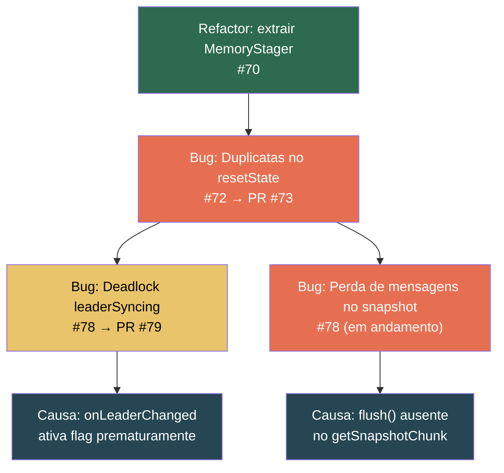

# Diário de Bordo — nishi-utils (NGrid / NQueue)

> Registro cronológico das alterações, decisões técnicas e lições aprendidas durante o ciclo de estabilização do NGrid (fev–mar/2026).

---

## 2026-09-26 — WRONG_OWNER confirmado no líder, lag do catálogo e reconexão de storages — release 8.7.0

Atende a [issue #177](https://github.com/nishisan-dev/nishi-utils/issues/177) (WRONG_OWNER em
pingue-pongue durante rebalance com ingestão contínua, produção TEMS) e
[issue #169](https://github.com/nishisan-dev/nishi-utils/issues/169) (desconexões
`PeerDisconnectedException` entre storages quando um cliente reconecta). Inclui também a correção
de uma causa de cluster sem líder após failover ([issue #179](https://github.com/nishisan-dev/nishi-utils/issues/179))
e o LEAVE gracioso do NGrid. **A dessincronia de escala do lag global de replicação
([issue #178](https://github.com/nishisan-dev/nishi-utils/issues/178)) segue aberta** — use `CAT_LAG`
(por tópico) em vez do `HIGH_REPLICATION_LAG` agregado para diagnosticar o catálogo do ngrrd.

### ngrrd cluster (`nishi-utils-ngrrd-cluster`)

- **Storage confirma no líder o redirecionamento derivado da réplica local.** `StorageRequestHandler`
  não responde mais `WRONG_OWNER`/`MIGRATING` só com base na cópia eventual do catálogo: todo
  redirecionamento derivado da réplica (dono divergente, ou migração em que este nó não é a origem
  copiando) é confirmado no líder numa única consulta em lote por request
  (`ngrrd.catalog.lookup`, prazo `OWNER_CONFIRMATION_TIMEOUT` = 2 s), exceto quando o próprio nó já é
  o líder. Confirmação positiva fica em cache por 5 s (até 100 mil chaves, invalidado por qualquer
  mudança de posse local) — o cache nunca autoriza criar uma série, só evita reconsultar o líder a
  cada request. Líder indisponível cai no comportamento da 8.6.0 (resposta pela réplica local), com
  cooldown de 1 s antes de tentar confirmar de novo e uma única sondagem enquanto durar a
  degradação. Log `NGRRD_OWNER_REDIRECT_OVERRIDE` (FINE) quando o líder diverge da réplica. Novas
  métricas `redirectConfirmations`, `redirectOverrides`, `redirectConfirmationFailures`,
  `redirectCacheHits` em `NodeMetricsSnapshot`/`ngrrd_admin metrics`/`NGRRD_NODE_STATUS`.
- **Cliente detecta dicas de dono contraditórias e resolve no líder.** `WriteDispatcher` e
  `RemoteSeriesHandle` não seguem mais toda dica de `WRONG_OWNER` cegamente: uma dica é
  contraditória quando aponta para o próprio nó, para um nó já visitado no episódio de
  redirecionamento, diverge do dono já confirmado pelo líder, ou o episódio já tem 4 saltos. Nesse
  caso a série pausa sozinha e uma consulta coalescida ao líder (uma tarefa por vez, não uma por
  série) decide o próximo passo; a cadeia legítima A→B→C continua sem RPC extra. Backoff
  exponencial por série (`redirectAttempts`) atravessa saltos; falha da consulta segue a última
  dica conhecida em vez de travar a série. `PlacementResolver.noteOwner` não sobrepõe mais um
  override autoritativo recente (líder/`ngrrd.catalog.lookup`) e carimba a dica com o maior
  `updatedAt` conhecido, nunca com o relógio do cliente — corrige o laço quente de auto-redirect.
  Novas métricas `ownerLookups`/`redirectCycles` em `ClientMetricsSnapshot`.
- **Lag da réplica do catálogo por nó.** `StorageNodeStatus.catalogReplica`
  (`CatalogReplicaStatus`: `leader`, `lag`, `leaderHighWatermark`, `nextExpectedSequence`,
  `syncing`, `pendingBootstrap`, `streaming`) expõe o lag **por tópico** do mapa `ngrrd.catalog`,
  alimentado por `ReplicationManager.getTopicReplicationStatuses()` — diferente do
  `HIGH_REPLICATION_LAG` global (dessincronizado, issue #178 aberta). Coluna `CAT_LAG` no comando
  `status` da CLI (`lider`, número, `sync`, `boot`, `?` = lag desconhecido, `-` = nó anterior à
  8.7.0) e `catalogLag=` na linha `NGRRD_NODE_STATUS`.
- **Rebalance não escolhe destino com réplica do catálogo atrasada.** Nova configuração
  `ngrrd.rebalance.maxDestinationCatalogLag` (padrão 1000; `-1` desliga a porta; `0` exige réplica
  em dia) exclui como **destino** — nunca como origem, e sem afetar o cálculo da distribuição alvo —
  nós com lag acima do limite, lag desconhecido, sincronizando ou com bootstrap pendente. Nós sem o
  campo (rolling upgrade a partir da 8.6.0) continuam elegíveis; o líder nunca é excluído. Rechecado
  na execução de cada migração (`SKIPPED` se deixou de ser elegível nesse meio-tempo), não na
  recuperação de migrações em curso. Log `NGRRD_REBALANCE_DEST_EXCLUDED` (INFO só quando o conjunto
  de exclusões muda). `ngrrd_admin rebalance` imprime `planejados=N iniciados=M` e uma linha
  `destino excluído: <nó> (<motivo>)` por nó fora da rodada; nova API
  `NgrrdClusterClient.triggerRebalance()` devolvendo `RebalanceTrigger` (a `rebalanceNow()` anterior
  continua disponível, delegando para a nova).
- Documentação: `doc/oss/ngrrd-cluster.md` (semântica de redirecionamento confirmado no líder, YAML
  de `maxDestinationCatalogLag`, métricas novas), `doc/oss/ngrrd-cluster-operacao.md` (coluna
  `CAT_LAG`, saída do `rebalance`, troubleshooting de `WRONG_OWNER` alternando entre nós, ordem de
  atualização) e o diagrama `doc/oss/diagrams/ngrrd_cluster_sequence_write.puml`.

### NGrid (`nishi-utils-core`)

- **Issue #169 — aliases de seed não resolvidos não derrubam mais links já estabelecidos entre
  storages.** Um nó entrando na malha (ex.: um cliente reiniciando) podia gossipar seu próprio
  alias de seed (`host:port`) antes de ser identificado; um storage que recebesse esse alias
  substituía o peer canônico já verificado em `knownPeers`, discava de novo para o mesmo processo
  sob outra chave, e o desempate de conexões do outro lado fechava o link original —
  derrubando requisições storage↔storage em voo (`ngrrd.migrate.chunk` falhando com
  `PeerDisconnectedException`). Corrigido em `TcpTransport`: alias gossipado no `host:port` de um
  peer já verificado pelo handshake é descartado (`mergeGossipedPeer`, usado uniformemente no
  handshake, `PEER_UPDATE` e reachability); aliases de seed não resolvidos deixam de ser
  gossipados (`gossipablePeers()`); o `disconnect` não derruba mais o lock de conexão do peer nem
  falha respostas pendentes se outra conexão identificada para o mesmo peer segue aberta; logs de
  disconnect do transporte passam a identificar o nó local.
- **Lag de replicação do líder é zero no snapshot operacional.** O HWM rastreado do líder só
  avançava com heartbeats recebidos — e o líder não recebe o próprio heartbeat — então
  `NGridNode.operationalSnapshot` calculava um lag artificial e `HIGH_REPLICATION_LAG` disparava
  `CRITICAL` no próprio líder (observado em produção: 4.761.359). O líder agora reporta
  `getAdvertisedHighWatermark()` como HWM rastreado e o lag é sempre 0 nele;
  `NGridAlertEngine.evaluateReplicationLag` não avalia mais lag de replicação quando o snapshot é
  do líder.
- **HWM do tópico no líder recém-eleito considera a fronteira aplicada.** Um líder recém-eleito
  passava a anunciar o high-watermark do tópico como o que ele havia **recebido**, não o que
  **aplicou** — com um tópico ocioso (sem tráfego novo desde a eleição), os seguidores viam HWM 0 e
  reportavam lag desconhecido mesmo com a réplica em dia. Corrigido: o líder recém-eleito anuncia a
  fronteira aplicada como HWM.
- **Issue #179 — sobreviventes não ficam mais sem líder após failover quando um membro
  inelegível está à frente no odômetro aplicado.** Um cliente ngrrd (`leader-ineligible`) mais
  adiantado que os storages sobreviventes podia impedir a eleição de um novo líder entre eles depois
  da queda do líder anterior.
- **LEAVE gracioso.** Membros efêmeros (inelegíveis a líder, ou porta ≤ 0 — clientes ngrrd e a CLI
  administrativa) enviam `LEAVE` ao encerrar (best-effort, com flush por conexão) em vez de só
  desconectar; os peers os esquecem por completo (tombstone de 10 min, retransmissão única) — a CLI
  administrativa deixa de aparecer como membro do cluster depois de sair. Votantes continuam usando
  o caminho de desconexão atual, sem forçar o esquecimento (evita encolher a maioria sem consenso).
  Nova capacidade de handshake `supportsLeave`; nós anteriores a esta versão nunca recebem `LEAVE`.
  Detalhes em `doc/ngrid/arquitetura.md`.

**Compatibilidade e ordem de atualização.** Mudanças aditivas e compatíveis no protocolo —
atualize os storages primeiro, depois os clientes; mantenha o rebalance automático desabilitado
durante a janela e só reabilite quando todos os storages estiverem na 8.7.0 (mesma orientação da
8.5.0, ver `doc/oss/ngrrd-cluster-operacao.md`). Um cliente 8.6.0 contra storages 8.7.0 já se
beneficia da confirmação no líder feita pelo storage; um cliente 8.7.0 contra storages 8.6.0 ainda
converge pela detecção do lado do cliente. Nós anteriores à 8.7.0 simplesmente não publicam
`catalogReplica` (coluna `CAT_LAG` mostra `-`) e nunca recebem `LEAVE`.

## 2026-09-25 — Consultar existência e abrir sem criar — release 8.6.0

Atende a [issue #171](https://github.com/nishisan-dev/nishi-utils/issues/171), nos dois modos do
ngrrd (local e cluster), e a [issue #174](https://github.com/nishisan-dev/nishi-utils/issues/174)
(origem de migração reiniciada recriando a série vazia). **Inclui as correções da 8.5.1** (rebalance com ingestão contínua, ver
seção abaixo) — a 8.5.1 não teve release/tag própria; ela é publicada junto com esta versão.

- `Ngrrd.OpenOptions.withCreateIfMissing(false)` (novo campo `createIfMissing`, default `true`)
  desliga a criação implícita de `open`/`fromYaml`: série ausente lança
  `dev.nishisan.utils.oss.api.SeriesNotFoundException` sem alocar nada, nos dois modos. No modo
  local o handle de uma série existente segue gravável normalmente. `SeriesNotFoundException`
  não herda de `NgrrdClusterException` (falha de transporte nunca a captura por engano) e expõe
  `reason()` — `ABSENT` no modo local; `NOT_PLACED`/`MISSING_ON_OWNER` no cluster.
- `Ngrrd.exists(...)` (três overloads, espelhando `open`/`fromYaml`) consulta a existência de uma
  série no volume sem I/O de criação — resolve a chave física e pergunta ao storage.
- `NgrrdClusterClient` ganha `exists(String)`, `exists(Collection<String>)`,
  `find(String) → Optional<SeriesInfo>` e `verify(Collection<String>) → Map<String,
  SeriesVerification>` (`PRESENT`/`MISSING_ON_OWNER`/`NOT_PLACED`/`UNVERIFIED`). Existência no
  cluster é presença de placement no catálogo (`MIGRATING` conta como existente); um hit local
  responde sem RPC, um miss é confirmado em lote no líder (`ngrrd.catalog.lookup`, novo comando,
  paginado em `NgrrdClusterConfig.catalogLookupBatchSize`, default 2000, sequencial). Falha ao
  confirmar (sem líder, timeout, transporte, líder sem o comando) nunca vira `false` — sempre
  `NgrrdClusterException`. `verify` é a única verificação física (`ngrrd.series.exists.batch` no
  dono, também novo).
- `NgrrdClusterClient.open(..., createIfMissing=false)` abre um handle SOMENTE LEITURA: o cliente
  nunca posiciona (`ngrrd.place`), o storage recusa criar — responde `SeriesStatus.NOT_FOUND`
  só depois de o líder confirmar `ACTIVE(self)`, isto é, com ownership: a série é dele e o
  arquivo não existe — e `write`/`flush`/`checkpoint` lançam `IllegalStateException`. O storage
  abre sem criar sempre com `OnGeometryChange.FAIL`, qualquer que seja a política pedida:
  geometria divergente vira erro ao leitor e nada é migrado nem recriado (exceção: um arquivo
  truncado, menor que o header fixo, passa na checagem de existência e é reinicializado — ver
  `doc/oss/ngrrd.md`). O OPEN sem criar também não invalida a confirmação de geometria no
  catálogo antes de abrir; só a confirma depois do sucesso. Cache de handles sem
  contagem de referências: abrir com criação sobre um somente leitura em cache o substitui por
  um gravável novo (o antigo continua válido para quem já o tinha); abrir sem criar sobre um
  gravável em cache devolve uma vista somente leitura nova a cada chamada, cujo `close()` nunca
  fecha o gravável.
- Storages anunciam capacidades de protocolo em `StorageNodeStatus.capabilities`
  (`catalog.lookup`, `open.createIfMissing`, `series.exists.batch`); o cliente confere a
  capacidade antes de enviar uma operação nova e falha com `ErrorCode.UNSUPPORTED_BY_NODE` — sem
  RPC — contra um storage/líder de versão anterior, em vez de arriscar `false` ou criar a série
  por engano. Status local sem a capacidade é confirmado por leitura forte no líder antes de
  recusar, relida com backoff curto dentro do prazo restante quando ausente.
- Corrige o seed da liderança do `placementHandler` no boot: vale para qualquer primeiro líder
  eleito durante `builder.start()`, antes do registro dos listeners (não só para um cluster de
  um nó) — `addLeadershipListener` não dispara callback sintético para quem já é líder. Sem o
  seed, a janela de graça pós-eleição de `PLACE` e `ngrrd.catalog.lookup` nunca se abria naquele
  mandato, e um miss logo após o boot podia virar "não existe" definitivo antes da réplica local
  do catálogo convergir. O seed agora acontece antes de o handler ser registrado para atender
  requisições (rede e caminho local).
- Corrige o "não existe" falso logo após uma eleição: o coordenador troca o líder antes de
  notificar os listeners, e o novo líder recontava as pendências a partir do catálogo inteiro
  (centenas de ms com ~357 mil séries) antes de marcar o início da janela de graça — nesse
  intervalo, um miss de `ngrrd.catalog.lookup` era respondido como `OK` sem a chave. A marca
  agora é gravada antes de qualquer trabalho pesado, e um miss enquanto a réplica do líder ainda
  sincroniza (`ReplicationManager.isLeaderSyncing()`) responde `NOT_LEADER` (o cliente retenta).
- Um miss de `ngrrd.catalog.lookup` no intervalo em que o coordenador já trocou o líder mas ainda
  não notificou os listeners também responde `NOT_LEADER`: depois de perder (ou não ter) a
  liderança, o handler se considera dentro da janela de graça até ver a próxima posse.
- **Mudança de assinatura:** os construtores públicos de `PlacementRequestHandler` recebem um
  novo parâmetro `BooleanSupplier leaderSyncing` (logo após `leaderView`), usado para recusar
  misses enquanto a réplica do líder sincroniza. Quem monta o handler fora do `NgrrdStorageNode`
  precisa passar `replicationManager()::isLeaderSyncing` do `NGridNode`.
- `NgrrdClusterAdminCli status` mostra as capacidades anunciadas por nó (coluna `CAPABILITIES`;
  `-` quando o status não traz nenhuma).
- Mudanças de comportamento no caminho que cria:
  - `open` durante um `close()` lento do mesmo handle agora abre um handle novo (a 8.5.0
    devolvia o handle que estava fechando);
  - a reabertura automática de uma série no storage (após fechamento por ociosidade/LRU) nunca
    cria: se o objeto sumiu, o storage responde `NOT_OPEN` e o `OPEN` do cliente o recria — um
    round-trip a mais;
  - `PLACE` de séries novas aguarda `placementGraceAfterLeadership` (3 s por padrão) depois que
    o primeiro líder do boot assume, porque a janela de graça agora também se abre nesse
    mandato — a criação das primeiras séries logo após subir o cluster atrasa até esse prazo.
- **Issue #174 — origem de migração reiniciada não recria mais a série vazia.** Um `OPEN` com
  criação (padrão da ingestão) de uma série fechada, sem objeto no volume e com o dono decidido só
  pela réplica local do catálogo, agora confirma o dono no líder (`placementStrong`) antes de
  criar: outro dono → `WRONG_OWNER(dono)`, `MIGRATING` → `MIGRATING`, sem placement →
  `WRONG_OWNER` sem dono, falha da consulta → `ERROR`. Antes, a origem reiniciada logo após o
  `migrate.finish` com a réplica ainda em `ACTIVE(origem)` recriava a série vazia, e as escritas
  dessa janela se perdiam quando o `LocalReconciler` apagava a órfã. Custo: a criação de uma série
  nova paga até uma leitura forte no líder além do `PLACE` (nada a mais quando a réplica do dono
  ainda não recebeu o placement) — medição em `doc/oss/ngrrd-cluster-operacao.md`.
- A decisão de dono tomada pelo líder no storage (réplica local vazia, hint do cliente ou série
  esquecida) passa a responder `MIGRATING` quando o placement forte está em migração com dono =
  este nó, salvo durante a cópia online da própria origem — antes respondia `OK` e a série podia
  ser aberta ou escrita durante a troca de dono.
- Marcas por série em memória no storage passam a ter limite (issue #174): a marca de série
  esquecida da origem de uma migração é descartada quando a réplica local já mostra outro dono
  (na requisição ou no ciclo do `LocalReconciler`); o `CLOSE` explícito do cliente não guarda mais
  marca — descarta a definição em cache, o que também passa a bloquear a reabertura automática de
  uma série cujo handle já tinha sido fechado por ociosidade antes do `CLOSE`.
- Novas métricas `leaderConfirmations`/`leaderConfirmationLatency` em `NodeMetricsSnapshot` e
  `StorageRequestHandler.StorageHandlerMetrics` (também na linha `NGRRD_NODE_STATUS`) e
  `forgottenPruned` em `LocalReconciler.ReconcileReport` (linha `NGRRD_RECONCILE`); os
  construtores com a assinatura anterior continuam disponíveis e zeram os campos novos.
- Documentação: `doc/oss/ngrrd.md` (modo local), `doc/oss/ngrrd-cluster.md` (contrato de
  consistência, cache de handles, reconciliação de catálogo externo, origem após o `finish`) e
  `doc/oss/ngrrd-cluster-operacao.md` (ordem de atualização — storages antes dos clientes;
  confirmação do dono antes de criar e seu custo).

## 2026-09-25 — Correções no rebalance com ingestão contínua — release 8.5.1 (não publicada — incorporada na 8.6.0)

Correções aplicadas ao módulo `nishi-utils-ngrrd-cluster`, complementando o trabalho da
[PR #172](https://github.com/nishisan-dev/nishi-utils/pull/172) (rebalance com ingestão contínua, 8.5.0).

- `MigrationCoordinator#pollUntilResolved` abortava a migração quando o poll de
  `MIGRATE_STATUS` ao destino falhava por transporte na mesma iteração em que a origem já
  reportava erro — mesmo com o destino já `COMMITTED` (ele segura o lock da série durante
  o commit/fsync, e o mesmo lock atende `MIGRATE_STATUS`, então esse timeout é o caso
  comum, não o raro). Agora só aborta por erro da origem quando o destino respondeu
  (não-nulo) e não é `COMMITTED` na mesma iteração. Se o poll do destino falhar por
  transporte com a origem já em erro, `SOURCE_FAILURE_DESTINATION_GRACE` (10 s, contados
  da primeira falha da origem observada) dá uma carência limitada antes de reconsultar o
  destino uma última vez e decidir — **trade-off aceito:** até 10 s de congelamento extra
  da série nesse cenário específico, em vez de esperar o `migrationTimeout` inteiro
  (10 min por padrão) sempre que o destino realmente caísse durante o cutover. Se a
  origem nunca reportar erro (ou o poll do destino nunca falhar), o coordenador continua
  tentando até o `migrationTimeout`, reconsultando o destino uma última vez antes de
  desistir.
- Com a série já congelada (clientes recebendo `MIGRATING`), cada patch final do delta
  esperava na mesma fila dos chunks de 256 KiB de outras cópias — medido em até 252 ms por
  rodada a 1 MiB/s com sete transferências concorrentes. `MigrationBandwidth` ganha
  `acquireUrgent(bytes)`: debita o orçamento imediatamente, sem esperar a vez. Só os
  patches enviados depois de `markMigrating` (cutover final) usam o modo urgente; os
  patches de catch-up continuam disputando a banda em pé de igualdade. O delta final
  continua contando no orçamento — a média de bytes/s por origem é preservada. A rajada do
  orçamento (`ngrrd.rebalance.maxBytesPerSecond`) deixa de ser só "até um chunk": pode
  incluir também os deltas finais de cutovers simultâneos.
- `VirtualThreadMigrationTest` pula a partir do JDK 24: o JEP 491 faz `synchronized` deixar
  de prender a carrier thread, tornando o teste inócuo (passaria mesmo com a regressão de
  volta). O CI roda em JDK 21.

## 2026-09-24 — Rebalance com ingestão contínua — release 8.5.0

Continuação da [issue #169](https://github.com/nishisan-dev/nishi-utils/issues/169).

- A origem continua recebendo escritas durante a cópia principal e transfere blocos
  incrementais antes da troca de dono. O checkpoint final precisa ter sucesso, e o delta
  final é limitado a 256 KiB por tentativa; exceder esse limite aborta preservando a origem.
- O cliente mantém FIFO por série e intercala séries prontas. Migrações e reaberturas
  pendentes deixam de bloquear todas as séries de um nó; barreiras continuam esperando ACKs.
- Esperas de RPC, abertura de conexão e escrita TCP usam caminhos compatíveis com as
  virtual threads do Java 21, evitando prender suas threads de suporte em monitores.
- O handshake preserva a conexão aberta pelo endereço do seed ao descobrir o ID real
  do nó. A limpeza do alias provisório deixava de reutilizar o socket e o fechava.
- O encerramento do transporte fecha também sockets sem handshake e impede que uma
  conexão iniciada antes do fechamento seja publicada depois dele.
- `ngrrd.rebalance.maxBytesPerSecond` limita o tráfego de imagem e patches por origem,
  somando todas as migrações; padrão 16 MiB/s. O coordenador também consulta falhas na origem.
- A cópia online negocia `liveCopy`/`COPY_READY` antes dos chunks e usa `ngrrd.migrate.patch`.
  Destinos antigos são recusados pela origem nova; destinos novos aceitam o fluxo legado.
  Atualize todos os storages antes de reativar rebalance e atualize os clientes para isolar
  retentativas por série. Não há mudança de mapas ou formato persistido.
- Regressões incluem transferência com escritas concorrentes, integridade e ordem de
  100 mil amostras a 5 mil/s com oito migrações, reservas, patches inválidos, reabertura
  lenta, checkpoint com falha e Java 21 com apenas duas threads de suporte.
- Banda, CPU, memória e disco continuam compartilhados; dimensione concorrência e orçamento
  pela folga disponível. A pausa final depende do commit e do catálogo, e não é uma garantia
  de latência zero. O guia operacional descreve os limites e a atualização.

## 2026-09-24 — Checkpoint após migração — release 8.4.1

Corrige a falha principal da [issue #169](https://github.com/nishisan-dev/nishi-utils/issues/169).

- Checkpoint, flush e leituras recuperam `WRONG_OWNER` seguido de `NOT_OPEN`,
  incluindo migrações durante a reabertura, sem consumir a recuperação de outro status.
- A barreira de escrita, as consultas ao líder, o `OPEN`, os RPCs e as esperas respeitam
  o orçamento original de retentativa. Erros permanentes e interrupções são preservados.
- Logs `FINE`/`DEBUG` identificam os status intermediários e o prazo restante.
- Regressões cobrem mudanças de dono, prazo esgotado e migração real com o handle original;
  o checkpoint do teste de rebalance deixa de mascarar exceções com retentativa externa.
- Compatível com storages 8.4.0: atualizar o cliente Java e a aplicação consumidora.
  Não há mudança de protocolo, catálogo ou formato de armazenamento neste hotfix.
- A observação secundária sobre transporte com 32 migrações simultâneas permanece
  sem diagnóstico confirmado e não está incluída na correção.

## 2026-09-24 — Capacidade e distribuição ponderada do ngrrd — release 8.4.0

Atende os itens 1 e 2 da [issue #167](https://github.com/nishisan-dev/nishi-utils/issues/167).
Cotas e afinidade por nó (item 3) permanecem para uma entrega futura.

- **Admissão por capacidade:** placement, rebalance e drain respeitam 95% da capacidade
  declarada, incluindo tamanho alinhado da próxima série, entradas planejadas e reservas.
  A origem só libera orçamento quando sua região é removida após a migração.
- **Distribuição consistente:** `ngrrd.distribution.mode` aceita `COUNT` (padrão), `CAPACITY`
  e `WEIGHT`. Placement e rebalance usam os mesmos pesos; `ngrrd.weight` deve ser positivo
  e finito. Capacidade desconhecida em `CAPACITY` ou modos divergentes levam a `COUNT`,
  com diagnóstico.
- **Geometria replicada:** `ngrrd.geometries` persiste descritores compartilhados por hash
  e versão. O dono confirma a geometria física após `OPEN`; mudanças suspendem a confirmação.
  Séries antigas são identificadas em lotes de até 256, lendo apenas cabeçalho e seção estática.
  Séries sem confirmação ficam fora das migrações até o preenchimento dos metadados.
- **Reserva antes da transferência:** `MIGRATE_PREPARE` usa o tamanho real da imagem e
  compartilha o orçamento do `BlobStorage` com novos `OPEN`. Commit consome a reserva;
  abort, falha e expiração a liberam. Após reinício é necessária nova preparação.
- **Operação:** status mostra modo, peso, reservas e geometrias pendentes. Drenagens sem
  espaço permanecem pendentes e procuram outras séries/destinos admissíveis. A entrada de
  um nó dispara avaliação automática quando o rebalance está habilitado.
- **Filesystem:** além do teto de regiões vivas, a admissão consulta o espaço utilizável.
  Essa consulta não reserva blocos contra consumo externo ao processo.

**Atualização coordenada obrigatória:** interromper tráfego e rebalance, aguardar migrações,
atualizar todos os storages e clientes Java e validar catálogo/metadados antes da retomada.
Iniciar em `COUNT`; habilitar ponderação explicitamente e com configuração uniforme.
Detalhes no [guia operacional](oss/ngrrd-cluster-operacao.md#atualização-coordenada).

## 2026-09-19 — Correções de escrita e desempenho do ngrrd — release 8.3.1

- **Falhas de escrita preservadas:** uma falha assíncrona deixa o `NgrrdWriter`
  em erro e é propagada a novas escritas e checkpoints. Escritas posteriores
  não podem ocultar uma falha anterior nem confirmar um prefixo incompleto.
- **Barreiras ACK mais eficientes:** o `WriteDispatcher` acompanha apenas rotas
  pendentes ou com falha e acorda por sinais de conclusão/erro, preservando as
  garantias das barreiras durante redirecionamentos e encerramento.
- **Retry após desconexão:** o cliente reconhece `IOException` e desconexões de
  peers em toda a cadeia de causas, inclusive quando encapsuladas, sem entrar
  em loop se a cadeia de exceções for cíclica.
- **LRU estável sob concorrência:** o registry captura os horários de acesso
  antes de ordenar candidatos à remoção e revalida as entradas sob lock antes
  de fechar os handles.
- **Reabertura com menos I/O:** séries com geometria inalterada leem apenas o
  cabeçalho nos backends com canal; migrações continuam usando a imagem completa.
- Regressões cobertas por testes de barreiras ACK, retry, LRU, reconciliação de
  geometria e propagação de falhas de escrita.

## 2026-09-18 — 🟢 Feature: ngrrd cluster (armazenamento distribuído) — release 8.3.0

O `ngrrd-consumer` (TEMS) persiste dezenas de milhares de séries via `nishi-utils-oss` num único
processo com um único volume blob, e o troubleshooting em produção apontava o disco como limitador
provável conforme o volume cresce — sem medição precisa. A única saída até aqui era crescer
verticalmente a máquina. A 8.3.0 introduz o **novo módulo `nishi-utils-ngrrd-cluster`**: um cluster
de storage nodes sobre o NGrid, com coordenador eleito, que distribui séries horizontalmente sem
mudar a interface `NgrrdHandle` que o consumer já usa.

**O que entrou, por marco:**

- **M0 (core):** role `leader-ineligible` e roles configuráveis no `NGridNodeBuilder` — pré-requisito
  para o cliente do cluster participar da malha sem nunca poder liderá-la.
- **M1 (módulo, protocolo, caminho feliz):** catálogo replicado (`SeriesPlacement`/`StorageNodeStatus`
  em dois `DistributedMap`), protocolo `ngrrd.*` sobre o transporte do NGrid, storage node com
  registry de handles e placement no líder, política `LeastLoadedPlacementPolicy`, cliente
  transparente (`RemoteSeriesHandle`) com a mesma interface `NgrrdHandle` de sempre.
- **M2 (métricas e admin):** `NodeMetricsSnapshot`/`ClientMetricsSnapshot`, comandos
  `ngrrd.admin.status`/`ngrrd.admin.metrics`, orçamento total (não por handle) de `close()`.
- **M3 (migração e rebalanceamento):** `MigrationCoordinator`/`MigrationExecutor` movendo séries
  entre nós em chunks com verificação SHA-256, `Rebalancer` equilibrando carga automaticamente,
  resolução de migrações órfãs por troca de liderança.
- **M4 (drenagem, reconciliação e CLI):** `ngrrd.admin.drain`/`activate`, `LocalReconciler` (adoção
  de séries órfãs — também o caminho de migração de um ngrrd single-node existente — e deleção
  segura de cópias órfãs), `NgrrdClusterAdminCli`.
- **M5 (este release):** documentação (`doc/oss/ngrrd-cluster.md`), quatro diagramas PlantUML,
  bump de versão e este registro.

**Decisões de arquitetura:**

- **Sem réplica, por desenho.** Cada série vive em exatamente um storage node; redundância é
  problema de infraestrutura, não do cluster. Queda de nó = séries dele indisponíveis até voltar —
  não existe (nem faria sentido existir) re-placement automático de uma série de um nó caído.
- **Líder eleito entre os próprios storage nodes** coordena placement, rebalanceamento, drenagem e
  admin; não há processo de coordenador dedicado.
- **Cliente é membro pleno do NGrid, mas `leader-ineligible`** — participa de gossip/handshake para
  falar com qualquer storage node, nunca disputa liderança.
- **Dimensionamento mínimo recomendado: 3 storage nodes**, para que a queda de 1 ainda deixe maioria
  entre os votantes elegíveis e o cluster continue coordenando.

**Defeitos encontrados no caminho:**

- *No core:* sem um jeito de marcar um nó como inelegível a líder, um cliente fino do cluster
  seria automaticamente candidato a coordenar o NGrid inteiro — corrigido com o role
  `leader-ineligible`. Sem um jeito de declarar mapas persistentes direto no `NGridNodeBuilder`, o
  catálogo do cluster (que precisa sobreviver a restart) exigiria descer ao `NGridConfig.Builder`
  cru em todo storage node — corrigido com `NGridNodeBuilder.map(name, mode)`.
- *No módulo (bloqueadores pegos em revisão de código, um por linha):* records do catálogo sem
  `Serializable` faziam o WAL do `NMapPersistence` falhar em silêncio e o catálogo nunca persistir
  de verdade; nó reiniciado respondia `WRONG_OWNER` sem dono e o cliente reenfileirava em loop
  silencioso; filtro de frescor de 4 s descartava justo o nó que perdeu a liderança, concentrando
  toda série nova nele; `close()` usava o `requestTimeout` em vez do orçamento total configurado,
  então um nó morto custava caro por handle; sob churn de liderança o líder podia recolocar uma
  série já existente e criar uma cópia vazia no lugar errado; um `abort()` de migração sem
  revalidação contra o líder podia apagar a única cópia real já commitada por outra via e reverter
  o catálogo para uma origem vazia; deadlock AB-BA e uso de handle após fechamento por outra thread
  no registry de handles do storage node.

**Trade-offs e limites:** chunks de migração em JSON+Base64 (adequado até poucos MiB por série);
churn de bootstrap do NGrid é ruído padrão observado em todo o desenvolvimento, mitigado (não
eliminado) por `bootDiscoveryWindow`; `close()` do cliente descarta amostras que não couberem no
orçamento total configurado, logando em `ERROR`; comandos do líder (inclusive o tick do
`NodeStatusReporter`) bloqueiam sem líder eleito — comportamento pré-existente do core. Ver a seção
13 de `doc/oss/ngrrd-cluster.md` para a lista completa, inclusive o vermelho conhecido
`LeaderFailoverDuringMigrationClusterTest` (~1 em 4) e os pontos abertos no core registrados como
trabalho futuro.

**Como operar:** subir storage nodes via `NgrrdStorageNodeMain --config <yaml>`; conectar clientes
via `NgrrdCluster.connect(NgrrdClusterConfig.fromYaml(...))`; administrar com
`NgrrdClusterAdminCli --seed host:port <status|metrics|drain|activate|rebalance>`. Detalhes,
exemplos de YAML e os quatro diagramas: `doc/oss/ngrrd-cluster.md`.

### Correções e adições no NGrid (core) que vieram junto

Encontradas e resolvidas durante o desenvolvimento do ngrrd cluster, mas são mudanças de
comportamento do **NGrid em si** — visíveis a qualquer usuário de `nishi-utils-core`, não só a quem
usa o cluster ngrrd. Cada uma merece destaque próprio:

- **Maioria de eleição só entre votantes elegíveis, líder estável a peers novos (`d521d5e`).**
  Antes, qualquer peer que passasse pela malha — inclusive um cliente efêmero com porta real —
  entrava para sempre no denominador da maioria dinâmica; após a queda do líder, os sobreviventes
  podiam nunca atingir quórum, e uma minoria de votantes de verdade chegava a liderar sustentada por
  clientes. **Por que importa:** sem essa correção, qualquer cluster com nós não-votantes (o próprio
  cliente do ngrrd cluster é um) arrisca ficar sem líder eleito mesmo com maioria real saudável.
- **Seguidores adotam quem de fato lidera; guard de sincronização não fica preso (`3ff1ace`).**
  Num handoff por afinidade, cada nó podia seguir um alvo diferente (o seguidor adotava um vencedor
  que ainda não tinha assumido, o eleito deferia a um seguidor, o recém-chegado mandava handback a
  quem não liderava); um guard de sincronização podia ficar armado sem pedido em curso, travando por
  16 s. **Por que importa:** elimina uma classe de handoff que nunca convergia (ou convergia tarde
  demais) só por causa de discordância entre nós sobre quem já é líder de fato.
- **Relay só por peers conectados, com retorno ao caminho direto (`77177e7`).** O roteador podia
  escolher um relay a partir do gossip sem exigir conexão aberta, e uma rota rebaixada a proxy nunca
  voltava a tentar o caminho direto — heartbeats podiam ir por um proxy morto até um nó se enxergar
  isolado. **Por que importa:** evita que um nó saudável pareça isolado (e dispare eleição
  desnecessária) só porque o relay escolhido morreu silenciosamente.
- **Desconexão confirmada com graça; placeholder promovido; escape de stalemate confirmado por
  heartbeat (`20f4a05`).** Um desempate de conexão duplicada com um peer ainda vivo podia derrubar o
  quórum por um instante e fazer o líder se demitir sem necessidade; o placeholder de `HEARTBEAT`
  (sem host) podia ser tratado como candidato real. **Por que importa:** reduz demissões de líder por
  ruído transitório de rede — o cenário mais comum de instabilidade percebida pelo cliente.
- **Protocolo de relay: UM salto por conexão direta aberta e aviso `UNDELIVERABLE` negociado.** Um
  relay passa a encaminhar só por uma conexão direta e aberta ao destino — nunca disca o destino em
  nome do remetente nem re-proxya por um terceiro nó (a rota de dois saltos derivada do gossip deixa
  de ser tentada, deliberadamente: cada mensagem a um nó morto virava uma tempestade de dials
  falhos executada no read loop dos sobreviventes, que se evictavam entre si no meio do failover).
  Quando não consegue encaminhar, o relay devolve `UNDELIVERABLE` ao remetente, que falha o
  request/response pendente na hora em vez de esperar o `requestTimeout`. O aviso só vai a peers que
  anunciaram `supportsUndeliverable` no handshake (campo novo, `false` para nós anteriores); o
  decoder passou a tolerar `MessageType` desconhecido (descarta a mensagem, mantém a conexão) —
  antes, um enum desconhecido derrubava o socket. Um `confirmPeerDisconnect` do coordinator só
  aceita reachability direta (uma rota de proxy por gossip não mantém vivo um peer cujo socket
  fechou), enquanto a evicção por heartbeat continua concedendo graça a membros só-por-proxy — as
  duas políticas de "vivo" coexistem de propósito e estão documentadas no código. **Por que
  importa:** o failover de um líder morto caiu de ~25 s para 1-3 s e um RPC ao líder recém-morto
  falha em milissegundos em vez de dezenas de segundos.
- **Passthroughs de `bootDiscoveryWindow`/`affinityHandbackMode` no `NGridNodeBuilder` (`5b935ca`).**
  Esses dois parâmetros só existiam no `NGridConfig.Builder` cru. **Por que importa:** qualquer
  código (não só o ngrrd cluster) que use a fachada recomendada `NGridNodeBuilder` agora consegue
  configurar os dois sem descer ao builder de baixo nível.
- **Role `leader-ineligible` (`26918ef`, mais roles configuráveis em `6ac1934`).** Honrado em todo
  ponto de escolha de candidato do `ClusterCoordinator` (afinidade, líder preferido, watermark,
  escape de stalemate, resolução de dual-leader, quiesce de reclaim, handback). **Por que importa:**
  é o que permite qualquer cliente fino (não só o do ngrrd cluster) participar de um cluster NGrid
  sem nunca correr o risco de acabar coordenando-o.
- **Mapa persistente configurável direto no builder (`6cd744c`).** `NGridNodeBuilder.map(name,
  NMapPersistenceMode)` evita descer ao `NGridConfig.Builder` para declarar um mapa que precisa
  sobreviver a restart. **Por que importa:** é o que tornou o catálogo do ngrrd cluster
  (`ngrrd.catalog`/`ngrrd.nodes`) persistente sem gambiarra — e serve qualquer outro `DistributedMap`
  do projeto que precise da mesma garantia.

## 2026-09-04 — 🔴 Fix: leitura descartava as amostras mais recentes da janela — release 8.2.0

O `NgrrdReader.downsample` reduzia a `maxPoints` **amostrando um índice por balde**
(`floor(i*n/maxPoints)`) e descartando o resto. Como o último índice visitado é
`n − ceil(n/maxPoints)`, as `ceil(n/maxPoints) − 1` amostras **mais recentes do range nunca
entravam na resposta** — justamente onde mora uma transição acabada de acontecer. E, por rodar
depois da escolha do anel do RRA, o resultado era idêntico em AVERAGE, MAX e LAST.

- **Sintoma em produção (TEMS):** uma interface caída às 23:57 aparecia, na tira `oper_status`
  da janela de 24h, como "up 100,0 % · down 0,0 % · 0 transição(ões)" — ao lado de um cabeçalho
  `DOWN` e de um alarme `INTERFACE_OPER_DOWN` ativo. Com `n = 287` e `maxPoints = 120`, os
  índices 284 e 285 (`23:55` e `00:00`, os **únicos** com `down`) não eram sequer olhados.
- **Sintoma em contadores:** subestimação de pico em janelas longas. A mesma série lida em 30
  dias com `maxPoints=1000` reportava **393 Mbps** onde o máximo real era **562 Mbps**.
- **Fix:** `reduce` agrega **baldes contíguos que particionam `[0, n)` sem sobra** — o último
  termina exatamente em `n`, então a amostra mais recente sempre participa — reduzidos pela
  mesma `cf` da `ViewQuery` (MAX preserva o pico, LAST o valor final, AVERAGE a média). `NaN` é
  ignorado na redução; balde inteiramente `NaN` emite `NaN` e os gaps ficam preservados.
- **`SeriesResult.stepSec`** passa a informar o **espaçamento real** dos pontos devolvidos. Antes
  repassava o step do RRA mesmo após reduzir, e uma resposta espaçada de 600s anunciava 300s.
- **`cf` não materializada agora falha:** quando nenhuma RRA declara a `cf` pedida, o
  `BestFitSelector` não acha candidato e o reader devolvia lista vazia — indistinguível de
  "janela sem amostras", e no cliente HTTP um `200` com arrays vazios. Passa a lançar
  `NgrrdQueryException` listando as `cf` disponíveis. A distinção é segura porque o seletor só
  devolve vazio por esse motivo quando **há** RRAs declaradas.

Lição: a validação `validateStateConsolidation` já exigia, desde sempre, uma RRA não-AVERAGE
para DS com `dictionary`, e o javadoc dizia "a leitura deve então usar esse CF" — uma obrigação
declarada que **nenhum código impunha**. Um contrato que só existe em comentário não é contrato.

Cobertura: `NgrrdReadReductionTest` (7 casos — cauda preservada, MAX/LAST/AVERAGE, passthrough,
step efetivo, `cf` ausente). Sem mudança de layout on-disk nem de `formatVersion`.

## 2026-06-23 — 🟢 Feature: idle-skip de checkpoint redundante no ngrrd writer

O `checkpoint()`/`flush()` re-emitia o CDP parcial de todos os RRAs e forçava a durabilidade
(fsync no disco / **PUT do objeto inteiro** no S3) a cada chamada — mesmo sem nenhuma amostra
nova desde o último force. Com checkpoints frequentes (~1s) e ingestão mais lenta, isso gerava
N forces/PUTs idênticos por intervalo.

- **Gate idle-skip:** `NgrrdWriter` pula `checkpointAndForce()` quando nada mudou desde o último
  force (`changedSinceForce`, por série, confinado à worker thread). A re-emissão parcial seria
  byte-idêntica e o canal já estaria limpo, então o force/PUT seria no-op. Estritamente
  Pareto-positivo: leitura e durabilidade **idênticas**.
- **Segurança:** o flag é marcado em **toda** amostra aplicada (mesmo sem virar passo, para não
  perder o PDP parcial do slot aberto no shutdown) e limpo **só após** persistir/forçar com
  sucesso (retry se o `force()` lançar). Publicado pelo mesmo mecanismo de `ringDirty`.
- **Observabilidade:** novo `checkpoint_coalesced_count` (`onCheckpointCoalesced` no
  `NgrrdMetricsListener`/`NgrrdMetrics`, forma canônica + legada).

Contrato: `checkpoint()`/`flush()` passam a documentar o no-op idle. Sem mudança de layout
on-disk nem de `formatVersion`.

## 2026-06-22 — 🟢 Feature: observabilidade global do blob volume (ngrrd, issue #160) — release 8.1.0

A v8.0.0 introduziu o backend `SHARDED_BLOB`, onde milhares de séries compartilham um volume; a
observabilidade era apenas por-handle/por-série. A 8.1.0 fecha duas lacunas, de forma **aditiva e
não-breaking**:

- **(a) Listener de qualidade por-volume:** `Ngrrd.open(BlobVolume, …)` passava `metricsListener=null`
  fixo (séries abertas por volume nunca recebiam listener). Agora propaga `volume.qualityListener()`
  a cada handle — coleta central via `NgrrdBlob.registry().qualityListener(...)`, sem fiar um
  listener por série.
- **(b) seriesKey nos callbacks de qualidade:** forma canônica `on*(seriesKey, …)` (legadas
  preservadas por delegação), permitindo atribuir eventos à série de origem num listener global.
- **(c) Métricas operacionais do volume:** nova `BlobVolumeMetricsListener` (push: `onShardGrow`,
  `onRegionAllocate`, `onRegionFree`, `onCheckpoint`) instrumentada no `BlobStorage` — eventos
  estruturais sob o `structuralLock` (contrato O(1)/non-blocking), `onCheckpoint` fora do lock. Mais
  `BlobVolumeStats` (gauges pull: fill ratio e séries por shard com **uso líquido**, tamanho de
  catálogo e WAL) via `BlobVolume.stats()`.
- **(d) `ingest_lag_sec`:** métrica antes declarada-porém-não-emitida; agora instrumentada no writer
  com relógio de ingestão injetável (emite só lag positivo).

Telemetria não altera o layout on-disk — sem bump de `formatVersion` nem impacto cross-language.

## 2026-06-11 — 🟠 Fix: handoff por afinidade sob produção contínua — dual-leader livelock (issue tems#9, D10)

A validação do D9 em pré-prod expôs o D10: no rejoin do nó de maior afinidade sob firehose, o
cluster degenerava em **dual-leader estável** (gate B estrito nunca abria pelo delta in-flight; o
candidato armava o latch contra watermark stale e assumia; escada infinita de re-stamps de epoch).
Pacote em três frentes complementares:

- **(a) Join-quiesce cobre o catch-up real:** o release comparava o progresso do follower contra o
  `globalSequence` CRU do líder (escala errada num líder promovido — liberava em 1,5s com catch-up
  de 64s). Agora compara contra `max(globalSequence, lastApplied)`, descarta progresso com epoch
  divergente/frontier -1 e exige report fresco (entrada stale de sessão anterior não pré-satisfaz).
- **(b) Quiesce-assisted reclaim (opt-in, `leaderPauseOnReclaim`):** espelho do pause-on-join no
  caminho do reclaim — com o candidato de maior afinidade a ≤ `reclaimQuiesceThreshold` do
  watermark, o incumbente pausa a produção, o watermark congela, o candidato emparelha EXATO e o
  gate B abre (handoff coordenado). Pausa bounded (`reclaimQuiesceMaxDuration`, retém na
  expiração) + cooldown anti-loop.
- **(c) Detecção + resolução determinística de dual-leader (sempre ativa):** flag de líder no
  heartbeat (1 byte retro-compatível no frame binário); 3 observações consecutivas → o de MENOR
  afinidade (ordem da eleição: prioridade, depois NodeId) cede, adota o termo do rival (mata a
  escada de epochs) e ressinca via maquinaria D8 (a cauda da janela dual é descartada — o desfecho
  da contenção manual, agora automático). O F2 do D9 permanece intocado.

Testes: `JoinQuiesceReleaseGateTest` (reproduzia o release de 1,5s), `ReclaimQuiesceTest`,
`DualLeaderResolutionTest`, `DualLeaderYieldResyncTest`, codec (frame legado/novo) e
`DualLeaderLivelockE2ETest` — o primeiro E2E da suíte com **produção contínua durante o handoff**:
líder único, epoch estável, zero duplicatas e zero perda de itens ackados.

Limitação conhecida (follow-up epoch-aware da PR #142): contadores escalares cegos a linhagem —
ops aplicadas de ramos descartados inflam o contador e inviabilizam o emparelhamento exato.
Detalhes: `doc/ngrid/oplog-ha-hardening.md` §13 e `planning/issue-tems9-d10-dual-leader-livelock.md`.

---

## 2026-06-08 — 🔴 5.0.0 — BREAKING: `RELAY_STREAM` é o único modelo de replicação (remoção definitiva do legado)

Consolida o modelo definitivo **MySQL binlog/relay-log**: o líder grava um op-log durável segmentado
(o binlog) e o follower **PUXA** por cursor durável (`RELAY_STREAM`), persistindo em ordem e aplicando
no seu ritmo. `FollowerIngestMode` passa a ter **um único valor: `RELAY_STREAM`** (o default). Todo o
maquinário dos modos legados (`INLINE` e `RELAY_LOG`) era código morto e foi **removido**.

**BREAKING CHANGES:**
- **`FollowerIngestMode`**: removidos `INLINE` e `RELAY_LOG`; resta só `RELAY_STREAM` (default em
  `ReplicationConfig`/`NGridConfig`/`NGridNodeBuilder`). YAML/Cardinal continuam podendo setar o knob
  `followerIngestMode` = `RELAY_STREAM` (valores inválidos/ausentes caem no default tolerante).
- **Protocolo NAK (push + resend) REMOVIDO**: `SEQUENCE_RESEND_REQUEST`/`SEQUENCE_RESEND_RESPONSE`
  (enum `MessageType` + payloads `SequenceResendRequestPayload`/`SequenceResendResponsePayload`),
  detecção de gap, reenvio por lacuna e o skip de lacuna evicta. Em `RELAY_STREAM` o pull é contíguo
  por construção — não há gap nem NAK.
- **Push de replicação REMOVIDO**: o líder não faz mais broadcast de `REPLICATION_REQUEST` (enum +
  caminho de recepção do follower). Removidos também `REPLICATION_ACK`/`ReplicationAckPayload` (o
  ack-channel do quorum síncrono): o líder commita assíncrono em quorum-1 sobre o próprio binlog; os
  followers puxam o stream. **`replicate()` não bloqueia mais aguardando ACKs de followers.**
- **Reorder buffer e buffer INLINE REMOVIDOS**: buffer de sequência em memória
  (`sequenceBufferByTopic`), reorder buffer (`relayReorderByTopic`, `RELAY_REORDER_CAP`) e seus
  caminhos. Mantidos intactos o `sequenceBufferLock` (agora serializa apenas o frontier durável de
  apply do stream), o avanço do frontier, a aplicação ordenada e a liberação do drain-gate de failover.
- **Drop policy do `OutboundChannel` REMOVIDA**: existia só para o push de `REPLICATION_REQUEST`; o
  canal agora é uma fila FIFO ilimitada (métricas de depth/dropped reportam `0` estável).
- **Catch-up legado REMOVIDO**: `checkLagAndSync` (lag-based snapshot), `checkProactiveJoinSync`,
  `checkRelayHeadAgeAndBootstrap`, `attemptLeaderSync`/`retryLeaderSync` (pull-snapshot-to-lead). Em
  `RELAY_STREAM` o follower puxa e o líder sinaliza `needSnapshot` quando o cursor cai abaixo da janela
  retida; na promoção o nó drena o próprio relay (drain-gate) em vez de puxar snapshot para liderar.

**API pública preservada (compat de observabilidade/testes):** `getGapsDetected()`,
`getInlineSequenceBufferSize()`, `getResendSuccessCount()`, `getAverageConvergenceTimeMs()`,
`getEvictedSkipCount()` retornam `0`/constantes estáveis (os comportamentos subjacentes não existem
mais em `RELAY_STREAM`). `TopicReplicationStatus.resendPending` é sempre `false`. `getReplicationLogSize`
passa a reportar a janela de índice em heap governada por `replicationLogRetention(Time)` (o binlog em
disco é uma store segmentada separada).

**Testes:** removidos os que validavam exclusivamente o legado (`SequenceResendProtocolTest`,
`RelayLogReplicationTest`, `PersistentResendLogRegressionTest`, `FollowerSnapshotCutoverTest`,
`ReplicationManagerQuorumFailureTest`); ajustados para `RELAY_STREAM`-only os de config/retention/
cold-join/drop. Cobertura do stream em `RelayStream*Test` (incl. `streamContiguousUnderFirehoseNoNak`,
`slowFollowerLagsButNeverLoses`, `restartResumesFromCursorNoSnapshot`,
`failoverContinuesBinlogAcrossPromotion`).

---

## 2026-06-08 — 🟢 4.7.0 — Feat: retenção do binlog do líder estilo MySQL (rotação por tamanho + nº de arquivos)

Evolui a persistência do op-log do líder (o "binlog" do `RELAY_STREAM`, `ResendLog`) para reter um
número configurável de arquivos por **tamanho** ou **contagem de ops**, equiparando ao
relay/binlog do MySQL. O dono pode agora expressar **"10 arquivos de 10GB"** ou **"10 arquivos de
10M ops cada"**.

**Contexto:** o `ResendLog` já era segmentado (`seg-NNNNNNNNNN.dat`) e rotacionava por **ops**
(`resendLogSegmentMaxEntries`) e **idade** (`resendLogSegmentMaxAge`), retendo por **contagem total**
(`resendLogMaxEntries`) e **tempo** (`replicationLogRetentionTime`). Faltavam os dois eixos com que o
operador raciocina no MySQL: rotação por **bytes do arquivo** (`max_binlog_size`) e retenção por
**número de arquivos/índices** (`mysql-bin.NNNNNN`).

**Mudanças:**
- **Rotação por tamanho** (`resendLogSegmentMaxBytes`, o `max_binlog_size`): o segmento ativo rola no
  primeiro limite atingido entre ops, idade e bytes; um registro nunca é partido.
- **Retenção por nº de segmentos** (`resendLogMaxSegments`): mantém no máximo N arquivos de binlog; o
  segmento ativo nunca é dropado, então o líder sempre tem janela para servir o stream.
- **Exposição** no `ReplicationConfig`/`NGridConfig.Builder` e no YAML (`cluster.replication.*`), com
  **guardrails de PRODUCTION** (piso de 1MB/segmento e ≥2 segmentos retidos quando opt-in).
- **Observabilidade:** `ResendLog.totalBytes()/segmentCount()` e `ResendLogStore.diskBytes()/segmentCount()`.
- **Relay do follower:** expõe o TTL `expireAfterWrite` que o `NQueue` já suportava como knob
  `relayExpireAfterWrite` (o relay-log expiry do MySQL) — teto duro opt-in, default desligado.

Knobs `0`/`ZERO` por default (desabilitados) → comportamento atual preservado; o backstop de contagem
(`resendLogMaxEntries = 10M`) continua limitando o disco out-of-box.

**Testes:** `ResendLogTest` (rotação por bytes, retenção por nº de segmentos, `totalBytes`/
`segmentCount`), `ReplicationConfigTest`/`NGridConfigOpLogKnobTest` (defaults, propagação, rejeição de
negativos), `NGridConfigValidationTest` (guardrails de PRODUCTION), `NGridConfigLoaderTest`
(round-trip YAML), `RelayStoreTest` (TTL descarta entrada não-aplicada; default preserva).

---

## 2026-06-08 — 🟢 4.5.2 — Feat: compressão LZ4 transparente na camada de transporte (#133)

Adiciona **compressão LZ4** transparente ao transporte TCP do cluster (PR **#133**), reduzindo os
bytes trafegados na replicação — em especial `SYNC_RESPONSE` (snapshots multi-MB, byte-sliced) e
`REPLICATION_REQUEST`. O `ReplicationManager` não foi tocado: a compressão é totalmente transparente,
feita na camada de codec/transporte.

**Contexto:** nenhuma camada do caminho de replicação comprimia nada; a serialização é JSON via
Jackson, que ainda emite os `byte[]` dos payloads como Base64 (~+33%). O ganho é direto sobre esse
volume inflado.

**Como funciona:**
- Novo marker de frame **`0x10`** no `CompositeMessageCodec` (LZ4 *block* + header
  `[marker][originalLength]`, pois o block não guarda o tamanho descomprimido). `unwrap` valida o
  tamanho contra um teto (256 MiB) antes de alocar.
- **Threshold + ganho real:** só comprime JSON `>= minSize` (default **512B**) e apenas se o frame
  comprimido ficar menor; caso contrário envia `0x00`+JSON. HEARTBEAT/PING seguem binários.
- **Compatível com rolling upgrade:** capacidade negociada no handshake
  (`HandshakePayload.supportsCompression`). Nó antigo (campo ausente → `false`) **nunca** recebe frame
  comprimido; o `decode` sempre sabe descomprimir. O próprio handshake nunca vai comprimido.
- **Per-connection:** cada `Connection` tem seu `CompositeMessageCodec`; a compressão de saída só liga
  após o peer confirmar suporte (`compressionEnabled && peerSupportsCompression`).
- **Configurável (default ligada):** `TcpTransportConfig`/`NGridConfig`
  (`compressionEnabled`/`compressionMinSize`) e seção YAML `cluster.transport.compression`
  (`enabled`/`minSize`). Dependência nova: `org.lz4:lz4-java`.

**Testes:** `Lz4FrameCompressorTest`, `CompositeMessageCodecTest` (round-trip comprimido, threshold,
incompressível, interop legado `0x00`/`0x7B`, HEARTBEAT binário), `HandshakePayloadTest` (campo
ausente → `false`), `TransportCompressionConfigTest`, mapeamento YAML em `NGridConfigLoaderTest` e
`TransportCompressionClusterTest` (cluster real de 2 nós: cold-join via snapshot comprimido +
replicação ao vivo comprimida). Suíte do core verde (420 testes) com compressão ligada por default.

---

## 2026-06-07 — 🟢 4.5.1 — Fix: sync proativo do cold-join contra líder quiescente (montagem manual)

Corrige o **#131** (follow-up do #129 3a): em montagem **manual** do `ReplicationManager` (sem
`NGridNodeBuilder`, como no `tevent-cardinal`), um follower **novo** contra um líder **quiescente**
não fazia o sync proativo do cold-join — ficava em estado vazio indefinidamente. O caminho reativo
(líder produzindo) sempre funcionou; só o proativo/sem-tráfego falhava.

**Causa raiz:** `checkProactiveJoinSync` desistia quando `getTrackedLeaderHighWatermark() <= 0`. Esse
watermark vem do heartbeat do líder, cujo valor é produzido pelo `leaderHighWatermarkSupplier` do
coordinator — **fiado apenas pelo `NGridNode`** (default `-1`). Na montagem manual o supplier ficava no
default, o líder emitia heartbeat com watermark `-1` e o proativo do follower era barrado para sempre.
(A hipótese de epoch da issue é falso positivo: o fencing compara contra `trackedLeaderEpoch`, que
começa em 0, não contra o `leaderEpoch` local da auto-eleição transitória.)

**Correção:**
- **`ReplicationManager.start()` passa a fiar o supplier do watermark** (`isLeader ? getGlobalSequence()
  : getLastAppliedSequence()`), tornando-o correto em **qualquer** montagem (manual ou facade). A
  fiação externa duplicada no `NGridNode` foi removida (fonte única).
- **O cold-join proativo não depende mais de watermark > 0**: só pula quando o watermark é **conhecido
  (>0) e já alcançado**; watermark desconhecido (`<=0`) vira "sincroniza por segurança" (pior caso:
  snapshot vazio, 1x por termo).

**Testes:** `ProactiveColdJoinWatermarkTest` (2, montagem manual — cobre o gap do #129 que usava o
facade): heartbeat do líder carrega o watermark real após `start()`, e o follower cold dispara o sync
proativo mesmo com watermark desconhecido (verificado que falha sem o fix). Suíte do core verde.

---

## 2026-06-07 — 🟢 4.5.0 — Convergência do bootstrap sob carga (op-log em disco, apply em lote, sync no join) + broadcast inter-nós

Fecha três falhas interligadas observadas na validação do `tevent-cardinal` (TEMS) em HA de 2 nós com
o `ReplicationManager` em **RELAY_LOG** (#124), sob carga real de produção (pré-prod 218/219), e
adiciona uma primitiva de coordenação leve entre nós. Detalhes e diagramas em
[`doc/ngrid/oplog-ha-hardening.md`](ngrid/oplog-ha-hardening.md) (seções 10–12) e
[`doc/ngrid/broadcast-messaging.md`](ngrid/broadcast-messaging.md).

**#127 — op-log de resend do líder em disco (híbrido).** O op-log de resend vivia em heap
(`NavigableMap`), então sob alta produção o teto por **contagem** vencia a janela **temporal** e o gap
de bootstrap era evictado → "missing sequences → snapshot fallback" em loop (relay do follower
crescendo sem limite, 18 GB observados). Novo **`ResendLog`**: store próprio, segmentado, indexado por
sequência (busca binária ordenada por inserção, tolerante a commits fora de ordem), com
**auto-compactação por descarte de segmento** governada por tempo. O op-log passa a ser **híbrido**:
cache quente em heap (recente) + `ResendLog` em disco (janela temporal profunda, off-heap). Opt-in via
**`persistentResendLog`** (default `false`); janela por `replicationLogRetentionTime`.

**#128 — throughput de apply em lote + métricas de relay.** O drain do relay era 1-a-1
(`peek→apply→poll`); o apply do follower não acompanhava a produção sob burst. Agora **apply em lote**
(`readRange(n)` + um único commit de frontier por lote), mantendo consumidor single-thread e ordem
estrita (`effectively-once` preservado). Knob **`relayApplyBatchSize`** (default 256). Métricas
públicas de lag: **`getRelaySize(topic)`**, **`getRelayHeadAgeMillis(topic)`**, **`getRelaySizes()`**.

**#129 — sync proativo no join + leader-pause-on-join + sem caught-up transitório.** Em RELAY_LOG o
follower só sincronizava reativamente, então um follower **novo** contra um líder **quiescente** nunca
convergia. Agora: **(3a)** sync proativo no cold-join (lê o watermark do líder via heartbeat e puxa um
snapshot, sem depender de tráfego); **(3b)** **leader-pause-on-join** opt-in (`leaderPauseOnJoin`) —
o líder pausa a produção enquanto um follower atrasado entra, até ele alcançar / desconectar / estourar
`joinQuiesceMaxDuration` (espelho do drain-gate de failover, novo canal `FOLLOWER_PROGRESS`);
**(3c)** um nó que se auto-elege sozinho no boot (pair mode) não libera o gate por relay vazio dentro da
`joinPeerDiscoveryWindow`, evitando marcar estado vazio como sincronizado.

**Broadcast inter-nós.** Nova API **`broadcastMessage(String)`** + listener
**`onMsgBroadcasted(NodeId produtor, String msg)`** (em `ReplicationManager` e `NGridNode`), sobre o
`transport.broadcast` existente (novo `MessageType.USER_BROADCAST`). **Best-effort** (não-ordenado,
não-durável) e **com loopback** (o produtor também recebe a própria mensagem). Para coordenação leve;
para entrega garantida/ordenada, usar fila replicada.

**Novas chaves de config (`ReplicationConfig`/`NGridNodeBuilder`):** `persistentResendLog`,
`resendLogSegmentMaxEntries`, `resendLogSegmentMaxAge`, `resendLogMaxEntries`, `resendLogReadBatchMax`,
`relayApplyBatchSize`, `leaderPauseOnJoin`, `joinQuiesceMaxDuration`, `followerProgressInterval`,
`joinPeerDiscoveryWindow`, `joinSyncLagThreshold`. Defaults preservam o comportamento 4.4.0.

**Testes:** `ResendLogTest` (9), `PersistentResendLogRegressionTest` (2, regressão da espiral),
`RelayLogReplicationTest` (+2: métricas de backlog e cold-join contra líder quiescente),
`LeaderPauseOnJoinTest` (1, gate), `BroadcastMessagingTest` (2). Suíte do core verde.

---

## 2026-06-07 — 🟢 4.4.0 — Relay-log no follower (elimina a espiral de morte)

Implementa o **modelo relay-log** no follower do `ReplicationManager` (#124), sobre as fundações da
4.3.0 (#122/#123). Substitui o buffer em memória por um **relay-log persistente em disco** que
desacopla recepção de aplicação, eliminando a espiral de morte (reset + full-snapshot crescente +
starvation do líder) sob volume real (~2.8k ops/s). **Opt-in e aditivo**: default `INLINE` preserva o
comportamento 4.3.0. Detalhes e diagramas em
[`doc/ngrid/oplog-ha-hardening.md`](ngrid/oplog-ha-hardening.md) (seção *Relay-log no follower*).

**Novidades:**
- **`FollowerIngestMode { INLINE, RELAY_LOG }`** — knob do follower (default `INLINE`). No modo
  `RELAY_LOG`, cada `REPLICATION_REQUEST` é persistido num relay-log NQueue por tópico (ACK na recepção
  durável) e aplicado por um consumer próprio: `peek → fencing(epoch,seq) → apply → poll`. Exposto em
  `ReplicationConfig.Builder`, `NGridConfig.Builder`, facade `NGridNodeBuilder` e YAML
  (`cluster.replication.followerIngestMode`).
- **`RelayDurability { OS_MANAGED, GROUP_COMMIT, ALWAYS }`** — durabilidade configurável do tail do
  relay, análoga ao `sync_relay_log` do MySQL (trade-off taxa × janela de perda; o tail perdido é
  re-buscado pelo resend do líder). Default `OS_MANAGED`. Novo `NQueue.sync()` para o group commit.
- **Extensão NQueue** — `Options.withRetentionClampToConsumer(boolean)`: a retenção `TIME_BASED` nunca
  descarta registros **não-aplicados** (só recupera o prefixo consumido); e fix do `recordCount`
  defasado após compaction `TIME_BASED`.
- **Snapshot bootstrap-only** — no modo relay, lag **não** dispara snapshot (o relay absorve);
  snapshot fica só para o irrecuperável (restart sujo, gap evictado, head > retenção). Com
  `replicationLogRetentionTime=0` (default), o relay **acumula indefinidamente** os não-aplicados e
  aplica depois (lag ≠ perda — comportamento tipo relay log do MySQL sem purge).
- **Failover drain-gate** — generaliza o gate de leader-sync de "snapshot instalado" para "relay
  drenado": o nó promovido segura escrita (`LeaderSyncingException`) até drenar o relay; release por
  relay vazio, **sem depender de peer**.
- **Crash-safety do cursor** — clean-shutdown marker distingue parada limpa (resume) de crash
  (bootstrap), evitando duplicação do `OFFER` não-idempotente.
- Métricas `getSyncRequestCount()` e `getInlineSequenceBufferSize()` (observabilidade do regime relay).

**Aceite:** carga sustentada de 10k ops com lag muito além dos limiares → converge com **0**
snapshot/sync, sem reset (espiral eliminada). Failover 3-nós sem divergência. Suíte de resiliência
completa verde; INLINE inalterado.

---

## 2026-06-07 — 🟢 4.3.0 — Retenção temporal do op-log e gate de leader-sync

Fecha duas lacunas do HA active/standby (op-log) levantadas pelo `tevent-cardinal` (issues #122 e
#123). Detalhes e diagramas em [`doc/ngrid/oplog-ha-hardening.md`](ngrid/oplog-ha-hardening.md)
(seções 7 e 8).

**Novidades:**
- **`replicationLogRetentionTime(Duration)`** (#122) — retenção **temporal** do resend log do op-log,
  complementar ao teto de contagem (`replicationLogRetention`): *o que evictar primeiro vence*
  (contagem = memória; tempo = janela de backlog). Eviction oportunística no commit + agendada para
  tópicos ociosos. Default `Duration.ZERO` (desabilitado). Exposto em `ReplicationConfig.Builder` e na
  facade `NGridConfig.Builder`. Métricas `getReplicationLogTimeEvictedCount()` /
  `getReplicationLogSize(topic)`. Sequência fora da janela → `missingSequences` → snapshot fallback
  (caminho existente, sem divergência silenciosa).
- **Gate de escrita durante leader-sync** (#123) — `replicate()` agora rejeita escritas com
  **`LeaderSyncingException`** (subtipo de `IllegalStateException`) enquanto `isLeaderSyncing()` for
  `true`, fechando a janela de divergência para queue **e** map. Além disso, `attemptLeaderSync`
  **limpa** `leaderSyncing` quando não há `syncSource` alcançável (nó sozinho / cluster novo), em vez
  de travar o consumidor — elimina a necessidade do *grace* do lado do cardinal.

**Testes:** `ReplicationLogTimeRetentionTest` (4) e `LeaderSyncGateTest` (2). Testes de failover que
escreviam durante a janela de sync foram alinhados à convenção `!isLeaderSyncing()`.

---

## 2026-06-06 — 🟢 4.1.3 — Endurecimento do op-log de HA sob volume real

Convergência e estabilidade do HA active/standby (op-log) sob a volumetria real do Kafka
(~milhares de ops/s). Diagnóstico por logs + thread dumps de pré-prod; validado E2E. Detalhes e
diagramas em [`doc/ngrid/oplog-ha-hardening.md`](ngrid/oplog-ha-hardening.md).

**Correções:**
- **`leaderLocalApply`** — quando um engine externo é a fonte da verdade, o líder pula o apply-local
  redundante e commita+indexa de forma síncrona ao atingir o quórum, mantendo o índice de resend no
  frontier (elimina o falso-"missing" que causava snapshot infinito).
- **Snapshot multi-chunk byte-sliced** (`onSnapshotInstalled`) — contorna o limite de frame de 64 MB.
- **Resiliência do `sequenceBufferLock`** — `tryLock(timeout)` (lock órfão degrada para recuperação,
  não freeze), `catch(Throwable)` nas tasks, cap do buffer (remove o gatilho de OOM) e persistência
  da sequência coalescida/off-lock.
- **Operações O(log n) sob o lock** — removidos o scan de duplicata O(n) e o `removeIf` O(n²) que
  monopolizavam o lock e travavam a convergência.
- **skip-and-drain** — gap evictado é pulado e a cauda drenada em massa (quebra head-of-line),
  trocando consistência forte por liveness (LWW eventual; métrica `getEvictedSkipCount()`).
- **Pair mode** (`ClusterCoordinatorConfig.withPairMode`) — cluster de 2 nós: o sobrevivente assume
  ao perder o peer (bypassa a maioria dinâmica); split-brain reconciliado pelo maior NodeId.

**Testes:** `PairModeFailoverTest` (RED→GREEN). Suíte completa verde (329).

---

## 2026-06-04 — 🟢 `DistributedMap implements java.util.Map<K,V>` (#106) + baseline JDK 21 (#107)

**Alterações:**
- **#106 — `DistributedMap<K,V>` agora implementa `java.util.Map<K,V>`** (drop-in de
  `ConcurrentHashMap`, sem refatorar o código consumidor — inclusive regras Groovy).
  - `get`/`put`/`remove` passam a retornar `V` (contrato `Map`); variantes `getOptional`/
    `putOptional`/`removeOptional` preservam o retorno `Optional<V>` (e o overload com
    `Consistency`).
  - Novos: `values()`, `entrySet()` (snapshots imutáveis locais, imunes a
    `ConcurrentModificationException`), `containsValue()` e `clear()` **replicado**.
  - `replaceAll` sobrescrito para emitir `put` **replicado** (o default da interface
    mutaria apenas o snapshot descartável de `entrySet()`).
  - `equals`/`hashCode` mantidos por **identidade** (`Object`), intencionalmente — o
    `DistributedMap` é registrado como `TransportListener` num `CopyOnWriteArraySet` (dedup
    por `equals`); igualdade por conteúdo faria mapas distintos colidirem e dropar o registro
    do listener. Mesma escolha de implementações como o Hazelcast `IMap`.
  - Novo opcode **`CLEAR`** (`NMapOperationType`, adicionado ao final do enum para preservar a
    compatibilidade de ordinais do WAL): esvazia a réplica mantendo a engine de persistência
    viva (reutilizável), distinto do `DESTROY` que apaga os arquivos. Propagado via
    `MapClusterService.clearReplicated()` e registrado no WAL como marcador sem chave/valor.
  - `DistributedOffsetStore` migrado para `getOptional`.
  - `DistributedMapApiTest` cobre o contrato `Map` ponta a ponta (RF1–RF12, incl. clear
    replicado + reuso, iteração sob escrita concorrente e uso como `java.util.Map`).
- **#110 — Ponto de extensão do `ObjectMapper` no `MapReplicationCodec`**: `registerModule`,
  `addMixIn` e `registerCustomizer` (estáticos, escopo global ao codec) permitem registrar
  Jackson `Module`s/Mixins que **compõem** com o default typing, aplicados simetricamente em
  serialização e desserialização. Sem customização, comportamento idêntico (backward-compat).
  Caso de uso: mixin `@JsonIdentityInfo` para quebrar ciclos `impacts`/`impactedBy` do
  `EventDto` (dedup por id) **sem anotar o POJO global**.
- **#107 — Baseline JDK 21** para a linha 4.x: `maven.compiler.release=21` (declarado o
  `maven-compiler-plugin` 3.13.0, pois o default 3.1 não suporta a property `release`),
  `Dockerfile` e workflows do GitHub Actions em JDK 21. Nenhuma API exclusiva de JDK > 21 é
  usada (virtual threads são GA desde 21). Suíte verde sob JVM 21 (293 unitários + 31 do
  profile resilience).

**Status:** ✅ Commitado

---

## 2026-03-28 — 🟢 NMap: `lastMutationTimestamp` persistido + Consumer Lógico

**Commits:** `84722d7`, `b97e214`, `e831d31`

**Alterações:**
- `NMap.lastMutationTimestamp()` agora persiste o timestamp da última mutação em `meta.json` e restaura no `open()`
- Documentação ADR: semântica V1 do NQUEUE e NMAP canonizada (`adr-nqueue-nmap-v1.md`)
- Matriz de gap: `nqueue-nmap-gap-matrix.md` com status de cada capacidade
- Consumer lógico: `DistributedQueue.openConsumer(groupId, consumerId)` com `QueueConsumerCursor` e `DistributedQueueConsumer`
  - Cursor independente do `NodeId` físico
  - Suporte a `peek()`, `poll()`, `pollWhenAvailable()`, `position()` e `seek()`
  - Offset persistido via `_ngrid-queue-offsets` com chave codificada `cg:<base64(group)>:<base64(consumer)>`
- `QueueClusterService`: refatoração de `poll`/`peek` para suportar `QueueConsumerCursor`

**Status:** ✅ Commitado

---

## 2026-03-27 — 🟢 Fix: Bug #3 — `byte[]` serializado como Base64 String pelo Jackson (v3.6.5)

**Commit:** `1a1f327`

**Problema:** No path `CLIENT_REQUEST` follower→leader do mapa distribuído, o `byte[]` gerado pelo `MapReplicationCodec.encode()` era serializado pelo Jackson como uma string Base64. O líder recebia `String` ao invés de `byte[]`, causando `ClassCastException`.

**Correção:**
- Criado `EncodedCommand` como wrapper POJO para transportar `byte[]` via `ClientRequestPayload`
- `@JsonTypeInfo(CLASS)` no campo `body` de `ClientRequestPayload` escreve o discriminador `@class`, permitindo deserialização correta
- `DistributedMap.put()` e `remove()` no path follower agora enviam `EncodedCommand` ao invés de `byte[]` raw
- `executeLocal()` detecta `EncodedCommand` via `instanceof` e extrai o payload original

**Lição aprendida:** O Jackson trata `byte[]` como tipo especial (Base64 String), não preservando a identidade de tipo. Wrappers POJO com `@JsonTypeInfo` resolvem o problema de forma transparente.

**Status:** ✅ Commitado

---

## 2026-03-27 — 🟢 Fix: POJO type fidelity no `CLIENT_REQUEST` follower→leader (#83, v3.6.4)

**Commits:** `c85298b`, `2407bc3`, `1bcd936`

**Problema:** POJOs personalizados (sem anotações Jackson) enviados de followers para o líder via `CLIENT_REQUEST` eram deserializados como `LinkedHashMap`, causando `ClassCastException` no `MapClusterService.put()`.

**Correção:**
- `DistributedMap.put()` no follower agora codifica o comando via `MapReplicationCodec.encode()` (preserva tipos concretos via `activateDefaultTyping`)
- `MapReplicationCodec` tornado `public` para uso cross-package
- `executeLocal()` decodifica via `MapReplicationCodec.decode()` quando recebe `byte[]`

**Status:** ✅ Commitado

---

## 2026-03-26 — 🟢 Fix: POJO type na replicação do mapa (#82, v3.6.2)

**Commits:** `ad91643`, `588c6b1`, `f5b44a6`, `643a2f0`

**Problema:** No path de replicação líder→follower, POJOs arbitrários eram serializados pelo `JacksonMessageCodec` sem informação de tipo, resultando em `LinkedHashMap` nos followers.

**Correção:**
- Criado `MapReplicationCodec` com `ObjectMapper` dedicado + `activateDefaultTyping`
- `MapClusterService` passa a usar `MapReplicationCodec.encode/decode` para transportar comandos e snapshots como `byte[]` opaco
- Testes de regressão adicionados para validar preservação de POJO

**Lição aprendida:** O `JacksonMessageCodec` padrão não preserva tipos concretos. Para POJOs arbitrários no payload de replicação, um codec dedicado com `activateDefaultTyping` é necessário.

**Status:** ✅ Commitado

---

## 2026-02-24 — 🚀 Release 3.1.0

**Objetivo:** preparar release `v3.1.0` com versionamento consistente entre tag, pacote Maven e documentação.

**Ajustes aplicados:**
- `pom.xml` atualizado para `3.1.0`
- `README.md` atualizado para `3.1.0` na seção de dependência Maven
- `ngrid-test/pom.xml` atualizado para `nishi.utils.version=3.1.0`
- Workflow `.github/workflows/publish.yml` corrigido para trigger por tags `v*.*.*` com validação explícita de SemVer (`v<major>.<minor>.<patch>`)
- Publicação otimizada para `mvn -B -DskipTests deploy` no job de release (evita execução duplicada de testes na etapa de deploy)

**Status:** ✅ Pronto para push da tag `v3.1.0` e execução do pipeline de release

---

## 2026-02-23 — 🔴 Investigação: Perda de mensagens após restart (Issue #78, em andamento)

**Contexto:** Após fechar as duplicatas e o deadlock do leader sync, o teste Docker `shouldRecoverAfterSeedRestartWithoutDuplicatesOrLoss` passou a falhar com **perda** de mensagens: `Missing messages for epoch 2: [8]`.

**Causa raiz identificada:** Quando o novo líder solicita um snapshot de um follower via `SYNC_REQUEST`, o `QueueClusterService.getSnapshotChunk()` chama `NQueue.readRange()` — que lê **apenas** o log durável em disco. Se o `MemoryStager` estiver ativo e ainda possuir registros não drenados, estes ficam **fora do snapshot**. O novo líder instala um snapshot incompleto e o cluster perde as mensagens que estavam somente em memória.

**Correção planejada:**
- Adicionar `NQueue.flush()` que drena o `MemoryStager` explicitamente
- Chamar `flush()` antes do primeiro chunk em `getSnapshotChunk()`

**Status:** ⏳ Aguardando aprovação do plano

---

## 2026-02-22 — 🟡 Fix: Leader Sync deadlock (`leaderSyncing = true`) — PR [#79](https://github.com/nishisan-dev/nishi-utils/pull/79)

**Commit:** `1b8fe9e`

**Problema:** O `QueueNodeFailoverIntegrationTest` travava com `IllegalState: Leader sync in progress`. A flag `leaderSyncing` ficava `true` indefinidamente porque as queues eram instanciadas assincronamente durante o `onLeaderChanged`, antes dos peers estarem totalmente levantados.

**Correção:**
- Proteção da flag `leaderSyncing` contra ativação prematura
- Remoção do `findLeader()` proativo que conflitava com o estado assíncrono
- Ajuste do teste para usar `awaitNewLeader()` ao invés de sleep fixo
- `heartbeatInterval` aumentado para `250ms` no `ConsistencyIntegrationTest`
- TypeSafety: warnings `@SuppressWarnings("unchecked")` e substituição de `IStatsListener` raw

**Lição aprendida:** Operações de líder no `onLeaderChanged` devem ser idempotentes e tolerantes a peers incompletos. O sync deve ser assíncrono com retry, nunca bloqueante no callback.

**Status:** 🔓 PR aberto

---

## 2026-02-22 — 🟢 Fix: Duplicatas no snapshot após seed restart — PR [#73](https://github.com/nishisan-dev/nishi-utils/pull/73) (merged)

**Commit:** `ed1ce07`

**Problema:** O `resetState()` do `QueueClusterService` usava um **poll-loop** para esvaziar a queue antes de instalar o snapshot. Esse loop possuía um race condition com o `MemoryStager`: itens staged podiam ser drenados para disco **depois** do reset de offsets, causando re-entrega.

**Correção:**
- Criado `NQueue.truncateAndReopen()` — deleta arquivos, reabre I/O, zera cursores, reinicializa `MemoryStager`/`CompactionEngine`
- `resetState()` agora faz `queue.close()` → `queue.truncateAndReopen()` (atômico, sem race)
- 5 testes novos em `NQueueTruncateTest`

**Lição aprendida:** Nunca usar loops de consumo (`poll`) para "limpar" uma queue antes de substituir seu conteúdo. A operação deve ser atómica: fechar → truncar → reabrir.

> [!WARNING]
> Este fix eliminou as **duplicatas**, mas revelou um segundo bug: agora mensagens são **perdidas** (ver entrada 2026-02-23).

---

## 2026-02-22 — 🟢 Fix: Findings do Codex Review (P1/P2) — PR [#71](https://github.com/nishisan-dev/nishi-utils/pull/71) (merged)

**Commit:** `7a17d56`

**3 findings corrigidos:**

| # | Sev. | Descrição | Solução |
|---|------|-----------|---------|
| 1 | P1 | `DistributedQueue.offer(key, headers, value)` perdia key+headers ao forward para o leader | Criado `OfferPayload` como envelope serializável |
| 2 | P2 | `MemoryStager.checkAndDrain()` usava snapshot **anterior** ao drain para calcular disponibilidade | Parâmetro trocado de `long` para `LongSupplier`, avaliado **após** drain |
| 3 | P2 | `offerViaStager()` alocava index duplo no fallback | Fallback reutiliza `PreIndexedItem` já indexado |

---

## 2026-02-22 — 🟢 Fix: Flaky failover test — PR [#77](https://github.com/nishisan-dev/nishi-utils/pull/77) (merged)

**Commit:** `d894630`

**Problema:** `testDataPersistsAfterLeaderFailover` falhava intermitentemente com `assertEquals("item-0", ...)` e `Leader sync in progress`.

**Correção:**
- `Thread.sleep()` fixo → `awaitNewLeader(15_000)` com polling
- Assertion relaxada: `assertTrue(item.startsWith("item-"))` em vez de igualdade exata
- `heartbeatInterval` 200ms → 500ms
- Dead code removido (`findLeaderAmong`, `getAnyFollower`, etc)

---

## 2026-02-22 — 🟢 Refactor: Extração de `CompactionEngine` e `MemoryStager` — PR [#70](https://github.com/nishisan-dev/nishi-utils/pull/70) (merged)

**Commit:** `7d47e43`

**Motivação:** `NQueue.java` ultrapassou 1200 linhas com responsabilidades misturadas (staging, compactação, I/O). Extraídas duas classes package-private:
- `MemoryStager` — buffer in-memory com drain síncrono via callback
- `CompactionEngine` — compactação de background com máquina de estados

**Impacto:** Redução de ~400 linhas em `NQueue`, sem mudança na API pública.

---

## 2026-02-22 — 🟢 CI: Release por tag — PR implícita

**Commit:** `f03e82d`

Reescrita do `publish.yml` para trigger apenas em tags `vy.x.z`. A versão é extraída da tag, setada no POM, build+deploy executados, e GitHub Release criada automaticamente.

---

## 2026-02-21 — 🟢 Feat: Suite Docker com Testcontainers

**Commit:** `35c92d6`

Criação do módulo `ngrid-test` com testes de cluster Docker usando Testcontainers. Cobertura:
- Eleição de líder
- Replicação e failover
- Catch-up após restart

Este módulo é a base para os testes de resiliência que expuseram os bugs de duplicata e perda de mensagens.

---

## 2026-02-21 — 🟢 Feat: Key/Headers na replicação (V3 metadata)

**Commits:** `8955428`, `8feb0b6`, `3bca51c`

Propagação de `key` e `headers` por toda a cadeia: `NQueue.offer()` → `NQueueRecordMetaData V3` → `ReplicationManager` → `DistributedQueue`.

---

## Quadro de Bugs Relacionados (Snapshot/Failover)

O diagrama abaixo mostra a cadeia de causa-efeito dos bugs encontrados durante a estabilização:

```mermaid
graph TD
    A["Refactor: extrair MemoryStager<br/>#70"] --> B["Bug: Duplicatas no resetState<br/>#72 → PR #73"]
    B --> C["Bug: Deadlock leaderSyncing<br/>#78 → PR #79"]
    B --> D["Bug: Perda de mensagens no snapshot<br/>#78 (em andamento)"]
    D --> E["Causa: flush() ausente<br/>no getSnapshotChunk"]
    C --> F["Causa: onLeaderChanged<br/>ativa flag prematuramente"]

    style A fill:#2d6a4f,color:#fff
    style B fill:#e76f51,color:#fff
    style C fill:#e9c46a,color:#000
    style D fill:#e76f51,color:#fff
    style E fill:#264653,color:#fff
    style F fill:#264653,color:#fff
```

> [!IMPORTANT]
> O padrão recorrente: a introdução do `MemoryStager` como classe separada tornou visível que o pipeline de snapshot/recovery **não considerava dados em memória**. Cada fix expôs a próxima camada do problema. A correção definitiva requer garantir que `flush()` seja chamado antes de qualquer operação que leia o estado durável para transferência (snapshots, sync responses).
