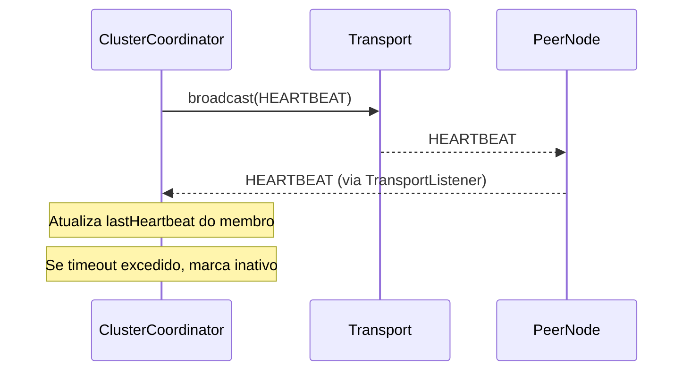
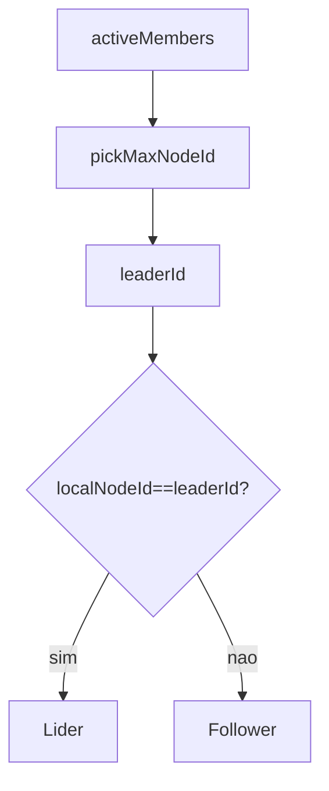
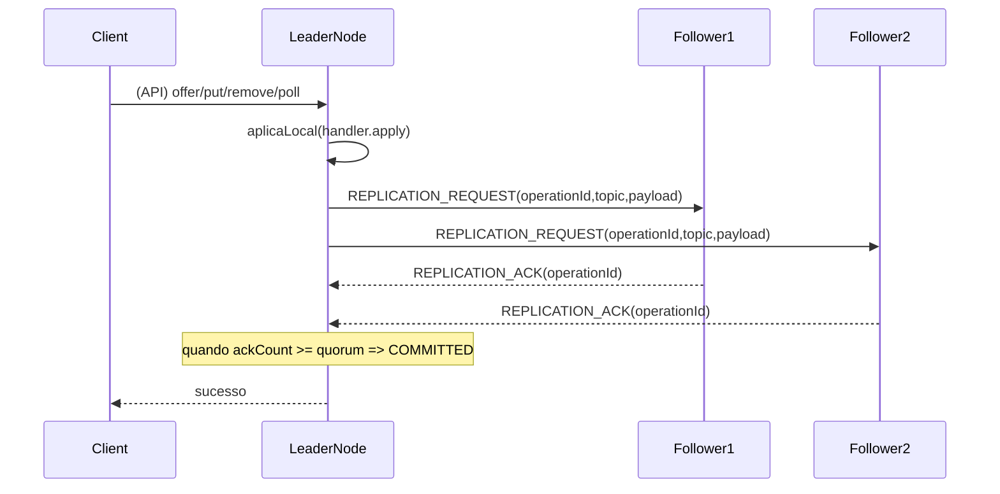
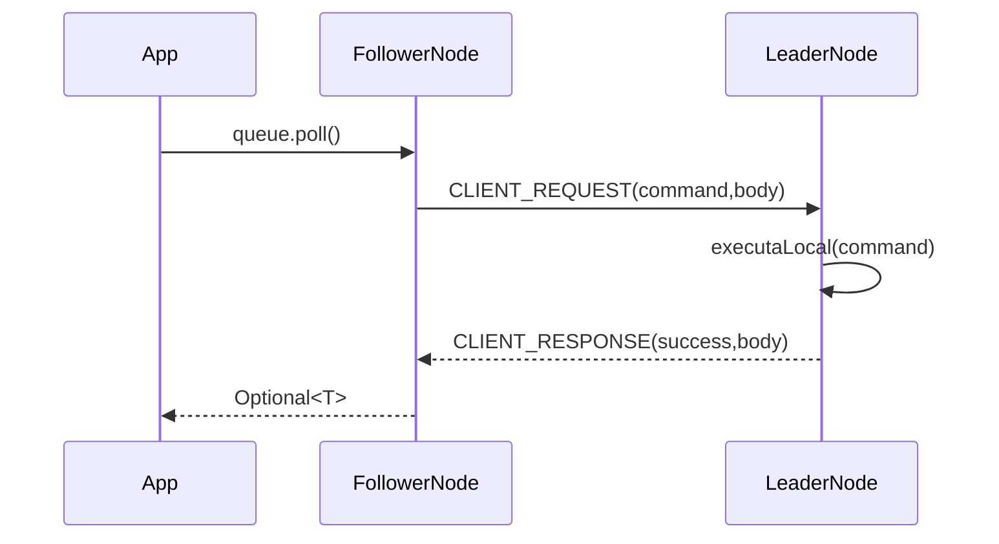

# NGrid — Arquitetura (visão técnica)

Este documento descreve a arquitetura e os mecanismos internos do **NGrid** (cluster TCP, eleição de líder, replicação com quorum e estruturas distribuídas).

## Visão geral

O NGrid é uma biblioteca Java que permite executar, em um **cluster de nós**, estruturas distribuídas simples:

- **Fila distribuída**: `DistributedQueue<T>` (internamente usa `NQueue<T>` como backend persistente local).
- **Mapa distribuído**: `DistributedMap<K,V>` (replicado em memória via `ConcurrentHashMap`, com **persistência local opcional** via WAL + snapshot).

O cluster é **leader-based**: leituras/escritas são roteadas ao **líder** (ou executadas localmente se o nó já for líder).

## Componentes e camadas

### 1) Transporte (TCP)

Implementação: `dev.nishisan.utils.ngrid.cluster.transport.TcpTransport`

Responsabilidades principais:

- **Conectividade TCP** entre nós.
- **Descoberta progressiva** (gossip simples) via:
  - `HANDSHAKE`: troca metadados do nó + lista de peers conhecidos.
  - `PEER_UPDATE`: broadcast periódico/reativo da lista de peers.
- **RPC interno** via mensagens `CLIENT_REQUEST`/`CLIENT_RESPONSE` com correlação (`correlationId`) para `sendAndAwait`.

### 2) Coordenação (membros + líder)

Implementação: `dev.nishisan.utils.ngrid.cluster.coordination.ClusterCoordinator`

Responsabilidades principais:

- Manter a lista de **membros ativos** com base em `HEARTBEAT`.
- Marcar membros como inativos por **timeout**.
- Eleição de líder **determinística**: o líder é o nó com **maior `NodeId` ativo**.
- Expor:
  - `isLeader()`
  - `leaderInfo()`
  - `activeMembers()`

### 3) Replicação com quorum

Implementação: `dev.nishisan.utils.ngrid.replication.ReplicationManager`

Responsabilidades principais:

- Permitir que **apenas o líder** inicie replicações (`replicate(...)`).
- Enviar `REPLICATION_REQUEST` para os followers e coletar `REPLICATION_ACK`.
- Confirmar a operação quando atingir **quorum** (inclui o próprio líder).
- Deduplicação em followers por `operationId` (set `applied`).

Observação: o quorum efetivo é limitado pelo tamanho de `activeMembers()`:

- \(quorumEfetivo = \max(1, \min(config.quorum, membrosAtivos))\)

### 4) Estruturas distribuídas

Implementações:

- `dev.nishisan.utils.ngrid.structures.DistributedQueue`
- `dev.nishisan.utils.ngrid.structures.DistributedMap`

Responsabilidades:

- Expor API amigável para o consumidor da biblioteca.
- **Roteamento para o líder**:
  - Se `coordinator.isLeader()`: executa localmente.
  - Caso contrário: envia `CLIENT_REQUEST` ao líder e aguarda `CLIENT_RESPONSE`.

### 5) Bootstrap do nó

Implementação: `dev.nishisan.utils.ngrid.structures.NGridNode`

O `NGridNode` amarra tudo:

- `TcpTransport` (rede e descoberta)
- `ClusterCoordinator` (membros + líder)
- `ReplicationManager` (quorum/replicação)
- `QueueClusterService` (fila distribuída em cima de `NQueue`)
- `MapClusterService` (mapa distribuído em memória, com persistência local opcional quando configurada)

## Fluxos principais

### Descoberta e formação da malha (mesh)

O `TcpTransport` tenta conectar nos peers iniciais e, a cada `HANDSHAKE`, faz merge das listas de peers e tenta novas conexões.

```mermaid
sequenceDiagram
participant A as NodeA
participant B as NodeB
participant C as NodeC

Note over A,B: A conecta em B (peer inicial)
A->>B: HANDSHAKE(localInfo,knownPeers)
B->>A: HANDSHAKE(localInfo,knownPeers)

Note over A,C: A aprende C via lista de peers
A->>C: connect()
A->>C: HANDSHAKE(localInfo,knownPeers)
C->>A: HANDSHAKE(localInfo,knownPeers)

Note over A,B,C: PEER_UPDATE ajuda late joiners
A-->>B: PEER_UPDATE(peers)
B-->>C: PEER_UPDATE(peers)
```

### Heartbeat e detecção de falha

O `ClusterCoordinator` emite `HEARTBEAT` periodicamente e marca membros inativos por timeout.



### Eleição de líder

Política: **maior `NodeId` ativo vence**.



### Replicação (quorum)

Uma operação mutável é aplicada localmente no líder, replicada aos followers e confirmada quando atinge quorum.



### Roteamento de chamadas (follower → líder)

Se um cliente chama `queue.poll()` ou `map.put(...)` em um follower, o `DistributedQueue/DistributedMap` faz RPC interno:



## Integração com NQueue (fila persistente local)

Implementação do backend local: `dev.nishisan.utils.queue.NQueue`

Integração do NGrid com NQueue: `dev.nishisan.utils.ngrid.queue.QueueClusterService`

Pontos importantes:

- Cada nó abre sua própria `NQueue` (`baseDir` + `queueName`).
- Operações mutáveis são replicadas via `ReplicationManager` usando o tópico `"queue"`.
- `poll()` na fila distribuída funciona como:
  - Ler `peek()` local para descobrir o próximo item.
  - Replicar um comando `POLL(expectedValue)` para manter as réplicas alinhadas.
  - Aplicar `queue.poll()` em cada nó na replicação.

## Limitações atuais (MVP)

- **Leader-based para operações**: followers sempre encaminham operações para o líder.
- **Map em memória**: `MapClusterService` usa `ConcurrentHashMap` (persistência é opcional por nó).
- **Persistência do mapa (quando habilitada)**: recuperação local via snapshot + WAL (não substitui a replicação distribuída).
- **Deduplicação não-durável**: a deduplicação via `applied` é em memória; em reinícios, o cluster depende do estado persistido (fila) + tráfego de replicação corrente.

## Utilitários relacionados

- `dev.nishisan.utils.ngrid.LeaderElectionUtils`: wrapper para criar um serviço de eleição de líder reutilizável (útil quando você quer usar apenas “cluster + líder” sem Map/Queue).


