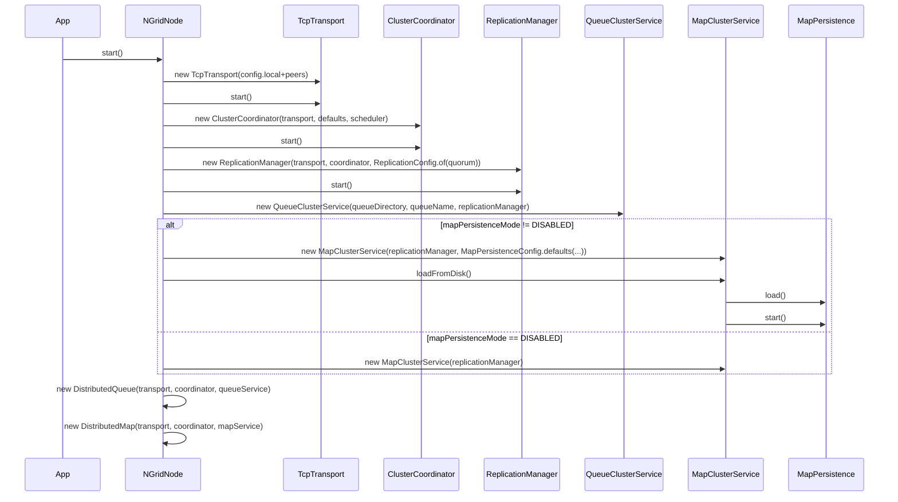
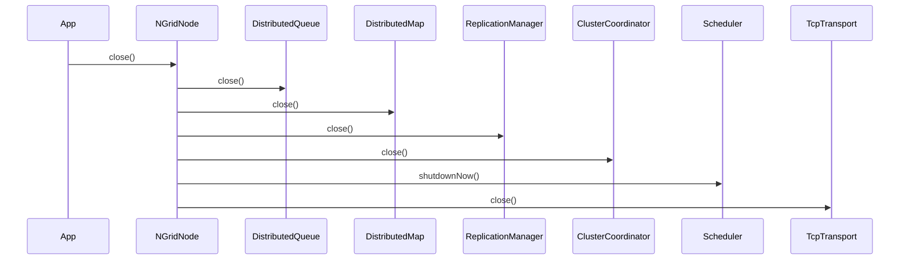
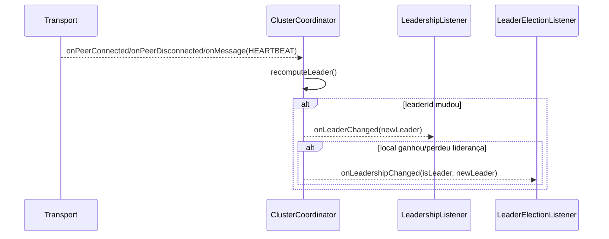
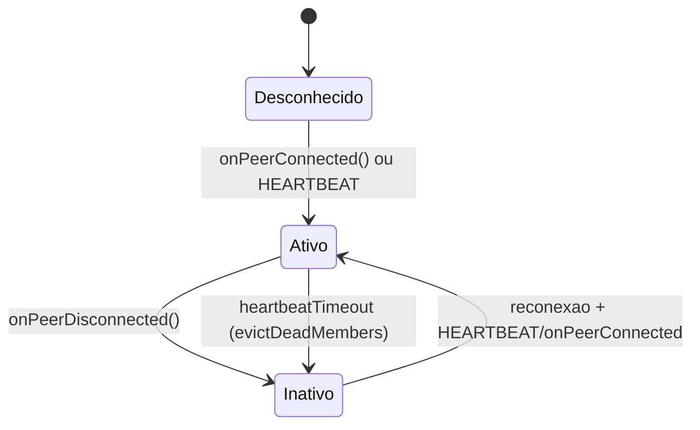
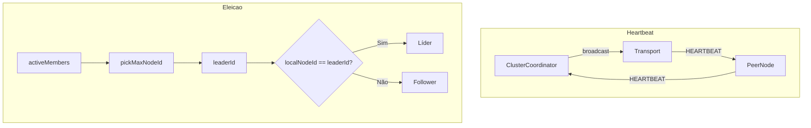
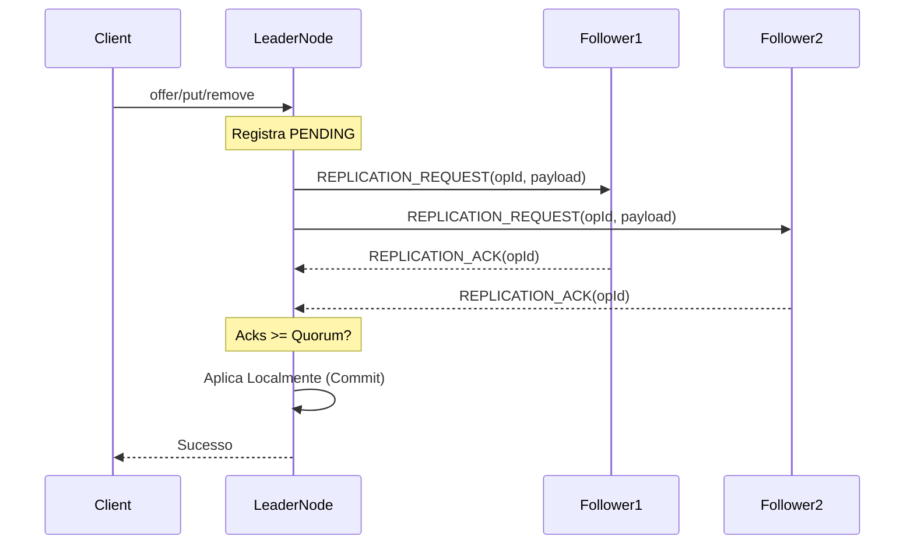

# NGrid – Arquitetura e Visão Técnica

Este documento descreve a arquitetura do **NGrid**, detalhando suas camadas, mecanismos internos (cluster TCP, eleição de líder, replicação com quorum) e a implementação das estruturas distribuídas.

## Visão Geral

O NGrid é uma biblioteca Java projetada para executar estruturas de dados distribuídas em um **cluster de nós**, garantindo consistência e disponibilidade através de um modelo baseado em líder.

As principais estruturas suportadas são:

- **Fila distribuída**: `DistributedQueue<T>` (utiliza `NQueue<T>` como backend persistente local).
- **Mapa distribuído**: `DistributedMap<K,V>` (replicado em memória via `ConcurrentHashMap`, com **persistência local opcional** via WAL + snapshot).
  - O NGrid suporta **múltiplos mapas nomeados** via `NGridNode#getMap("map-name", ...)`. O método `NGridNode#map(...)` continua existindo e retorna o **mapa padrão** (`config.mapName()`, padrão: `default-map`).

O cluster opera no modelo **leader-based**: todas as operações de escrita (e leituras que exigem consistência forte) são roteadas para o **líder**. Se o nó atual já for o líder, a execução é local; caso contrário, é feito um encaminhamento transparente.

---

## Camadas e Componentes

A arquitetura do NGrid é organizada em camadas lógicas que separam a responsabilidade de rede, coordenação, replicação e estruturas de dados.

### 1. Camada de Transporte (TCP)
**Implementação:** `dev.nishisan.utils.ngrid.cluster.transport.TcpTransport`

Responsável pela comunicação de baixo nível entre os nós.
- **Conectividade:** Mantém conexões TCP persistentes entre os membros do cluster.
- **Roteamento Inteligente (Sticky Proxy Fallback):**
  - O transporte implementa uma lógica de roteamento resiliente para contornar falhas de rede parciais (ex: firewalls, NATs).
  - **Fallback:** Se uma conexão direta falha, o nó procura automaticamente um vizinho que tenha acesso ao destino e estabelece uma rota "Proxy".
  - **Stickiness:** Uma vez que uma rota Proxy é estabelecida, ela é mantida ("gruda") para evitar latência de novas tentativas de conexão falhas.
  - **Recuperação Oportunista:** Uma tarefa em background ("Probe") tenta periodicamente restabelecer a conexão direta de forma silenciosa. Se bem-sucedida, a rota é promovida de volta para "Direct".
  - **TTL:** Mensagens possuem um Time-To-Live para evitar loops infinitos de roteamento.
- **Descoberta (Gossip Simples):**
  - `HANDSHAKE`: Na conexão, troca metadados do nó e lista de peers conhecidos.
  - `PEER_UPDATE`: Broadcast periódico ou reativo para compartilhar novos peers descobertos, permitindo o fechamento da malha (full mesh).
- **RPC Interno:** Suporta mensagens do tipo `CLIENT_REQUEST`/`CLIENT_RESPONSE` com correlação (`correlationId`), permitindo chamadas síncronas (`sendAndAwait`).

### 2. Camada de Coordenação
**Implementação:** `dev.nishisan.utils.ngrid.cluster.coordination.ClusterCoordinator`

Gerencia o estado do cluster e a liderança.
- **Membros Ativos:** Mantém a lista de membros vivos baseada em mensagens de `HEARTBEAT`.
- **Detecção de Falhas:** Marca membros como inativos após um timeout sem heartbeat.
- **Robustez:** As tarefas de heartbeat e detecção de falhas são protegidas contra exceções inesperadas para garantir a estabilidade do agendamento.
- **Eleição de Líder:**
  - O mecanismo é **determinístico**: o líder é sempre o nó com o **maior `NodeId` ativo**.
  - **Proteção contra Split-Brain:** O coordenador exige um número mínimo de membros ativos (`minClusterSize`) para declarar um líder. Se a rede particionar e um grupo de nós ficar abaixo desse mínimo, eles não elegerão líder, evitando divergência de estado.
  - Todos os nós convergem para o mesmo líder assim que a lista de membros é sincronizada.
  - Expõe APIs para verificar liderança (`isLeader()`) e obter informações do líder atual (`leaderInfo()`).

### 3. Camada de Replicação e Quorum
**Implementação:** `dev.nishisan.utils.ngrid.replication.ReplicationManager`

Garante a consistência dos dados através da replicação de operações.
- **Centralização no Líder:** Apenas o líder pode iniciar replicações (`replicate(...)`).
- **Integridade:**
  - O envio de `REPLICATION_ACK` só ocorre após a operação ser efetivamente processada com sucesso no nó seguidor, evitando falsos positivos de confirmação.
- **Fluxo de Replicação (Consistente):**
  1. O líder recebe a operação e a registra como `PENDING`.
  2. O líder envia `REPLICATION_REQUEST` para todos os followers.
  3. Followers aplicam a operação localmente e respondem `REPLICATION_ACK`.
  4. O líder aguarda os ACKs. Quando `Acks >= Quorum`, o líder **aplica a operação no seu próprio estado** e marca como `COMMITTED`.
  5. O sucesso é retornado ao cliente.
- **Fail-Fast:** Se o nó perder a liderança enquanto aguarda o quórum, todas as operações pendentes são canceladas imediatamente com erro "Lost leadership".
- **Consistência Configurável (`strictConsistency`):**
  - **Disponibilidade (Padrão):** O quorum efetivo se adapta ao tamanho do cluster ativo. Útil para clusters dinâmicos onde a disponibilidade é prioridade.
    \( \text{quorumEfetivo} = \max(1, \min(\text{config.quorum}, |\text{membrosAtivos}|)) \)
  - **Consistência Estrita (CP):** Se habilitada, o quorum é fixo e baseado na configuração inicial (`replicationFactor`). Se o número de nós ativos for menor que o quorum exigido, as escritas falham para garantir consistência e evitar *split-brain*. No modo estrito, o líder nunca aplica a mudança localmente sem confirmação da maioria.
- **Timeout e quorum inalcançável:**
  - Se a operação exceder o `operationTimeout` (padrão: 30s), ela pode falhar por timeout.
  - Se peers desconectarem e o cluster não tiver membros alcançáveis suficientes para satisfazer o quorum, a operação falha como “quorum inalcançável”.

### 4. Camada de Estruturas Distribuídas
**Implementações:** `DistributedQueue`, `DistributedMap`

Expõe as APIs de alto nível para o usuário final e faz a ponte com as camadas inferiores.
- **Roteamento Transparente:**
  - Se `coordinator.isLeader()`: Executa a operação localmente e inicia a replicação.
  - Se `!isLeader()`: Encaminha a operação ao líder via `CLIENT_REQUEST` e aguarda a resposta.
- **Integração com Backend:** Conecta a lógica distribuída com o armazenamento local (como a `NQueue` ou `ConcurrentHashMap`).

### 5. Bootstrap do Nó
**Implementação:** `dev.nishisan.utils.ngrid.structures.NGridNode`

O `NGridNode` é o ponto de entrada que inicializa e integra todos os componentes acima (Transporte, Coordenação, Replicação e Serviços de Mapa/Fila).

---

## Ciclo de vida e eventos (visão “pé no código”)

Esta seção descreve os eventos e o ciclo de vida que você vai observar ao usar as classes principais.

### Ciclo de vida do `NGridNode`

O `NGridNode` não cria nada “preguiçosamente”: o `start()` sobe todos os componentes e o `close()` derruba em ordem segura (best-effort, acumulando o primeiro `IOException`).

#### `start()` (ordem real)



#### `close()` (ordem real)



### Eventos e listeners (cluster)

#### 1) Eventos de transporte (`TransportListener`)

O transporte dispara eventos de baixo nível:
- `onPeerConnected(NodeInfo)`
- `onPeerDisconnected(NodeId)`
- `onMessage(ClusterMessage)`

Esses eventos são consumidos por camadas superiores (coordenação, replicação e as fachadas distribuídas).

#### 2) Eventos de liderança (`ClusterCoordinator`)

O `ClusterCoordinator` recomputa o líder sempre que a visão de membros muda (conexão, desconexão, heartbeat, eviction por timeout). Existem dois tipos de callback relevantes:

- `LeadershipListener#onLeaderChanged(NodeId newLeader)`:
  - Dispara sempre que o líder observado muda (mesmo que o nó local não ganhe/perca liderança).
- `LeaderElectionListener#onLeadershipChanged(boolean isLeader, NodeId currentLeader)`:
  - Dispara apenas quando o **nó local** muda seu estado de liderança (ganha ou perde).



### Ciclo de vida do membro no cluster (simplificado)



## Fluxos Principais

### Descoberta e Formação da Malha

O processo de descoberta garante que todos os nós se conectem entre si, mesmo que conheçam apenas um peer inicial.

```mermaid
sequenceDiagram
participant A as NodeA
participant B as NodeB
participant C as NodeC

Note over A,B: A conecta em B (peer inicial)
A->>B: HANDSHAKE(localInfo, knownPeers)
B->>A: HANDSHAKE(localInfo, knownPeers)

Note over A,C: A aprende sobre C via lista de peers de B
A->>C: connect()
A->>C: HANDSHAKE(localInfo, knownPeers)
C->>A: HANDSHAKE(localInfo, knownPeers)

Note over A,B,C: PEER_UPDATE ajuda nós que entraram depois (late joiners)
A-->>B: PEER_UPDATE(peers)
B-->>C: PEER_UPDATE(peers)
```

### Heartbeat e Eleição

A saúde do cluster é monitorada continuamente. A eleição é uma consequência direta da visão de membros ativos.



### Replicação de Operações (Escrita)

Toda operação que altera estado (`offer`, `put`, `remove`, `poll`) segue este fluxo para garantir consistência:



---

## Estruturas Distribuídas em Detalhe

### Fila Distribuída (`DistributedQueue`)

**Integração com NQueue:**
- Utiliza a biblioteca `NQueue` como backend de persistência em disco em cada nó.
- Cada nó possui sua própria instância de `NQueue` em um diretório configurado.

**Operações:**
- **`offer(item)`**: O líder grava na sua `NQueue` local e replica o item para as `NQueue` dos followers. Confirmado apenas após quorum.
- **`poll()`**: Coordenado pelo líder. O líder determina qual é o próximo item (via `peek` local), e replica um comando de `POLL` para garantir que todos os nós desenfileirem o mesmo item.
- **`peek()`**: O líder consulta sua fila local e retorna o item sem removê-lo.

### Mapa Distribuído (`DistributedMap`)

**Armazenamento:**
- Em memória (`ConcurrentHashMap`) em todos os nós.
- **Persistência Opcional:** Cada nó pode ser configurado independentemente para persistir dados em disco (WAL + Snapshot), acelerando sua recuperação após reinício.
  - **Recuperação Robusta:** O mecanismo de carga (`load()`) detecta e recupera automaticamente situações de falha durante a rotação de logs (presença de `wal.log.old`), garantindo que nenhuma operação confirmada seja perdida em caso de crash.

**Operações:**
- **`put(key, value)`**: Enviado ao líder, aplicado, replicado e confirmado. Sobrescreve valores anteriores.
- **`remove(key)`**: Enviado ao líder, replicado com comando `REMOVE` e aplicado em todos os nós (remoção direta da chave).
- **`get(key)`**: Servido pelo líder na fachada `DistributedMap` (modelo simples de consistência forte).

---

## Falhas e respostas típicas (o que você verá em runtime)

### Chamadas do cliente (follower -> líder)
- Quando você chama `DistributedQueue`/`DistributedMap` em um follower, a chamada vira um `CLIENT_REQUEST` para o líder.
- Se o nó remoto **não for líder**, ele responde erro “Not the leader” e o cliente recebe exceção (`IllegalStateException`).

### Replicação (líder)
- **Timeout:** a operação pode falhar se exceder o `operationTimeout` configurado no `ReplicationManager` (padrão ~30s).
- **Quorum inalcançável:** se peers desconectarem e o cluster não tiver membros alcançáveis suficientes para atingir o quorum efetivo, a operação falha como “quorum unreachable”.

---

## Tolerância a Falhas e Limitações

### Recuperação de Falha do Líder
1. Se o líder falha (para de enviar heartbeats).
2. Os followers detectam o timeout e o removem da lista de membros ativos.
3. O algoritmo de eleição (`pickMaxNodeId`) seleciona determinísticamente o novo líder entre os nós restantes.
4. O novo líder assume o controle das operações e da coordenação.

### Limitações Atuais (MVP)
- **Escrita Centralizada:** Todas as escritas dependem do líder, o que simplifica a consistência mas pode ser um gargalo em clusters muito grandes.
- **Mapa em Memória:** O tamanho do mapa é limitado pela RAM disponível nos nós (embora a persistência em disco ajude na durabilidade, ela não estende a capacidade de armazenamento).
- **Deduplicação em Memória:** O registro de operações aplicadas (`applied`) reside em memória. Em caso de reinício total do cluster, a consistência depende do estado persistido (fila/mapa) e do tráfego de replicação.

## Utilitários

- **`LeaderElectionUtils`**: Permite utilizar apenas o mecanismo de eleição de líder e descoberta do NGrid em outras aplicações, sem a necessidade de usar as estruturas de dados distribuídas.