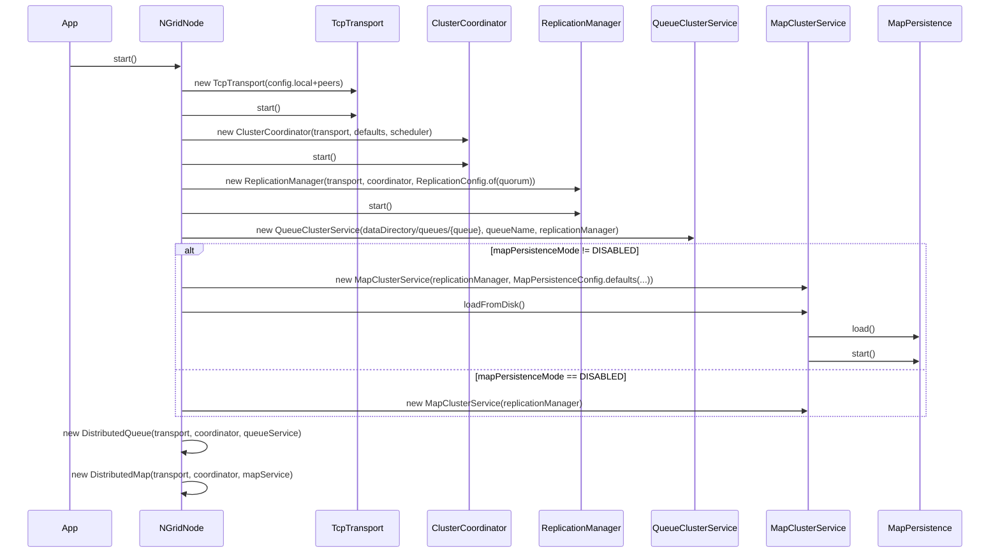
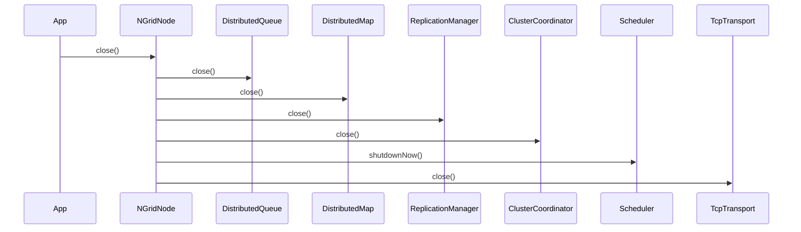
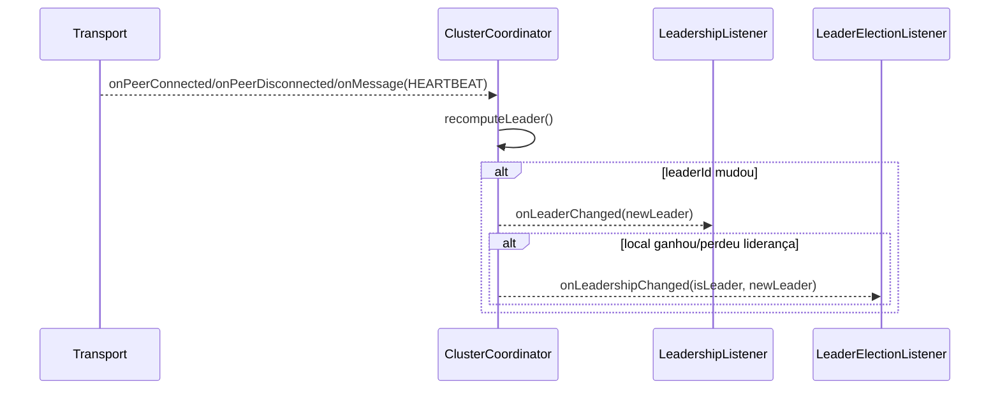
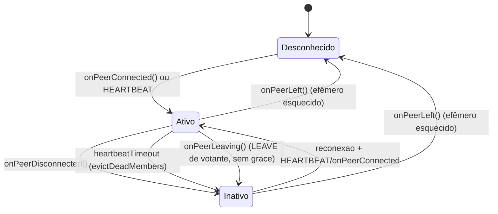
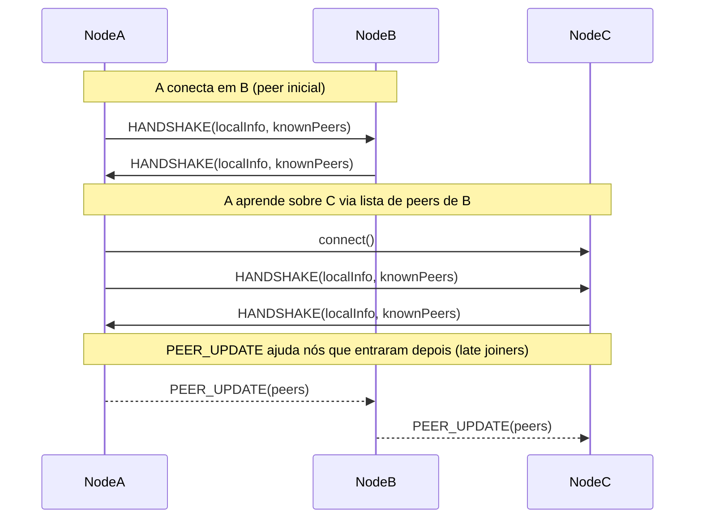
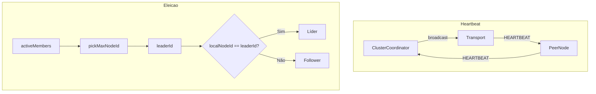
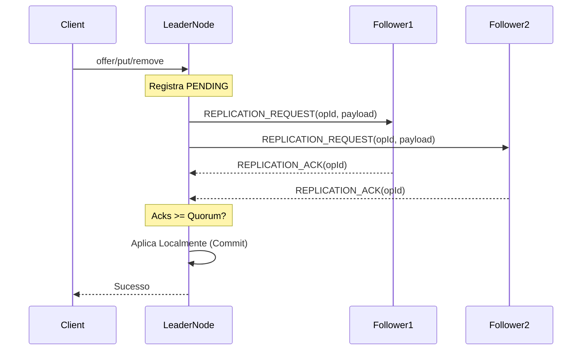

# NGrid – Arquitetura e Visão Técnica

Este documento descreve a arquitetura do **NGrid**, detalhando suas camadas, mecanismos internos (cluster TCP, eleição de líder, replicação com quorum) e a implementação das estruturas distribuídas.

## Visão Geral

O NGrid é uma biblioteca Java projetada para executar estruturas de dados distribuídas em um **cluster de nós**, garantindo consistência e disponibilidade através de um modelo baseado em líder.

As principais estruturas suportadas são:

- **Fila distribuída**: `DistributedQueue<T>` (utiliza `NQueue<T>` como backend persistente local).
- **Mapa distribuído**: `DistributedMap<K,V>` (replicado em memória via `ConcurrentHashMap`, com **persistência local opcional** via WAL + snapshot).
  - O NGrid suporta **múltiplos mapas nomeados** via `NGridNode#getMap("map-name", ...)`. O método `NGridNode#map(...)` continua existindo e retorna o **mapa padrão** (`config.mapName()`, padrão: `default-map`).

O cluster opera no modelo **leader-based**: todas as operações de escrita (e leituras que exigem consistência forte) são roteadas para o **líder**. Se o nó atual já for o líder, a execução é local; caso contrário, é feito um encaminhamento transparente.

---

## Camadas e Componentes

A arquitetura do NGrid é organizada em camadas lógicas que separam a responsabilidade de rede, coordenação, replicação e estruturas de dados.

### 1. Camada de Transporte (TCP)
**Implementação:** `dev.nishisan.utils.ngrid.cluster.transport.TcpTransport`

Responsável pela comunicação de baixo nível entre os nós.
- **Conectividade:** Mantém conexões TCP persistentes entre os membros do cluster.
- **Roteamento Inteligente (Mesh & RTT Optimization):**
  - O transporte implementa uma lógica de roteamento resiliente e otimizada para malha (full mesh).
  - **Fase 1 (Resiliência):** Se a conexão direta falha, o nó busca automaticamente um vizinho (Proxy) que tenha acesso ao destino, garantindo entrega mesmo com falhas parciais de link.
  - **Fase 2 (Otimização por Custo):**
    - O `RttMonitor` coleta métricas de latência para todos os vizinhos diretos.
    - Essas métricas são disseminadas no cluster via Gossip (`Handshake` e `PeerUpdate`).
    - O `NetworkRouter` calcula o custo das rotas (`RTT_local_proxy + RTT_proxy_destino`).
    - Se uma rota via Proxy for significativamente mais rápida que a direta (ganho > 15%) ou se a direta estiver degradada, o tráfego é otimizado automaticamente.
  - **Stickiness & Recuperação:** Rotas Proxy são mantidas enquanto forem vantajosas ou necessárias. Uma tarefa em background ("Probe") tenta periodicamente restabelecer a conexão direta de forma silenciosa.
  - **TTL:** Mensagens possuem um Time-To-Live para evitar loops infinitos de roteamento.
- **Descoberta (Gossip Simples):**
  - `HANDSHAKE`: Na conexão, troca metadados do nó e lista de peers conhecidos. Numa conexão discada o handshake é sempre o primeiro frame (frames entregues antes dele ficam retidos e saem logo depois, em ordem; se o envio do handshake falhar, a conexão é fechada); um socket aceito sempre responde ao primeiro handshake lido, mesmo que um frame anterior já tenha permitido inferir a identidade do remoto. Seeds configurados como `host:port` entram com um id provisório (alias): o handshake troca o alias pelo id canônico, remove toda chave antiga que ainda aponte para a mesma conexão, e aliases não resolvidos nunca são gossipados. Enquanto a resposta não chega, o socket do alias atende o id canônico por no máximo `connectTimeout`; depois disso o id canônico é discado.
  - `PEER_UPDATE`: Broadcast periódico ou reativo para compartilhar novos peers descobertos, permitindo o fechamento da malha (full mesh). Desde a 8.7.0 carrega também `departed` (peers esquecidos e o TTL restante do tombstone de cada um).
  - `LEAVE` (8.7.0): enviado pelo `close()` do transporte em cada conexão cujo peer anunciou suporte no handshake (`supportsLeave`). Ver [Saída de membros](#saída-de-membros-leave-e-esquecimento-de-peers-efêmeros).
- **RPC Interno:** Suporta mensagens do tipo `CLIENT_REQUEST`/`CLIENT_RESPONSE` com correlação (`correlationId`), permitindo chamadas síncronas (`sendAndAwait`).

### 2. Camada de Coordenação
**Implementação:** `dev.nishisan.utils.ngrid.cluster.coordination.ClusterCoordinator`

Gerencia o estado do cluster e a liderança.
- **Membros Ativos:** Mantém a lista de membros vivos baseada em mensagens de `HEARTBEAT`.
- **Detecção de Falhas:** Marca membros como inativos após um timeout sem heartbeat.
- **Robustez:** As tarefas de heartbeat e detecção de falhas são protegidas contra exceções inesperadas para garantir a estabilidade do agendamento.
- **Eleição de Líder:**
  - O mecanismo é **determinístico**: o líder é sempre o nó com o **maior `NodeId` ativo**.
  - **Proteção contra Split-Brain:** O coordenador exige um número mínimo de membros ativos (`minClusterSize`) para declarar um líder. Se a rede particionar e um grupo de nós ficar abaixo desse mínimo, eles não elegerão líder, evitando divergência de estado.
  - Todos os nós convergem para o mesmo líder assim que a lista de membros é sincronizada.
  - Expõe APIs para verificar liderança (`isLeader()`) e obter informações do líder atual (`leaderInfo()`).

### 3. Camada de Replicação e Quorum
**Implementação:** `dev.nishisan.utils.ngrid.replication.ReplicationManager`

Garante a consistência dos dados através da replicação de operações.
- **Centralização no Líder:** Apenas o líder pode iniciar replicações (`replicate(...)`).
- **Integridade:**
  - O envio de `REPLICATION_ACK` só ocorre após a operação ser efetivamente processada com sucesso no nó seguidor, evitando falsos positivos de confirmação.
- **Sequenciamento por tópico:** filas e mapas possuem sequências independentes, evitando bloqueios entre estruturas diferentes.
- **Persistência de sequência:** o estado de sequência é salvo em disco (`{dataDirectory}/replication/sequence-state.dat`) para recuperação após restart.
- **Fluxo de Replicação (Consistente):**
  1. O líder recebe a operação e a registra como `PENDING`.
  2. O líder envia `REPLICATION_REQUEST` para todos os followers.
  3. Followers aplicam a operação localmente e respondem `REPLICATION_ACK`.
  4. O líder aguarda os ACKs. Quando `Acks >= Quorum`, o líder **aplica a operação no seu próprio estado** e marca como `COMMITTED`.
  5. O sucesso é retornado ao cliente.
- **Fail-Fast:** Se o nó perder a liderança enquanto aguarda o quórum, todas as operações pendentes são canceladas imediatamente com erro "Lost leadership".
- **Consistência Configurável (`strictConsistency`):**
  - **Disponibilidade (Padrão):** O quorum efetivo se adapta ao tamanho do cluster ativo. Útil para clusters dinâmicos onde a disponibilidade é prioridade.
    \( \text{quorumEfetivo} = \max(1, \min(\text{config.quorum}, |\text{membrosAtivos}|)) \)
  - **Consistência Estrita (CP):** Se habilitada, o quorum é fixo e baseado na configuração inicial (`replicationFactor`). Se o número de nós ativos for menor que o quorum exigido, as escritas falham para garantir consistência e evitar *split-brain*. No modo estrito, o líder nunca aplica a mudança localmente sem confirmação da maioria.
- **Timeout e quorum inalcançável:**
  - Se a operação exceder o `operationTimeout` (padrão: 30s), ela pode falhar por timeout.
  - Se peers desconectarem e o cluster não tiver membros alcançáveis suficientes para satisfazer o quorum, a operação falha como “quorum inalcançável”.
- **Resiliência (gaps e catch-up):**
  - Se um follower detectar gaps curtos, ele solicita **reenvio de sequência** ao líder.
  - Se o atraso for grande, o follower aciona **sync por snapshot em chunks** (mapas e filas).

### 4. Camada de Estruturas Distribuídas
**Implementações:** `DistributedQueue`, `DistributedMap`

Expõe as APIs de alto nível para o usuário final e faz a ponte com as camadas inferiores.
- **Roteamento Transparente:**
  - Se `coordinator.isLeader()`: Executa a operação localmente e inicia a replicação.
  - Se `!isLeader()`: Encaminha a operação ao líder via `CLIENT_REQUEST` e aguarda a resposta.
- **Integração com Backend:** Conecta a lógica distribuída com o armazenamento local (como a `NQueue` ou `ConcurrentHashMap`).
- **Multi-queue:** comandos incluem o nome da fila (`queue.offer:{fila}`), e o líder registra listeners por fila no startup (init eager).

### 5. Bootstrap do Nó
**Implementação:** `dev.nishisan.utils.ngrid.structures.NGridNode`

O `NGridNode` é o ponto de entrada que inicializa e integra todos os componentes acima (Transporte, Coordenação, Replicação e Serviços de Mapa/Fila).

---

## Ciclo de vida e eventos (visão “pé no código”)

Esta seção descreve os eventos e o ciclo de vida que você vai observar ao usar as classes principais.

### Ciclo de vida do `NGridNode`

O `NGridNode` não cria nada “preguiçosamente”: o `start()` sobe todos os componentes e o `close()` derruba em ordem segura (best-effort, acumulando o primeiro `IOException`).

#### `start()` (ordem real)

```mermaid
sequenceDiagram
participant App as App
participant Node as NGridNode
participant T as TcpTransport
participant C as ClusterCoordinator
participant R as ReplicationManager
participant QS as QueueClusterService
participant MS as MapClusterService
participant MP as MapPersistence

App->>Node: start()
Node->>T: new TcpTransport(config.local+peers)
Node->>T: start()
Node->>C: new ClusterCoordinator(transport, defaults, scheduler)
Node->>C: start()
Node->>R: new ReplicationManager(transport, coordinator, ReplicationConfig.of(quorum))
Node->>R: start()
Node->>QS: new QueueClusterService(dataDirectory/queues/{queue}, queueName, replicationManager)
alt mapPersistenceMode != DISABLED
  Node->>MS: new MapClusterService(replicationManager, MapPersistenceConfig.defaults(...))
  Node->>MS: loadFromDisk()
  MS->>MP: load()
  MS->>MP: start()
else mapPersistenceMode == DISABLED
  Node->>MS: new MapClusterService(replicationManager)
end
Node->>Node: new DistributedQueue(transport, coordinator, queueService)
Node->>Node: new DistributedMap(transport, coordinator, mapService)
```

Em configuracoes multi-queue, o `NGridNode` cria um `QueueClusterService` por fila configurada e registra os listeners logo no startup.

#### `close()` (ordem real)

```mermaid
sequenceDiagram
participant App as App
participant Node as NGridNode
participant DQ as DistributedQueue
participant DM as DistributedMap
participant R as ReplicationManager
participant C as ClusterCoordinator
participant S as Scheduler
participant T as TcpTransport

App->>Node: close()
Node->>DQ: close()
Node->>DM: close()
Node->>R: close()
Node->>C: close()
Node->>S: shutdownNow()
Node->>T: close()
```

### Eventos e listeners (cluster)

#### 1) Eventos de transporte (`TransportListener`)

O transporte dispara eventos de baixo nível:
- `onPeerConnected(NodeInfo)`
- `onPeerDisconnected(NodeId)`
- `onMessage(ClusterMessage)`

Esses eventos são consumidos por camadas superiores (coordenação, replicação e as fachadas distribuídas).

#### 2) Eventos de liderança (`ClusterCoordinator`)

O `ClusterCoordinator` recomputa o líder sempre que a visão de membros muda (conexão, desconexão, heartbeat, eviction por timeout). Existem dois tipos de callback relevantes:

- `LeadershipListener#onLeaderChanged(NodeId newLeader)`:
  - Dispara sempre que o líder observado muda (mesmo que o nó local não ganhe/perca liderança).
- `LeaderElectionListener#onLeadershipChanged(boolean isLeader, NodeId currentLeader)`:
  - Dispara apenas quando o **nó local** muda seu estado de liderança (ganha ou perde).

```mermaid
sequenceDiagram
participant T as Transport
participant C as ClusterCoordinator
participant LL as LeadershipListener
participant EL as LeaderElectionListener

T-->>C: onPeerConnected/onPeerDisconnected/onMessage(HEARTBEAT)
C->>C: recomputeLeader()
alt leaderId mudou
  C-->>LL: onLeaderChanged(newLeader)
  alt local ganhou/perdeu liderança
    C-->>EL: onLeadershipChanged(isLeader, newLeader)
  end
end
```

### Ciclo de vida do membro no cluster (simplificado)

```mermaid
stateDiagram-v2
  [*] --> Desconhecido
  Desconhecido --> Ativo: onPeerConnected() ou HEARTBEAT
  Ativo --> Inativo: onPeerDisconnected()
  Ativo --> Inativo: heartbeatTimeout (evictDeadMembers)
  Ativo --> Inativo: onPeerLeaving() (LEAVE de votante, sem grace)
  Inativo --> Ativo: reconexao + HEARTBEAT/onPeerConnected
  Ativo --> Desconhecido: onPeerLeft() (efêmero esquecido)
  Inativo --> Desconhecido: onPeerLeft() (efêmero esquecido)
```

### Saída de membros (LEAVE) e esquecimento de peers efêmeros

Um membro **efêmero** — inelegível a líder (`NodeInfo.ROLE_LEADER_INELIGIBLE`, ex.: o cliente do
ngrrd/CLI de administração) ou sem porta de escuta — é **esquecido** pelo transporte quando sai:
sai de `knownPeers`, do roteador e da membership do coordenador, e deixa de ser discado pelos
heartbeats. Antes disso, um cliente que encerrava ficava conhecido para sempre e cada broadcast de
heartbeat tentava discar para ele (até `connectTimeout`, com o log "No connection available for ...").

- **Gatilho rápido (LEAVE):** `TcpTransport.close()` envia `LEAVE` diretamente em cada conexão
  rastreada (só para peers com `supportsLeave`) e espera o flush de cada mensagem até
  `leaveFlushTimeout` (500 ms) antes de fechar os sockets; `leaveOnClose(false)` desliga. Um backlog
  de saída grande pode estourar o prazo: o close segue normal e os peers caem no gatilho lento.
- **Primeira mão apenas:** o receptor honra o LEAVE só na conexão rastreada para aquele peer, com
  handshake, e com a identidade anunciada igual à da conexão — LEAVE forjado ou atrasado de uma
  encarnação antiga num socket substituído é descartado. O LEAVE nunca é repassado.
- **Gatilho lento (backstop):** no `reconnectLoop`, um peer efêmero sem conexão aberta **e** sem
  nenhuma mensagem vinda dele (direta ou retransmitida por um relay) por mais de
  `departedPeerForgetAfter` é esquecido (kill -9, OOM, perda de rede). Numa malha parcial (firewall,
  link de um lado só), um cliente vivo que este nó não consegue discar segue falando por relay e não é
  esquecido. O `NGridNode` usa `max(1 min, 2 × heartbeatTimeout)` (= `6 × heartbeatInterval`). Como a saída aqui é só inferida,
  o tombstone dura a mesma janela (`departedPeerForgetAfter`), não os 10 min do LEAVE: um cliente vivo
  que ficou isolado (ex.: o único relay caiu) volta a ser aceito por gossip e tráfego retransmitido logo
  depois, e um cliente morto readmitido assim é esquecido de novo na janela seguinte.
- **Tombstone:** o id esquecido por LEAVE fica bloqueado por `departedPeerTombstoneTtl` (10 min; o
  gatilho lento usa a janela curta acima) contra
  readmissão de segunda mão — gossip, lista de peers de handshake de terceiros, alcançabilidade do
  roteador, mensagens retransmitidas e sockets sem handshake. Um **handshake direto** do mesmo id
  (nova encarnação), um `addPeer` explícito ou a expiração limpam o tombstone; heartbeats de um id em
  tombstone não recriam o membro.
- **Disseminação:** `departed` segue em todo `PEER_UPDATE` enquanto o tombstone durar; a primeira
  recepção de um LEAVE só antecipa um `PEER_UPDATE` na hora. Essa
  notícia de segunda mão só serve para admissão: esquece um peer apenas conhecido (quem nunca alcançou
  o cliente também limpa), mas nunca derruba um peer com conexão handshaked aberta nem um votante.
- **Votantes nunca são esquecidos:** um membro elegível a líder que envia LEAVE segue em
  `knownPeers` e na membership (a maioria não encolhe sem consenso); o coordenador apenas o marca
  inativo na hora, sem o grace de disconnect, e o próximo heartbeat do mesmo id o reativa.
  **Descomissionar um votante de vez** (ex.: storage drenado que não volta) continua exigindo ação do
  operador.

```mermaid
sequenceDiagram
participant C as Cliente (inelegível)
participant S1 as Storage 1
participant S2 as Storage 2

Note over C: close()
C->>S1: LEAVE(node=C)
C->>S2: LEAVE(node=C)
Note over S1: 1ª mão: esquece C + tombstone
S1-->>S2: PEER_UPDATE(peers, departed={C: ttl})
Note over S2: já esqueceu C pelo próprio LEAVE; um nó sem link com C esqueceria aqui
Note over S1,S2: gossip atrasado listando C não o readmite; handshake direto de C (nova encarnação) sim
```

## Fluxos Principais

### Descoberta e Formação da Malha

O processo de descoberta garante que todos os nós se conectem entre si, mesmo que conheçam apenas um peer inicial.

```mermaid
sequenceDiagram
participant A as NodeA
participant B as NodeB
participant C as NodeC

Note over A,B: A conecta em B (peer inicial)
A->>B: HANDSHAKE(localInfo, knownPeers)
B->>A: HANDSHAKE(localInfo, knownPeers)

Note over A,C: A aprende sobre C via lista de peers de B
A->>C: connect()
A->>C: HANDSHAKE(localInfo, knownPeers)
C->>A: HANDSHAKE(localInfo, knownPeers)

Note over A,C: PEER_UPDATE ajuda nós que entraram depois (late joiners)
A-->>B: PEER_UPDATE(peers)
B-->>C: PEER_UPDATE(peers)
```

### Heartbeat e Eleição

A saúde do cluster é monitorada continuamente. A eleição é uma consequência direta da visão de membros ativos.

```mermaid
flowchart TD
    subgraph Heartbeat
    Coord[ClusterCoordinator] -->|broadcast| T[Transport]
    T -->|HEARTBEAT| Peer[PeerNode]
    Peer -->|HEARTBEAT| Coord
    end
    
    subgraph Eleicao
    members[activeMembers] --> pickLeader[pickMaxNodeId]
    pickLeader --> leaderNode[leaderId]
    leaderNode --> isLeaderCheck{localNodeId == leaderId?}
    isLeaderCheck -->|Sim| leaderRole[Líder]
    isLeaderCheck -->|Não| followerRole[Follower]
    end
```

#### Fronteira aplicada por tópico no heartbeat (issue #178, desde a 8.8.0)

Cada nó anuncia no `HEARTBEAT`, além do watermark escalar, o **vetor de fronteiras por tópico**
(`HeartbeatPayload.topicFrontiers`: `map:<nome>`/`queue:<nome>` → última sequência aplicada). No
frame binário é uma seção final opcional (`u16 count` + `count × (u16 len, tópico UTF-8, i64
fronteira)`), ignorada por decoders antigos e lida só quando presente — compatível nos dois sentidos
de um rolling upgrade. O odômetro escalar (`getLastAppliedSequence`) é **derivado** desse vetor
(soma das fronteiras) e vale o mesmo para líder e seguidor; ele só serve a peers sem vetor.

Os gates de eleição comparam o vetor, não o escalar:

- **gate A (reclaim):** um nó só reclama a liderança quando nenhum peer elegível ativo o domina
  em algum tópico (dentro do `joinSyncLagThreshold`);
- **gate B (step-down):** o incumbente não cede a um candidato que esteja atrás em **um** tópico
  que seja, qualquer que seja a soma;
- **peer a seguir / escape D9:** escolhidos pelo vetor (dominância; incomparáveis → maior soma →
  primeiro tópico divergente em ordem de prioridade — `NGridConfig.priorityTopics`, ordem por nome
  como padrão; empate → afinidade). O escape D9 promove um único nó (o melhor candidato não-eleito)
  e nunca enquanto outro peer elegível afirma liderança.
- **`FOLLOWER_PROGRESS`** carrega o mesmo vetor: o join-quiesce libera quando o joiner não está
  atrás em nenhum tópico.

Com isso um seguidor que perdeu a última op do `ngrrd.catalog` não é mais eleito à frente de um
peer que a tem, ainda que o tópico de status (`ngrrd.nodes`, gravado a cada tick) dominasse o
agregado. Detalhes e testes em `doc/ngrid/oplog-ha-hardening.md`, seção 15.

### Replicação de Operações (Escrita)

Toda operação que altera estado (`offer`, `put`, `remove`, `poll`) segue este fluxo para garantir consistência:

```mermaid
sequenceDiagram
participant Client as Client
participant Leader as LeaderNode
participant F1 as Follower1
participant F2 as Follower2

Client->>Leader: offer/put/remove
Note over Leader: Registra PENDING
Leader->>F1: REPLICATION_REQUEST(opId, payload)
Leader->>F2: REPLICATION_REQUEST(opId, payload)
F1-->>Leader: REPLICATION_ACK(opId)
F2-->>Leader: REPLICATION_ACK(opId)
Note over Leader: Acks >= Quorum?
Leader->>Leader: Aplica Localmente (Commit)
Leader-->>Client: Sucesso
```

---

## Estruturas Distribuídas em Detalhe

### Fila Distribuída (`DistributedQueue`)

**Integração com NQueue:**
- Utiliza a biblioteca `NQueue` como backend de persistência em disco em cada nó.
- Cada nó possui sua própria instância de `NQueue` em um diretório configurado.

**Operações:**
- **`offer(item)`**: O líder grava na sua `NQueue` local e replica o item para as `NQueue` dos followers. Confirmado apenas após quorum.
- **`poll()`**: Coordenado pelo líder. O líder determina qual é o próximo item (via `peek` local), e replica um comando de `POLL` para garantir que todos os nós desenfileirem o mesmo item.
- **`peek()`**: O líder consulta sua fila local e retorna o item sem removê-lo.

### Mapa Distribuído (`DistributedMap`)

**Armazenamento:**
- Em memória (`ConcurrentHashMap`) em todos os nós.
- **Persistência Opcional:** Cada nó pode ser configurado independentemente para persistir dados em disco (WAL + Snapshot), acelerando sua recuperação após reinício.
  - **Recuperação Robusta:** O mecanismo de carga (`load()`) detecta e recupera automaticamente situações de falha durante a rotação de logs (presença de `wal.log.old`), garantindo que nenhuma operação confirmada seja perdida em caso de crash.

**Operações:**
- **`put(key, value)`**: Enviado ao líder, aplicado, replicado e confirmado. Sobrescreve valores anteriores.
- **`remove(key)`**: Enviado ao líder, replicado com comando `REMOVE` e aplicado em todos os nós (remoção direta da chave).
- **`get(key)`**: Servido pelo líder na fachada `DistributedMap` (modelo simples de consistência forte).

---

## Falhas e respostas típicas (o que você verá em runtime)

### Chamadas do cliente (follower -> líder)
- Quando você chama `DistributedQueue`/`DistributedMap` em um follower, a chamada vira um `CLIENT_REQUEST` para o líder.
- Se o nó remoto **não for líder**, ele responde erro “Not the leader” e o cliente recebe exceção (`IllegalStateException`).

### Replicação (líder)
- **Timeout:** a operação pode falhar se exceder o `operationTimeout` configurado no `ReplicationManager` (padrão ~30s).
- **Quorum inalcançável:** se peers desconectarem e o cluster não tiver membros alcançáveis suficientes para atingir o quorum efetivo, a operação falha como “quorum unreachable”.

---

## Tolerância a Falhas e Limitações

### Recuperação de Falha do Líder
1. Se o líder falha (para de enviar heartbeats).
2. Os followers detectam o timeout e o removem da lista de membros ativos.
3. O algoritmo de eleição (`pickMaxNodeId`) seleciona determinísticamente o novo líder entre os nós restantes.
4. O novo líder assume o controle das operações e da coordenação.

### Resiliência e Auto-Cura (Catch-up)
O NGrid implementa um mecanismo de **sincronização de estado (State Sync)** para recuperar nós que ficaram offline ou entraram tardiamente no cluster.

1. **Detecção de Atraso (Lag):** O `ReplicationManager` monitora continuamente a diferença entre a sequência global do líder (`leaderHighWatermark`) e a última operação aplicada localmente. Se o atraso exceder um limiar configurado (padrão: 500 operações), o nó inicia o processo de **Catch-up**.
2. **Snapshot Transfer:** O nó solicita ao líder um snapshot do estado atual. Para evitar gargalos de rede e memória, a transferência é feita em **chunks** (paginada).
3. **Instalação:** O nó limpa seu estado local (`resetState`) e instala os chunks recebidos. Ao finalizar, atualiza sua sequência local para corresponder à do líder e retoma a replicação incremental normal.

### Limitações Atuais (MVP)
- **Escrita Centralizada:** Todas as escritas dependem do líder, o que simplifica a consistência mas pode ser um gargalo em clusters muito grandes.
- **Mapa em Memória:** O tamanho do mapa é limitado pela RAM disponível nos nós (embora a persistência em disco ajude na durabilidade, ela não estende a capacidade de armazenamento).
- **Deduplicação em Memória:** O registro de operações aplicadas (`applied`) reside em memória. Em caso de reinício total do cluster, a consistência depende do estado persistido (fila/mapa) e do tráfego de replicação.

## Utilitários

- **`LeaderElectionUtils`**: Permite utilizar apenas o mecanismo de eleição de líder e descoberta do NGrid em outras aplicações, sem a necessidade de usar as estruturas de dados distribuídas.
