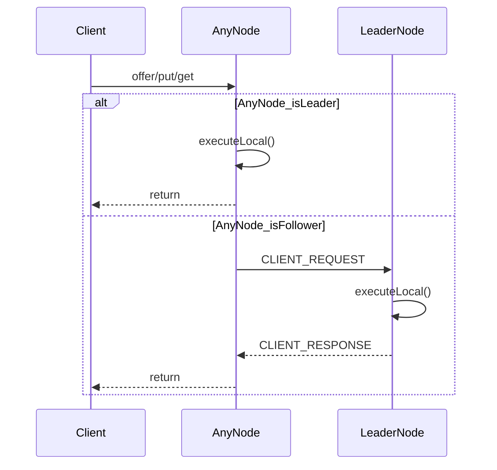
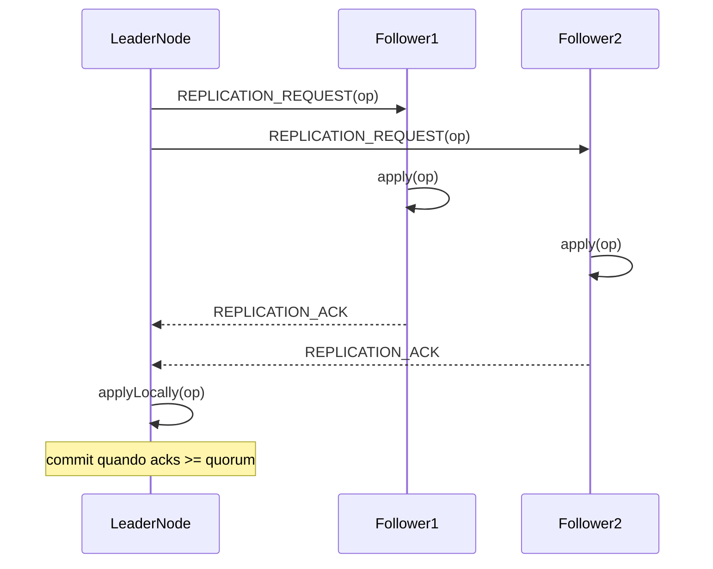

# NGrid & NQueue — Exemplos e Guia de Uso

Este documento reúne exemplos práticos para:

- **NQueue**: fila persistente standalone (filesystem), thread-safe.
- **NGrid**: cluster TCP com **fila distribuída** e **mapa distribuído** replicados via **líder + quorum**.

> Dica: para visão técnica (fluxos e detalhes internos), veja `doc/ngrid/arquitetura.md`. Para um guia “passo a passo” mais longo, veja `doc/ngrid/guia-utilizacao.md`.

## Índice (links rápidos)

- [Início rápido](#inicio-rapido)
- [Configuração](#configuracao)
- [NQueue (Standalone)](#nqueue-standalone)
- [NGrid (Cluster distribuído)](#ngrid-cluster-distribuido)
- [Multi-queue e Log/Stream](#multi-queue-e-logstream)
- [Resiliência e Catch-up](#resiliencia-e-catch-up)
- [Failover e Consistência](#failover-e-consistencia)
- [Playbook de Resiliencia](#playbook-de-resiliencia)
- [Monitoramento do cluster (liderança e membros)](#monitoramento-do-cluster-lideranca-e-membros)
- [Métricas e RTT](#metricas-e-rtt)
- [Persistência do mapa (WAL + snapshot)](#persistencia-do-mapa-wal--snapshot)
- [Utilitários](#utilitarios)
- [Solução de problemas](#solucao-de-problemas)
- [Dicas de performance](#dicas-de-performance)
- [Comparações rápidas](#comparacoes-rapidas)
- [Limitações atuais](#limitacoes-atuais)

---

## Início rápido

### NQueue — mínimo funcional

```java
import dev.nishisan.utils.queue.NQueue;

import java.nio.file.Path;

public class QuickStartNQueue {
  public static void main(String[] args) throws Exception {
    Path baseDir = Path.of("./data");
    try (NQueue<String> queue = NQueue.open(baseDir, "minha-fila")) {
      queue.offer("hello");
      System.out.println(queue.poll().orElse("<vazio>"));
    }
  }
}
```

### NGrid — 3 nós em um único processo (demo local)

> Em produção, cada nó roda em seu próprio processo/host. Em testes, prefira portas efêmeras (veja `src/test/java/dev/nishisan/utils/ngrid/NGridIntegrationTest.java`).

```java
import dev.nishisan.utils.ngrid.common.NodeId;
import dev.nishisan.utils.ngrid.common.NodeInfo;
import dev.nishisan.utils.ngrid.structures.DistributedQueue;
import dev.nishisan.utils.ngrid.structures.NGridConfig;
import dev.nishisan.utils.ngrid.structures.NGridNode;
import dev.nishisan.utils.ngrid.structures.QueueConfig;

import java.nio.file.Files;
import java.nio.file.Path;

public class QuickStartNGrid {
  public static void main(String[] args) throws Exception {
    NodeInfo n1 = new NodeInfo(NodeId.of("node-1"), "127.0.0.1", 9011);
    NodeInfo n2 = new NodeInfo(NodeId.of("node-2"), "127.0.0.1", 9012);
    NodeInfo n3 = new NodeInfo(NodeId.of("node-3"), "127.0.0.1", 9013);

    Path base = Files.createTempDirectory("ngrid-quickstart");
    Path d1 = Files.createDirectories(base.resolve("node1"));
    Path d2 = Files.createDirectories(base.resolve("node2"));
    Path d3 = Files.createDirectories(base.resolve("node3"));
    QueueConfig queueConfig = QueueConfig.builder("queue").build();

    try (NGridNode node1 = new NGridNode(NGridConfig.builder(n1).addPeer(n2).addPeer(n3).dataDirectory(d1).addQueue(queueConfig).replicationFactor(2).build());
         NGridNode node2 = new NGridNode(NGridConfig.builder(n2).addPeer(n1).addPeer(n3).dataDirectory(d2).addQueue(queueConfig).replicationFactor(2).build());
         NGridNode node3 = new NGridNode(NGridConfig.builder(n3).addPeer(n1).addPeer(n2).dataDirectory(d3).addQueue(queueConfig).replicationFactor(2).build())) {

      node1.start();
      node2.start();
      node3.start();

      DistributedQueue<String> q = node2.queue(String.class); // pode chamar em qualquer nó
      q.offer("job-1");
      System.out.println(q.poll().orElse("<vazio>"));
    }
  }
}
```

---

## Configuração

### NGridConfig (principal)

| Atributo | Tipo | Padrão | Recomendação (quando usar) | Descrição |
| :--- | :--- | :--- | :--- | :--- |
| `local` | `NodeInfo` | Obrigatório | Sempre | Identidade do nó local (ID, host, porta). |
| `peers` / `addPeer(...)` | `Set<NodeInfo>` | Vazio | Opcional | Peers iniciais para bootstrap do cluster (pode usar `node.join(...)` após o start). |
| `replicationFactor` | `int` | `2` | `2` (dev), `2..N` (prod) | Fator de replicação default (número mínimo de confirmações, inclui o líder). |
| `replicationQuorum` | `int` | `2` | Legado | Mantido por compatibilidade; use `replicationFactor`. |
| `dataDirectory` | `Path` | Obrigatório | Diretório persistente | Raiz única para filas, mapas e estado de replicação. |
| `queues` | `List<QueueConfig>` | Vazio | `1..N` filas | Filas configuradas (multi-queue). |
| `queueDirectory` | `Path` | Legado | Compatibilidade | Base de dados da fila distribuída (modo antigo). |
| `queueName` | `String` | `"ngrid"` | Compatibilidade | Nome da fila única do modo legado. |
| `queueOptions` | `NQueue.Options` | `defaults()` | Ajuste por cluster | Opções default da NQueue usadas ao criar filas na grid (short-circuit é forçado para false). |
| `mapDirectory` | `Path` | `dataDirectory/maps` | Persistente se usar WAL/snapshot | Diretório base da persistência local do mapa. |
| `mapName` | `String` | `"default-map"` | Um nome por cluster | Nome do mapa padrão (usado por `node.map(...)`). |
| `mapPersistenceMode` | `MapPersistenceMode` | `DISABLED` | `DISABLED` (padrão), `ASYNC_WITH_FSYNC` se quiser durabilidade local | Modo de persistência do mapa: `DISABLED`, `ASYNC_NO_FSYNC`, `ASYNC_WITH_FSYNC`. |
| `strictConsistency` | `boolean` | `false` | `true` (produção CP) | Se `true`, líder espera quorum fixo antes de aplicar localmente. Protege contra split-brain. |
| `transportWorkerThreads` | `int` | `2` | Aumentar em alta carga | Número de threads para I/O e handshakes. Útil aumentar em clusters grandes (>5 nós). |
| `rttProbeInterval` | `Duration` | `2s` | `2s` (observabilidade) | Intervalo de ping RTT entre nós. Use `Duration.ZERO` para desativar. |
| `leaderReelectionEnabled` | `boolean` | `false` | `true` (se quiser dinâmica) | Ativa reeleição baseada em carga de escrita (ingress). |
| `leaderReelectionInterval` | `Duration` | `5s` | `5s..10s` | Intervalo para calcular taxa de escrita e sugerir líder. |
| `leaderReelectionCooldown` | `Duration` | `60s` | `60s+` | Tempo mínimo entre sugestões para evitar thrash. |
| `leaderReelectionSuggestionTtl` | `Duration` | `30s` | `30s..60s` | Quanto tempo uma sugestão de líder permanece válida. |
| `leaderReelectionMinDelta` | `double` | `20.0` | Ajustar por workload | Mínima diferença de taxa (ops/s) para trocar de líder. |

### MapPersistenceConfig (persistência local do mapa)

> Importante: ao usar `NGridNode`, a persistência do mapa é criada com `MapPersistenceConfig.defaults(...)` internamente. Para customizar os parâmetros abaixo, veja [Persistência do mapa (WAL + snapshot)](#persistencia-do-mapa-wal--snapshot) (seção “wiring avançado”).

| Atributo | Tipo | Padrão | Recomendação (quando usar) | Descrição |
| :--- | :--- | :--- | :--- | :--- |
| `snapshotIntervalOperations` | `int` | `10_000` | Aumente para reduzir IO | Nº de operações antes de gerar snapshot. |
| `snapshotIntervalTime` | `Duration` | `5 min` | Diminua para snapshots mais frequentes | Tempo máximo entre snapshots. |
| `batchSize` | `int` | `100` | Aumente para throughput | Tamanho do batch para gravar WAL. |
| `batchTimeout` | `Duration` | `10 ms` | Aumente se a taxa for baixa | Espera máxima para preencher um batch do WAL. |

### DistributedQueueConfig (configuração por fila)

> Use quando quiser criar filas nomeadas com padrões diferentes após o `start()` do node.

| Atributo | Tipo | Padrão | Descrição |
| :--- | :--- | :--- | :--- |
| `name` | `String` | Obrigatório | Nome lógico da fila. |
| `replicationFactor` | `int` | `NGridConfig.replicationFactor` | Fator de replicação específico da fila (override do default da grid). |
| `queueOptions` | `NQueue.Options` | `NGridConfig.queueOptions` | Opções da NQueue usadas pela fila (short-circuit é forçado para false). |

---

## NQueue (Standalone)

`NQueue` é uma fila persistente em disco e thread-safe, com `offer/poll/peek` e compactação automática.

### 1) Uso básico

```java
import dev.nishisan.utils.queue.NQueue;

import java.nio.file.Path;
import java.util.Optional;

public class SimpleQueueExample {
  public static void main(String[] args) throws Exception {
    Path baseDir = Path.of("./data");
    try (NQueue<String> queue = NQueue.open(baseDir, "minha-fila")) {
      queue.offer("Primeira Mensagem");
      queue.offer("Segunda Mensagem");

      System.out.println("size=" + queue.size());
      Optional<String> peek = queue.peek();
      System.out.println("peek=" + peek.orElse("<vazio>"));

      Optional<String> polled = queue.poll();
      System.out.println("poll=" + polled.orElse("<vazio>"));
    }
  }
}
```

### 2) Opções avançadas (fsync + compactação)

```java
import dev.nishisan.utils.queue.NQueue;

import java.io.Serializable;
import java.nio.file.Path;
import java.time.Duration;

public class AdvancedQueueConfig {
  private record MyObject(String id) implements Serializable {}

  public static void main(String[] args) throws Exception {
    Path baseDir = Path.of("./data");

    NQueue.Options options = NQueue.Options.defaults()
        .withFsync(true) // mais durável (e mais lento)
        .withCompactionWasteThreshold(0.4) // compacta se ~40% for lixo
        .withCompactionInterval(Duration.ofMinutes(10))
        .withCompactionBufferSize(1024 * 1024);

    try (NQueue<MyObject> queue = NQueue.open(baseDir, "fila-otimizada", options)) {
      queue.offer(new MyObject("obj-1"));
    }
  }
}
```

### 3) Produtor/consumidor (múltiplas threads)

> Veja também: `src/main/java/dev/nishisan/utils/queue/NQueueExample.java`.

```java
import dev.nishisan.utils.queue.NQueue;

import java.io.IOException;
import java.nio.file.Path;
import java.util.concurrent.ExecutorService;
import java.util.concurrent.Executors;
import java.util.concurrent.TimeUnit;

public class NQueueProducerConsumerExample {
  public static void main(String[] args) throws Exception {
    Path baseDir = Path.of("./data");
    try (NQueue<String> queue = NQueue.open(baseDir, "demo")) {
      ExecutorService ex = Executors.newFixedThreadPool(2);

      ex.submit(() -> {
        try {
          for (int i = 0; i < 10_000; i++) {
            queue.offer("message-" + i);
          }
        } catch (IOException e) {
          throw new RuntimeException("producer failed", e);
        }
      });

      ex.submit(() -> {
        try {
          while (true) {
            if (queue.poll().isEmpty()) {
              break;
            }
          }
        } catch (IOException e) {
          throw new RuntimeException("consumer failed", e);
        }
      });

      ex.shutdown();
      ex.awaitTermination(30, TimeUnit.SECONDS);
    }
  }
}
```

### 4) Objeto complexo (Serializable) + boas práticas

```java
import dev.nishisan.utils.queue.NQueue;

import java.io.Serializable;
import java.nio.file.Path;
import java.util.List;

public class NQueueComplexPayloadExample {
  public record UserProfile(String name, List<String> roles) implements Serializable {}

  public static void main(String[] args) throws Exception {
    try (NQueue<UserProfile> queue = NQueue.open(Path.of("./data"), "profiles")) {
      queue.offer(new UserProfile("alice", List.of("admin", "billing")));
      System.out.println(queue.peek().orElseThrow());
    }
  }
}
```

### 5) Recuperação após restart (persistência)

```java
import dev.nishisan.utils.queue.NQueue;

import java.nio.file.Path;

public class NQueueRestartExample {
  public static void main(String[] args) throws Exception {
    Path baseDir = Path.of("./data");

    try (NQueue<String> q1 = NQueue.open(baseDir, "restart-demo")) {
      q1.offer("payload-1");
    }

    // “Reinício” (reabrindo a mesma fila)
    try (NQueue<String> q2 = NQueue.open(baseDir, "restart-demo")) {
      System.out.println("peekAfterRestart=" + q2.peek().orElse("<vazio>"));
    }
  }
}
```

---

## NGrid (Cluster distribuído)

O NGrid funciona em um modelo **leader-based**: as fachadas `DistributedQueue` e `DistributedMap` roteam chamadas ao **líder**. Escritas são confirmadas após **quorum**.

### Como o roteamento funciona (visão rápida)



### 1) Subindo um nó (bootstrap)

```java
import dev.nishisan.utils.ngrid.common.NodeId;
import dev.nishisan.utils.ngrid.common.NodeInfo;
import dev.nishisan.utils.ngrid.structures.NGridConfig;
import dev.nishisan.utils.ngrid.structures.NGridNode;
import dev.nishisan.utils.ngrid.structures.QueueConfig;
import dev.nishisan.utils.ngrid.structures.QueueConfig;

import java.nio.file.Path;

public class NGridNodeBootstrap {
  public static void main(String[] args) throws Exception {
    NodeInfo me = new NodeInfo(NodeId.of("node-1"), "127.0.0.1", 8081);
    NodeInfo seed = new NodeInfo(NodeId.of("node-2"), "127.0.0.1", 8082);

    NGridConfig config = NGridConfig.builder(me)
        .addPeer(seed)
        .dataDirectory(Path.of("./node-1-data"))
        .addQueue(QueueConfig.builder("queue").build())
        .replicationFactor(2)
        .build();

    try (NGridNode node = new NGridNode(config)) {
      node.start();
      System.out.println("Leader=" + node.coordinator().leaderInfo().orElse(null));
    }
  }
}
```

### 1.1) Join dinâmico (descoberta via um peer)

```java
import dev.nishisan.utils.ngrid.common.NodeInfo;
import dev.nishisan.utils.ngrid.structures.NGridNode;

public class NGridJoinExample {
  public static void main(String[] args) {
    NGridNode node = null; // suponha start() chamado
    NodeInfo seed = null;  // peer conhecido

    node.join(seed);
  }
}
```

### 2) DistributedQueue — uso + tratamento de erros (fila padrão)

```java
import dev.nishisan.utils.ngrid.structures.DistributedQueue;
import dev.nishisan.utils.ngrid.structures.NGridNode;

import java.util.Optional;

public class DistributedQueueExample {
  public static void main(String[] args) {
    NGridNode node = null; // suponha que já foi criado e start() chamado
    DistributedQueue<String> q = node.queue(String.class);

    try {
      q.offer("job-1"); // pode ser chamado em follower; será roteado ao líder
      Optional<String> job = q.poll();
      System.out.println("job=" + job.orElse("<vazio>"));
      // long-poll com notificação (reduz storm quando a fila está vazia)
      // Optional<String> next = q.pollWhenAvailable(Duration.ofSeconds(5));
    } catch (IllegalStateException e) {
      // Ex.: "No leader available", "Not the leader", falhas de quorum/timeout propagadas como erro
      System.err.println("DistributedQueue operation failed: " + e.getMessage());
    }
  }
}
```

### 2.1) DistributedQueue — filas nomeadas e configuração por fila

```java
import dev.nishisan.utils.ngrid.structures.DistributedQueue;
import dev.nishisan.utils.ngrid.structures.DistributedQueueConfig;
import dev.nishisan.utils.ngrid.structures.NGridNode;
import dev.nishisan.utils.queue.NQueue;

public class DistributedQueueNamedExample {
  public static void main(String[] args) {
    NGridNode node = null; // suponha start() chamado

    DistributedQueueConfig fastQueue = DistributedQueueConfig.builder("fast")
        .replicationFactor(2)
        .queueOptions(NQueue.Options.defaults().withFsync(false).withMemoryBuffer(true))
        .build();

    DistributedQueue<String> queue = node.getQueue("fast", fastQueue, String.class);
    queue.offer("job-1");
  }
}
```

### 3) DistributedMap — uso + tratamento de erros

```java
import dev.nishisan.utils.ngrid.structures.DistributedMap;
import dev.nishisan.utils.ngrid.structures.NGridNode;

import java.io.Serializable;
import java.util.Optional;

public class DistributedMapExample {
  public record UserProfile(String name, String role) implements Serializable {}

  public static void main(String[] args) {
    NGridNode node = null; // suponha start() chamado
    DistributedMap<String, UserProfile> map = node.map(String.class, UserProfile.class);

    try {
      map.put("user:123", new UserProfile("Alice", "Admin"));
      Optional<UserProfile> fetched = map.get("user:123");
      System.out.println("get=" + fetched.orElse(null));
    } catch (IllegalStateException e) {
      System.err.println("DistributedMap operation failed: " + e.getMessage());
    }
  }
}
```

### 3.1) Replicação (escritas) — visão rápida



### 4) Restart de nó e consistência (exemplo baseado em teste)

Para um exemplo completo e estável (com portas efêmeras e wait de port release), veja:

- `src/test/java/dev/nishisan/utils/ngrid/NGridIntegrationTest.java`

Esse teste demonstra:

- chamadas em follower roteando para o líder
- estado persistindo na fila (via NQueue local) após restart de um nó

---

## Multi-queue e Log/Stream

### 1) Configuracao de filas com politicas distintas

```java
QueueConfig ordersCfg = QueueConfig.builder("orders").build();
QueueConfig eventsCfg = QueueConfig.builder("events").build();
QueueConfig logsCfg = QueueConfig.builder("logs").build();

NGridNode node = new NGridNode(NGridConfig.builder(local)
    .dataDirectory(Path.of("/var/ngrid/node-1"))
    .addQueue(ordersCfg)
    .addQueue(eventsCfg)
    .addQueue(logsCfg)
    .replicationFactor(2)
    .build());
node.start();

DistributedQueue<Order> orders = node.getQueue("orders", Order.class);
DistributedQueue<Event> events = node.getQueue("events", Event.class);
```

### 2) Log distribuido com offsets por consumidor

```java
DistributedQueue<String> events = node.getQueue("events", String.class);

// Consumidor A (NodeId A)
Optional<String> a1 = events.poll();
Optional<String> a2 = events.poll();

// Consumidor B (NodeId B)
Optional<String> b1 = events.poll();
```

Boas praticas:

- Use `TIME_BASED` para permitir consumo persistente por NodeId.
- IDs estaveis garantem que o offset sobreviva a restart.
- Se o retention expirar, o offset pode ser ajustado para o item mais antigo.

## Resiliência e Catch-up

### 1) Follower atrasado com snapshot

```java
// Lider enfileira muitas operacoes
DistributedQueue<String> q = leader.getQueue("orders", String.class);
for (int i = 0; i < 1200; i++) {
  q.offer("item-" + i);
}

// Follower entra depois e sincroniza via snapshot
NGridNode follower = new NGridNode(NGridConfig.builder(infoF)
    .addPeer(infoL)
    .dataDirectory(dirF)
    .addQueue(QueueConfig.builder("orders").build())
    .replicationFactor(1)
    .build());
follower.start();
```

### 2) Reenvio de sequencias faltantes (gap curto)

Quando um follower recebe uma sequencia futura (ex.: seq=10 e esperava seq=7), ele solicita ao lider o reenvio das sequencias faltantes. Esse caminho evita snapshot quando o atraso e pequeno.

## Failover e Consistência

### 1) Consistencia estrita (CP)

```java
NGridNode node = new NGridNode(NGridConfig.builder(local)
    .dataDirectory(Path.of("/var/ngrid/node-1"))
    .addQueue(QueueConfig.builder("orders").build())
    .replicationFactor(3)
    .strictConsistency(true)
    .build());
```

No modo estrito, o lider so confirma a operacao apos atingir o quorum fixo. Em caso de perda de membros, as escritas falham rapidamente (consistencia acima de disponibilidade).

### 2) Failover com quorum ajustavel (AP)

Em `strictConsistency(false)`, o quorum se ajusta ao numero de membros alcancaveis. Isso permite continuar escrevendo durante falhas de rede ou restart parcial do cluster.

## Playbook de Resiliencia

Veja o playbook completo em `doc/ngrid/playbook-resiliencia.md`.

## Monitoramento do cluster (liderança e membros)

### 1) Consultas simples (polling)

```java
import dev.nishisan.utils.ngrid.structures.NGridNode;

public class NGridMonitoringPolling {
  public static void main(String[] args) {
    NGridNode node = null; // suponha start() chamado
    System.out.println("isLeader=" + node.coordinator().isLeader());
    System.out.println("leader=" + node.coordinator().leaderInfo().orElse(null));
    System.out.println("activeMembers=" + node.coordinator().activeMembers());
  }
}
```

### 2) Listeners (event-driven)

```java
import dev.nishisan.utils.ngrid.cluster.coordination.LeadershipListener;
import dev.nishisan.utils.ngrid.structures.NGridNode;

public class NGridMonitoringListeners {
  public static void main(String[] args) {
    NGridNode node = null; // suponha start() chamado

    node.coordinator().addLeadershipListener((LeadershipListener) newLeader ->
        System.out.println("Leader changed => " + newLeader)
    );

    node.coordinator().addLeaderElectionListener((isLeader, leaderId) ->
        System.out.println("Local leadership changed => isLeader=" + isLeader + " leaderId=" + leaderId)
    );
  }
}
```

---

## Métricas e RTT

O NGrid expõe métricas simples via `StatsUtils` e um snapshot estruturado com os principais indicadores.
As métricas de RTT são coletadas por ping periódico (configurável com `rttProbeInterval`).

### 1) Acesso direto via StatsUtils

```java
import dev.nishisan.utils.ngrid.structures.NGridNode;

public class NGridMetricsDirectExample {
  public static void main(String[] args) {
    NGridNode node = null; // suponha start() chamado

    long writes = node.stats().getCounterValue("ngrid.write.node.node-1");
    double rtt = node.stats().getAverage("ngrid.rtt.ms.node.node-2");
    System.out.println("writes=" + writes + " rtt=" + rtt);
  }
}
```

### 2) Snapshot estruturado (DTO)

```java
import dev.nishisan.utils.ngrid.metrics.NGridStatsSnapshot;
import dev.nishisan.utils.ngrid.structures.NGridNode;

public class NGridMetricsSnapshotExample {
  public static void main(String[] args) {
    NGridNode node = null; // suponha start() chamado

    NGridStatsSnapshot snap = node.metricsSnapshot();
    System.out.println("capturedAt=" + snap.capturedAt());
    System.out.println("writesByNode=" + snap.writesByNode());
    System.out.println("ingressWritesByNode=" + snap.ingressWritesByNode());
    System.out.println("rttMsByNode=" + snap.rttMsByNode());
  }
}
```

### 3) Reeleição baseada em carga (opcional)

```java
import dev.nishisan.utils.ngrid.structures.NGridConfig;

import java.time.Duration;

public class NGridReelectionConfigExample {
  public static void main(String[] args) {
    NGridConfig cfg = NGridConfig.builder(/* local */ null) // substitua pelo NodeInfo local
        .leaderReelectionEnabled(true)
        .leaderReelectionInterval(Duration.ofSeconds(5))
        .leaderReelectionCooldown(Duration.ofSeconds(60))
        .leaderReelectionSuggestionTtl(Duration.ofSeconds(30))
        .leaderReelectionMinDelta(20.0)
        .build();
  }
}
```

> A decisão de reeleição é feita pelo líder atual com base na taxa de **ingress writes** recebidas por cada nó.
> As sugestões são distribuídas para o cluster e respeitam cooldown/TTL.

> Dica: para ambientes de teste, reduza `leaderReelectionInterval`, `leaderReelectionCooldown` e `leaderReelectionMinDelta` para acelerar a troca de líder. Em produção, use valores mais conservadores para evitar thrash.

| Cenário | Interval | Cooldown | TTL | MinDelta |
| :--- | :--- | :--- | :--- | :--- |
| Teste | `200ms` | `0s..5s` | `2s..5s` | `1.0..5.0` |
| Produção | `5s..10s` | `60s+` | `30s..60s` | `20.0+` |

---

## Persistência do mapa (WAL + snapshot)

### 1) Habilitando no NGridConfig (modo)

```java
import dev.nishisan.utils.ngrid.common.NodeId;
import dev.nishisan.utils.ngrid.common.NodeInfo;
import dev.nishisan.utils.ngrid.map.MapPersistenceMode;
import dev.nishisan.utils.ngrid.structures.NGridConfig;
import dev.nishisan.utils.ngrid.structures.NGridNode;
import dev.nishisan.utils.ngrid.structures.QueueConfig;

import java.nio.file.Path;

public class NGridMapPersistenceModeExample {
  public static void main(String[] args) throws Exception {
    NodeInfo me = new NodeInfo(NodeId.of("node-1"), "127.0.0.1", 9011);

    NGridConfig cfg = NGridConfig.builder(me)
        .dataDirectory(Path.of("./node-1-data"))
        .addQueue(QueueConfig.builder("queue").build())
        .mapDirectory(Path.of("./node-1-data/maps"))
        .mapName("default-map")
        .mapPersistenceMode(MapPersistenceMode.ASYNC_WITH_FSYNC)
        .replicationFactor(1)
        .build();

    try (NGridNode node = new NGridNode(cfg)) {
      node.start();
      // O MapClusterService executa loadFromDisk() no start() do NGridNode quando persistência está habilitada
    }
  }
}
```

### 2) Wiring avançado: customizar MapPersistenceConfig

> O `NGridNode` cria a persistência com defaults. Se você precisa customizar `batchSize`, `snapshotInterval*`, etc., você pode montar os componentes manualmente (mesma ideia descrita em `doc/ngrid/arquitetura.md`).

```java
import dev.nishisan.utils.ngrid.cluster.coordination.ClusterCoordinator;
import dev.nishisan.utils.ngrid.cluster.coordination.ClusterCoordinatorConfig;
import dev.nishisan.utils.ngrid.cluster.transport.TcpTransport;
import dev.nishisan.utils.ngrid.cluster.transport.TcpTransportConfig;
import dev.nishisan.utils.ngrid.common.NodeId;
import dev.nishisan.utils.ngrid.common.NodeInfo;
import dev.nishisan.utils.ngrid.map.MapClusterService;
import dev.nishisan.utils.ngrid.map.MapPersistenceConfig;
import dev.nishisan.utils.ngrid.map.MapPersistenceMode;
import dev.nishisan.utils.ngrid.replication.ReplicationConfig;
import dev.nishisan.utils.ngrid.replication.ReplicationManager;
import dev.nishisan.utils.ngrid.structures.DistributedMap;

import java.nio.file.Path;
import java.time.Duration;
import java.util.concurrent.Executors;
import java.util.concurrent.ScheduledExecutorService;

public class AdvancedMapPersistenceConfigExample {
  public static void main(String[] args) {
    NodeInfo me = new NodeInfo(NodeId.of("node-1"), "127.0.0.1", 9011);

    TcpTransport transport = new TcpTransport(
        TcpTransportConfig.builder(me)
            .connectTimeout(Duration.ofSeconds(5))
            .reconnectInterval(Duration.ofSeconds(2))
            .build()
    );
    transport.start();

    ScheduledExecutorService scheduler = Executors.newSingleThreadScheduledExecutor();
    ClusterCoordinator coordinator = new ClusterCoordinator(transport, ClusterCoordinatorConfig.defaults(), scheduler);
    coordinator.start();

    ReplicationManager replication = new ReplicationManager(transport, coordinator, ReplicationConfig.of(1));
    replication.start();

    MapPersistenceConfig persistence = MapPersistenceConfig.builder(Path.of("./data/maps"), "map")
        .mode(MapPersistenceMode.ASYNC_NO_FSYNC)
        .batchSize(1_000)
        .batchTimeout(Duration.ofMillis(25))
        .snapshotIntervalOperations(50_000)
        .snapshotIntervalTime(Duration.ofMinutes(10))
        .build();

    MapClusterService<String, String> mapService = new MapClusterService<>(replication, persistence);
    mapService.loadFromDisk();

    DistributedMap<String, String> map = new DistributedMap<>(transport, coordinator, mapService);
    map.put("k1", "v1");
  }
}
```

### 3) Configuração de Consistência Estrita (CP)

Use este modo se evitar *split-brain* for mais importante que disponibilidade. Se o número de nós ativos cair abaixo do `replicationFactor`, as escritas falharão.

```java
import dev.nishisan.utils.ngrid.common.NodeId;
import dev.nishisan.utils.ngrid.common.NodeInfo;
import dev.nishisan.utils.ngrid.structures.NGridConfig;
import dev.nishisan.utils.ngrid.structures.NGridNode;

public class StrictConsistencyExample {
  public static void main(String[] args) throws Exception {
    NodeInfo me = new NodeInfo(NodeId.of("node-1"), "127.0.0.1", 9011);

    NGridConfig cfg = NGridConfig.builder(me)
        .replicationFactor(3) // Exige confirmação de 3 nós (incluindo líder)
        .strictConsistency(true) // Ativa modo CP
        .dataDirectory(java.nio.file.Path.of("./data"))
        .addQueue(QueueConfig.builder("queue").build())
        .build();

    try (NGridNode node = new NGridNode(cfg)) {
      node.start();
      // Se houver apenas 2 nós vivos, node.queue(...).offer(...) lançará exceção.
    }
  }
}
```

### 4) Cenário de Roteamento (Proxy e Otimização)

Não há configuração explícita necessária para ativar o roteamento via proxy ou a otimização por RTT. Ele é **automático**.

- **Resiliência:** Se o Nó A não conseguir conectar diretamente ao Líder (Nó C), mas estiver conectado ao Nó B (que vê C), o NGrid automaticamente usará B como ponte.
- **Performance:** Se a conexão direta A->C estiver lenta (ex: latência alta), mas o caminho A->B->C for significativamente mais rápido (com base nas métricas de RTT trocadas pelo cluster), o NGrid poderá optar pela rota via B automaticamente.

---

## Utilitários

### 1) LeaderElectionUtils (apenas cluster + eleição)

> Exemplo completo no guia: `doc/ngrid/guia-utilizacao.md` (seção LeaderElectionUtils).

```java
import dev.nishisan.utils.ngrid.LeaderElectionUtils;
import dev.nishisan.utils.ngrid.cluster.coordination.ClusterCoordinatorConfig;
import dev.nishisan.utils.ngrid.cluster.transport.TcpTransport;
import dev.nishisan.utils.ngrid.cluster.transport.TcpTransportConfig;
import dev.nishisan.utils.ngrid.common.NodeId;
import dev.nishisan.utils.ngrid.common.NodeInfo;

import java.time.Duration;
import java.util.concurrent.Executors;

public class LeaderElectionOnlyExample {
  public static void main(String[] args) {
    NodeInfo local = new NodeInfo(NodeId.of("node-1"), "127.0.0.1", 9021);
    TcpTransport transport = new TcpTransport(
        TcpTransportConfig.builder(local)
            .connectTimeout(Duration.ofSeconds(5))
            .reconnectInterval(Duration.ofSeconds(2))
            .build()
    );
    transport.start();

    var scheduler = Executors.newSingleThreadScheduledExecutor();
    var svc = LeaderElectionUtils.create(transport, ClusterCoordinatorConfig.defaults(), scheduler);
    svc.addLeaderElectionListener((isLeader, leaderId) ->
        System.out.println("isLeader=" + isLeader + " leaderId=" + leaderId)
    );
    svc.start();
  }
}
```

### 2) StatsUtils (métricas simples)

```java
import dev.nishisan.utils.stats.StatsUtils;

public class StatsUtilsExample {
  public static void main(String[] args) {
    StatsUtils stats = new StatsUtils();
    stats.notifyHitCounter("requests.total");
    stats.notifyAverageCounter("latency.ms", 10);
    stats.notifyAverageCounter("latency.ms", 20);

    System.out.println("requests.total=" + stats.getCounterValue("requests.total"));
    System.out.println("latency.avg=" + stats.getAverage("latency.ms"));
  }
}
```

---

## Solução de problemas

### “No leader available” / “Not the leader”

- Garanta que há **conectividade** entre peers (host/port corretos, firewall).
- Espere o cluster estabilizar (principalmente em startup).
- Em testes, é comum isso acontecer se você começa a chamar APIs imediatamente após `start()`.

### “Address already in use” (porta ocupada)

- Use **portas efêmeras** em testes (veja `NGridIntegrationTest`).
- Em alguns ambientes existe janela de `TIME_WAIT` após fechar sockets; o teste possui uma estratégia de espera.

### “Quorum unreachable” / timeouts

- Verifique número de membros ativos (`node.coordinator().activeMembers()`).
- Se o cluster tiver menos membros ativos do que `replicationFactor`, a operação pode falhar quando não consegue atingir confirmações suficientes.

### Permissões / diretórios de dados

- `dataDirectory` e `mapDirectory` devem ser graváveis.
- Para durabilidade entre execuções, não use diretórios temporários.

### Proteção contra Split-Brain (MinClusterSize)

O NGrid possui uma configuração de segurança (no `ClusterCoordinatorConfig`) chamada `minClusterSize`.
- Se o número de membros ativos for menor que esse valor, o nó **não assumirá a liderança**.
- Isso evita que, em caso de partição de rede, múltiplos "ilhas" de nós elejam líderes concorrentes.
- Em produção, configure `minClusterSize` para a maioria simples (`(N/2) + 1`).

---

## Dicas de performance

- **NQueue**
  - `withFsync(true)`: mais durável (mais lento).
  - `withFsync(false)`: bom para dev/benchmark (risco de perda em crash).
  - Ajuste `withCompactionWasteThreshold(...)` e `withCompactionInterval(...)` para reduzir uso de disco.
- **NGrid**
  - Quorum maior aumenta durabilidade/consistência, mas reduz disponibilidade/latência.
  - Persistência de mapa: `ASYNC_NO_FSYNC` tende a ser bem mais rápida que `ASYNC_WITH_FSYNC`.

---

## Boas práticas

- **Sempre use `try-with-resources`** com `NGridNode` e `NQueue` (garante `close()` mesmo em exceções).
- **Use diretórios persistentes** para `dataDirectory`/`mapDirectory` se você quer durabilidade entre execuções.
- **Não reuse `nodeId` em dois processos ao mesmo tempo** (vai gerar comportamento indefinido no cluster).
- **Evite chamar APIs distribuídas “imediatamente” após `start()`** em testes: espere o cluster estabilizar (ver `NGridIntegrationTest`).
- **LeaderElectionUtils**: forneça um `ScheduledExecutorService` dedicado (o `ClusterCoordinator#close()` encerra o scheduler usado).

---

## Comparações rápidas

### NQueue vs DistributedQueue

- **NQueue**: local, simples, persistente, sem rede.
- **DistributedQueue**: cluster, roteamento para líder, replicação por quorum; usa NQueue local por nó.

### Persistência do mapa (modos)

- `DISABLED`: mapa é só memória.
- `ASYNC_NO_FSYNC`: WAL+snapshot (melhor performance; menos durável em crash).
- `ASYNC_WITH_FSYNC`: WAL+snapshot com mais durabilidade (mais IO).

---

## Limitações atuais

- **Leituras do mapa (`get`) são roteadas ao líder** para manter consistência forte e modelo simples.
- **Deduplicação de operação é em memória** (após restart total, IDs anteriores não são mantidos; persistência do mapa/fila cobre estado, não o histórico de IDs).
- **Offsets em log mode** são por `NodeId` e podem ser avançados quando o retention expira (use IDs estáveis).

---

## Casos de uso reais (padrões)

### 1) Job Queue distribuída (workers)

**Ideia**: produtores fazem `offer(job)` e múltiplos workers fazem `poll()` e processam.

- **Producer**: `queue.offer(job)`
- **Worker**: `queue.poll()` → processa → (opcional) grava resultado em `DistributedMap` (ex.: `job:{id} -> status`)

> Observação: este exemplo é “at least once” no nível da aplicação se você não tiver ACK. Se você precisar exatamente-uma-vez, geralmente você combina `DistributedMap` (idempotência) + controle de reprocessamento.

### 2) Cache distribuído simples (KV)

**Ideia**: usar `DistributedMap<K,V>` como cache fortemente consistente (via líder).

- Para TTL, você pode embutir `expiresAt` no valor e validar no consumidor (TTL nativo não existe hoje).

### 3) Sistema de eventos (event log simples)

**Ideia**: publicar eventos em `DistributedQueue<Event>` e manter um “offset” por consumidor em `DistributedMap<String, Long>`.

- Em `TIME_BASED`, o NGrid já mantém o offset do consumidor (por `NodeId`).
- Para processamento idempotente, combine com `DistributedMap` (ex.: `event:{id} -> status`).
