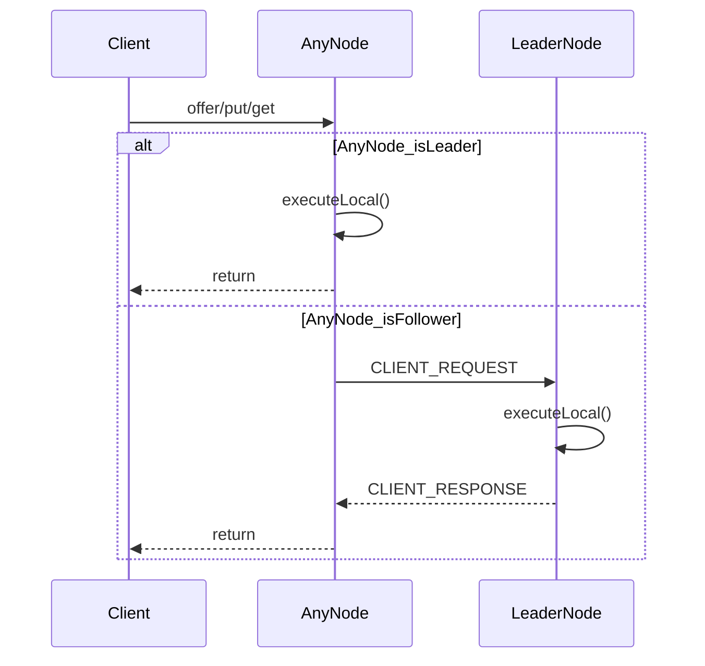
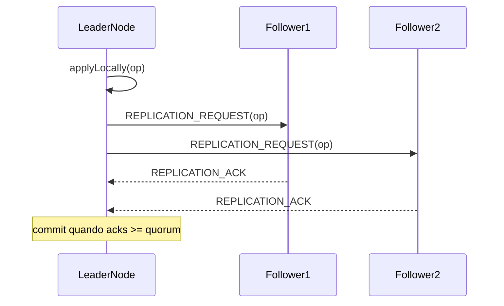

# NGrid & NQueue — Exemplos e Guia de Uso

Este documento reúne exemplos práticos para:

- **NQueue**: fila persistente standalone (filesystem), thread-safe.
- **NGrid**: cluster TCP com **fila distribuída** e **mapa distribuído** replicados via **líder + quorum**.

> Dica: para visão técnica (fluxos e detalhes internos), veja `doc/ngrid/arquitetura.md`. Para um guia “passo a passo” mais longo, veja `doc/ngrid/guia-utilizacao.md`.

## Índice (links rápidos)

- [Início rápido](#inicio-rapido)
- [Configuração](#configuracao)
- [NQueue (Standalone)](#nqueue-standalone)
- [NGrid (Cluster distribuído)](#ngrid-cluster-distribuido)
- [Monitoramento do cluster (liderança e membros)](#monitoramento-do-cluster-lideranca-e-membros)
- [Persistência do mapa (WAL + snapshot)](#persistencia-do-mapa-wal--snapshot)
- [Utilitários](#utilitarios)
- [Solução de problemas](#solucao-de-problemas)
- [Dicas de performance](#dicas-de-performance)
- [Comparações rápidas](#comparacoes-rapidas)
- [Limitações atuais](#limitacoes-atuais)

---

## Início rápido

### NQueue — mínimo funcional

```java
import dev.nishisan.utils.queue.NQueue;

import java.nio.file.Path;

public class QuickStartNQueue {
  public static void main(String[] args) throws Exception {
    Path baseDir = Path.of("./data");
    try (NQueue<String> queue = NQueue.open(baseDir, "minha-fila")) {
      queue.offer("hello");
      System.out.println(queue.poll().orElse("<vazio>"));
    }
  }
}
```

### NGrid — 3 nós em um único processo (demo local)

> Em produção, cada nó roda em seu próprio processo/host. Em testes, prefira portas efêmeras (veja `src/test/java/dev/nishisan/utils/ngrid/NGridIntegrationTest.java`).

```java
import dev.nishisan.utils.ngrid.common.NodeId;
import dev.nishisan.utils.ngrid.common.NodeInfo;
import dev.nishisan.utils.ngrid.structures.DistributedQueue;
import dev.nishisan.utils.ngrid.structures.NGridConfig;
import dev.nishisan.utils.ngrid.structures.NGridNode;

import java.nio.file.Files;
import java.nio.file.Path;

public class QuickStartNGrid {
  public static void main(String[] args) throws Exception {
    NodeInfo n1 = new NodeInfo(NodeId.of("node-1"), "127.0.0.1", 9011);
    NodeInfo n2 = new NodeInfo(NodeId.of("node-2"), "127.0.0.1", 9012);
    NodeInfo n3 = new NodeInfo(NodeId.of("node-3"), "127.0.0.1", 9013);

    Path base = Files.createTempDirectory("ngrid-quickstart");
    Path d1 = Files.createDirectories(base.resolve("node1"));
    Path d2 = Files.createDirectories(base.resolve("node2"));
    Path d3 = Files.createDirectories(base.resolve("node3"));

    try (NGridNode node1 = new NGridNode(NGridConfig.builder(n1).addPeer(n2).addPeer(n3).queueDirectory(d1).replicationQuorum(2).build());
         NGridNode node2 = new NGridNode(NGridConfig.builder(n2).addPeer(n1).addPeer(n3).queueDirectory(d2).replicationQuorum(2).build());
         NGridNode node3 = new NGridNode(NGridConfig.builder(n3).addPeer(n1).addPeer(n2).queueDirectory(d3).replicationQuorum(2).build())) {

      node1.start();
      node2.start();
      node3.start();

      DistributedQueue<String> q = node2.queue(String.class); // pode chamar em qualquer nó
      q.offer("job-1");
      System.out.println(q.poll().orElse("<vazio>"));
    }
  }
}
```

---

## Configuração

### NGridConfig (principal)

| Atributo | Tipo | Padrão | Recomendação (quando usar) | Descrição |
| :--- | :--- | :--- | :--- | :--- |
| `local` | `NodeInfo` | Obrigatório | Sempre | Identidade do nó local (ID, host, porta). |
| `peers` / `addPeer(...)` | `Set<NodeInfo>` | Vazio | Sempre (exceto single-node) | Peers iniciais para bootstrap do cluster. |
| `replicationQuorum` | `int` | `2` | `2` (dev), `2..N` (prod) | Número mínimo de confirmações (inclui o líder) para commit de escritas. |
| `queueDirectory` | `Path` | Obrigatório | Diretório persistente | Base de dados da fila distribuída (usa NQueue local). |
| `queueName` | `String` | `"ngrid"` | Um nome por cluster | Subpasta/nome da fila usada pelo serviço de fila. |
| `mapDirectory` | `Path` | `queueDirectory/maps` | Persistente se usar WAL/snapshot | Diretório base da persistência local do mapa. |
| `mapName` | `String` | `"default-map"` | Um nome por cluster | Nome do mapa padrão (usado por `node.map(...)`). |
| `mapPersistenceMode` | `MapPersistenceMode` | `DISABLED` | `DISABLED` (padrão), `ASYNC_WITH_FSYNC` se quiser durabilidade local | Modo de persistência do mapa: `DISABLED`, `ASYNC_NO_FSYNC`, `ASYNC_WITH_FSYNC`. |

### MapPersistenceConfig (persistência local do mapa)

> Importante: ao usar `NGridNode`, a persistência do mapa é criada com `MapPersistenceConfig.defaults(...)` internamente. Para customizar os parâmetros abaixo, veja [Persistência do mapa (WAL + snapshot)](#persistencia-do-mapa-wal--snapshot) (seção “wiring avançado”).

| Atributo | Tipo | Padrão | Recomendação (quando usar) | Descrição |
| :--- | :--- | :--- | :--- | :--- |
| `snapshotIntervalOperations` | `int` | `10_000` | Aumente para reduzir IO | Nº de operações antes de gerar snapshot. |
| `snapshotIntervalTime` | `Duration` | `5 min` | Diminua para snapshots mais frequentes | Tempo máximo entre snapshots. |
| `batchSize` | `int` | `100` | Aumente para throughput | Tamanho do batch para gravar WAL. |
| `batchTimeout` | `Duration` | `10 ms` | Aumente se a taxa for baixa | Espera máxima para preencher um batch do WAL. |

---

## NQueue (Standalone)

`NQueue` é uma fila persistente em disco e thread-safe, com `offer/poll/peek` e compactação automática.

### 1) Uso básico

```java
import dev.nishisan.utils.queue.NQueue;

import java.nio.file.Path;
import java.util.Optional;

public class SimpleQueueExample {
  public static void main(String[] args) throws Exception {
    Path baseDir = Path.of("./data");
    try (NQueue<String> queue = NQueue.open(baseDir, "minha-fila")) {
      queue.offer("Primeira Mensagem");
      queue.offer("Segunda Mensagem");

      System.out.println("size=" + queue.size());
      Optional<String> peek = queue.peek();
      System.out.println("peek=" + peek.orElse("<vazio>"));

      Optional<String> polled = queue.poll();
      System.out.println("poll=" + polled.orElse("<vazio>"));
    }
  }
}
```

### 2) Opções avançadas (fsync + compactação)

```java
import dev.nishisan.utils.queue.NQueue;

import java.io.Serializable;
import java.nio.file.Path;
import java.time.Duration;

public class AdvancedQueueConfig {
  private record MyObject(String id) implements Serializable {}

  public static void main(String[] args) throws Exception {
    Path baseDir = Path.of("./data");

    NQueue.Options options = NQueue.Options.defaults()
        .withFsync(true) // mais durável (e mais lento)
        .withCompactionWasteThreshold(0.4) // compacta se ~40% for lixo
        .withCompactionInterval(Duration.ofMinutes(10))
        .withCompactionBufferSize(1024 * 1024);

    try (NQueue<MyObject> queue = NQueue.open(baseDir, "fila-otimizada", options)) {
      queue.offer(new MyObject("obj-1"));
    }
  }
}
```

### 3) Produtor/consumidor (múltiplas threads)

> Veja também: `src/main/java/dev/nishisan/utils/queue/NQueueExample.java`.

```java
import dev.nishisan.utils.queue.NQueue;

import java.io.IOException;
import java.nio.file.Path;
import java.util.concurrent.ExecutorService;
import java.util.concurrent.Executors;
import java.util.concurrent.TimeUnit;

public class NQueueProducerConsumerExample {
  public static void main(String[] args) throws Exception {
    Path baseDir = Path.of("./data");
    try (NQueue<String> queue = NQueue.open(baseDir, "demo")) {
      ExecutorService ex = Executors.newFixedThreadPool(2);

      ex.submit(() -> {
        try {
          for (int i = 0; i < 10_000; i++) {
            queue.offer("message-" + i);
          }
        } catch (IOException e) {
          throw new RuntimeException("producer failed", e);
        }
      });

      ex.submit(() -> {
        try {
          while (true) {
            if (queue.poll().isEmpty()) {
              break;
            }
          }
        } catch (IOException e) {
          throw new RuntimeException("consumer failed", e);
        }
      });

      ex.shutdown();
      ex.awaitTermination(30, TimeUnit.SECONDS);
    }
  }
}
```

### 4) Objeto complexo (Serializable) + boas práticas

```java
import dev.nishisan.utils.queue.NQueue;

import java.io.Serializable;
import java.nio.file.Path;
import java.util.List;

public class NQueueComplexPayloadExample {
  public record UserProfile(String name, List<String> roles) implements Serializable {}

  public static void main(String[] args) throws Exception {
    try (NQueue<UserProfile> queue = NQueue.open(Path.of("./data"), "profiles")) {
      queue.offer(new UserProfile("alice", List.of("admin", "billing")));
      System.out.println(queue.peek().orElseThrow());
    }
  }
}
```

### 5) Recuperação após restart (persistência)

```java
import dev.nishisan.utils.queue.NQueue;

import java.nio.file.Path;

public class NQueueRestartExample {
  public static void main(String[] args) throws Exception {
    Path baseDir = Path.of("./data");

    try (NQueue<String> q1 = NQueue.open(baseDir, "restart-demo")) {
      q1.offer("payload-1");
    }

    // “Reinício” (reabrindo a mesma fila)
    try (NQueue<String> q2 = NQueue.open(baseDir, "restart-demo")) {
      System.out.println("peekAfterRestart=" + q2.peek().orElse("<vazio>"));
    }
  }
}
```

---

## NGrid (Cluster distribuído)

O NGrid funciona em um modelo **leader-based**: as fachadas `DistributedQueue` e `DistributedMap` roteam chamadas ao **líder**. Escritas são confirmadas após **quorum**.

### Como o roteamento funciona (visão rápida)



### 1) Subindo um nó (bootstrap)

```java
import dev.nishisan.utils.ngrid.common.NodeId;
import dev.nishisan.utils.ngrid.common.NodeInfo;
import dev.nishisan.utils.ngrid.structures.NGridConfig;
import dev.nishisan.utils.ngrid.structures.NGridNode;

import java.nio.file.Path;

public class NGridNodeBootstrap {
  public static void main(String[] args) throws Exception {
    NodeInfo me = new NodeInfo(NodeId.of("node-1"), "127.0.0.1", 8081);
    NodeInfo seed = new NodeInfo(NodeId.of("node-2"), "127.0.0.1", 8082);

    NGridConfig config = NGridConfig.builder(me)
        .addPeer(seed)
        .queueDirectory(Path.of("./node-1-data"))
        .replicationQuorum(2)
        .build();

    try (NGridNode node = new NGridNode(config)) {
      node.start();
      System.out.println("Leader=" + node.coordinator().leaderInfo().orElse(null));
    }
  }
}
```

### 2) DistributedQueue — uso + tratamento de erros

```java
import dev.nishisan.utils.ngrid.structures.DistributedQueue;
import dev.nishisan.utils.ngrid.structures.NGridNode;

import java.util.Optional;

public class DistributedQueueExample {
  public static void main(String[] args) {
    NGridNode node = null; // suponha que já foi criado e start() chamado
    DistributedQueue<String> q = node.queue(String.class);

    try {
      q.offer("job-1"); // pode ser chamado em follower; será roteado ao líder
      Optional<String> job = q.poll();
      System.out.println("job=" + job.orElse("<vazio>"));
    } catch (IllegalStateException e) {
      // Ex.: "No leader available", "Not the leader", falhas de quorum/timeout propagadas como erro
      System.err.println("DistributedQueue operation failed: " + e.getMessage());
    }
  }
}
```

### 3) DistributedMap — uso + tratamento de erros

```java
import dev.nishisan.utils.ngrid.structures.DistributedMap;
import dev.nishisan.utils.ngrid.structures.NGridNode;

import java.io.Serializable;
import java.util.Optional;

public class DistributedMapExample {
  public record UserProfile(String name, String role) implements Serializable {}

  public static void main(String[] args) {
    NGridNode node = null; // suponha start() chamado
    DistributedMap<String, UserProfile> map = node.map(String.class, UserProfile.class);

    try {
      map.put("user:123", new UserProfile("Alice", "Admin"));
      Optional<UserProfile> fetched = map.get("user:123");
      System.out.println("get=" + fetched.orElse(null));
    } catch (IllegalStateException e) {
      System.err.println("DistributedMap operation failed: " + e.getMessage());
    }
  }
}
```

### 3.1) Replicação (escritas) — visão rápida



### 4) Restart de nó e consistência (exemplo baseado em teste)

Para um exemplo completo e estável (com portas efêmeras e wait de port release), veja:

- `src/test/java/dev/nishisan/utils/ngrid/NGridIntegrationTest.java`

Esse teste demonstra:

- chamadas em follower roteando para o líder
- estado persistindo na fila (via NQueue local) após restart de um nó

---

## Monitoramento do cluster (liderança e membros)

### 1) Consultas simples (polling)

```java
import dev.nishisan.utils.ngrid.structures.NGridNode;

public class NGridMonitoringPolling {
  public static void main(String[] args) {
    NGridNode node = null; // suponha start() chamado
    System.out.println("isLeader=" + node.coordinator().isLeader());
    System.out.println("leader=" + node.coordinator().leaderInfo().orElse(null));
    System.out.println("activeMembers=" + node.coordinator().activeMembers());
  }
}
```

### 2) Listeners (event-driven)

```java
import dev.nishisan.utils.ngrid.cluster.coordination.LeadershipListener;
import dev.nishisan.utils.ngrid.structures.NGridNode;

public class NGridMonitoringListeners {
  public static void main(String[] args) {
    NGridNode node = null; // suponha start() chamado

    node.coordinator().addLeadershipListener((LeadershipListener) newLeader ->
        System.out.println("Leader changed => " + newLeader)
    );

    node.coordinator().addLeaderElectionListener((isLeader, leaderId) ->
        System.out.println("Local leadership changed => isLeader=" + isLeader + " leaderId=" + leaderId)
    );
  }
}
```

---

## Persistência do mapa (WAL + snapshot)

### 1) Habilitando no NGridConfig (modo)

```java
import dev.nishisan.utils.ngrid.common.NodeId;
import dev.nishisan.utils.ngrid.common.NodeInfo;
import dev.nishisan.utils.ngrid.map.MapPersistenceMode;
import dev.nishisan.utils.ngrid.structures.NGridConfig;
import dev.nishisan.utils.ngrid.structures.NGridNode;

import java.nio.file.Path;

public class NGridMapPersistenceModeExample {
  public static void main(String[] args) throws Exception {
    NodeInfo me = new NodeInfo(NodeId.of("node-1"), "127.0.0.1", 9011);

    NGridConfig cfg = NGridConfig.builder(me)
        .queueDirectory(Path.of("./node-1-data"))
        .mapDirectory(Path.of("./node-1-data/maps"))
        .mapName("default-map")
        .mapPersistenceMode(MapPersistenceMode.ASYNC_WITH_FSYNC)
        .replicationQuorum(1)
        .build();

    try (NGridNode node = new NGridNode(cfg)) {
      node.start();
      // O MapClusterService executa loadFromDisk() no start() do NGridNode quando persistência está habilitada
    }
  }
}
```

### 2) Wiring avançado: customizar MapPersistenceConfig

> O `NGridNode` cria a persistência com defaults. Se você precisa customizar `batchSize`, `snapshotInterval*`, etc., você pode montar os componentes manualmente (mesma ideia descrita em `doc/ngrid/arquitetura.md`).

```java
import dev.nishisan.utils.ngrid.cluster.coordination.ClusterCoordinator;
import dev.nishisan.utils.ngrid.cluster.coordination.ClusterCoordinatorConfig;
import dev.nishisan.utils.ngrid.cluster.transport.TcpTransport;
import dev.nishisan.utils.ngrid.cluster.transport.TcpTransportConfig;
import dev.nishisan.utils.ngrid.common.NodeId;
import dev.nishisan.utils.ngrid.common.NodeInfo;
import dev.nishisan.utils.ngrid.map.MapClusterService;
import dev.nishisan.utils.ngrid.map.MapPersistenceConfig;
import dev.nishisan.utils.ngrid.map.MapPersistenceMode;
import dev.nishisan.utils.ngrid.replication.ReplicationConfig;
import dev.nishisan.utils.ngrid.replication.ReplicationManager;
import dev.nishisan.utils.ngrid.structures.DistributedMap;

import java.nio.file.Path;
import java.time.Duration;
import java.util.concurrent.Executors;
import java.util.concurrent.ScheduledExecutorService;

public class AdvancedMapPersistenceConfigExample {
  public static void main(String[] args) {
    NodeInfo me = new NodeInfo(NodeId.of("node-1"), "127.0.0.1", 9011);

    TcpTransport transport = new TcpTransport(
        TcpTransportConfig.builder(me)
            .connectTimeout(Duration.ofSeconds(5))
            .reconnectInterval(Duration.ofSeconds(2))
            .build()
    );
    transport.start();

    ScheduledExecutorService scheduler = Executors.newSingleThreadScheduledExecutor();
    ClusterCoordinator coordinator = new ClusterCoordinator(transport, ClusterCoordinatorConfig.defaults(), scheduler);
    coordinator.start();

    ReplicationManager replication = new ReplicationManager(transport, coordinator, ReplicationConfig.of(1));
    replication.start();

    MapPersistenceConfig persistence = MapPersistenceConfig.builder(Path.of("./data/maps"), "map")
        .mode(MapPersistenceMode.ASYNC_NO_FSYNC)
        .batchSize(1_000)
        .batchTimeout(Duration.ofMillis(25))
        .snapshotIntervalOperations(50_000)
        .snapshotIntervalTime(Duration.ofMinutes(10))
        .build();

    MapClusterService<String, String> mapService = new MapClusterService<>(replication, persistence);
    mapService.loadFromDisk();

    DistributedMap<String, String> map = new DistributedMap<>(transport, coordinator, mapService);
    map.put("k1", "v1");
  }
}
```

---

## Utilitários

### 1) LeaderElectionUtils (apenas cluster + eleição)

> Exemplo completo no guia: `doc/ngrid/guia-utilizacao.md` (seção LeaderElectionUtils).

```java
import dev.nishisan.utils.ngrid.LeaderElectionUtils;
import dev.nishisan.utils.ngrid.cluster.coordination.ClusterCoordinatorConfig;
import dev.nishisan.utils.ngrid.cluster.transport.TcpTransport;
import dev.nishisan.utils.ngrid.cluster.transport.TcpTransportConfig;
import dev.nishisan.utils.ngrid.common.NodeId;
import dev.nishisan.utils.ngrid.common.NodeInfo;

import java.time.Duration;
import java.util.concurrent.Executors;

public class LeaderElectionOnlyExample {
  public static void main(String[] args) {
    NodeInfo local = new NodeInfo(NodeId.of("node-1"), "127.0.0.1", 9021);
    TcpTransport transport = new TcpTransport(
        TcpTransportConfig.builder(local)
            .connectTimeout(Duration.ofSeconds(5))
            .reconnectInterval(Duration.ofSeconds(2))
            .build()
    );
    transport.start();

    var scheduler = Executors.newSingleThreadScheduledExecutor();
    var svc = LeaderElectionUtils.create(transport, ClusterCoordinatorConfig.defaults(), scheduler);
    svc.addLeaderElectionListener((isLeader, leaderId) ->
        System.out.println("isLeader=" + isLeader + " leaderId=" + leaderId)
    );
    svc.start();
  }
}
```

### 2) StatsUtils (métricas simples)

```java
import dev.nishisan.utils.stats.StatsUtils;

public class StatsUtilsExample {
  public static void main(String[] args) {
    StatsUtils stats = new StatsUtils();
    stats.notifyHitCounter("requests.total");
    stats.notifyAverageCounter("latency.ms", 10);
    stats.notifyAverageCounter("latency.ms", 20);

    System.out.println("requests.total=" + stats.getCounterValue("requests.total"));
    System.out.println("latency.avg=" + stats.getAverage("latency.ms"));
  }
}
```

---

## Solução de problemas

### “No leader available” / “Not the leader”

- Garanta que há **conectividade** entre peers (host/port corretos, firewall).
- Espere o cluster estabilizar (principalmente em startup).
- Em testes, é comum isso acontecer se você começa a chamar APIs imediatamente após `start()`.

### “Address already in use” (porta ocupada)

- Use **portas efêmeras** em testes (veja `NGridIntegrationTest`).
- Em alguns ambientes existe janela de `TIME_WAIT` após fechar sockets; o teste possui uma estratégia de espera.

### “Quorum unreachable” / timeouts

- Verifique número de membros ativos (`node.coordinator().activeMembers()`).
- Se o cluster tiver menos membros ativos do que `replicationQuorum`, a operação pode falhar quando não consegue atingir confirmações suficientes.

### Permissões / diretórios de dados

- `queueDirectory` e `mapDirectory` devem ser graváveis.
- Para durabilidade entre execuções, não use diretórios temporários.

---

## Dicas de performance

- **NQueue**
  - `withFsync(true)`: mais durável (mais lento).
  - `withFsync(false)`: bom para dev/benchmark (risco de perda em crash).
  - Ajuste `withCompactionWasteThreshold(...)` e `withCompactionInterval(...)` para reduzir uso de disco.
- **NGrid**
  - Quorum maior aumenta durabilidade/consistência, mas reduz disponibilidade/latência.
  - Persistência de mapa: `ASYNC_NO_FSYNC` tende a ser bem mais rápida que `ASYNC_WITH_FSYNC`.

---

## Boas práticas

- **Sempre use `try-with-resources`** com `NGridNode` e `NQueue` (garante `close()` mesmo em exceções).
- **Use diretórios persistentes** para `queueDirectory`/`mapDirectory` se você quer durabilidade entre execuções.
- **Não reuse `nodeId` em dois processos ao mesmo tempo** (vai gerar comportamento indefinido no cluster).
- **Evite chamar APIs distribuídas “imediatamente” após `start()`** em testes: espere o cluster estabilizar (ver `NGridIntegrationTest`).
- **LeaderElectionUtils**: forneça um `ScheduledExecutorService` dedicado (o `ClusterCoordinator#close()` encerra o scheduler usado).

---

## Comparações rápidas

### NQueue vs DistributedQueue

- **NQueue**: local, simples, persistente, sem rede.
- **DistributedQueue**: cluster, roteamento para líder, replicação por quorum; usa NQueue local por nó.

### Persistência do mapa (modos)

- `DISABLED`: mapa é só memória.
- `ASYNC_NO_FSYNC`: WAL+snapshot (melhor performance; menos durável em crash).
- `ASYNC_WITH_FSYNC`: WAL+snapshot com mais durabilidade (mais IO).

---

## Limitações atuais

- **Uma fila e um mapa por `NGridNode`** (há `queueName` e `mapName`, mas o nó expõe uma instância de cada estrutura).
- **Leituras do mapa (`get`) são roteadas ao líder** para manter consistência forte e modelo simples.
- **Deduplicação de operação é em memória** (após restart total, IDs anteriores não são mantidos; persistência do mapa/fila cobre estado, não o histórico de IDs).

---

## Casos de uso reais (padrões)

### 1) Job Queue distribuída (workers)

**Ideia**: produtores fazem `offer(job)` e múltiplos workers fazem `poll()` e processam.

- **Producer**: `queue.offer(job)`
- **Worker**: `queue.poll()` → processa → (opcional) grava resultado em `DistributedMap` (ex.: `job:{id} -> status`)

> Observação: este exemplo é “at least once” no nível da aplicação se você não tiver ACK. Se você precisar exatamente-uma-vez, geralmente você combina `DistributedMap` (idempotência) + controle de reprocessamento.

### 2) Cache distribuído simples (KV)

**Ideia**: usar `DistributedMap<K,V>` como cache fortemente consistente (via líder).

- Para TTL, você pode embutir `expiresAt` no valor e validar no consumidor (TTL nativo não existe hoje).

### 3) Sistema de eventos (event log simples)

**Ideia**: publicar eventos em `DistributedQueue<Event>` e manter um “offset” por consumidor em `DistributedMap<String, Long>`.

- Consumidor lê evento, atualiza seu offset no mapa (id do consumidor → último offset processado).

