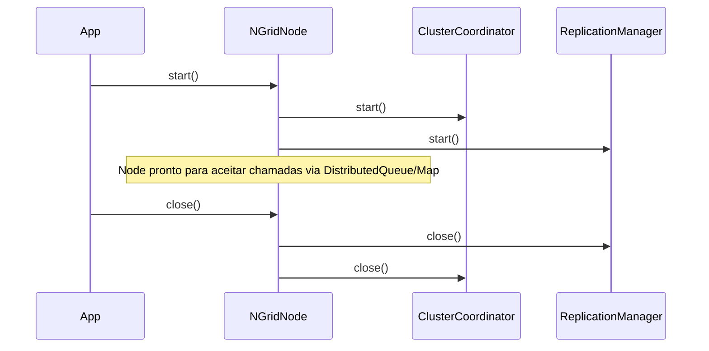
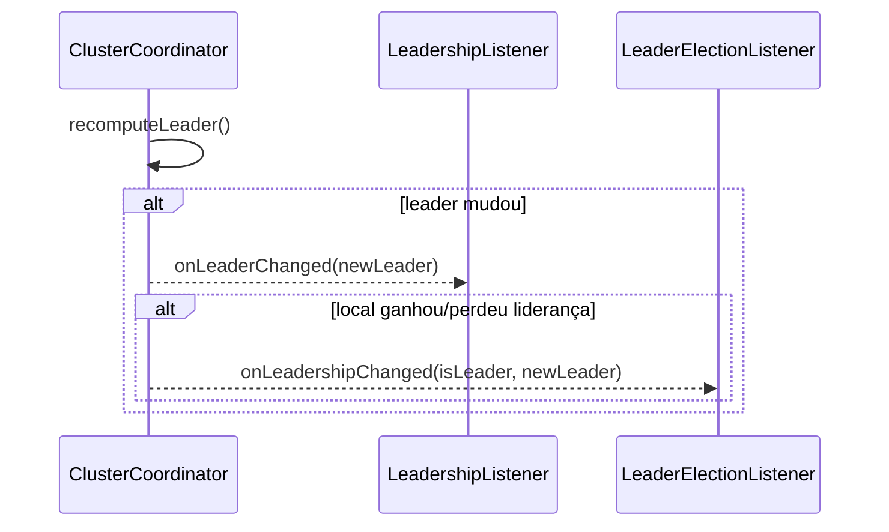

# NGrid — Guia de utilização (com exemplos)

Este documento mostra como **configurar e usar** o NGrid e suas estruturas (fila e mapa distribuídos), além de exemplos com **NQueue** e utilitários.

> Recomendação: leia também `doc/ngrid/arquitetura.md` para entender os fluxos de cluster/eleição/replicação.

## Dependência (Maven)

Adicione a dependência do projeto (ajuste a versão conforme seu release):

```xml
<dependency>
  <groupId>dev.nishisan</groupId>
  <artifactId>nishi-utils</artifactId>
  <version>1.0.14</version>
</dependency>
```

## Conceitos rápidos

- **NQueue**: fila persistente local em disco (por diretório), com `offer/poll/peek`.
- **NGridNode**: “processo” de um nó do cluster (inicia transporte TCP, coordenação, replicação e expõe fila/mapa).
- **DistributedQueue / DistributedMap**: fachadas que roteiam chamadas ao **líder**.
- **Quorum**: número mínimo de confirmações para “commit” de operações replicadas.

## 1) NQueue (fila local persistente)

### Exemplo básico

```java
import dev.nishisan.utils.queue.NQueue;

import java.nio.file.Path;
import java.util.Optional;

public class NQueueBasicExample {
  public static void main(String[] args) throws Exception {
    Path baseDir = Path.of("/tmp/queues");
    String queueName = "minha-fila";

    try (NQueue<String> queue = NQueue.open(baseDir, queueName)) {
      queue.offer("msg-1");
      queue.offer("msg-2");

      Optional<String> peek = queue.peek(); // não remove
      System.out.println("peek=" + peek.orElse("<vazio>"));

      Optional<String> polled = queue.poll(); // remove
      System.out.println("poll=" + polled.orElse("<vazio>"));
    }
  }
}
```

### Configurando opções (ex.: fsync e compactação)

```java
import dev.nishisan.utils.queue.NQueue;

import java.nio.file.Path;
import java.time.Duration;

public class NQueueOptionsExample {
  public static void main(String[] args) throws Exception {
    Path baseDir = Path.of("/tmp/queues");
    String queueName = "fila-com-opcoes";

    NQueue.Options options = NQueue.Options.defaults()
        .withFsync(false) // desempenho maior, menor durabilidade
        .withCompactionWasteThreshold(0.3)
        .withCompactionInterval(Duration.ofMinutes(10))
        .withCompactionBufferSize(256 * 1024);

    try (NQueue<String> queue = NQueue.open(baseDir, queueName, options)) {
      queue.offer("hello");
    }
  }
}
```

### Modo Stream (Log Distribuído)

Para usar a fila como um log de eventos (Stream) onde as mensagens persistem por tempo e múltiplos consumidores leem independentemente:

```java
NQueue.Options options = NQueue.Options.defaults()
    .withRetentionPolicy(NQueue.Options.RetentionPolicy.TIME_BASED)
    .withRetentionTime(Duration.ofHours(24)); // Retém por 24h
```

## 2) NGrid (cluster): configuração e bootstrap

O NGrid funciona com nós descritos por `NodeInfo(nodeId, host, port)` e com uma lista de **peers iniciais**. A descoberta completa tende a convergir via handshake e peer updates. Após o `start()`, você também pode adicionar peers dinamicamente com `node.join(...)`.

### Configuração do nó (NGridConfig)

Campos principais:

- `local(NodeInfo)`: identidade do nó (host/porta para bind).
- `addPeer(NodeInfo)`: peers iniciais para bootstrap (opcional).
- `replicationFactor(int)`: fator de replicação default (quorum efetivo é limitado pelo tamanho do cluster ativo).
- `queueDirectory(Path)` e `queueName(String)`: diretório/nome da `NQueue` local usada pela fila distribuída.
- **`strictConsistency(boolean)`**: Define o modelo de consistência. `false` (padrão) prioriza disponibilidade (AP), ajustando o quorum aos nós ativos. `true` prioriza consistência (CP), exigindo quorum fixo (`replicationFactor`) mesmo que nós falhem. **Nota:** No modo estrito, o líder aguarda o quórum antes de aplicar a mudança localmente.
- **`transportWorkerThreads(int)`**: Número de threads dedicadas ao processamento de IO e conexões (padrão: 2). Aumente em clusters com muitos nós ou alta latência de handshake.

#### Configuração via YAML

Você também pode carregar a configuração a partir de um arquivo YAML, com suporte a variáveis de ambiente.
Para detalhes completos e exemplos, consulte: [doc/ngrid/configuracao.md](configuracao.md).

```java
NGridYamlConfig yamlConfig = NGridConfigLoader.load(Path.of("config.yaml"));
NGridConfig config = NGridConfigLoader.convertToDomain(yamlConfig);
```

### Proteção contra Split-Brain

O NGrid agora exige um número mínimo de membros ativos para eleger um líder. Por padrão, esse valor é 1 (o nó pode ser líder sozinho). Em produção, recomenda-se configurar o cluster para exigir a maioria dos nós para evitar que partições de rede criem múltiplos líderes. (Veja `ClusterCoordinatorConfig` para customização avançada).

> Para produção, normalmente cada nó roda em seu processo/host. Aqui é apenas uma demo local.

```java
import dev.nishisan.utils.ngrid.common.NodeId;
import dev.nishisan.utils.ngrid.common.NodeInfo;
import dev.nishisan.utils.ngrid.structures.DistributedMap;
import dev.nishisan.utils.ngrid.structures.DistributedQueue;
import dev.nishisan.utils.ngrid.structures.NGridConfig;
import dev.nishisan.utils.ngrid.structures.NGridNode;

import java.nio.file.Files;
import java.nio.file.Path;
import java.util.Optional;

public class NGridClusterExample {
  public static void main(String[] args) throws Exception {
    // Dica: em testes/ambientes compartilhados (CI), prefira portas efêmeras para evitar colisões.
    // Para simplificar a demo, aqui ainda usamos portas fixas.
    NodeInfo n1 = new NodeInfo(NodeId.of("node-1"), "127.0.0.1", 9011);
    NodeInfo n2 = new NodeInfo(NodeId.of("node-2"), "127.0.0.1", 9012);
    NodeInfo n3 = new NodeInfo(NodeId.of("node-3"), "127.0.0.1", 9013);

    Path baseDir = Files.createTempDirectory("ngrid-demo");
    Path dir1 = Files.createDirectories(baseDir.resolve("node1"));
    Path dir2 = Files.createDirectories(baseDir.resolve("node2"));
    Path dir3 = Files.createDirectories(baseDir.resolve("node3"));

    try (NGridNode node1 = new NGridNode(NGridConfig.builder(n1)
            .addPeer(n2).addPeer(n3)
            .queueDirectory(dir1).queueName("queue")
            .replicationFactor(2)
            .build());
         NGridNode node2 = new NGridNode(NGridConfig.builder(n2)
            .addPeer(n1).addPeer(n3)
            .queueDirectory(dir2).queueName("queue")
            .replicationFactor(2)
            .build());
         NGridNode node3 = new NGridNode(NGridConfig.builder(n3)
            .addPeer(n1).addPeer(n2)
            .queueDirectory(dir3).queueName("queue")
            .replicationFactor(2)
            .build())) {

      node1.start();
      node2.start();
      node3.start();

      // APIs distribuídas
      DistributedQueue<String> q1 = node1.queue(String.class);
      DistributedQueue<String> q2 = node2.queue(String.class);
      DistributedQueue<String> q3 = node3.queue(String.class);

      DistributedMap<String, String> m1 = node1.map(String.class, String.class);
      DistributedMap<String, String> m3 = node3.map(String.class, String.class);

      // Por política atual: maior NodeId vence => node-3 será líder
      System.out.println("Leader=" + node1.coordinator().leaderInfo().orElseThrow());

      // Fila distribuída
      q3.offer("payload-1");
      q3.offer("payload-2");

      Optional<String> peekFollower = q1.peek(); // roteia para líder
      System.out.println("peekFollower=" + peekFollower.orElse("<vazio>"));

      // Consumo tradicional (Queue Mode - destrutivo)
      Optional<String> polledFollower = q2.poll(); // roteia para líder
      System.out.println("polledFollower=" + polledFollower.orElse("<vazio>"));
      
      // Consumo persistente (Log Mode - por consumidor)
      // O offset é salvo no cluster associado ao NodeId do chamador (neste caso n2)
      // Isso permite que n2 continue de onde parou mesmo após reconexão.
      // Requer que a NQueue esteja configurada com RetentionPolicy.TIME_BASED
      // Optional<String> streamItem = q2.poll(); 

      // Mapa distribuído
      m3.put("shared-key", "value-1");
      System.out.println("m1.get=" + m1.get("shared-key").orElse("<vazio>"));
    }
  }
}
```

### Adicionando peers dinamicamente (join)

```java
import dev.nishisan.utils.ngrid.common.NodeInfo;
import dev.nishisan.utils.ngrid.structures.NGridNode;

public class NGridJoinExample {
  public static void main(String[] args) {
    NGridNode node = null; // suponha start() chamado
    NodeInfo seed = null;  // peer conhecido

    node.join(seed);
  }
}
```

### Ciclo de vida do nó (start/close) e boas práticas

- **`start()`**: sobe transporte TCP, coordenação (heartbeat + eleição), replicação (quorum + timeout), e por fim as fachadas `DistributedQueue`/`DistributedMap`.
- **`close()`**: encerra as fachadas e serviços, para o replicador, coordenação, scheduler e transporte (best-effort; se houver erro de IO, propaga o primeiro).
- **Boas práticas**:
  - Sempre use `try-with-resources` com `NGridNode`.
  - Evite reusar o mesmo `nodeId` em dois processos ao mesmo tempo.
  - Garanta que `queueDirectory` seja persistente se você quiser durabilidade/restart.



## 3) DistributedQueue (fila distribuída)

### API principal

- `offer(T value)`
- `Optional<T> peek()`
- `Optional<T> poll()`

### Observações importantes

- Se você chamar em um **follower**, a operação será encaminhada ao **líder** via `CLIENT_REQUEST/CLIENT_RESPONSE`.
- No backend, o NGrid usa `QueueClusterService` + `ReplicationManager` e persiste em `NQueue` local (um diretório por nó).
- **Consumo Persistente**: Ao chamar `poll()`, o sistema identifica automaticamente o `NodeId` do nó que fez a requisição. Se a fila estiver configurada em modo `RetentionPolicy.TIME_BASED`, o cluster gerenciará um offset persistente para este consumidor. Isso garante que, se o nó cair e voltar, continuará lendo a partir da última mensagem não consumida por ele.

## 4) DistributedMap (mapa distribuído)

### API principal

- `Optional<V> put(K key, V value)`
- `Optional<V> get(K key)`
- `Optional<V> remove(K key)`

### Múltiplos mapas (nomeados)

- `node.map(K.class, V.class)` continua existindo e retorna o **mapa padrão**, cujo nome é `config.mapName()` (padrão: `default-map`).
- Para criar/usar **vários mapas independentes** no mesmo cluster, use `node.getMap("map-name", K.class, V.class)`:

```java
DistributedMap<String, String> users = node1.getMap("users", String.class, String.class);
DistributedMap<String, String> sessions = node2.getMap("sessions", String.class, String.class);

users.put("u1", "alice");
sessions.put("s1", "token-123");
```

> Nota importante: como cada mapa registra handlers de replicação por nome, **crie o mesmo mapa em todos os nós** (chamando `getMap(...)`) antes de começar a escrever, para evitar que followers recebam replicações de um mapa que ainda não foi inicializado localmente.

### Observações importantes

- No estado atual, o mapa é mantido em memória (`ConcurrentHashMap`) e replicado via `ReplicationManager`.
- `get()` também é roteado ao líder na fachada (`DistributedMap`), mantendo um modelo simples de consistência.

### Persistência local do mapa (opcional)

Você pode habilitar persistência em disco para o mapa **por nó** (cada nó escolhe).

Modos:

- `DISABLED` (padrão)
- `ASYNC_NO_FSYNC`
- `ASYNC_WITH_FSYNC`

Arquivos por mapa:

```
{mapDirectory}/{mapName}/
├── wal.log
├── snapshot.dat
└── map.meta
```

Exemplo de configuração:

```java
import dev.nishisan.utils.ngrid.common.NodeId;
import dev.nishisan.utils.ngrid.common.NodeInfo;
import dev.nishisan.utils.ngrid.map.MapPersistenceMode;
import dev.nishisan.utils.ngrid.structures.NGridConfig;
import dev.nishisan.utils.ngrid.structures.NGridNode;

import java.nio.file.Path;

public class NGridMapPersistenceExample {
  public static void main(String[] args) {
    NodeInfo local = new NodeInfo(NodeId.of("node-1"), "127.0.0.1", 9011);

    NGridConfig cfg = NGridConfig.builder(local)
        // bootstrap do cluster (exemplo)
        // .addPeer(...)
        .replicationQuorum(2)
        // fila distribuída (obrigatório hoje)
        .queueDirectory(Path.of("/tmp/ngrid/node-1"))
        .queueName("queue")
        // mapa: persistência local (opcional)
        .mapDirectory(Path.of("/tmp/ngrid/node-1/maps"))
        .mapName("default-map") // nome do mapa padrão (usado por node.map(...))
        .mapPersistenceMode(MapPersistenceMode.ASYNC_WITH_FSYNC)
        .build();

    try (NGridNode node = new NGridNode(cfg)) {
      node.start();
      // node.map(String.class, String.class)...
      // node.getMap("users", String.class, String.class)...
    } catch (Exception e) {
      throw new RuntimeException(e);
    }
  }
}
```

Notas:

- A persistência é **local** e não altera o modelo de consistência do cluster.
- `ASYNC_WITH_FSYNC` prioriza durabilidade em crash; `ASYNC_NO_FSYNC` prioriza performance.

## 5) Utilitários

### 5.1) LeaderElectionUtils (somente cluster + eleição)

Quando você quer apenas “descoberta + eleição de líder” (sem usar `NGridNode` completo), use `LeaderElectionUtils`.

```java
import dev.nishisan.utils.ngrid.LeaderElectionListener;
import dev.nishisan.utils.ngrid.LeaderElectionUtils;
import dev.nishisan.utils.ngrid.cluster.coordination.ClusterCoordinatorConfig;
import dev.nishisan.utils.ngrid.cluster.transport.TcpTransport;
import dev.nishisan.utils.ngrid.cluster.transport.TcpTransportConfig;
import dev.nishisan.utils.ngrid.common.NodeId;
import dev.nishisan.utils.ngrid.common.NodeInfo;

import java.time.Duration;
import java.util.concurrent.Executors;
import java.util.concurrent.ScheduledExecutorService;

public class LeaderElectionOnlyExample {
  public static void main(String[] args) {
    NodeInfo local = new NodeInfo(NodeId.of("node-1"), "127.0.0.1", 9021);

    TcpTransport transport = new TcpTransport(
        TcpTransportConfig.builder(local)
            .connectTimeout(Duration.ofSeconds(5))
            .reconnectInterval(Duration.ofSeconds(2))
            .build()
    );
    transport.start();

    ScheduledExecutorService scheduler = Executors.newSingleThreadScheduledExecutor();
    LeaderElectionUtils.LeaderElectionService svc =
        LeaderElectionUtils.create(transport, ClusterCoordinatorConfig.defaults(), scheduler);

    svc.addLeaderElectionListener(new LeaderElectionListener() {
      @Override
      public void onLeadershipChanged(boolean isLeader, NodeId leaderId) {
        System.out.println("isLeader=" + isLeader + " leaderId=" + leaderId);
      }
    });

    svc.start();
  }
}
```

> Nota: o `LeaderElectionService#close()` fecha internamente o `ClusterCoordinator`, que encerra o scheduler (veja o javadoc do utilitário). Use um scheduler dedicado.

### 5.1.1) Eventos de liderança (diferença entre `LeadershipListener` e `LeaderElectionListener`)

- **`LeadershipListener`**: notificado quando o líder observado muda (mesmo que o nó local não ganhe/perca liderança).
- **`LeaderElectionListener`**: notificado quando o nó local ganha/perde liderança.



### 5.2) StatsUtils (métricas simples)

O `NQueue` já expõe contadores internos por `StatsUtils` (ex.: `queue.getStatsUtils()`), mas você também pode usar `StatsUtils` diretamente:

```java
import dev.nishisan.utils.stats.StatsUtils;

public class StatsUtilsExample {
  public static void main(String[] args) {
    StatsUtils stats = new StatsUtils();
    stats.notifyHitCounter("requests.total");
    stats.notifyAverageCounter("latency.ms", 10);
    stats.notifyAverageCounter("latency.ms", 20);

    System.out.println("requests.total=" + stats.getCounterValue("requests.total"));
    System.out.println("latency.avg=" + stats.getAverage("latency.ms"));
  }
}
```

## Boas práticas e troubleshooting

### Portas e bind

- Cada nó precisa de uma porta TCP única (host/port em `NodeInfo`) para bind no `TcpTransport`.
- Em testes automatizados, prefira portas efêmeras (exemplo: `NGridIntegrationTest`).

### Quorum

- Ajuste `replicationQuorum` para equilibrar disponibilidade e consistência.
- Se o cluster tiver menos membros ativos do que o quorum configurado, o NGrid reduz para um quorum efetivo viável (se `strictConsistency=false`) ou falha a operação (se `strictConsistency=true`).

### Persistência (fila)

- Se você quer mais durabilidade, mantenha `NQueue.Options.withFsync(true)` (default).
- Para alta taxa de escrita em dev/benchmark, `withFsync(false)` pode ser aceitável (com risco de perda no crash).