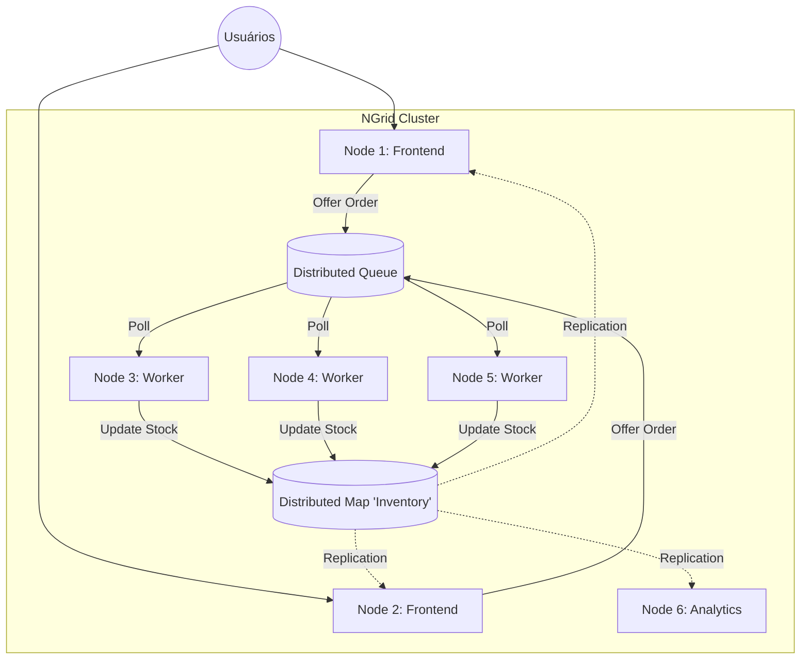

# NGrid Lab: Cenário de E-commerce Real

Este laboratório descreve a simulação de um sistema de E-commerce distribuído utilizando um cluster NGrid de **6 nós**. O objetivo é demonstrar as capacidades de **Malha (Mesh Routing)**, **Consistência Limitada (Bounded Staleness)** e **Auto-Cura (Catch-up)** em um ambiente controlado.

## 1. O Cenário

Imagine uma arquitetura de processamento de pedidos composta por:

*   **Nós 1 e 2 (Frontend):** Recebem requisições HTTP (simuladas), consultam estoque (Mapa) e enfileiram pedidos (Fila). Priorizam baixa latência de leitura.
*   **Nós 3, 4 e 5 (Backend Workers):** Consomem a fila de pedidos, processam pagamentos e atualizam o estoque. Priorizam consistência de escrita.
*   **Nó 6 (Analytics/Audit):** Mantém uma réplica passiva para relatórios. Pode sofrer latência maior.

### Topologia Lógica



---

## 2. Setup do Laboratório (Código Java)

Crie um arquivo `EcommerceLab.java` no seu projeto para rodar este cenário.

```java
import dev.nishisan.utils.ngrid.common.NodeId;
import dev.nishisan.utils.ngrid.common.NodeInfo;
import dev.nishisan.utils.ngrid.structures.Consistency;
import dev.nishisan.utils.ngrid.structures.DistributedMap;
import dev.nishisan.utils.ngrid.structures.DistributedQueue;
import dev.nishisan.utils.ngrid.structures.NGridConfig;
import dev.nishisan.utils.ngrid.structures.NGridNode;

import java.io.Serializable;
import java.nio.file.Files;
import java.nio.file.Path;
import java.time.Duration;
import java.util.ArrayList;
import java.util.List;
import java.util.Scanner;
import java.util.concurrent.Executors;
import java.util.concurrent.TimeUnit;

public class EcommerceLab {
    // Modelo de Dados
    public record Order(String id, String sku, int qty) implements Serializable {}
    public record InventoryItem(String sku, int available) implements Serializable {}

    public static void main(String[] args) throws Exception {
        // Configuração dos 6 Nós
        int basePort = 10000;
        List<NodeInfo> nodesInfo = new ArrayList<>();
        for (int i = 1; i <= 6; i++) {
            nodesInfo.add(new NodeInfo(NodeId.of("node-" + i), "127.0.0.1", basePort + i));
        }

        Path labDir = Files.createTempDirectory("ngrid-lab");
        List<NGridNode> runningNodes = new ArrayList<>();

        System.out.println(">>> Inicializando Cluster de 6 Nós...");

        for (NodeInfo info : nodesInfo) {
            NGridConfig.Builder builder = NGridConfig.builder(info)
                    .queueDirectory(labDir.resolve(info.nodeId().value()))
                    .replicationFactor(3) // Quorum de escrita = 2 (maioria de 3)
                    .heartbeatInterval(Duration.ofMillis(500))
                    .rttProbeInterval(Duration.ofSeconds(1)); // Para otimização de malha rápida

            // Todos conhecem todos inicialmente (full mesh bootstrap)
            nodesInfo.forEach(builder::addPeer);

            NGridNode node = new NGridNode(builder.build());
            node.start();
            runningNodes.add(node);
            System.out.println("   Started: " + info.nodeId());
        }

        // Aguardar formação do cluster
        Thread.sleep(3000);
        System.out.println(">>> Cluster Online. Líder Atual: " + runningNodes.get(0).coordinator().leaderInfo().orElse(null));

        // Inicializar Dados (Estoque)
        NGridNode workerNode = runningNodes.get(2); // Node 3
        DistributedMap<String, InventoryItem> inventory = workerNode.getMap("inventory", String.class, InventoryItem.class);
        inventory.put("sku-phone", new InventoryItem("sku-phone", 1000));
        System.out.println(">>> Estoque inicializado: 1000 phones.");

        // Menu Interativo
        runInteractiveMode(runningNodes);
    }

    private static void runInteractiveMode(List<NGridNode> nodes) {
        Scanner scanner = new Scanner(System.in);
        while (true) {
            System.out.println("\n--- LAB MENU ---");
            System.out.println("1. [Front] Criar Pedido (Simular Cliente)");
            System.out.println("2. [Work] Processar Pedidos");
            System.out.println("3. [Mesh] Simular Falha de Rede (Node 1 -> Líder)");
            System.out.println("4. [Heal] Parar Node 6 (Analytics)");
            System.out.println("5. [Heal] Reiniciar Node 6 (Teste Catch-up)");
            System.out.println("0. Sair");
            System.out.print("Escolha: ");
            
            String op = scanner.nextLine();
            try {
                switch (op) {
                    case "1" -> simulateFrontend(nodes.get(0));
                    case "2" -> processOrders(nodes);
                    case "3" -> System.out.println("Para testar Mesh: Use 'iptables' ou firewall para bloquear porta do Líder para o Node 1, mas deixe aberta para o Node 2.");
                    case "4" -> {
                        System.out.println("Parando Node 6...");
                        nodes.get(5).close();
                    }
                    case "5" -> {
                        System.out.println("Reiniciando Node 6...");
                        // Código de restart (necessita recriar instância no path correto)
                        // Simplificação para o lab: apenas reinicie a JVM ou assuma reconexão se close() não foi destrutivo.
                        System.out.println("(Nota: Em um lab real Java, você precisaria recriar o objeto NGridNode aqui)");
                    }
                    case "0" -> System.exit(0);
                }
            } catch (Exception e) {
                e.printStackTrace();
            }
        }
    }

    private static void simulateFrontend(NGridNode frontend) {
        DistributedMap<String, InventoryItem> inv = frontend.getMap("inventory", String.class, InventoryItem.class);
        
        // CENÁRIO 1: BOUNDED STALENESS
        // O Frontend aceita ler dados com até 10 operações de atraso para responder rápido.
        // Se o lag for pequeno, ele lê da memória local (sem rede!).
        long start = System.nanoTime();
        InventoryItem item = inv.get("sku-phone", Consistency.bounded(10)).orElse(null);
        long dur = System.nanoTime() - start;
        
        System.out.printf(">>> [Front] Leitura Estoque: %dms. Item: %s%n", TimeUnit.NANOSECONDS.toMicros(dur), item);
        
        if (item != null) {
            DistributedQueue<Order> q = frontend.getQueue("orders", Order.class);
            q.offer(new Order("ord-" + System.currentTimeMillis(), "sku-phone", 1));
            System.out.println(">>> [Front] Pedido enfileirado.");
        }
    }

    private static void processOrders(List<NGridNode> nodes) {
        // Workers: Node 3, 4, 5
        var executor = Executors.newFixedThreadPool(3);
        for (int i = 2; i <= 4; i++) {
            NGridNode worker = nodes.get(i);
            executor.submit(() -> {
                DistributedQueue<Order> q = worker.getQueue("orders", Order.class);
                DistributedMap<String, InventoryItem> inv = worker.getMap("inventory", String.class, InventoryItem.class);
                
                q.poll().ifPresent(order -> {
                    InventoryItem current = inv.get(order.sku).orElseThrow();
                    inv.put(order.sku, new InventoryItem(order.sku, current.available - order.qty));
                    System.out.println(">>> [Worker " + worker.transport().local().nodeId() + "] Processado: " + order.id + ". Restam: " + (current.available - order.qty));
                });
            });
        }
        executor.shutdown();
    }
}
```

---

## 3. Guia dos Cenários de Falha e Recuperação

### Cenário A: Performance com Bounded Staleness (Frontend)

O NGrid permite que os nós 1 e 2 (Frontend) leiam o estoque **localmente**, sem fazer requisição de rede para o líder, desde que estejam sincronizados.

1.  Execute a opção **1. [Front] Criar Pedido**.
2.  Observe o tempo de leitura no console. Deve ser na ordem de **microssegundos** (ex: `50ms` vs `2000ms` se fosse rede).
3.  **Por que?** O comando `Consistency.bounded(10)` verifica: `(SeqLider - SeqLocal) <= 10`. Se verdadeiro, retorna o valor do `ConcurrentHashMap` local.

### Cenário B: Mesh Routing (O "Cabo Cortado")

Neste cenário, simulamos que o **Node 1** perdeu conexão direta com o **Líder** (suponha que seja o Node 6), mas ainda vê o **Node 2**.

1.  **Ação:** Bloqueie a porta TCP entre Node 1 e Líder (via firewall do OS).
2.  **Comportamento NGrid:**
    *   O `TcpTransport` do Node 1 detecta falha no envio direto (`isConnected = false`).
    *   O `NetworkRouter` consulta a tabela de rotas. Ele vê que o Node 2 tem conexão com o Líder.
    *   O Node 1 envia a mensagem para o Node 2 (Proxy).
    *   O Node 2 encaminha para o Líder.
3.  **Resultado:** A aplicação no Node 1 continua funcionando (escrevendo pedidos), apenas com uma latência levemente maior (2 hops).
4.  **Auto-Otimização (Fase 2):** Se o link direto voltar mas estiver com latência alta (RTT ruim), o NGrid manterá a rota via Proxy se ela for >15% mais rápida.

### Cenário C: Catch-up (O Nó Recuperado)

Simulamos um desastre onde o **Node 6 (Analytics)** cai e fica fora por muito tempo, perdendo milhares de atualizações de estoque.

1.  Use a opção **4. Parar Node 6**.
2.  Gere carga no sistema (Opção 1 e 2 repetidamente) para avançar a `GlobalSequence` no líder (ex: de seq 100 para seq 800).
3.  O Node 6 parou na seq 100. O "Lag" é de 700 operações.
4.  Use a opção **5. Reiniciar Node 6**.
5.  **Comportamento NGrid:**
    *   Node 6 entra e recebe Heartbeat: "Leader HighWatermark = 800".
    *   Node 6 detecta `(800 - 100) > Threshold (500)`.
    *   Node 6 envia `SYNC_REQUEST` para o líder.
    *   Líder envia o mapa serializado em **Chunks**.
    *   Node 6 instala o snapshot, pula para a seq 800 e volta ao estado "Active".
6.  **Observação nos Logs:** Procure por `Requesting sync for map:inventory` e `Installing snapshot chunk`.

---

## 4. Conclusão do Lab

Este laboratório demonstra que o NGrid não é apenas um cache distribuído, mas um sistema resiliente capaz de:
1.  **Escalar leitura** (Bounded Staleness).
2.  **Sobreviver a falhas de rede parciais** (Mesh Routing).
3.  **Recuperar nós obsoletos automaticamente** (Catch-up).
