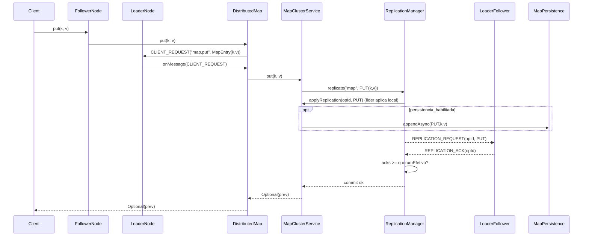
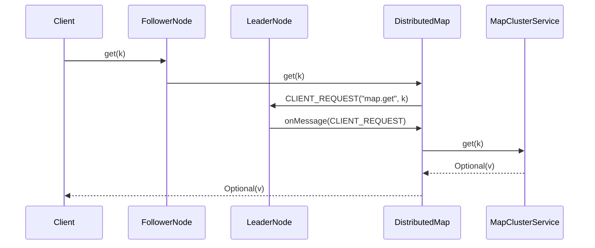
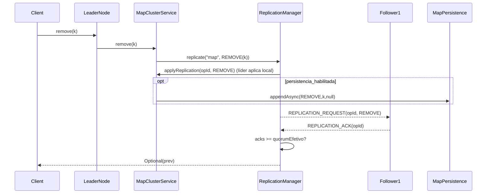
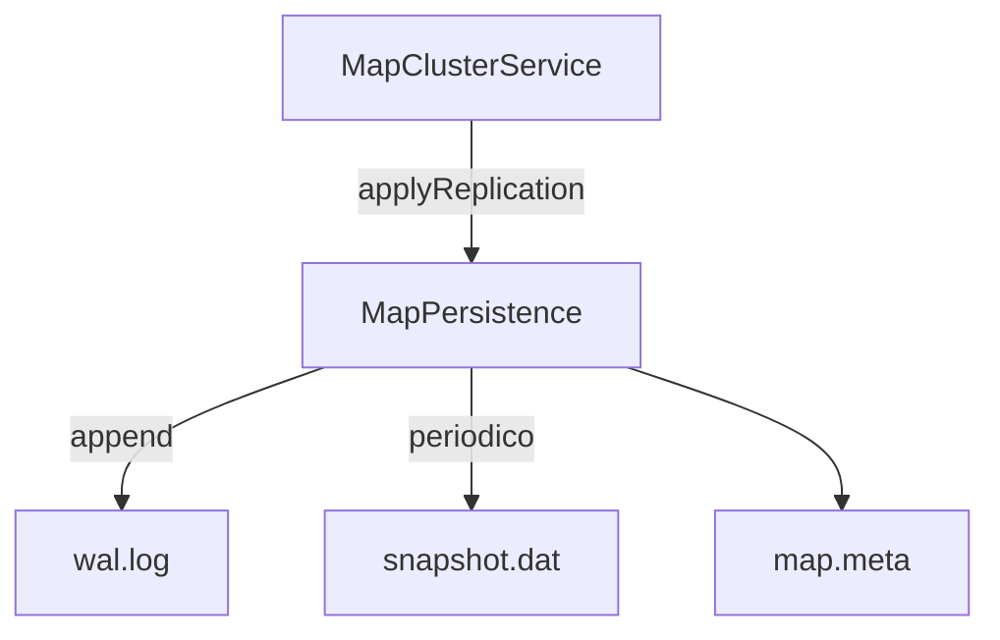
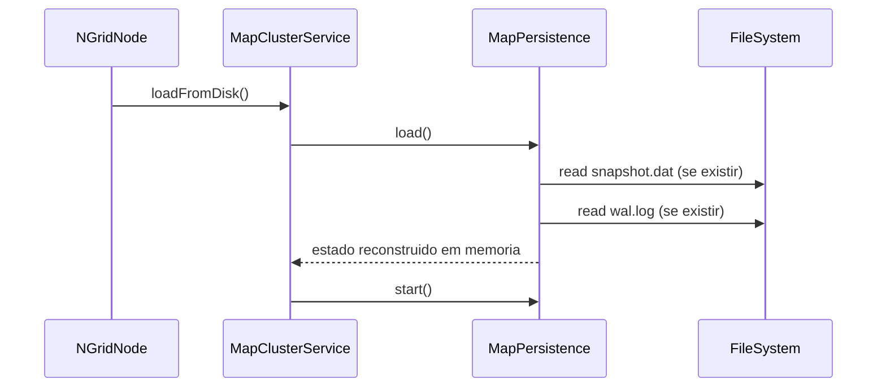

# NGrid – Mapa Distribuído (design + implementação atual)

Este documento descreve o **mapa distribuído** do NGrid conforme implementado hoje no código.

Principais classes envolvidas:
- `dev.nishisan.utils.ngrid.structures.DistributedMap`
- `dev.nishisan.utils.ngrid.map.MapClusterService`
- `dev.nishisan.utils.ngrid.replication.ReplicationManager`
- `dev.nishisan.utils.ngrid.map.MapPersistence` (opcional, por nó)

---

## Objetivo

Fornecer um mapa chave→valor replicado entre nós do cluster, com:
- **escritas serializadas por líder**
- **commit por quorum**
- **replicação de comandos** (`PUT`/`REMOVE`) para manter as réplicas alinhadas
- **persistência local opcional** (WAL + snapshot) para acelerar restart e melhorar durabilidade local

---

## Componentes e responsabilidades

### `DistributedMap<K,V>` (fachada “cliente”)
- Roteia as chamadas para o **líder**.
- Em nó líder: executa localmente no `MapClusterService`.
- Em nó follower: envia `CLIENT_REQUEST` ao líder e aguarda resposta.

### `MapClusterService<K,V>` (estado + integração com replicação)
- Mantém o estado em memória em um `ConcurrentHashMap`.
- Para `put/remove`:
  - dispara `ReplicationManager.replicate("map", MapReplicationCommand...)`
  - aguarda commit (quorum) ou falha (timeout/quorum inalcançável)
- Para `get`:
  - lê do mapa local (no líder, é o caminho efetivo; em followers, a fachada roteia ao líder por padrão)

### `ReplicationManager` (quorum + deduplicação em memória)
- Apenas o líder pode iniciar `replicate(...)`.
- Aplica localmente primeiro e replica para followers.
- Considera **commitada** quando `acks >= quorumEfetivo`.
- Deduplica por `operationId` em memória (evita reaplicar a mesma operação).

### `MapPersistence` (opcional, por nó)
- Persistência **best-effort**: falhas de IO são logadas, mas não devem derrubar a operação do mapa.
- Mantém:
  - `wal.log` (append-only)
  - `snapshot.dat` (snapshot completo periódico)
  - `map.meta` (metadados do snapshot; best-effort)

---

## Modelo de consistência e quorum (prático)

- **Escritas** (`put/remove`): passam pelo líder e só retornam sucesso após quorum.
- **Leituras** (`get`): a fachada roteia para o líder para manter o modelo simples (consistência forte no líder).
- **Quorum efetivo** (no líder):

\[
quorumEfetivo = \max(1, \min(quorumConfigurado, |\text{membrosAtivos}|))
\]

### Falhas típicas
- **Timeout**: operação excede `operationTimeout` (padrão ~30s no `ReplicationManager`).
- **Quorum inalcançável**: peers desconectam e o número de membros alcançáveis fica abaixo do quorum.

---

## Fluxos de operações

### PUT (`put(key, value)`)

- `MapReplicationCommand.put(key, value)` é o comando replicado.
- O retorno (valor anterior) é calculado no líder e devolvido ao chamador via `CLIENT_RESPONSE`.



### GET (`get(key)`)

Por implementação atual, o `get` é servido pelo líder (via roteamento da fachada). Isso simplifica a consistência sem exigir “read-repair” ou validação por versão.



### REMOVE (`remove(key)`)

Importante: **não existe tombstone** na implementação atual. O comando replicado é `REMOVE(key)` e cada nó executa `data.remove(key)`.



---

## Persistência local (WAL + snapshot)

### Arquivos

```
{mapDirectory}/{mapName}/
├── wal.log
├── snapshot.dat
└── map.meta
```

### Ciclo de vida (como roda hoje)

- `loadFromDisk()` (chamado no `NGridNode.start()` quando persistência está habilitada):
  - cria diretório do mapa
  - carrega `snapshot.dat` (se existir)
  - reaplica `wal.log` (se existir)
  - lê `map.meta` (best-effort)
- `start()`:
  - abre `wal.log` para append
  - inicia uma thread daemon (`ngrid-map-persistence`) que drena uma fila e escreve em batch
- `appendAsync(type, key, value)`:
  - enfileira entradas para o writer; não bloqueia o caminho crítico do cluster
- `maybeSnapshot()`:
  - dispara por **número de operações** (padrão: 10.000) ou por **tempo** (padrão: 5 min)
  - faz rotação do WAL e grava snapshot do mapa atual (cópia fraca do `ConcurrentHashMap`)



### Recuperação no boot (snapshot + WAL)



---

## Formato do comando replicado (como é de fato)

O payload replicado no tópico `map` é `MapReplicationCommand`:
- `type`: `PUT` ou `REMOVE`
- `key`: `Serializable` (obrigatório)
- `value`: `Serializable` (somente em `PUT`)

---

## Limitações atuais e caminhos de evolução

- **Sem tombstones**: remoção é direta; não há marcador lógico.
- **Deduplicação em memória** (`operationId`): após restart total, o histórico de IDs é perdido (o estado do mapa pode persistir via `snapshot/wal` se habilitado).
- **Leitura roteada ao líder**: simples e forte; evoluções futuras podem permitir `get` local com validação/versões.
