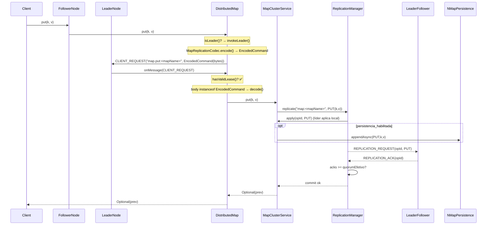
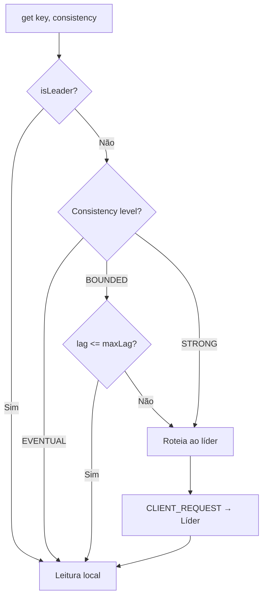
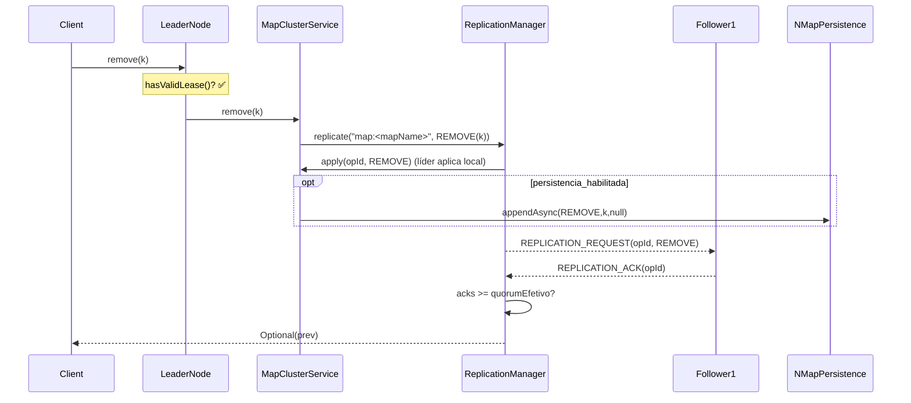
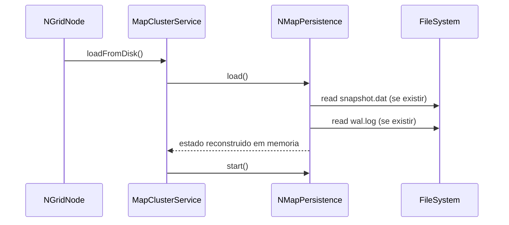

# NGrid – Mapa Distribuído (design + implementação atual)

> **Última atualização:** 2026-06-04

Este documento descreve o **mapa distribuído** do NGrid conforme implementado hoje no código.

Principais classes envolvidas:
- `dev.nishisan.utils.ngrid.structures.DistributedMap`
- `dev.nishisan.utils.ngrid.map.MapClusterService`
- `dev.nishisan.utils.ngrid.replication.ReplicationManager`
- `dev.nishisan.utils.map.NMapPersistence` (opcional, por nó)
- `dev.nishisan.utils.ngrid.structures.Consistency` / `ConsistencyLevel`

---

## Objetivo

Fornecer um mapa chave→valor replicado entre nós do cluster, com:
- **Drop-in de `java.util.Map<K,V>`** — `DistributedMap` implementa a interface, permitindo
  trocar um `ConcurrentHashMap` por ele sem refatorar o código consumidor (inclusive regras
  Groovy: `map[key]`, `map.each`, `map.containsKey`, `map.clear`).
- **Escritas serializadas por líder** com validação de lease
- **Commit por quorum** (estrito ou dinâmico)
- **Replicação de comandos** (`PUT`/`REMOVE`/`CLEAR`) para manter as réplicas alinhadas
- **Persistência local opcional** (WAL + Snapshot) para acelerar restart e melhorar durabilidade local
- **Leituras com 3 níveis de consistência** (STRONG, BOUNDED, EVENTUAL)

---

## Componentes e responsabilidades

### `DistributedMap<K,V>` (fachada "cliente")

- **Implementa `java.util.Map<K,V>`** — os métodos do contrato (`get`/`put`/`remove`)
  retornam `V` (ou `null`). As variantes `getOptional`/`putOptional`/`removeOptional`
  preservam o retorno `Optional<V>` (e o overload com `Consistency`), já que o *erasure*
  impede dois retornos na mesma assinatura.
- Roteia as chamadas de escrita para o **líder**.
- Em nó líder: valida **leader lease** antes de aceitar writes, executa localmente no `MapClusterService`.
- Em nó follower: codifica o comando via `MapReplicationCodec` e envelopa em `EncodedCommand` antes de enviar `CLIENT_REQUEST` ao líder via `invokeLeader()` com **retry + backoff exponencial** (5 tentativas, 200ms→2s). Isso garante fidelidade de tipo de POJOs arbitrários.
- Leituras (`get`/`getOptional`) respeitam o nível de consistência configurado (ver seção abaixo).
- Expõe `keySet()`, `containsKey()`, `containsValue()`, `size()`, `isEmpty()`, `putAll()` e as
  views locais `values()`/`entrySet()` (snapshots imutáveis, eventually-consistent e imunes a
  `ConcurrentModificationException` sob escrita concorrente).
- Expõe `clear()` **replicado** (esvazia todas as réplicas mantendo o mapa reutilizável).
- Expõe `removeByPrefix()` para limpeza local durante snapshot install (sem replicação).

### `MapClusterService<K,V>` (estado + integração com replicação)

- Mantém o estado em memória em um `ConcurrentHashMap`.
- Para `put/remove`:
  - dispara `ReplicationManager.replicate("map:<mapName>", MapReplicationCommand...)`
  - aguarda commit (quorum) ou falha (timeout/quorum inalcançável)
- Para `get`:
  - lê do mapa local diretamente
- Implementa `ReplicationHandler`:
  - `apply()` — aplica PUT/REMOVE/CLEAR/DESTROY localmente. Para offset maps (`_ngrid-queue-offsets`), usa semântica monotônica: `max(stored, new)`. **CLEAR** esvazia o `ConcurrentHashMap` e registra um marcador no WAL mantendo a persistência viva (reutilizável); **DESTROY** esvazia e apaga os arquivos de persistência.
  - `clearReplicated()` — replica um comando `CLEAR` (esvazia mantendo o mapa reutilizável).
  - `getSnapshotChunk()` — retorna snapshot paginado (1000 itens/chunk) para catch-up de followers.
  - `installSnapshot()` — instala snapshot recebido. Para offset maps, respeita semântica monotônica.
  - `resetState()` — limpa estado antes de snapshot install.
- Expõe health check: `isHealthy()` e `persistenceFailureCount()`.

### `ReplicationManager` (quorum + deduplicação)

- Apenas o líder pode iniciar `replicate(...)`.
- Valida **leader lease** antes de aceitar writes — rejeita com `LeaseExpiredException` se expirado.
- Replica para followers e aguarda ACKs.
- Considera **commitada** quando `acks >= quorumEfetivo`.
- Deduplica por `operationId` em memória (evita reaplicar a mesma operação).
- Resend de sequências faltantes via `SEQUENCE_RESEND_REQUEST/RESPONSE`.
- Catch-up de followers via snapshot chunked quando lag > threshold (500 ops).

### `NMapPersistence` (opcional, por nó)

- Persistência com modos configuráveis: `DISABLED`, `ASYNC_NO_FSYNC`, `ASYNC_WITH_FSYNC`.
- Para offset maps (`_ngrid-queue-offsets`): usa `appendSync()` (escrita síncrona) para garantir durabilidade em crash.
- Para mapas genéricos: usa `appendAsync()` (batch background).
- Mantém:
  - `wal.log` (append-only)
  - `snapshot.dat` (snapshot completo periódico)
  - `meta.json` (metadados do snapshot)

---

## Níveis de Consistência de Leitura

O `DistributedMap.get()` suporta 3 níveis de consistência configuráveis:

| Nível | Comportamento | Latência | Uso típico |
|---|---|---|---|
| `STRONG` (default) | Roteia ao líder | Maior (RPC) | Dados críticos, leitura após escrita |
| `BOUNDED` | Local se lag ≤ maxLag, senão líder | Variável | Caches com tolerância controlada |
| `EVENTUAL` | Sempre local | Mínima | Dashboards, métricas, dados não-críticos |

```java
// Contrato java.util.Map: retorna V (ou null), leitura STRONG (default)
V value = map.get("key");

// Variante Optional (leitura forte)
Optional<V> value = map.getOptional("key");

// Leitura eventual (local, sem RPC)
Optional<V> value = map.getOptional("key", Consistency.EVENTUAL);

// Leitura bounded (local se lag <= 10 operações)
Optional<V> value = map.getOptional("key", Consistency.bounded(10));
```

---

## Proteções em Cenários de Falha

### Leader Lease

- O líder mantém um lease baseado em heartbeat de followers.
- `DistributedMap.put()` e `remove()` verificam `coordinator.hasValidLease()` antes de aceitar writes.
- Se o lease expirou (líder isolado): `IllegalStateException("Leader lease expired, cannot accept writes")`.
- O `ReplicationManager` também rejeita com `LeaseExpiredException`.

### Epoch Fencing

- Cada eleição incrementa o epoch (persistido em `leader-epoch.dat`).
- Replicações com epoch antigo são rejeitadas pelo follower.
- Dados escritos no lado minoritário de uma partição são descartados na reconexão.

### Monotonic Offsets

- Para o map interno `_ngrid-queue-offsets`, o `apply()` usa `max(stored, new)` — nunca regride offsets.
- Evita duplicidade de mensagens em queues após failover/restart.

---

## Modelo de Quorum

- **Escritas** (`put/remove`): passam pelo líder e só retornam sucesso após quorum.
- **Quorum efetivo** (no líder):

| Modo | Cálculo |
|---|---|
| `strictConsistency=true` | Quorum configurado (fixo) — falha se inalcançável |
| `strictConsistency=false` | `max(1, min(quorumConfigurado, membrosAtivos))` — adapta dinamicamente |

### Falhas típicas
- **Timeout**: operação excede `operationTimeout` (default 30s).
- **Quorum inalcançável**: peers desconectam e `strictConsistency=true` impede writes.
- **Lease expirado**: líder isolado sem heartbeat de followers.

---

## Fluxos de operações

### PUT (`put(key, value)`)

- `MapReplicationCommand.put(key, value)` é o comando replicado.
- O retorno (valor anterior) é calculado no líder e devolvido ao chamador via `CLIENT_RESPONSE`.


```mermaid
sequenceDiagram
participant Client as Client
participant F as FollowerNode
participant L as LeaderNode
participant DM as DistributedMap
participant MS as MapClusterService
participant RM as ReplicationManager
participant LF as LeaderFollower
participant MP as NMapPersistence

Client->>F: put(k, v)
F->>DM: put(k, v)
Note over DM: isLeader()? → invokeLeader()
Note over DM: MapReplicationCodec.encode() → EncodedCommand
DM->>L: CLIENT_REQUEST("map.put:<mapName>", EncodedCommand(bytes))
L->>DM: onMessage(CLIENT_REQUEST)
Note over DM: hasValidLease()? ✅
Note over DM: body instanceof EncodedCommand → decode()
DM->>MS: put(k, v)
MS->>RM: replicate("map:<mapName>", PUT(k,v))
RM->>MS: apply(opId, PUT) (líder aplica local)
opt persistencia_habilitada
  MS->>MP: appendAsync(PUT,k,v)
end
RM-->>LF: REPLICATION_REQUEST(opId, PUT)
LF-->>RM: REPLICATION_ACK(opId)
RM->>RM: acks >= quorumEfetivo?
RM-->>MS: commit ok
MS-->>DM: Optional(prev)
DM-->>Client: Optional(prev)
```

### GET (`get(key, consistency)`)

O comportamento depende do nível de consistência e de quem é o nó:


```mermaid
flowchart TD
  A[get key, consistency] --> B{isLeader?}
  B -->|Sim| C[Leitura local]
  B -->|Não| D{Consistency level?}
  D -->|EVENTUAL| C
  D -->|BOUNDED| E{lag <= maxLag?}
  E -->|Sim| C
  E -->|Não| F[Roteia ao líder]
  D -->|STRONG| F
  F --> G[CLIENT_REQUEST → Líder]
  G --> C
```

### REMOVE (`remove(key)`)

**Não existe tombstone** na implementação atual. O comando replicado é `REMOVE(key)` e cada nó executa `data.remove(key)`.


```mermaid
sequenceDiagram
participant Client as Client
participant L as LeaderNode
participant MS as MapClusterService
participant RM as ReplicationManager
participant F1 as Follower1
participant MP as NMapPersistence

Client->>L: remove(k)
Note over L: hasValidLease()? ✅
L->>MS: remove(k)
MS->>RM: replicate("map:<mapName>", REMOVE(k))
RM->>MS: apply(opId, REMOVE) (líder aplica local)
opt persistencia_habilitada
  MS->>MP: appendAsync(REMOVE,k,null)
end
RM-->>F1: REPLICATION_REQUEST(opId, REMOVE)
F1-->>RM: REPLICATION_ACK(opId)
RM->>RM: acks >= quorumEfetivo?
RM-->>Client: Optional(prev)
```

---

## Persistência local (WAL + Snapshot)

### Arquivos

```
{mapDirectory}/{mapName}/
├── snapshot.dat      ← Snapshot completo serializado (Java ObjectStream)
├── wal.log           ← WAL append-only com entradas binárias
└── meta.json         ← Metadados (versão do snapshot, contadores)
```

### Ciclo de vida

- `loadFromDisk()` (chamado no `NGridNode.start()` quando persistência está habilitada):
  - cria diretório do mapa
  - carrega `snapshot.dat` (se existir)
  - reaplica `wal.log` (se existir)
  - lê `meta.json` (best-effort)
- `start()`:
  - abre `wal.log` para append
  - inicia uma thread daemon que drena uma fila e escreve em batch
- `appendAsync(type, key, value)`:
  - enfileira entradas para o writer; não bloqueia o caminho crítico
- `appendSync(type, key, value)`:
  - escrita síncrona; usado para offset maps críticos
- `maybeSnapshot()`:
  - dispara por **número de operações** (default: 10.000) ou por **tempo** (default: 5 min)
  - faz rotação do WAL e grava snapshot do mapa atual

### Modos de Persistência

| Modo | Durabilidade | Throughput | Uso típico |
|---|---|---|---|
| `DISABLED` | Nenhuma | Máximo | Caches, dados transientes |
| `ASYNC_NO_FSYNC` | Eventual | Alto | Dados recuperáveis de outra fonte |
| `ASYNC_WITH_FSYNC` | Forte | Moderado | Dados críticos, offsets de fila |

---

## Recuperação e Catch-up

### Boot (snapshot + WAL)


```mermaid
sequenceDiagram
participant Node as NGridNode
participant MS as MapClusterService
participant MP as NMapPersistence
participant FS as FileSystem

Node->>MS: loadFromDisk()
MS->>MP: load()
MP->>FS: read snapshot.dat (se existir)
MP->>FS: read wal.log (se existir)
MP-->>MS: estado reconstruido em memoria
MS->>MP: start()
```

### Catch-up de Follower Atrasado

Quando um follower detecta lag significativo (> 500 ops ou stalled por > 4s):

1. Follower envia `SYNC_REQUEST` ao líder para cada tópico registrado.
2. Líder responde com `SYNC_RESPONSE` contendo chunks de snapshot (1000 itens/chunk).
3. Follower executa `resetState()` + `installSnapshot()` progressivamente.
4. Após último chunk, follower atualiza `nextExpectedSequence` e continua replicação normal.

---

## API Pública (`DistributedMap<K,V> implements java.util.Map<K,V>`)

### Contrato `java.util.Map` (retornam `V`/`null`)

| Método | Retorno | Descrição |
|---|---|---|
| `put(key, value)` | `V` | Insere/atualiza, retorna valor anterior ou `null` (replicado) |
| `remove(Object key)` | `V` | Remove e retorna valor anterior ou `null` (replicado) |
| `get(Object key)` | `V` | Leitura STRONG (default — roteia ao líder), `null` se ausente |
| `containsKey(Object key)` | `boolean` | Verifica existência (local, eventually-consistent) |
| `containsValue(Object value)` | `boolean` | Scan linear local (eventually-consistent) |
| `keySet()` | `Set<K>` | Snapshot imutável das chaves (local, eventually-consistent) |
| `values()` | `Collection<V>` | Snapshot imutável dos valores (local; imune a `CME`) |
| `entrySet()` | `Set<Map.Entry<K,V>>` | Snapshot imutável das entradas (local; imune a `CME`) |
| `size()` | `int` | Número de entradas (local, eventually-consistent) |
| `isEmpty()` | `boolean` | Verifica se vazio (local, eventually-consistent) |
| `putAll(entries)` | `void` | Insere múltiplas entradas (cada put é replicado individualmente) |
| `clear()` | `void` | **Esvazia todas as réplicas** mantendo o mapa reutilizável (replicado) |

### Extensões (variantes `Optional` e ciclo de vida)

| Método | Retorno | Descrição |
|---|---|---|
| `getOptional(key)` | `Optional<V>` | Leitura STRONG, valor anterior embrulhado em `Optional` |
| `getOptional(key, consistency)` | `Optional<V>` | Leitura com nível de consistência configurável |
| `putOptional(key, value)` | `Optional<V>` | `put` com retorno `Optional` |
| `removeOptional(key)` | `Optional<V>` | `remove` com retorno `Optional` |
| `removeByPrefix(prefix)` | `void` | Remove chaves com prefixo (local-only, sem replicação) |
| `destroy()` / `destroyLocal()` | `void` | Destrói o mapa (replicado / apenas local) — apaga persistência |
| `close()` | `void` | Remove listener do transport |

> **`clear()` (CLEAR) × `destroy()` (DESTROY):** ambos esvaziam o estado, mas o `clear()`
> **preserva** a engine de persistência (o mapa continua usável e aceita novas escritas — caso
> de uso típico: `identifierCache.clear()` seguido de novos `put`), enquanto o `destroy()`
> **apaga** WAL/snapshot/diretório e encerra o mapa. No WAL, `CLEAR` é um marcador sem
> chave/valor (opcode adicionado ao final de `NMapOperationType` para preservar a compatibilidade
> de ordinais com logs já gravados).

---

## Formato do comando replicado e serialização de POJOs

O payload replicado no tópico `map:<mapName>` é **serializado como `byte[]`** pelo `MapReplicationCodec` antes de entrar no `ReplicationPayload`. Isso garante que POJOs arbitrários (sem anotações Jackson) sobrevivam ao transporte entre nós.

### Como funciona

```
map.put("key", new MeuPojo())  — líder
  → MapReplicationCodec.encode(MapReplicationCommand.put(key, value))
      ↓ byte[] com @class de cada campo preservado
  → ReplicationPayload.data = byte[]  (opaco para o JacksonMessageCodec)
  → rede
  ↓
  MapClusterService.apply()
  → MapReplicationCodec.decode(byte[])  ← tipo original restaurado
  → data.put((K) command.key(), (V) command.value())  ✅
```

### `MapReplicationCodec`

Classe em `dev.nishisan.utils.ngrid.map`. Mantém um `ObjectMapper` dedicado com:
- `activateDefaultTyping(NON_FINAL, AS_PROPERTY)` — embute `@type` em todos os objetos não-finais
- Field-access total (suporta classes com campos `final`, sem setters)
- `FAIL_ON_UNKNOWN_PROPERTIES = false` (compatibilidade futura)

Expõe métodos estáticos:
- `encode(MapReplicationCommand)` → `byte[]`
- `decode(byte[])` → `MapReplicationCommand`
- `encodeSnapshot(Map<?,?>)` → `byte[]`
- `decodeSnapshot(byte[])` → `Map<Object, Object>`

### Ponto de extensão do `ObjectMapper` (#110)

O `ObjectMapper` do codec pode ser customizado **no bootstrap**, compondo com (sem
substituir) a configuração de default typing:

- `MapReplicationCodec.registerModule(Module)` — registra um Jackson `Module`.
- `MapReplicationCodec.addMixIn(Class<?> target, Class<?> mixin)` — aplica um mixin a um tipo
  **apenas no codec de replicação**, sem anotar o POJO globalmente.
- `MapReplicationCodec.registerCustomizer(Consumer<ObjectMapper>)` — escape hatch genérico.

Escopo **global ao codec** (process-wide), aplicado de forma **simétrica** em serialização
(put/snapshot) e desserialização. Sem nenhuma customização, o comportamento é idêntico ao
anterior (backward-compat).

**Caso de uso — grafos auto-referenciais:** um DTO com relação recíproca
(`impacts`/`impactedBy`) forma ciclo e, sem proteção, estoura a serialização. Registrar um
mixin com `@JsonIdentityInfo(generator = PropertyGenerator.class, property = "identifier")`
quebra o ciclo e deduplica por id, resolvendo referências repetidas para a mesma instância —
tudo isolado no codec. Observação: o snapshot é serializado a partir de um `HashMap`
(não-final), de modo que o default typing emite `@class` no contêiner.

### Requisitos para o tipo V

| Requisito | Obrigatório? | Observação |
|-----------|:---:|---|
| Construtor no-args (pode ser package-private) | ✅ | Necessário para Jackson instanciar |
| Campos acessíveis (public, package, ou `ANY` visibility) | ✅ | O codec usa field access |
| Anotações Jackson (`@JsonProperty`, etc.) | ❌ | Não necessário |
| Implementar `Serializable` | ❌ | Não utilizado |

> **Fix #82 (v3.6.2):** Antes desta versão, POJOs sem anotações Jackson eram deserializados como `LinkedHashMap` nos followers e após snapshot sync, causando `ClassCastException` em runtime.

---

## Testes de cobertura

| Teste | Tipo | Cobertura |
|---|---|---|
| `MapNodeFailoverIntegrationTest` | Integração (3 nós) | Failover do líder, STRONG reads pós-failover, lease expirado, keySet |
| `NGridMapPersistenceIntegrationTest` | Integração (3 nós) | Full cluster restart, named maps recovery |
| `MapClusterServiceConcurrencyTest` | Concorrência | 8 threads × 500 ops put/remove sem deadlock |
| `DistributedMapPojoReplicationTest` | Integração (3 nós) + unitário | Regressão #82: POJO sem anotações Jackson preservado após replication e snapshot sync |

---

## Configuração via `NGridConfig`

| Parâmetro | Default | Descrição |
|---|---|---|
| `mapDirectory` | `{dataDirectory}/maps` | Diretório base para persistência de mapas |
| `mapName` | `"default-map"` | Nome do mapa padrão |
| `mapPersistenceMode` | `DISABLED` | Modo de persistência para mapas do usuário |

> **Nota:** O mapa de offsets (`_ngrid-queue-offsets`) sempre usa `ASYNC_WITH_FSYNC` independente da configuração do usuário.
