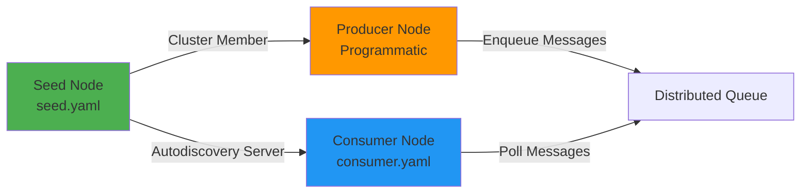

# Guia de Configuracao YAML para NGrid

Este guia demonstra como configurar um cluster NGrid usando arquivos YAML, com exemplos baseados no padrao Seed + Consumer com autodiscovery.

## Arquitetura do Exemplo



---

## 1. Seed Node (Servidor)

### Arquivo: `seed.yaml`

O Seed Node atua como ponto de entrada para o cluster e servidor de autodiscovery.

```yaml
# ====================================================================
# SEED NODE CONFIGURATION
# ====================================================================

# Identidade do No
node:
  id: seed-node
  host: 127.0.0.1
  port: 7001
  dirs:
    base: /var/ngrid/seed-data

# Configuracao de Autodiscovery (Servidor)
autodiscover:
  # Secret token compartilhado para autenticacao
  secret: my-cluster-secret-2026
  # enabled nao e necessario no seed (apenas em clientes)

# Politica de Cluster
cluster:
  name: my-cluster
  replication:
    factor: 2          # Replicas por item (minimo: 2, maximo: todos os nos)
    strict: false      # false = prioriza disponibilidade; true = prioriza consistencia
  
  # Seeds: Lista de nos iniciais do cluster
  # CRITICO: Inclua o proprio seed para que nos possam rejoin
  seeds:
    - 127.0.0.1:7001

# Politicas de Filas Distribuidas
queues:
  - name: orders
    retention:
      policy: TIME_BASED
      duration: 24h

  - name: events
    retention:
      policy: TIME_BASED
      duration: 2h

  - name: jobs
    retention:
      policy: TIME_BASED
      duration: 24h
```

### Inicializacao do Seed Node

```java
NGridNode seedNode = new NGridNode(Path.of("seed.yaml"));
seedNode.start();

// Seed aguarda outros nos se conectarem
```

---

## 2. Consumer Node (Cliente com Autodiscovery)

### Arquivo Inicial: `consumer.yaml`

Configuracao **minima** antes do bootstrap. Apos o autodiscovery, este arquivo sera atualizado automaticamente.

```yaml
# ====================================================================
# CONSUMER NODE CONFIGURATION (BEFORE AUTODISCOVERY)
# ====================================================================

# Identidade do No (sempre necessario)
node:
  id: consumer-node-1
  host: 127.0.0.1
  port: 7003
  dirs:
    base: /var/ngrid/consumer-data

# Configuracao de Autodiscovery (Cliente)
autodiscover:
  enabled: true                    # Habilita autodiscovery
  secret: my-cluster-secret-2026   # Deve corresponder ao seed
  seed: 127.0.0.1:7001            # Endereco do seed node

# Cluster e queues serao preenchidos automaticamente apos autodiscovery
```

### Arquivo Atualizado: `consumer.yaml` (Apos Autodiscovery)

Apos o consumer se conectar ao seed pela primeira vez, o arquivo e atualizado:

```yaml
# ====================================================================
# CONSUMER NODE CONFIGURATION (AFTER AUTODISCOVERY)
# ====================================================================

# Identidade do No
node:
  id: consumer-node-1
  host: 127.0.0.1
  port: 7003
  dirs:
    base: /var/ngrid/consumer-data

# Autodiscovery agora DESABILITADO (bootstrapped)
autodiscover:
  enabled: false                   # ← Autodiscovery desabilitado
  secret: my-cluster-secret-2026
  seed: 127.0.0.1:7001

# Politica de Cluster (copiada do seed)
cluster:
  name: my-cluster
  replication:
    factor: 2
    strict: false
  seeds:
    - 127.0.0.1:7001

# Politicas de Filas (copiadas do seed)
queues:
  - name: orders
    retention:
      policy: TIME_BASED
      duration: 24h

  - name: events
    retention:
      policy: TIME_BASED
      duration: 2h

  - name: jobs
    retention:
      policy: TIME_BASED
      duration: 24h
```

### Inicializacao do Consumer Node

```java
// Primeira vez: autodiscovery habilitado
NGridNode consumerNode = new NGridNode(Path.of("consumer.yaml"));
consumerNode.start();

// NGrid automaticamente:
// 1. Conecta ao seed via socket raw
// 2. Valida o secret token
// 3. Recebe politicas de cluster/queues
// 4. Atualiza consumer.yaml
// 5. Reinicia conexao via transporte TCP normal
// 6. Junta-se ao cluster

// Segunda vez em diante: usa configuracao armazenada
// (autodiscover.enabled = false)
```

---

## 3. Producer Node (Configuracao Programatica)

Produtores podem ser configurados programaticamente, sem YAML:

```java
NodeInfo seedInfo = new NodeInfo(
    NodeId.of("seed-node"),
    "127.0.0.1",
    7001
);

NodeInfo producerInfo = new NodeInfo(
    NodeId.of("producer-node"),
    "127.0.0.1",
    7002
);

NGridNode producerNode = new NGridNode(
    NGridConfig.builder(producerInfo)
        .addPeer(seedInfo)                          // Conecta ao seed
        .dataDirectory(Path.of("/var/ngrid/producer-data"))
        .addQueue(QueueConfig.builder("orders").build())
        .addQueue(QueueConfig.builder("events").build())
        .replicationQuorum(1)                        // Quorum = factor/2 + 1
        .transportWorkerThreads(4)
        .strictConsistency(false)
        .build()
);

producerNode.start();

// Produzir mensagens
DistributedQueue<String> queue = producerNode.getQueue("orders", String.class);
queue.offer("Hello, World!");
```
