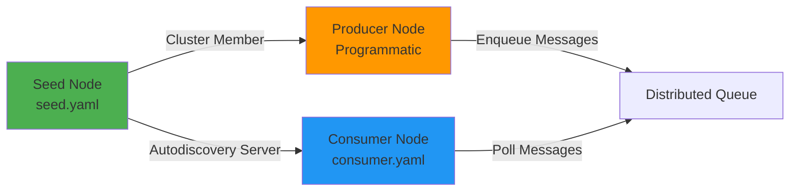

# Guia de Configuração YAML para NGrid

Este guia demonstra como configurar um cluster NGrid usando arquivos YAML, com exemplos baseados no padrão Seed + Consumer com autodiscovery.

## Arquitetura do Exemplo



---

## 1. Seed Node (Servidor)

### Arquivo: `seed.yaml`

O Seed Node atua como ponto de entrada para o cluster e servidor de autodiscovery.

```yaml
# ====================================================================
# SEED NODE CONFIGURATION
# ====================================================================

# Identidade do Nó
node:
  id: seed-node
  host: 127.0.0.1
  port: 7001
  dirs:
    base: /var/ngrid/seed-data

# Configuração de Autodiscovery (Servidor)
autodiscover:
  # Secret token compartilhado para autenticação
  secret: my-cluster-secret-2026
  # enabled não é necessário no seed (apenas em clientes)

# Política de Cluster
cluster:
  name: my-cluster
  replication:
    factor: 2          # Réplicas por item (mínimo: 2, máximo: todos os nós)
    strict: false      # false = prioriza disponibilidade; true = prioriza consistência
  
  # Seeds: Lista de nós iniciais do cluster
  # CRÍTICO: Inclua o próprio seed para que nós possam rejoin
  seeds:
    - 127.0.0.1:7001

# Política de Fila Distribuída
queue:
  name: message-queue
  retention:
    policy: TIME_BASED  # ou SIZE_BASED
    duration: 24h       # Para TIME_BASED
    # maxSize: 10GB     # Para SIZE_BASED
```

### Inicialização do Seed Node

```java
NGridNode seedNode = new NGridNode(Path.of("seed.yaml"));
seedNode.start();

// Seed aguarda outros nós se conectarem
```

---

## 2. Consumer Node (Cliente com Autodiscovery)

### Arquivo Inicial: `consumer.yaml`

Configuração **mínima** antes do bootstrap. Após o autodiscovery, este arquivo será atualizado automaticamente.

```yaml
# ====================================================================
# CONSUMER NODE CONFIGURATION (BEFORE AUTODISCOVERY)
# ====================================================================

# Identidade do Nó (sempre necessário)
node:
  id: consumer-node-1
  host: 127.0.0.1
  port: 7003
  dirs:
    base: /var/ngrid/consumer-data

# Configuração de Autodiscovery (Cliente)
autodiscover:
  enabled: true                    # Habilita autodiscovery
  secret: my-cluster-secret-2026   # Deve corresponder ao seed
  seed: 127.0.0.1:7001            # Endereço do seed node

# Cluster e Queue serão preenchidos automaticamente após autodiscovery
```

### Arquivo Atualizado: `consumer.yaml` (Após Autodiscovery)

Após o consumer se conectar ao seed pela primeira vez, o arquivo é atualizado:

```yaml
# ====================================================================
# CONSUMER NODE CONFIGURATION (AFTER AUTODISCOVERY)
# ====================================================================

# Identidade do Nó
node:
  id: consumer-node-1
  host: 127.0.0.1
  port: 7003
  dirs:
    base: /var/ngrid/consumer-data

# Autodiscovery agora DESABILITADO (bootstrapped)
autodiscover:
  enabled: false                   # ← Autodiscovery desabilitado
  secret: my-cluster-secret-2026
  seed: 127.0.0.1:7001

# Política de Cluster (copiada do seed)
cluster:
  name: my-cluster
  replication:
    factor: 2
    strict: false
  seeds:
    - 127.0.0.1:7001

# Política de Fila (copiada do seed)
queue:
  name: message-queue
  retention:
    policy: TIME_BASED
    duration: 24h
```

### Inicialização do Consumer Node

```java
// Primeira vez: autodiscovery habilitado
NGridNode consumerNode = new NGridNode(Path.of("consumer.yaml"));
consumerNode.start();

// NGrid automaticamente:
// 1. Conecta ao seed via socket raw
// 2. Valida o secret token
// 3. Recebe políticas de cluster/queue
// 4. Atualiza consumer.yaml
// 5. Reinicia conexão via transporte TCP normal
// 6. Junta-se ao cluster

// Segunda vez em diante: usa configuração armazenada
// (autodiscover.enabled = false)
```

---

## 3. Producer Node (Configuração Programática)

Produtores podem ser configurados programaticamente, sem YAML:

```java
NodeInfo seedInfo = new NodeInfo(
    NodeId.of("seed-node"),
    "127.0.0.1",
    7001
);

NodeInfo producerInfo = new NodeInfo(
    NodeId.of("producer-node"),
    "127.0.0.1",
    7002
);

NGridNode producerNode = new NGridNode(
    NGridConfig.builder(producerInfo)
        .addPeer(seedInfo)                          // Conecta ao seed
        .queueDirectory(Path.of("/var/ngrid/producer-data"))
        .queueName("message-queue")
        .replicationQuorum(1)                        // Quorum = factor/2 + 1
        .transportWorkerThreads(4)
        .strictConsistency(false)
        .build()
);

producerNode.start();

// Produzir mensagens
DistributedQueue<String> queue = producerNode.getQueue("message-queue", String.class);
queue.offer("Hello, World!");
```

---

## 4. Exemplo Completo: Seed + Producer + Consumer

### Cenário

1. **Seed Node** (porta 7001) - Configurado via YAML
2. **Producer Node** (porta 7002) - Configurado programaticamente
3. **Consumer Node** (porta 7003) - Configurado via YAML + Autodiscovery

### Passo a Passo

#### 1. Iniciar Seed Node

```bash
# seed.yaml já configurado
java -jar ngrid-app.jar --config seed.yaml
```

#### 2. Iniciar Producer Node

```java
// Código do producer
NGridNode producer = new NGridNode(producerConfig);
producer.start();

// Enfileirar mensagens
DistributedQueue<Order> queue = producer.getQueue("message-queue", Order.class);
queue.offer(new Order("order-123", 99.99));
queue.offer(new Order("order-124", 149.99));
```

#### 3. Iniciar Consumer Node (Primeira Vez)

```yaml
# consumer.yaml (mínimo)
node:
  id: consumer-1
  host: 127.0.0.1
  port: 7003
  dirs:
    base: /var/ngrid/consumer-1

autodiscover:
  enabled: true
  secret: my-cluster-secret-2026
  seed: 127.0.0.1:7001
```

```java
// Consumer faz autodiscovery automaticamente
NGridNode consumer = new NGridNode(Path.of("consumer.yaml"));
consumer.start();

// Consumir mensagens (após autodiscovery)
DistributedQueue<Order> queue = consumer.getQueue("message-queue", Order.class);
Optional<Order> order = queue.poll();
order.ifPresent(o -> System.out.println("Processando: " + o));
```

Após a primeira inicialização, `consumer.yaml` será atualizado com as políticas completas.

#### 4. Reiniciar Consumer Node

```java
// Segunda vez: usa configuração armazenada
NGridNode consumer = new NGridNode(Path.of("consumer.yaml"));
consumer.start();

// Autodiscovery já foi feito, conecta diretamente ao cluster
```

---

## 5. Variáveis de Ambiente

O NGrid suporta interpolação de variáveis de ambiente:

```yaml
node:
  id: ${NODE_ID:default-node}
  host: ${NODE_HOST:127.0.0.1}
  port: ${NODE_PORT:7001}
  dirs:
    base: ${DATA_DIR:/var/ngrid/data}

autodiscover:
  secret: ${CLUSTER_SECRET}
  seed: ${SEED_ADDRESS:127.0.0.1:7001}

cluster:
  name: ${CLUSTER_NAME:my-cluster}
  replication:
    factor: ${REPLICATION_FACTOR:2}
```

Uso:

```bash
export NODE_ID=consumer-1
export NODE_HOST=192.168.1.10
export NODE_PORT=7003
export CLUSTER_SECRET=super-secret-token
export SEED_ADDRESS=192.168.1.5:7001

java -jar ngrid-app.jar --config consumer.yaml
```

---

## 7. Múltiplas Filas (Novo em 2.1.0)

A partir da versão 2.1.0, o NGrid suporta múltiplas filas distribuídas independentes em um único cluster.

### Formato YAML com Múltiplas Filas

```yaml
node:
  id: worker-node
  host: 127.0.0.1
  port: 7001
  dirs:
    base: /var/ngrid/data

cluster:
  name: my-cluster
  replication:
    factor: 2
    strict: false
  seeds:
    - 127.0.0.1:7001

# Múltiplas filas (array)
queues:
  - name: orders
    retention:
      policy: TIME_BASED
      duration: 24h
  
  - name: events
    retention:
      policy: TIME_BASED
      duration: 1h
  
  - name: logs
    retention:
      policy: TIME_BASED
      duration: 7d
```

### Uso Programático com Type-Safe API

```java
// Definir tipos de fila como constantes (recomendado)
public final class AppQueues {
    public static final TypedQueue<Order> ORDERS = 
        TypedQueue.of("orders", Order.class);
    
    public static final TypedQueue<Event> EVENTS = 
        TypedQueue.of("events", Event.class);
    
    public static final TypedQueue<LogEntry> LOGS = 
        TypedQueue.of("logs", LogEntry.class);
}

// Usar as filas com type-safety em compile-time
NGridNode node = new NGridNode(Path.of("config.yaml"));
node.start();

DistributedQueue<Order> orders = node.getQueue(AppQueues.ORDERS);
DistributedQueue<Event> events = node.getQueue(AppQueues.EVENTS);
DistributedQueue<LogEntry> logs = node.getQueue(AppQueues.LOGS);

// Enfileirar mensagens (type-safe)
orders.offer(new Order("order-123", 99.99));
events.offer(new Event("user.login", System.currentTimeMillis()));
logs.offer(new LogEntry("INFO", "System started"));

// Consumir mensagens
Optional<Order> order = orders.poll();
Optional<Event> event = events.poll();
Optional<LogEntry> log = logs.poll();
```

### Configuração Programática com Múltiplas Filas

```java
NodeInfo localNode = new NodeInfo(
    NodeId.of("worker-1"),
    "127.0.0.1",
    7001
);

NGridConfig config = NGridConfig.builder(localNode)
    .dataDirectory(Path.of("/var/ngrid/data"))
    
    .addQueue(QueueConfig.builder("orders")
        .retention(RetentionPolicy.timeBased(Duration.ofHours(24)))
        .compressionEnabled(false)
        .build())
    
    .addQueue(QueueConfig.builder("events")
        .retention(RetentionPolicy.timeBased(Duration.ofHours(1)))
        .build())
    
    .addQueue(QueueConfig.builder("logs")
        .retention(RetentionPolicy.timeBased(Duration.ofDays(7)))
        .compressionEnabled(true)
        .build())
    
    .replicationFactor(2)
    .build();

NGridNode node = new NGridNode(config);
node.start();
```

### Compatibilidade com Formato Legado

O formato legado com fila única continua funcionando:

```yaml
# Formato legado (ainda suportado)
queue:
  name: message-queue
  retention:
    policy: TIME_BASED
    duration: 24h
```

**Migração:** Código e YAML legados continuam funcionando sem modificações. A nova API é opcional e recomendada para novos projetos.

---

## 8. Topologias Recomendadas

### Desenvolvimento Local (3 nós)

```
Seed  (7001) ──┐
Producer (7002)├─ Cluster
Consumer (7003)─┘

Replication Factor: 2
```

### Produção Pequena (5 nós)

```
Seed-1 (7001) ──┐
Seed-2 (7002) ──┼─ Seeds
Seed-3 (7003) ──┘
                │
Worker-1 (7004)─┼─ Workers (autodiscovery)
Worker-2 (7005)─┘

Replication Factor: 3
```

### Produção Grande (N nós)

```
Seed-1..3 (fixed IPs) ─── Seeds Layer
                          │
Worker-1..N ───────────── Workers Layer (autodiscovery)

Replication Factor: min(5, N/2)
```

---

## 9. Troubleshooting

### Consumer não consegue fazer autodiscovery

**Sintoma:** `Failed to connect to seed`

**Verificar:**
1. Seed está rodando? (`telnet <seed-host> <seed-port>`)
2. Secret token corresponde?
3. Firewall bloqueando conexão?

### Mensagens não são replicadas

**Sintoma:** Mensagens visíveis apenas no líder

**Verificar:**
1. `replication.factor` > 1?
2. Cluster tem nós suficientes? (mínimo: `factor` nós)
3. Quorum atingido? (mínimo: `factor/2 + 1` nós)

### Autodiscovery atualiza YAML toda vez

**Sintoma:** `consumer.yaml` reescrito a cada start

**Causa:** `autodiscover.enabled` ainda está `true`

**Solução:** Após primeira inicialização, deve estar `false`

---

## Referências

- [Arquitetura do NGrid](file:///home/lucas/Projects/nishisan/nishi-utils/doc/ngrid/arquitetura.md)
- [Guia de Configuração](file:///home/lucas/Projects/nishisan/nishi-utils/doc/ngrid/configuracao.md)
- [Integração NQueue](file:///home/lucas/Projects/nishisan/nishi-utils/doc/ngrid/nqueue-integration.md)
- [Teste de Exemplo](file:///home/lucas/Projects/nishisan/nishi-utils/src/test/java/dev/nishisan/utils/ngrid/NGridSeedWithQueueIntegrationTest.java)
