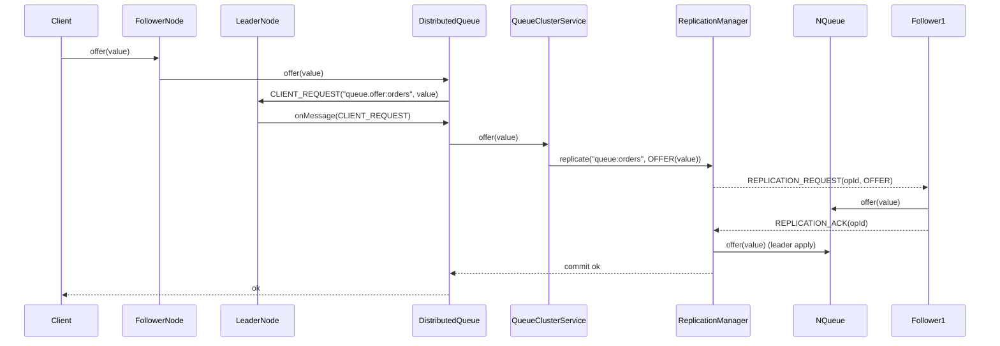
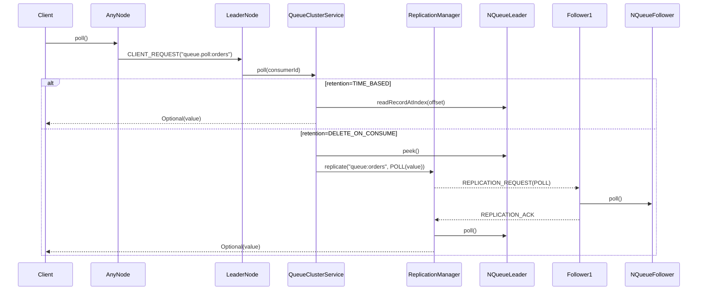
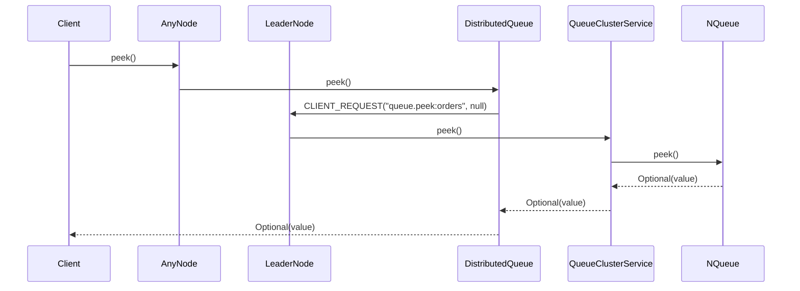
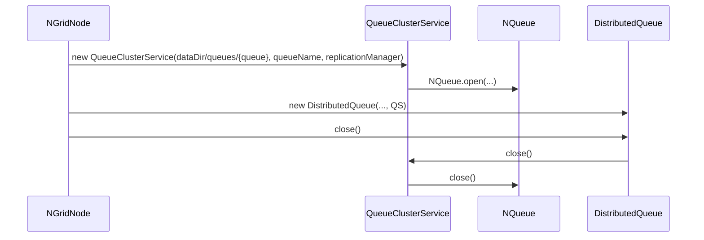

# NGrid - Integracao com NQueue

## Contexto

Ja existe uma implementacao de fila local persistente em filesystem chamada:

- `NQueue<T extends Serializable>` (implementa `Closeable`).

Essa classe:

- Ja cuida da **persistencia local** da fila em disco.
- Ja oferece a semantica de fila local necessaria.
- **Nao deve ser reimplementada**, apenas reutilizada.

---

## Objetivo da integracao

Na parte de **fila distribuida** do NGrid:

- Cada no do cluster deve ter uma instancia local de `NQueue`.
- A fila distribuida deve usar essa `NQueue` como backend para armazenamento local das mensagens.

Em outras palavras:

- A logica distribuida (cluster, lider, quorum, replicacao) fica por conta do NGrid.
- A logica de armazenamento local em disco ja esta resolvida pela `NQueue`.

---

## Regras de uso da NQueue

1. **Nao alterar a API publica existente de `NQueue`.**
2. **Nao duplicar a logica de persistencia de fila que ja existe.**
3. Utilizar `NQueue` apenas como:
   - Fila de armazenamento local (por no),
   - Onde os itens ja foram aprovados pela logica de lider/quorum.

---

## Papel da NQueue em cada no

Para cada no do cluster:

- Havera uma instancia de `NQueue<T>` responsavel por:
  - Guardar localmente os itens da fila distribuida que pertencem a aquele no.
  - Garantir que, apos uma replicacao bem-sucedida, o item esteja salvo em disco.

A logica de **ordenacao** e **decisao de entrega** vem do lider (via `ReplicationManager`), nao da NQueue.

---

## Fluxo de operacoes com integracao

Cada fila possui um **topico proprio** (`queue:{nome}`) e comandos com o nome da fila (ex.: `queue.offer:orders`). Isso permite multi-queue sem conflitos.

### `offer(item)`

Implementacao atual (resumo):

1. Cliente chama `offer` em qualquer no (`DistributedQueue.offer`).
2. Se o no for follower, ele envia `CLIENT_REQUEST(queue.offer:{queue})` ao lider e aguarda `CLIENT_RESPONSE`.
3. No lider, `QueueClusterService.offer` dispara `ReplicationManager.replicate("queue:{queue}", OFFER(value))`.
4. O `ReplicationManager` envia `REPLICATION_REQUEST` aos followers.
5. Followers aplicam e respondem `REPLICATION_ACK`.
6. Quando `acks >= quorum`, o lider aplica localmente e confirma ao cliente.

### `poll()`

No NGrid moderno, o padrao e **TIME_BASED**; **DELETE_ON_CONSUME** fica restrito ao legado.

- **TIME_BASED**: poll por offset (log mode) associado ao `NodeId` do consumidor.
- **DELETE_ON_CONSUME (legado)**: poll destrutivo replicado para todos os nos.

> Nota: offsets sao persistidos por `NodeId`. Em log mode, consumidores devem manter IDs estaveis para continuidade apos restart.

### `peek()`

1. Cliente chama `peek()` em qualquer no.
2. A fachada roteia ao lider.
3. O lider faz `NQueue.peek()` e devolve `Optional<T>`.

---

## Resiliencia: reenvio e catch-up

- **Reenvio de sequencias**: quando um follower detecta um gap, solicita ao lider as sequencias faltantes.
- **Catch-up por snapshot**: se o atraso for grande, o follower pede snapshot em chunks e reconstrui a fila local.

Isso evita travas logicas em multi-queue e acelera recuperacao apos downtime.

---

## Persistencia e recuperacao

- Em caso de reinicio de um no:
  - A `NQueue` local e reaberta.
  - Os itens previamente persistidos em disco sao carregados.
- O `ReplicationManager` restaura o estado de sequencia a partir do arquivo `sequence-state.dat`.

### Ciclo de vida da `NQueue` dentro do `NGridNode`

- `NGridNode.start()` cria `QueueClusterService` para cada fila, abrindo `NQueue` (`NQueue.open(baseDir, queueName)`).
- `DistributedQueue.close()` fecha o `QueueClusterService`, que fecha a `NQueue`.

Detalhes como:

- Como diferenciar itens apenas enfileirados de itens ja consumidos,
- Como lidar com mensagens “in-flight” no momento da parada,

nao fazem parte do modelo atual (o `poll()` ja avanca definitivamente a fila via replicacao). Caso voce precise de semantica “ack”/reentrega, isso deve ser implementado **acima** do NGrid (por exemplo, com um protocolo de confirmacao e uma estrutura separada de “em processamento”).
