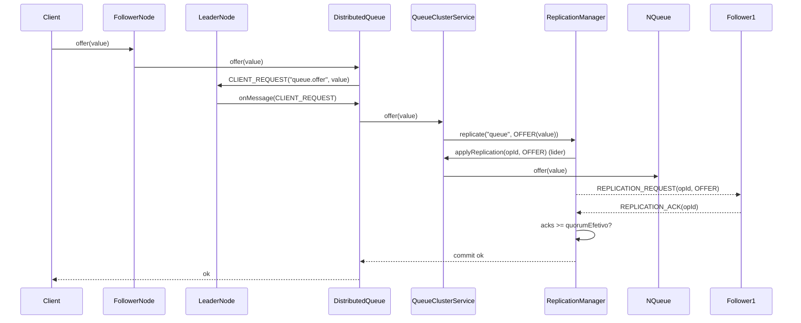
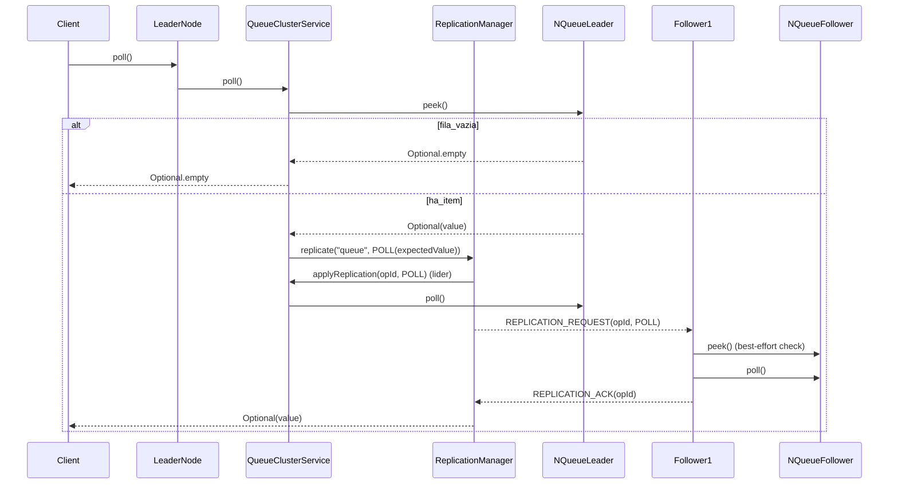
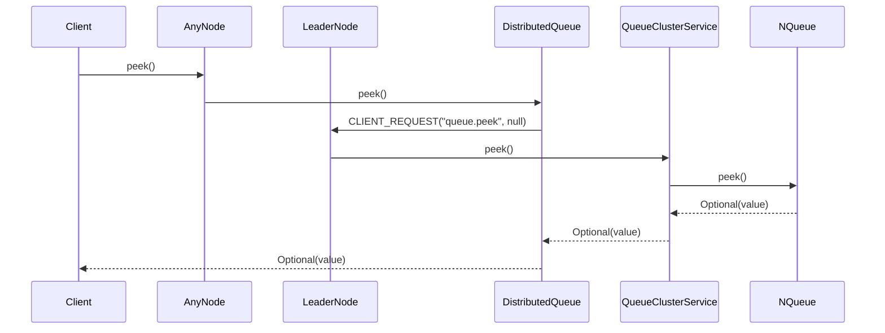
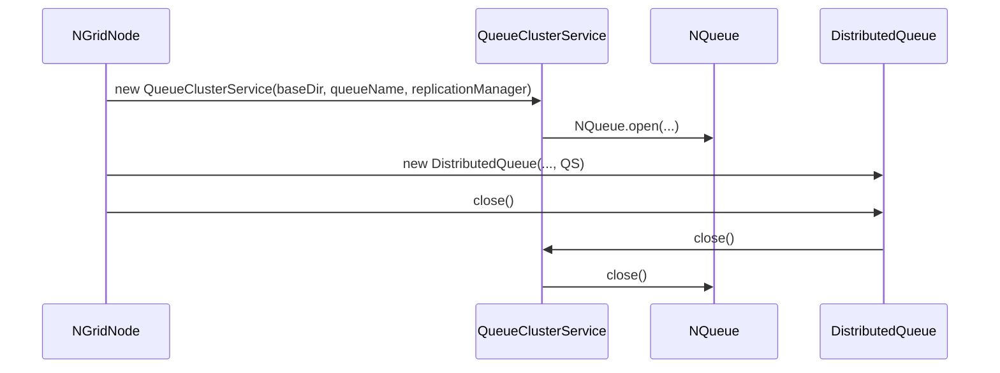

# NGrid – Integração com NQueue

## Contexto

Já existe uma implementação de fila local persistente em filesystem chamada:

- `NQueue<T extends Serializable>` (implementa `Closeable`).

Essa classe:

- Já cuida da **persistência local** da fila em disco.
- Já oferece a semântica de fila local necessária.
- **Não deve ser reimplementada**, apenas reutilizada.

---

## Objetivo da Integração

Na parte de **fila distribuída** da NGrid:

- Cada nó do cluster deve ter uma instância local de `NQueue`.
- A fila distribuída deve usar essa `NQueue` como backend para armazenamento local das mensagens.

Em outras palavras:

- A lógica distribuída (cluster, líder, quorum, replicação) fica por conta da NGrid.
- A lógica de armazenamento local em disco já está resolvida pela `NQueue`.

---

## Regras de Uso da NQueue

1. **Não alterar a API pública existente de `NQueue`.**
2. **Não duplicar a lógica de persistência de fila que já existe.**
3. Utilizar `NQueue` apenas como:
    - Fila de armazenamento local (por nó),
    - Onde os itens já foram aprovados pela lógica de líder/quorum.

---

## Papel da NQueue em Cada Nó

Para cada nó do cluster:

- Haverá uma instância de `NQueue<T>` responsável por:
    - Guardar localmente os itens da fila distribuída que pertencem a aquele nó.
    - Garantir que, após uma replicação bem-sucedida, o item esteja salvo em disco.

A lógica de **ordenação global** e **decisão de entrega** deve vir do líder, não da NQueue.

---

## Fluxo de Operações com Integração

### `offer(item)`

Implementação atual (resumo):

1. Cliente chama `offer` em qualquer nó (`DistributedQueue.offer`).
2. Se o nó for follower, ele envia `CLIENT_REQUEST(queue.offer)` ao líder e aguarda `CLIENT_RESPONSE`.
3. No líder, `QueueClusterService.offer` dispara `ReplicationManager.replicate("queue", OFFER(value))`.
4. O `ReplicationManager` aplica a operação localmente primeiro (no handler do tópico `queue`), e só depois envia `REPLICATION_REQUEST` aos followers.
5. A operação só é considerada bem-sucedida quando `acks >= quorumEfetivo`.

### `poll()`

Implementação atual (resumo):

1. O líder faz `peek()` na sua `NQueue` local.
2. Se estiver vazia, retorna `Optional.empty()`.
3. Se houver item, o líder replica um comando `POLL(expectedValue)` para todos os nós.
4. Ao aplicar `POLL` em cada nó:
   - o nó valida (best-effort) se `peek()` local bate com o `expectedValue` (se não bater, loga warning),
   - e então executa `NQueue.poll()` localmente.

Isso garante que todos os nós avancem o “ponteiro de consumo” na mesma ordem.

### `peek()`

1. Cliente chama `peek()` em qualquer nó.
2. A fachada roteia ao líder.
3. O líder faz `NQueue.peek()` e devolve `Optional<T>`.

---

## Persistência e Recuperação

- Em caso de reinício de um nó:
    - A `NQueue` local deve ser reaberta.
    - Os itens previamente persistidos em disco devem ser carregados.
- No NGrid atual, a consistência da fila é mantida porque **toda alteração** (OFFER/POLL) é feita via replicação por quorum.

### Ciclo de vida da `NQueue` dentro do `NGridNode`

- `NGridNode.start()` cria `QueueClusterService`, que abre `NQueue` (`NQueue.open(baseDir, queueName)`).
- `DistributedQueue.close()` fecha o `QueueClusterService`, que fecha a `NQueue`.

Detalhes como:

- Como diferenciar itens apenas enfileirados de itens já consumidos,
- Como lidar com mensagens “in-flight” no momento da parada,

não fazem parte do modelo atual (o `poll()` já avança definitivamente a fila via replicação). Caso você precise de semântica “ack”/reentrega, isso deve ser implementado **acima** do NGrid (por exemplo, com um protocolo de confirmação e uma estrutura separada de “em processamento”).

---

## Resumo da Integração

- `NQueue` é o **backend local de fila em disco** em cada nó.
- A NGrid adiciona:
    - Cluster,
    - Líder,
    - Quorum,
    - Replicação,
    - Deduplicação por ID,
    - APIs de fila distribuída.
- A lógica distribuída **envolve/coordena** o uso da `NQueue`, mas não substitui a implementação local existente.
