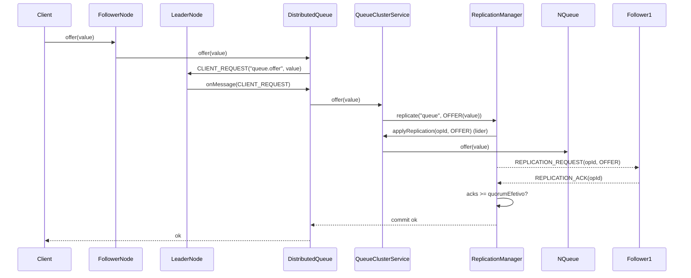
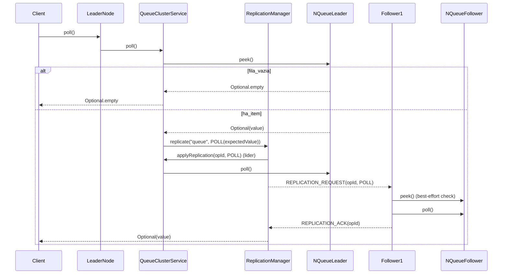
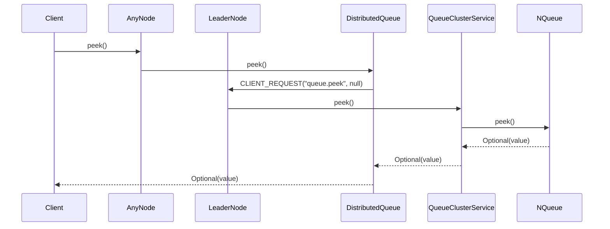
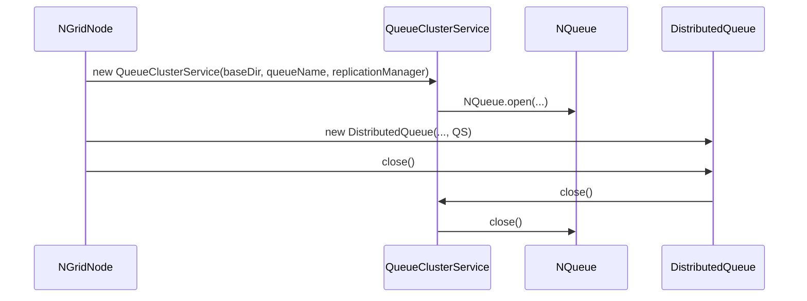

# NGrid - Integracao com NQueue

## Contexto

Ja existe uma implementacao de fila local persistente em filesystem chamada:

- `NQueue<T extends Serializable>` (implementa `Closeable`).

Essa classe:

- Ja cuida da **persistencia local** da fila em disco.
- Ja oferece a semantica de fila local necessaria.
- **Nao deve ser reimplementada**, apenas reutilizada.

---

## Objetivo da integracao

Na parte de **fila distribuida** da NGrid:

- Cada no do cluster deve ter uma instancia local de `NQueue`.
- A fila distribuida deve usar essa `NQueue` como backend para armazenamento local das mensagens.

Em outras palavras:

- A logica distribuida (cluster, lider, quorum, replicacao) fica por conta da NGrid.
- A logica de armazenamento local em disco ja esta resolvida pela `NQueue`.

---

## Regras de uso da NQueue

1. **Nao alterar a API publica existente de `NQueue`.**
2. **Nao duplicar a logica de persistencia de fila que ja existe.**
3. Utilizar `NQueue` apenas como:
   - Fila de armazenamento local (por no),
   - Onde os itens ja foram aprovados pela logica de lider/quorum.

---

## Papel da NQueue em cada no

Para cada no do cluster:

- Havera uma instancia de `NQueue<T>` responsavel por:
  - Guardar localmente os itens da fila distribuida que pertencem a aquele no.
  - Garantir que, apos uma replicacao bem-sucedida, o item esteja salvo em disco.

A logica de **ordenacao global** e **decisao de entrega** deve vir do lider, nao da NQueue.

---

## Fluxo de operacoes com integracao

### `offer(item)`

Implementacao atual (resumo):

1. Cliente chama `offer` em qualquer no (`DistributedQueue.offer`).
2. Se o no for follower, ele envia `CLIENT_REQUEST(queue.offer)` ao lider e aguarda `CLIENT_RESPONSE`.
3. No lider, `QueueClusterService.offer` dispara `ReplicationManager.replicate("queue", OFFER(value))`.
4. O `ReplicationManager` aplica a operacao localmente primeiro (no handler do topico `queue`), e so depois envia `REPLICATION_REQUEST` aos followers.
5. A operacao so e considerada bem-sucedida quando `acks >= quorumEfetivo`.



### `poll()`

Implementacao atual (resumo):

1. O lider faz `peek()` na sua `NQueue` local.
2. Se estiver vazia, retorna `Optional.empty()`.
3. Se houver item, o lider replica um comando `POLL(expectedValue)` para todos os nos.
4. Ao aplicar `POLL` em cada no:
   - o no valida (best-effort) se `peek()` local bate com o `expectedValue` (se nao bater, loga warning),
   - e entao executa `NQueue.poll()` localmente.

Isso garante que todos os nos avancem o “ponteiro de consumo” na mesma ordem.



### `peek()`

1. Cliente chama `peek()` em qualquer no.
2. A fachada roteia ao lider.
3. O lider faz `NQueue.peek()` e devolve `Optional<T>`.



---

## Persistencia e recuperacao

- Em caso de reinicio de um no:
  - A `NQueue` local deve ser reaberta.
  - Os itens previamente persistidos em disco devem ser carregados.
- No NGrid atual, a consistencia da fila e mantida porque **toda alteracao** (OFFER/POLL) e feita via replicacao por quorum.

### Ciclo de vida da `NQueue` dentro do `NGridNode`

- `NGridNode.start()` cria `QueueClusterService`, que abre `NQueue` (`NQueue.open(baseDir, queueName)`).
- `DistributedQueue.close()` fecha o `QueueClusterService`, que fecha a `NQueue`.



Detalhes como:

- Como diferenciar itens apenas enfileirados de itens ja consumidos,
- Como lidar com mensagens “in-flight” no momento da parada,

nao fazem parte do modelo atual (o `poll()` ja avanca definitivamente a fila via replicacao). Caso voce precise de semantica “ack”/reentrega, isso deve ser implementado **acima** do NGrid (por exemplo, com um protocolo de confirmacao e uma estrutura separada de “em processamento”).

---

## Exemplos de integracao

### Exemplo 1: Inicializar um no com fila distribuida

```java
import dev.nishisan.utils.ngrid.structures.NGridConfig;
import dev.nishisan.utils.ngrid.structures.NGridNode;
import dev.nishisan.utils.ngrid.structures.DistributedQueue;
import java.nio.file.Path;

public class NGridQueueNode {
    public static void main(String[] args) throws Exception {
        NGridConfig config = NGridConfig.defaults()
            .withBaseDir(Path.of("/tmp/ngrid"))
            .withNodeId("node-1")
            .withClusterAddress("127.0.0.1")
            .withClusterPort(9001);

        try (NGridNode node = new NGridNode(config)) {
            node.start();
            DistributedQueue<String> queue = node.getDistributedQueue("orders");
            queue.offer("order-1");
            System.out.println(queue.poll().orElse("vazio"));
        }
    }
}
```

### Exemplo 2: Cliente com fallback para o lider

```java
import dev.nishisan.utils.ngrid.structures.DistributedQueue;
import java.util.Optional;

public class QueueClient {
    private final DistributedQueue<String> queue;

    public QueueClient(DistributedQueue<String> queue) {
        this.queue = queue;
    }

    public void send(String payload) throws Exception {
        queue.offer(payload);
    }

    public Optional<String> receive() throws Exception {
        return queue.poll();
    }
}
```

### Exemplo 3: Politica de durabilidade na fila local

Este exemplo demonstra como configurar a `NQueue` local de cada no para durabilidade estrita (sem short-circuit):

```java
import dev.nishisan.utils.queue.NQueue;
import dev.nishisan.utils.ngrid.queue.QueueClusterService;
import java.nio.file.Path;

public class QueueServiceFactory {
    public static QueueClusterService build(Path baseDir, String queueName) throws Exception {
        NQueue.Options options = NQueue.Options.defaults()
            .withShortCircuit(false)
            .withFsync(true);

        // Exemplo conceitual: depende do construtor real do QueueClusterService
        return new QueueClusterService(baseDir, queueName, options);
    }
}
```

### Exemplo 4: Validacao best-effort no follower

```java
// fluxo simplificado dentro do follower
Optional<String> expected = incoming.getExpectedValue();
Optional<String> head = localQueue.peek();
if (head.isPresent() && expected.isPresent() && !head.get().equals(expected.get())) {
    logger.warn("out-of-sync: head=" + head.get() + " expected=" + expected.get());
}
localQueue.poll();
```

---

## Resumo da integracao

- `NQueue` e o **backend local de fila em disco** em cada no.
- A NGrid adiciona:
  - Cluster,
  - Lider,
  - Quorum,
  - Replicacao,
  - Deduplicacao por ID,
  - APIs de fila distribuida.
- A logica distribuida **envolve/coordena** o uso da `NQueue`, mas nao substitui a implementacao local existente.

