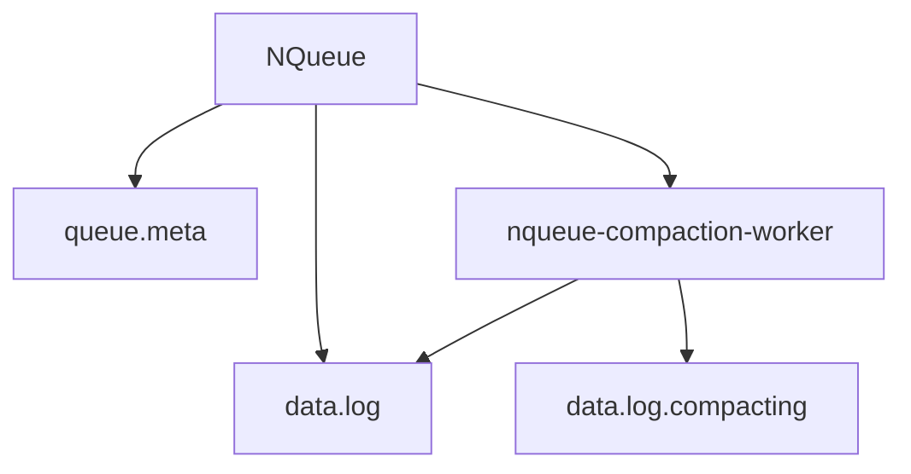
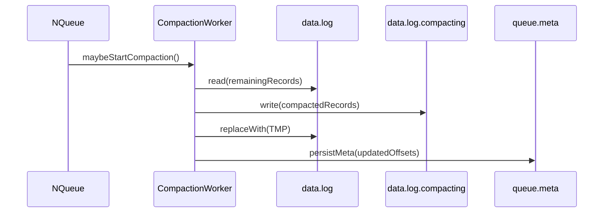

# NQueue: Fila Persistente em Java

`NQueue` e uma biblioteca Java que implementa uma fila FIFO (First-In, First-Out) persistente, baseada em arquivos. Ela foi projetada para ser simples, eficiente e segura para uso em ambientes com multiplos produtores e consumidores concorrentes.

Os objetos sao serializados e armazenados em disco, garantindo que os dados nao sejam perdidos mesmo que a aplicacao seja reiniciada (dentro das garantias de durabilidade configuradas).

## Principais funcionalidades

- **Fila FIFO persistente:** armazena objetos `Serializable` em disco, mantendo a ordem de insercao.
- **Segura para concorrencia:** multiplas threads podem adicionar e remover itens com seguranca.
- **Recuperacao automatica:** ao abrir, reconstrui o estado a partir dos arquivos de dados/metadata.
- **Compactacao de arquivo:** remove espaco nao utilizado automaticamente.
- **Operacoes bloqueantes:** `poll()` bloqueante e `poll(timeout)` com timeout.
- **Buffer de memoria opcional:** absorve rajadas e mantem throughput durante compacao.
- **Short-circuit opcional:** entrega direta para consumidor aguardando quando a fila esta vazia.

## Dependencia (Maven)

```xml
<dependency>
    <groupId>dev.nishisan</groupId>
    <artifactId>nishi-utils</artifactId>
    <version>1.0.14</version>
</dependency>
```

## Como usar (basico)

```java
import dev.nishisan.utils.queue.NQueue;
import java.nio.file.Path;
import java.util.Optional;

Path baseDir = Path.of("/tmp/queues");
String queueName = "minha-fila";

try (NQueue<String> queue = NQueue.open(baseDir, queueName)) {
    queue.offer("primeira");
    queue.offer("segunda");

    Optional<String> item = queue.poll();
    item.ifPresent(System.out::println);
}
```

**Importante:** use `try-with-resources` ou chame `close()` para garantir a liberacao de recursos.

## Arquitetura (alto nivel)

A `NQueue` cria um diretorio por fila e usa dois arquivos principais:

- `data.log`: log append-only com os registros.
- `queue.meta`: metadados com offsets e contadores.



## API publica (resumo)

- `NQueue.open(baseDir, name)`
- `NQueue.open(baseDir, name, options)`
- `long offer(T item)`
- `Optional<T> poll()`
- `Optional<T> poll(long timeout, TimeUnit unit)`
- `Optional<T> peek()`
- `Optional<NQueueRecord> peekRecord()`
- `Optional<T> readAt(long offset)`
- `Optional<NQueueReadResult> readRecordAt(long offset)`
- `long size()`
- `long size(boolean optimistic)`
- `long getRecordCount()`
- `boolean isEmpty()`
- `StatsUtils getStats()`
- `void close()`

## Offsets e retorno do offer

- Quando o item e persistido diretamente, `offer` retorna o **offset** (posicao) do registro no `data.log`.
- Quando a fila usa **buffer de memoria**, `offer` pode retornar **-1** (item ainda nao persistido).
- Quando o **short-circuit** esta ativo e ha consumidor aguardando, `offer` pode retornar `NQueue.OFFSET_HANDOFF` (valor `-2`).

**Regra pratica:** offsets >= 0 sao validos para `readAt/readRecordAt`. Valores negativos indicam entrega/estagio fora do `data.log`.

## Semantica de entrega

- **At-most-once:** ao retornar um item em `poll`, a fila avanca o cursor e persiste essa posicao. O item nao sera entregue novamente apos restart.
- **Peek nao consome:** `peek()` e `peekRecord()` apenas inspecionam o proximo item.
- **Confianca na serializacao:** objetos devem ser `Serializable` e compataveis entre execucoes.

## Short-circuit (handoff direto)

Quando ativado (padrao), se a fila estiver vazia e houver consumidor aguardando em `poll`, um `offer` pode entregar diretamente para o consumidor sem gravar em disco. Isso reduz latencia, mas evita persistencia daquele item.

Para forcar persistencia antes da entrega:

```java
NQueue.Options options = NQueue.Options.defaults()
    .withShortCircuit(false);
```

## Buffer de memoria

Quando `withMemoryBuffer(true)`:

- Itens podem ser enfileirados em memoria e drenados para o `data.log` em lotes.
- Ajuda durante compaction ou alta contencao.
- O tamanho e controlado por `withMemoryBufferSize(int)`.
- Quando o buffer esta cheio, produtores podem bloquear ate haver espaco.

## Compactacao

- Remove espaco de registros ja consumidos.
- Pode ser disparada por:
  - **waste threshold** (`withCompactionWasteThreshold`) ou
  - **intervalo de tempo** (`withCompactionInterval`).
- Usa arquivo temporario `data.log.compacting` e faz troca atomica.



## Opcoes avancadas (Options)

```java
NQueue.Options options = NQueue.Options.defaults()
    .withFsync(true) // durabilidade mais forte
    .withShortCircuit(false) // sem handoff direto
    .withMemoryBuffer(true)
    .withMemoryBufferSize(5000)
    .withCompactionWasteThreshold(0.3)
    .withCompactionInterval(Duration.ofMinutes(10))
    .withCompactionBufferSize(256 * 1024)
    .withLockTryTimeout(Duration.ofMillis(10))
    .withRevalidationInterval(Duration.ofMillis(100))
    .withMaintenanceInterval(Duration.ofSeconds(5))
    .withMaxSizeReconciliationInterval(Duration.ofMinutes(1))
    .withResetOnRestart(false);
```

### O que cada opcao controla

- `withFsync(boolean)`: solicita flush sincrono em operacoes criticas.
- `withShortCircuit(boolean)`: permite ou nao handoff direto para consumidores.
- `withMemoryBuffer(boolean)`: habilita buffer de memoria.
- `withMemoryBufferSize(int)`: capacidade do buffer em numero de itens.
- `withCompactionWasteThreshold(double)`: percentual de dados consumidos para disparar compactacao.
- `withCompactionInterval(Duration)`: intervalo minimo entre compactacoes.
- `withCompactionBufferSize(int)`: buffer usado na compactacao.
- `withLockTryTimeout(Duration)`: timeout ao tentar adquirir lock interno.
- `withRevalidationInterval(Duration)`: intervalo de revalidacao do modo memoria.
- `withMaintenanceInterval(Duration)`: intervalo de tarefas de manutencao.
- `withMaxSizeReconciliationInterval(Duration)`: intervalo maximo sem reconciliar tamanho.
- `withResetOnRestart(boolean)`: ignora `queue.meta` e reconstrui do `data.log`.

## Inspecao de registros (diagnostico)

Use `peekRecord` e `readRecordAt` para inspecionar metadados sem consumir.

```java
try (NQueue<String> queue = NQueue.open(baseDir, "audit")) {
    queue.offer("a");
    queue.offer("b");

    NQueueRecord head = queue.peekRecord().orElseThrow();
    System.out.println(head.meta().getIndex());
    System.out.println(head.meta().getClassName());

    long offset = queue.offer("c");
    if (offset >= 0) {
        NQueueReadResult read = queue.readRecordAt(offset).orElseThrow();
        System.out.println(read.getRecord().meta().getIndex());
        System.out.println("nextOffset=" + read.getNextOffset());
    }
}
```

## Metricas e validacao de ordem

A fila expõe contadores via `StatsUtils`:

- `NQueueMetrics.OFFERED_EVENT`
- `NQueueMetrics.PEEK_EVENT`
- `NQueueMetrics.POLL_EVENT`
- `nqueue.out_of_order`: contador interno para detectar violacoes de FIFO.

```java
try (NQueue<String> queue = NQueue.open(baseDir, "metrics")) {
    queue.offer("x");
    queue.poll();

    Long offered = queue.getStats().getCounterValueOrNull(NQueueMetrics.OFFERED_EVENT);
    Long outOfOrder = queue.getStats().getCounterValueOrNull("nqueue.out_of_order");
    System.out.println("offered=" + offered + ", outOfOrder=" + outOfOrder);
}
```

## Formato do registro (data.log)

Cada registro possui um cabecalho seguido do payload serializado:

```
[ MAGIC(4) ][ VER(1) ][ HEADER_LEN(4) ]
[ INDEX(8) ][ PAYLOAD_LEN(4) ][ CLASSNAME_LEN(2) ][ CLASSNAME(N) ]
[ PAYLOAD(PAYLOAD_LEN) ]
```

- `INDEX` e um indice sequencial interno.
- `CLASSNAME` e o nome canonico da classe serializada.

## Exemplo completo: produtor/consumidor

```java
import dev.nishisan.utils.queue.NQueue;
import java.nio.file.Path;
import java.util.concurrent.ExecutorService;
import java.util.concurrent.Executors;
import java.util.concurrent.TimeUnit;

public class NQueueDemo {
    public static void main(String[] args) throws Exception {
        Path baseDir = Path.of("/tmp/queues");

        try (NQueue<String> queue = NQueue.open(baseDir, "prod-cons")) {
            ExecutorService exec = Executors.newFixedThreadPool(2);

            exec.submit(() -> {
                try {
                    for (int i = 0; i < 10; i++) {
                        queue.offer("msg-" + i);
                        Thread.sleep(25);
                    }
                } catch (Exception e) {
                    throw new RuntimeException(e);
                }
            });

            exec.submit(() -> {
                try {
                    for (int i = 0; i < 10; i++) {
                        queue.poll(5, TimeUnit.SECONDS)
                                .ifPresent(m -> System.out.println("consumiu=" + m));
                    }
                } catch (Exception e) {
                    throw new RuntimeException(e);
                }
            });

            exec.shutdown();
            exec.awaitTermination(30, TimeUnit.SECONDS);
        }
    }
}
```

## Exemplo: modo duravel estrito

```java
NQueue.Options options = NQueue.Options.defaults()
    .withShortCircuit(false)
    .withFsync(true);

try (NQueue<String> queue = NQueue.open(baseDir, "duravel", options)) {
    queue.offer("persistente");
    System.out.println(queue.poll().orElseThrow());
}
```

## Exemplo: buffer de memoria e compactacao agressiva

```java
NQueue.Options options = NQueue.Options.defaults()
    .withMemoryBuffer(true)
    .withMemoryBufferSize(2000)
    .withCompactionWasteThreshold(0.2)
    .withCompactionInterval(Duration.ofSeconds(5))
    .withFsync(false);

try (NQueue<Integer> queue = NQueue.open(baseDir, "burst", options)) {
    for (int i = 0; i < 1000; i++) {
        queue.offer(i);
    }
    while (!queue.isEmpty()) {
        queue.poll();
    }
}
```

## Integracao com NGrid

Veja `doc/ngrid/nqueue-integration.md` para detalhes de uso da `NQueue` como backend de fila distribuida.

