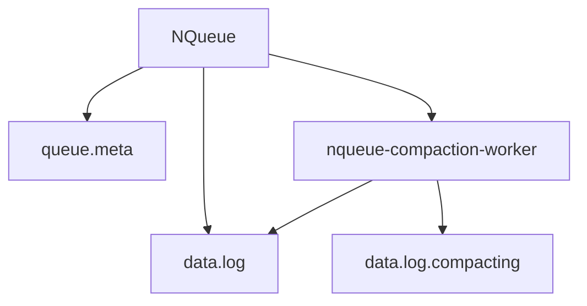
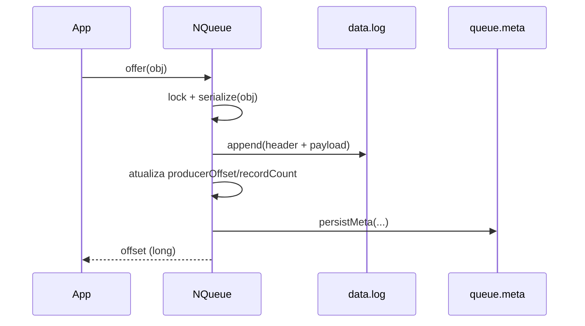
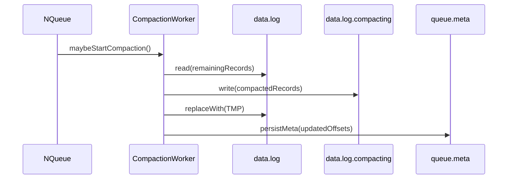

# NQueue: Fila Persistente em Java

`NQueue` é uma biblioteca Java que implementa uma fila FIFO (First-In, First-Out) persistente, baseada em arquivos. Ela foi projetada para ser simples, eficiente e segura para uso em ambientes com múltiplos produtores e consumidores concorrentes.

Os objetos são serializados e armazenados em disco, garantindo que os dados não sejam perdidos mesmo que a aplicação seja reiniciada.

## Principais Funcionalidades

*   **Fila FIFO Persistente:** Armazena objetos `Serializable` em disco, mantendo a ordem de inserção.
*   **Segura para Concorrência:** Permite que múltiplas threads adicionem e removam itens da fila de forma segura.
*   **Recuperação Automática:** Em caso de falha ou reinicialização, a fila reconstrói seu estado a partir dos arquivos de dados, garantindo a consistência.
*   **Compactação de Arquivo:** O arquivo de dados é compactado automaticamente para remover espaço não utilizado e evitar o crescimento indefinido.
*   **Operações Bloqueantes:** Oferece métodos como `poll()` que podem esperar por novos itens, com ou sem timeout, de forma semelhante às filas do `java.util.concurrent`.

## Como Usar

### 1. Adicionando a dependência

Se você usa Maven, adicione a seguinte dependência ao seu `pom.xml` (lembre-se de verificar a versão mais recente):

```xml
<dependency>
    <groupId>dev.nishisan</groupId>
    <artifactId>nishi-utils</artifactId>
    <version>1.0.14</version>
</dependency>
```

## Arquitetura (alto nível)

A `NQueue` é uma fila persistente baseada em **dois arquivos por fila** e um fluxo de **compactação** em background.



### 2. Abrindo ou criando uma fila

Para começar, crie uma instância de `NQueue`, especificando um diretório base e um nome para a fila. A biblioteca cuidará de criar os arquivos necessários se eles não existirem.

Os objetos que você pretende armazenar na fila devem implementar a interface `java.io.Serializable`.

```java
import dev.nishisan.utils.queue.NQueue;
import java.nio.file.Path;

// ...

Path baseDir = Path.of("/tmp/queues");
String queueName = "minha-fila-de-tarefas";

try (NQueue<String> queue = NQueue.open(baseDir, queueName)) {
    // Sua lógica de fila aqui...
} catch (IOException e) {
    e.printStackTrace();
}
```
**Importante:** É fundamental usar a `NQueue` dentro de um bloco `try-with-resources` ou chamar `queue.close()` explicitamente em um bloco `finally` para garantir que os recursos (arquivos) sejam liberados corretamente.

### Ciclo de vida (open → uso → close)

- **open**: cria `{baseDir}/{queueName}/`, abre `data.log`, lê/valida `queue.meta` e, se necessário, reconstrói offsets para manter consistência.
- **uso**: `offer/peek/poll` com thread-safety (lock interno) e suporte a `poll(timeout, unit)` (bloqueante).
- **close**: fecha arquivos e encerra o worker de compactação (best-effort).

### 3. Adicionando itens (`offer`)

Use o método `offer()` para adicionar um item ao final da fila.



```java
try (NQueue<String> queue = NQueue.open(baseDir, queueName)) {
    queue.offer("Primeira mensagem");
    queue.offer("Segunda mensagem");
    System.out.println("Tamanho da fila: " + queue.size()); // Saída: 2
}
```

### 4. Consumindo itens (`poll`)

Use o método `poll()` para recuperar e remover o item do início da fila. Se a fila estiver vazia, o método retorna um `Optional.empty()`.

```mermaid
sequenceDiagram
participant App as App
participant Q as NQueue
participant DF as data.log
participant MF as queue.meta

App->>Q: poll()
Q->>Q: lock
alt fila_vazia
  Q-->>App: Optional.empty
else ha_item
  Q->>DF: read(record at consumerOffset)
  Q->>Q: consumerOffset += recordSize; recordCount--
  Q->>MF: persistMeta(...)
  Q-->>App: Optional(value)
end
```

```java
try (NQueue<String> queue = NQueue.open(baseDir, queueName)) {
    Optional<String> message = queue.poll();
    message.ifPresent(m -> System.out.println("Mensagem consumida: " + m)); // Saída: "Primeira mensagem"

    System.out.println("Tamanho da fila agora: " + queue.size()); // Saída: 1
}
```

Você também pode usar `poll(long timeout, TimeUnit unit)` para esperar por um item se a fila estiver vazia.

```java
// Espera por até 5 segundos por um novo item
Optional<String> message = queue.poll(5, TimeUnit.SECONDS);
```

### 5. Espiando itens (`peek`)

Se precisar apenas inspecionar o próximo item sem removê-lo, use `peek()`.

```java
try (NQueue<String> queue = NQueue.open(baseDir, queueName)) {
    Optional<String> nextItem = queue.peek();
    nextItem.ifPresent(item -> System.out.println("Próximo item na fila: " + item));

    System.out.println("Tamanho da fila não mudou: " + queue.size());
}
```

## Exemplo Completo: Produtor/Consumidor

Este exemplo demonstra um cenário com duas threads: uma produzindo mensagens e outra consumindo-as.

```java
import dev.nishisan.utils.queue.NQueue;
import java.io.IOException;
import java.nio.file.Path;
import java.util.concurrent.ExecutorService;
import java.util.concurrent.Executors;
import java.util.concurrent.TimeUnit;

public class NQueueExample {

    public static void main(String[] args) throws Exception {
        Path baseDir = Path.of("/tmp/queues");
        String queueName = "produtor-consumidor-demo";

        try (NQueue<String> queue = NQueue.open(baseDir, queueName)) {
            System.out.println("Tamanho inicial da fila: " + queue.size());

            ExecutorService executor = Executors.newFixedThreadPool(2);

            // Thread Produtora
            executor.submit(() -> {
                try {
                    for (int i = 0; i < 100; i++) {
                        String message = "Mensagem #" + i;
                        queue.offer(message);
                        System.out.println("Produziu: " + message);
                        Thread.sleep(50); // Simula trabalho
                    }
                } catch (IOException | InterruptedException e) {
                    Thread.currentThread().interrupt();
                    System.err.println("Erro no produtor: " + e.getMessage());
                }
            });

            // Thread Consumidora
            executor.submit(() -> {
                try {
                    for (int i = 0; i < 100; i++) {
                        // Espera por uma mensagem por até 10 segundos
                        queue.poll(10, TimeUnit.SECONDS).ifPresent(
                            message -> System.out.println("--> Consumiu: " + message)
                        );
                    }
                } catch (IOException e) {
                    System.err.println("Erro no consumidor: " + e.getMessage());
                }
            });

            executor.shutdown();
            if (!executor.awaitTermination(60, TimeUnit.SECONDS)) {
                System.err.println("Executor não terminou a tempo.");
                executor.shutdownNow();
            }

            System.out.println("Tamanho final da fila: " + queue.size());
        }
    }
}
```

## Configurações Avançadas

É possível customizar o comportamento da compactação da fila através da classe `NQueue.Options`.

```java
import java.time.Duration;

NQueue.Options options = NQueue.Options.defaults()
    // Quando true, força fsync em pontos críticos (mais durabilidade, menos performance)
    .withFsync(false)
    // Inicia a compactação se o espaço desperdiçado for >= 30% do tamanho total
    .withCompactionWasteThreshold(0.3)
    // Força uma compactação a cada 10 minutos se houver qualquer espaço desperdiçado
    .withCompactionInterval(Duration.ofMinutes(10))
    // Define o buffer de memória usado durante a compactação
    .withCompactionBufferSize(256 * 1024); // 256 KB

try (NQueue<String> queue = NQueue.open(baseDir, queueName, options)) {
    // ...
}
```

## Como Funciona

A `NQueue` utiliza uma abordagem simples e robusta para persistir os dados. Para cada fila, ela cria um diretório exclusivo que contém dois arquivos principais:

*   `data.log`: Este arquivo armazena todos os registros (os objetos serializados) em sequência. Funciona como um log de append-only, onde novos itens são sempre adicionados ao final.
*   `queue.meta`: Um pequeno arquivo que armazena os "ponteiros" e o estado da fila, incluindo:
    *   `consumerOffset`: A posição em `data.log` onde o próximo item a ser lido se encontra.
    *   `producerOffset`: A posição em `data.log` onde o próximo item será escrito.
    *   `recordCount`: O número total de itens atualmente na fila.

Quando um item é consumido, apenas o `consumerOffset` é atualizado no arquivo de metadados. O dado permanece no `data.log` até que o processo de **compactação** seja acionado. A compactação copia os dados ainda válidos para o início do arquivo, descartando o espaço ocupado por registros já consumidos.

### Compactação (visão prática)

- A compactação roda em um worker daemon (`nqueue-compaction-worker`).
- Ela usa um arquivo temporário (`data.log.compacting`) para reescrever apenas os registros ainda válidos e então substitui o `data.log`.
- Pode ser disparada por:
  - **waste threshold** (`withCompactionWasteThreshold`)
  - **intervalo de tempo** (`withCompactionInterval`)

