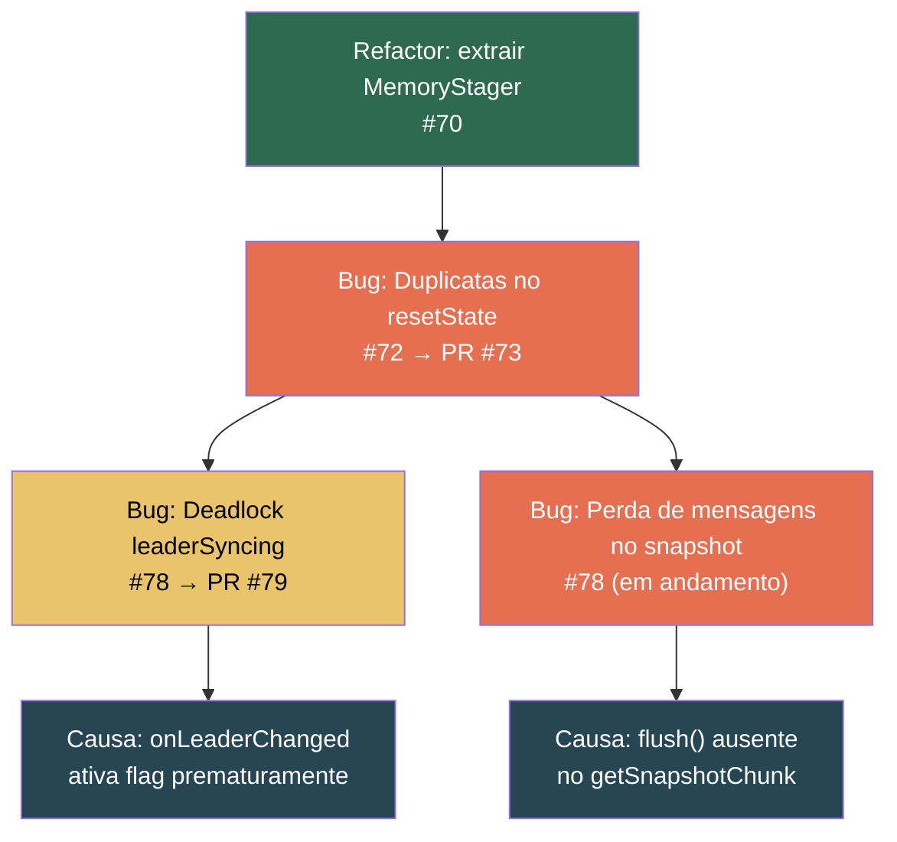

# Diário de Bordo — nishi-utils (NGrid / NQueue)

> Registro cronológico das alterações, decisões técnicas e lições aprendidas durante o ciclo de estabilização do NGrid (fev/2026).

---

## 2026-02-23 — 🔴 Investigação: Perda de mensagens após restart (Issue #78, em andamento)

**Contexto:** Após fechar as duplicatas e o deadlock do leader sync, o teste Docker `shouldRecoverAfterSeedRestartWithoutDuplicatesOrLoss` passou a falhar com **perda** de mensagens: `Missing messages for epoch 2: [8]`.

**Causa raiz identificada:** Quando o novo líder solicita um snapshot de um follower via `SYNC_REQUEST`, o `QueueClusterService.getSnapshotChunk()` chama `NQueue.readRange()` — que lê **apenas** o log durável em disco. Se o `MemoryStager` estiver ativo e ainda possuir registros não drenados, estes ficam **fora do snapshot**. O novo líder instala um snapshot incompleto e o cluster perde as mensagens que estavam somente em memória.

**Correção planejada:**
- Adicionar `NQueue.flush()` que drena o `MemoryStager` explicitamente
- Chamar `flush()` antes do primeiro chunk em `getSnapshotChunk()`

**Status:** ⏳ Aguardando aprovação do plano

---

## 2026-02-22 — 🟡 Fix: Leader Sync deadlock (`leaderSyncing = true`) — PR [#79](https://github.com/nishisan-dev/nishi-utils/pull/79)

**Commit:** `1b8fe9e`

**Problema:** O `QueueNodeFailoverIntegrationTest` travava com `IllegalState: Leader sync in progress`. A flag `leaderSyncing` ficava `true` indefinidamente porque as queues eram instanciadas assincronamente durante o `onLeaderChanged`, antes dos peers estarem totalmente levantados.

**Correção:**
- Proteção da flag `leaderSyncing` contra ativação prematura
- Remoção do `findLeader()` proativo que conflitava com o estado assíncrono
- Ajuste do teste para usar `awaitNewLeader()` ao invés de sleep fixo
- `heartbeatInterval` aumentado para `250ms` no `ConsistencyIntegrationTest`
- TypeSafety: warnings `@SuppressWarnings("unchecked")` e substituição de `IStatsListener` raw

**Lição aprendida:** Operações de líder no `onLeaderChanged` devem ser idempotentes e tolerantes a peers incompletos. O sync deve ser assíncrono com retry, nunca bloqueante no callback.

**Status:** 🔓 PR aberto

---

## 2026-02-22 — 🟢 Fix: Duplicatas no snapshot após seed restart — PR [#73](https://github.com/nishisan-dev/nishi-utils/pull/73) (merged)

**Commit:** `ed1ce07`

**Problema:** O `resetState()` do `QueueClusterService` usava um **poll-loop** para esvaziar a queue antes de instalar o snapshot. Esse loop possuía um race condition com o `MemoryStager`: itens staged podiam ser drenados para disco **depois** do reset de offsets, causando re-entrega.

**Correção:**
- Criado `NQueue.truncateAndReopen()` — deleta arquivos, reabre I/O, zera cursores, reinicializa `MemoryStager`/`CompactionEngine`
- `resetState()` agora faz `queue.close()` → `queue.truncateAndReopen()` (atômico, sem race)
- 5 testes novos em `NQueueTruncateTest`

**Lição aprendida:** Nunca usar loops de consumo (`poll`) para "limpar" uma queue antes de substituir seu conteúdo. A operação deve ser atómica: fechar → truncar → reabrir.

> [!WARNING]
> Este fix eliminou as **duplicatas**, mas revelou um segundo bug: agora mensagens são **perdidas** (ver entrada 2026-02-23).

---

## 2026-02-22 — 🟢 Fix: Findings do Codex Review (P1/P2) — PR [#71](https://github.com/nishisan-dev/nishi-utils/pull/71) (merged)

**Commit:** `7a17d56`

**3 findings corrigidos:**

| # | Sev. | Descrição | Solução |
|---|------|-----------|---------|
| 1 | P1 | `DistributedQueue.offer(key, headers, value)` perdia key+headers ao forward para o leader | Criado `OfferPayload` como envelope serializável |
| 2 | P2 | `MemoryStager.checkAndDrain()` usava snapshot **anterior** ao drain para calcular disponibilidade | Parâmetro trocado de `long` para `LongSupplier`, avaliado **após** drain |
| 3 | P2 | `offerViaStager()` alocava index duplo no fallback | Fallback reutiliza `PreIndexedItem` já indexado |

---

## 2026-02-22 — 🟢 Fix: Flaky failover test — PR [#77](https://github.com/nishisan-dev/nishi-utils/pull/77) (merged)

**Commit:** `d894630`

**Problema:** `testDataPersistsAfterLeaderFailover` falhava intermitentemente com `assertEquals("item-0", ...)` e `Leader sync in progress`.

**Correção:**
- `Thread.sleep()` fixo → `awaitNewLeader(15_000)` com polling
- Assertion relaxada: `assertTrue(item.startsWith("item-"))` em vez de igualdade exata
- `heartbeatInterval` 200ms → 500ms
- Dead code removido (`findLeaderAmong`, `getAnyFollower`, etc)

---

## 2026-02-22 — 🟢 Refactor: Extração de `CompactionEngine` e `MemoryStager` — PR [#70](https://github.com/nishisan-dev/nishi-utils/pull/70) (merged)

**Commit:** `7d47e43`

**Motivação:** `NQueue.java` ultrapassou 1200 linhas com responsabilidades misturadas (staging, compactação, I/O). Extraídas duas classes package-private:
- `MemoryStager` — buffer in-memory com drain síncrono via callback
- `CompactionEngine` — compactação de background com máquina de estados

**Impacto:** Redução de ~400 linhas em `NQueue`, sem mudança na API pública.

---

## 2026-02-22 — 🟢 CI: Release por tag — PR implícita

**Commit:** `f03e82d`

Reescrita do `publish.yml` para trigger apenas em tags `vy.x.z`. A versão é extraída da tag, setada no POM, build+deploy executados, e GitHub Release criada automaticamente.

---

## 2026-02-21 — 🟢 Feat: Suite Docker com Testcontainers

**Commit:** `35c92d6`

Criação do módulo `ngrid-test` com testes de cluster Docker usando Testcontainers. Cobertura:
- Eleição de líder
- Replicação e failover
- Catch-up após restart

Este módulo é a base para os testes de resiliência que expuseram os bugs de duplicata e perda de mensagens.

---

## 2026-02-21 — 🟢 Feat: Key/Headers na replicação (V3 metadata)

**Commits:** `8955428`, `8feb0b6`, `3bca51c`

Propagação de `key` e `headers` por toda a cadeia: `NQueue.offer()` → `NQueueRecordMetaData V3` → `ReplicationManager` → `DistributedQueue`.

---

## Quadro de Bugs Relacionados (Snapshot/Failover)

O diagrama abaixo mostra a cadeia de causa-efeito dos bugs encontrados durante a estabilização:

> [!IMPORTANT]
> O padrão recorrente: a introdução do `MemoryStager` como classe separada tornou visível que o pipeline de snapshot/recovery **não considerava dados em memória**. Cada fix expôs a próxima camada do problema. A correção definitiva requer garantir que `flush()` seja chamado antes de qualquer operação que leia o estado durável para transferência (snapshots, sync responses).
