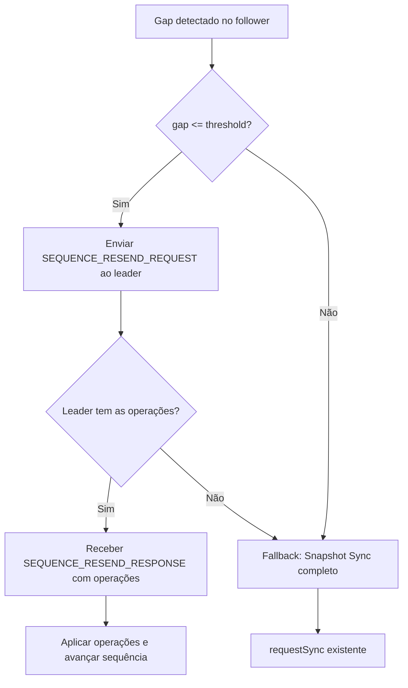

# Fase 3 — Recovery Inteligente de Lacunas de Sequência (NGrid)

## Problema

Quando um follower detecta um gap de sequência (ex: recebeu seq=10 mas esperava seq=8), o mecanismo atual em `checkForMissingSequences()` aguarda um timeout de 1s e faz **fallback direto para snapshot sync completo**. Isso é custoso e desnecessário quando o gap é pequeno (poucas mensagens perdidas em trânsito).

## Solução Proposta

Implementar uma **estratégia híbrida de recovery** com resend pontual como primeira tentativa:



## Estado Atual do Código

| Artefato | Estado |
|---|---|
| `MessageType.SEQUENCE_RESEND_REQUEST/RESPONSE` | ✅ Já existe no enum |
| `SequenceResendRequestPayload` (topic, fromSeq, toSeq) | ✅ Já existe |
| `SequenceResendResponsePayload` (topic, operations[], missingSequences[]) | ✅ Já existe |
| Handler no `ReplicationManager.onMessage()` | ❌ Não implementado |
| Log indexado por sequência no leader | ❌ Não existe |
| Lógica de resend no `checkForMissingSequences()` | ❌ Faz fallback direto |
| Métricas de gap/convergência | ❌ Não existe |
| Parâmetros de config (threshold, timeout) | ❌ Não existe |

---

## Proposed Changes

### Componente 1: Configuração

#### [MODIFY] [ReplicationConfig.java](file:///home/lucas/Projects/nishisan/nishi-utils/src/main/java/dev/nishisan/utils/ngrid/replication/ReplicationConfig.java)

Adicionar dois novos parâmetros ao builder:

- `resendGapThreshold` (int, default: 50) — Se o gap for ≤ este valor, tenta resend pontual. Se for maior, faz fallback direto para snapshot.
- `resendTimeout` (Duration, default: 2s) — Tempo máximo de espera por um `SEQUENCE_RESEND_RESPONSE` antes de fazer fallback para snapshot.
- `replicationLogRetention` (int, default: 1000) — Número máximo de operações por tópico retidas no log indexado por sequência.

---

### Componente 2: Replication Log indexado por Sequência (Leader-side)

#### [MODIFY] [ReplicationManager.java](file:///home/lucas/Projects/nishisan/nishi-utils/src/main/java/dev/nishisan/utils/ngrid/replication/ReplicationManager.java)

**2a. Estrutura de dados:**
- Adicionar campo `replicationLogBySequence`: `Map<String, NavigableMap<Long, ReplicationPayload>>` (TreeMap por tópico).
- No `replicateToFollowers()`, após criar o `ReplicationPayload`, indexá-lo neste mapa.
- Compactação: ao indexar, se o mapa do tópico exceder `replicationLogRetention`, remover as entradas mais antigas via `pollFirstEntry()`.

**2b. Handler do SEQUENCE_RESEND_REQUEST no leader:**
- Adicionar branch em `onMessage()` para `SEQUENCE_RESEND_REQUEST`.
- Implementar `handleSequenceResendRequest(ClusterMessage)`:
  1. Extrair `SequenceResendRequestPayload` (topic, fromSequence, toSequence).
  2. Buscar no `replicationLogBySequence` as operações da faixa `[fromSequence, toSequence]` via `subMap()`.
  3. Se **todas** as sequências solicitadas estão disponíveis → responder com `SequenceResendResponsePayload(topic, operationsList, emptyList)`.
  4. Se **nenhuma ou parcialmente** disponível → responder com `missingSequences` listando as sequências não encontradas (sinal para o follower fazer fallback).
  5. Somente o leader (ou nó com `isLeader()`) responde.

---

### Componente 3: Recovery Híbrido (Follower-side)

#### [MODIFY] [ReplicationManager.java](file:///home/lucas/Projects/nishisan/nishi-utils/src/main/java/dev/nishisan/utils/ngrid/replication/ReplicationManager.java)

**3a. Modificar `checkForMissingSequences()`:**
- Calcular o gap (`nextInBuffer - nextExpected`).
- Se `gap <= config.resendGapThreshold()` e não há resend in-flight para este tópico:
  - Enviar `SEQUENCE_RESEND_REQUEST` ao leader com `fromSequence=nextExpected` e `toSequence=nextInBuffer-1`.
  - Marcar o tópico como "resend-pending" (novo Set `resendPendingTopics`).
  - Registrar timestamp de início do resend (`resendStartByTopic`).
- Se `gap > threshold`:
  - Fallback direto para snapshot sync (comportamento atual).

**3b. Adicionar handler do `SEQUENCE_RESEND_RESPONSE` no `onMessage()`:**
- Nova função `handleSequenceResendResponse(ClusterMessage)`:
  1. Extrair `SequenceResendResponsePayload`.
  2. Se `operations` não está vazio:
     - Para cada `ReplicationPayload` na lista, injetá-lo como se fosse um `REPLICATION_REQUEST` recebido (delegando para `handleReplicationRequest`).
     - As operações serão naturalmente processadas pelo mecanismo de sequência/buffer existente.
  3. Se `missingSequences` não está vazio:
     - Fallback para snapshot sync via `requestSync(topic)`.
  4. Limpar `resendPendingTopics` para o tópico.
  5. Registrar métrica de convergência.

**3c. Timeout de resend:**
- No `checkForMissingSequences()` (chamado periodicamente ou ao receber nova mensagem out-of-order):
  - Se tópico está em `resendPendingTopics` e o tempo desde `resendStartByTopic` > `config.resendTimeout()`:
    - Limpar resend-pending.
    - Fallback para snapshot sync.

**3d. Novo loop periódico:**
- Adicionar `checkResendTimeouts()` ao scheduler no `start()` (a cada 500ms).

---

### Componente 4: Métricas

#### [MODIFY] [ReplicationManager.java](file:///home/lucas/Projects/nishisan/nishi-utils/src/main/java/dev/nishisan/utils/ngrid/replication/ReplicationManager.java)

Implementar contadores atômicos expostos via getters públicos:

| Métrica | Tipo | Descrição |
|---|---|---|
| `gapsDetected` | `AtomicLong` | Total de gaps de sequência detectados |
| `resendSuccessCount` | `AtomicLong` | Resends que resultaram em convergência sem snapshot |
| `snapshotFallbackCount` | `AtomicLong` | Fallbacks para snapshot completo |
| `totalConvergenceTimeMs` | `AtomicLong` | Soma do tempo de convergência (gap→resolução) |
| `convergenceCount` | `AtomicLong` | Contagem de convergências (para calcular média) |

Métodos públicos:
- `long getGapsDetected()`
- `long getResendSuccessCount()`
- `long getSnapshotFallbackCount()`
- `double getAverageConvergenceTimeMs()`

---

### Componente 5: Testes

#### [NEW] [SequenceResendProtocolTest.java](file:///home/lucas/Projects/nishisan/nishi-utils/src/test/java/dev/nishisan/utils/ngrid/replication/SequenceResendProtocolTest.java)

Teste unitário usando o padrão `FakeTransport` do `ReplicationManagerQuorumFailureTest`:

1. **testResendRequestSentOnSmallGap**: Configurar gap < threshold, verificar que `SEQUENCE_RESEND_REQUEST` é enviado ao leader (capturando mensagens no FakeTransport).
2. **testResendResponseAppliesOperations**: Simular resposta do leader com operações → verificar que follower avança a sequência.
3. **testResendFallbackOnMissingSequences**: Simular resposta do leader com `missingSequences` → verificar que follower faz fallback para `SYNC_REQUEST`.
4. **testDirectSnapshotOnLargeGap**: Gap > threshold → verificar que não tenta resend e vai direto para snapshot.
5. **testResendTimeoutFallback**: Enviar resend request, não responder dentro do timeout → verificar fallback para snapshot.
6. **testMetricsUpdated**: Verificar que `gapsDetected`, `resendSuccessCount` e `snapshotFallbackCount` são incrementadas corretamente.

#### [NEW] [SequenceGapRecoveryIntegrationTest.java](file:///home/lucas/Projects/nishisan/nishi-utils/src/test/java/dev/nishisan/utils/ngrid/SequenceGapRecoveryIntegrationTest.java)

Teste de integração com 3 nós reais (padrão do `ReplicationSuccessIntegrationTest`):

1. **testConvergenceAfterMessageLoss**: Escrever dados no leader, simular perda de mensagem no follower (parar momentaneamente), verificar convergência dentro da janela alvo.

> [!IMPORTANT]
> O teste de integração usa a mesma infra de 3 nós do `ReplicationSuccessIntegrationTest` e ficará `@Disabled` para CI por instabilidade em ambientes virtuais, assim como os existentes.

---

## Verification Plan

### Automated Tests

Compilação e execução dos testes:

```bash
# Build completo
cd /home/lucas/Projects/nishisan/nishi-utils
mvn clean compile -q

# Testes unitários (excluindo os @Disabled de integração)
mvn test -pl . -Dtest="SequenceResendProtocolTest" -DfailIfNoTests=false

# Testes unitários existentes (regressão)
mvn test -pl . -Dtest="ReplicationManagerQuorumFailureTest" -DfailIfNoTests=false

# Todos os testes unitários do módulo
mvn test -pl . -DfailIfNoTests=false
```

### Validação de Regressão

```bash
# Verificar que testes existentes de NGrid continuam passando
mvn test -pl . -Dtest="NGridIntegrationTest,NGridSeedWithQueueIntegrationTest,LeaderLeaseStepDownTest,LeaderLeaseIntegrationTest,ReplicationManagerQuorumFailureTest" -DfailIfNoTests=false
```
